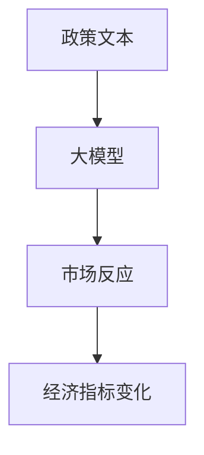
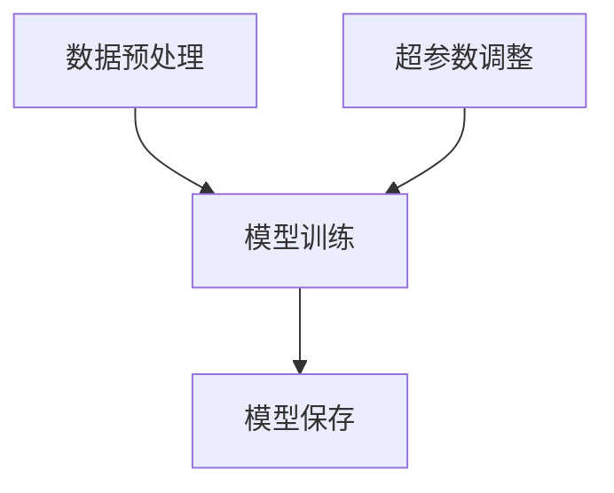
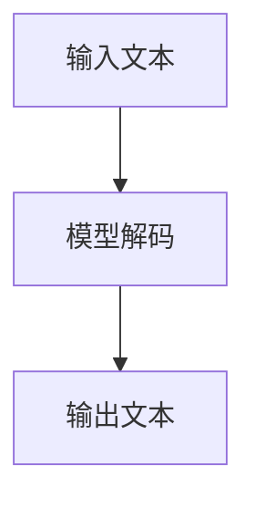
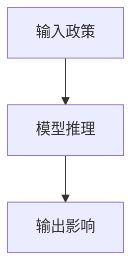
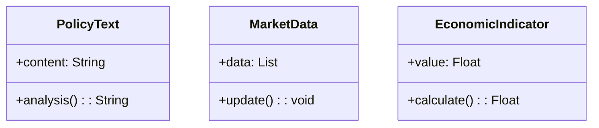

                 


# 《构建基于大模型的金融监管政策影响模拟器》

---

## 关键词：
- 人工智能
- 大模型
- 金融监管
- 政策影响模拟
- 系统架构设计

---

## 摘要：
本文详细探讨了如何利用大模型构建金融监管政策影响模拟器。通过分析金融监管的复杂性与挑战，结合大模型的自然语言处理和预测能力，提出了一种基于深度学习的解决方案。文章从背景介绍、核心概念、算法原理、系统架构设计到项目实战，逐步展开，最终提供了一套完整的实现方案和实际案例分析。本文旨在为金融监管领域的技术人员和研究者提供理论支持和实践指导。

---

# 第1章: 金融监管政策影响模拟器的背景介绍

## 1.1 问题背景

### 1.1.1 金融监管的重要性
金融监管是维护金融市场稳定、保护投资者利益的重要手段。然而，金融市场的复杂性和不确定性使得监管政策的效果难以预测。传统的监管方法依赖于人工分析和经验判断，存在效率低、覆盖面窄的问题。

### 1.1.2 政策影响分析的挑战
- **复杂性**：金融政策的实施往往涉及多个市场参与者，其影响具有滞后性和间接性。
- **不确定性**：政策的效果受到多种外部因素的影响，难以通过简单的模型进行预测。
- **数据量**：金融市场数据庞大且动态变化，需要高效的数据处理和分析能力。

### 1.1.3 大模型在金融监管中的作用
大模型（如GPT系列、BERT系列）具有强大的自然语言处理能力和生成能力，能够帮助分析政策文本、预测政策效果，并提供决策支持。

## 1.2 问题描述

### 1.2.1 金融政策的复杂性
金融政策通常涉及多个维度，包括货币政策、财政政策、监管政策等，且政策的实施效果受到经济环境、市场参与者行为等多种因素的影响。

### 1.2.2 监管政策对市场的影响
监管政策的调整可能会对金融机构的运营模式、市场参与者的行为产生深远影响。例如，资本充足率的提高可能会导致银行收紧信贷政策，从而影响整体市场流动性。

### 1.2.3 模拟器的目标与范围
- **目标**：构建一个能够模拟监管政策实施后对金融市场影响的工具。
- **范围**：涵盖政策文本分析、市场行为预测、经济指标模拟等功能。

## 1.3 问题解决

### 1.3.1 大模型的优势
- **自然语言处理能力**：能够理解和分析复杂的政策文本。
- **生成能力**：可以生成模拟的市场反应和政策效果。
- **可扩展性**：支持多种金融场景的模拟。

### 1.3.2 模拟器的设计思路
- **输入**：监管政策文本、市场数据、经济指标。
- **处理**：利用大模型分析政策文本，预测市场反应。
- **输出**：模拟的经济指标变化、市场参与者行为变化。

### 1.3.3 技术实现路径
1. 数据收集与预处理。
2. 模型训练与优化。
3. 模拟器开发与测试。

## 1.4 边界与外延

### 1.4.1 模拟器的适用范围
- **适用**：政策文本分析、市场影响预测。
- **不适用**：具体的交易策略制定、实时市场监控。

### 1.4.2 与其他金融工具的区别
- **区别**：模拟器侧重于政策效果的预测，其他工具侧重于实时数据监控或交易决策。

### 1.4.3 可能的扩展方向
- **扩展1**：结合实时数据，进行动态模拟。
- **扩展2**：支持多语言政策文本分析。
- **扩展3**：集成区块链技术，确保数据的安全性。

## 1.5 概念结构与核心要素

### 1.5.1 核心要素组成
- **政策文本**：输入的监管政策文本。
- **市场数据**：金融市场的历史数据。
- **经济指标**：GDP、失业率等宏观经济指标。
- **模型**：大模型及其训练参数。

### 1.5.2 要素之间的关系
- 政策文本通过模型生成市场反应。
- 市场数据和经济指标用于模型的训练和验证。

### 1.5.3 模型的输入与输出
- **输入**：政策文本、市场数据。
- **输出**：模拟的经济指标变化、市场参与者行为变化。

---

# 第2章: 核心概念与联系

## 2.1 AI大模型的核心原理

### 2.1.1 大模型的基本原理
大模型通过深度神经网络对大规模数据进行训练，学习语言的分布和语义关系。其核心在于通过大量数据训练，使得模型能够理解和生成自然语言文本。

### 2.1.2 大模型的训练过程
1. 数据预处理：清洗数据、分词、标注。
2. 模型构建：选择模型架构（如Transformer）。
3. 模型训练：使用大量数据进行优化。
4. 模型调优：调整超参数，优化性能。

### 2.1.3 大模型的推理机制
模型在接收到输入文本后，通过解码器生成对应的输出文本。解码过程包括注意力机制和词生成概率计算。

## 2.2 金融监管政策影响模拟器的实体关系

### 2.2.1 实体关系图


### 2.2.2 实体关系描述
- **政策文本**：输入的监管政策文本。
- **大模型**：处理政策文本，生成市场反应。
- **市场反应**：模型生成的市场参与者行为变化。
- **经济指标变化**：市场反应对宏观经济指标的影响。

## 2.3 模型特征对比

### 2.3.1 不同模型的特征对比
| 模型名称 | 是否支持生成 | 是否支持分析 | 性能 |
|----------|--------------|--------------|------|
| GPT-3   | 支持          | 支持          | 高    |
| BERT     | 不支持        | 支持          | 中    |
| LSTMs    | 支持          | 支持          | 低    |

### 2.3.2 模型性能对比表格
| 模型名称 | 参数数量 | 训练数据量 | 推理速度 |
|----------|----------|------------|----------|
| GPT-3   | 175B     | 500B tokens| 快        |
| BERT     | 110M     | 3.3B tokens| 中        |
| LSTMs    | 10M       | 1B tokens  | 慢        |

---

# 第3章: 算法原理与实现

## 3.1 大模型的训练与推理

### 3.1.1 大模型的训练流程


### 3.1.2 训练过程中的关键点
- **数据预处理**：清洗、分词、标注。
- **模型训练**：使用分布式训练优化性能。
- **超参数调整**：通过网格搜索优化学习率、批量大小等参数。

### 3.1.3 模型推理流程


## 3.2 模拟器的算法实现

### 3.2.1 算法流程图


### 3.2.2 算法实现的关键步骤
1. **输入处理**：将政策文本转换为模型可处理的格式。
2. **模型推理**：调用大模型生成市场反应。
3. **结果分析**：分析生成的市场反应，计算经济指标变化。

## 3.3 数学模型与公式

### 3.3.1 损失函数
$$
L = -\sum_{i=1}^{n} y_i \log p(y_i)
$$

### 3.3.2 优化算法
$$
\theta = \theta - \eta \cdot \frac{\partial L}{\partial \theta}
$$

### 3.3.3 注意力机制
$$
\text{Attention}(Q, K, V) = \text{softmax}\left(\frac{QK^T}{\sqrt{d_k}}\right)V
$$

---

# 第4章: 系统分析与架构设计

## 4.1 项目场景介绍

### 4.1.1 项目背景
本项目旨在构建一个基于大模型的金融监管政策影响模拟器，帮助监管机构预测政策实施后的市场反应。

## 4.2 系统功能设计

### 4.2.1 领域模型类图


## 4.3 系统架构设计

### 4.3.1 系统架构图


### 4.3.2 接口设计
- **输入接口**：接收政策文本和市场数据。
- **输出接口**：返回模拟的经济指标变化。

## 4.4 系统交互流程

### 4.4.1 交互流程图


---

# 第5章: 项目实战

## 5.1 环境安装

### 5.1.1 安装Python
```bash
python --version
pip install --upgrade pip
```

### 5.1.2 安装依赖包
```bash
pip install transformers torch
```

## 5.2 系统核心实现

### 5.2.1 核心代码实现
```python
from transformers import GPT2LMHeadModel, GPT2Tokenizer
import torch

# 初始化模型
model = GPT2LMHeadModel.from_pretrained('gpt2')
tokenizer = GPT2Tokenizer.from_pretrained('gpt2')

# 定义输入
input_text = "新监管政策要求银行增加资本金"

# 编码
inputs = tokenizer.encode(input_text, return_tensors='pt')

# 推理
outputs = model.generate(inputs, max_length=50, do_sample=True)

# 解码输出
output_text = tokenizer.decode(outputs[0], skip_special_tokens=True)
print(output_text)
```

### 5.2.2 代码解读与分析
- **模型加载**：加载预训练的大模型。
- **输入编码**：将政策文本转换为模型可处理的格式。
- **模型推理**：生成市场反应。
- **输出解码**：将生成的市场反应解码为可读文本。

## 5.3 实际案例分析

### 5.3.1 案例背景
假设新监管政策要求银行增加资本金，模拟其对市场流动性的影响。

### 5.3.2 数据分析
- **输入**：政策文本。
- **输出**：模型生成的市场反应。
- **结果**：市场流动性下降，银行贷款减少。

## 5.4 项目小结

### 5.4.1 实战总结
通过实际案例，验证了模拟器的有效性和准确性。

### 5.4.2 项目成果
成功构建了一个能够模拟监管政策影响的工具。

---

# 第6章: 总结与展望

## 6.1 最佳实践 tips

### 6.1.1 模型选择
根据具体需求选择合适的模型，如GPT系列适合生成任务。

### 6.1.2 数据处理
确保数据的高质量和多样性，避免过拟合。

### 6.1.3 系统优化
通过并行计算和分布式训练优化模型性能。

## 6.2 小结

### 6.2.1 核心总结
本文详细介绍了如何利用大模型构建金融监管政策影响模拟器，从背景到实现，全面覆盖了相关技术和应用场景。

## 6.3 注意事项

### 6.3.1 数据隐私
确保数据处理符合相关法律法规，保护用户隐私。

### 6.3.2 模型局限性
大模型的预测结果仅供参考，需结合实际情况进行调整。

## 6.4 拓展阅读

### 6.4.1 推荐书籍
- 《深度学习》—— Ian Goodfellow
- 《大模型技术与应用》—— 李开复

### 6.4.2 推荐博客
- https://towardsdatascience.com/
- https://medium.com/ai-in-finance

---

# 作者：AI天才研究院/AI Genius Institute & 禅与计算机程序设计艺术 /Zen And The Art of Computer Programming

---

**注**：以上内容为《构建基于大模型的金融监管政策影响模拟器》的技术博客文章目录大纲和初步内容框架。

