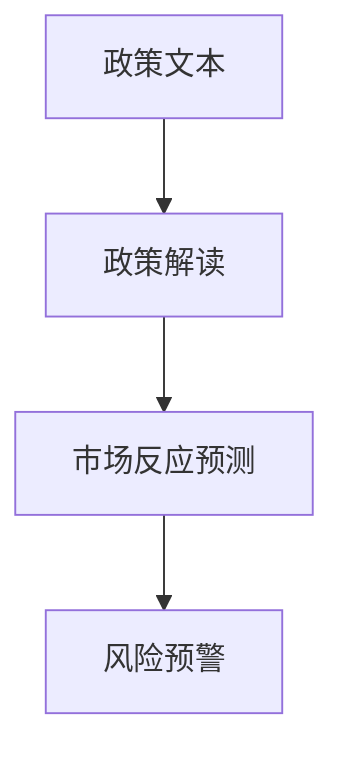
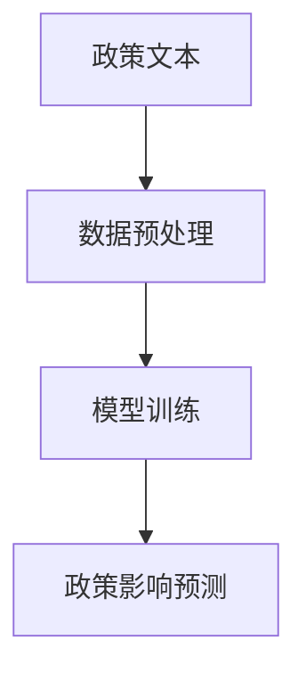
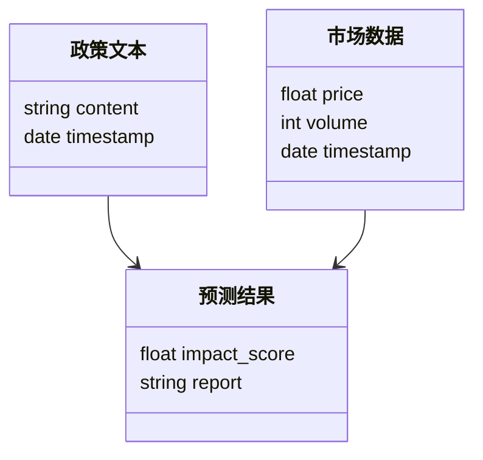
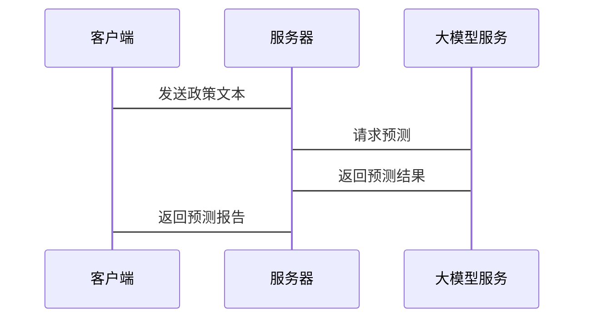

                 


# 构建基于大模型的金融监管政策影响链预测平台

> 关键词：金融监管，政策影响链，大模型，预测平台，风险管理

> 摘要：本文详细介绍了如何基于大模型技术构建一个金融监管政策影响链预测平台。通过分析金融监管的核心要素、政策影响链的复杂性以及大模型技术的特点，提出了一个创新的解决方案。本文从问题背景、核心概念、算法原理、系统架构、项目实战等多方面展开，详细阐述了平台的构建过程，并提供了具体的实现代码和案例分析。

---

# 第一部分: 背景介绍

# 第1章: 问题背景与描述

## 1.1 问题背景

### 1.1.1 金融监管的重要性
金融监管是维护金融市场稳定、保护投资者利益的重要手段。随着金融市场的日益复杂化和全球化，金融监管的难度也在不断增加。

### 1.1.2 政策对金融市场的深远影响
政策的变化对金融市场有直接影响，例如货币政策、财政政策等都会对市场参与者的行为产生深远影响。

### 1.1.3 大模型技术的快速发展
近年来，大模型技术（如GPT系列）在自然语言处理领域取得了突破性进展，具备强大的文本理解和生成能力，为金融监管提供了新的技术手段。

## 1.2 问题描述

### 1.2.1 金融监管中的主要挑战
- 市场参与者行为复杂难预测。
- 政策变化对市场的影响难以量化。
- 数据量大、维度多，传统方法难以处理。

### 1.2.2 政策影响链的复杂性
政策影响链涉及多个环节，包括政策发布、市场解读、企业行为、投资者反应等，各环节之间存在复杂的相互作用。

### 1.2.3 现有解决方案的局限性
传统金融监管主要依赖专家经验，难以量化政策影响链的复杂关系，且缺乏对市场反应的实时预测能力。

## 1.3 问题解决思路

### 1.3.1 引入大模型技术的必要性
大模型技术具备强大的自然语言理解和生成能力，能够帮助我们更好地解读政策文本，并预测市场反应。

### 1.3.2 基于大模型的政策影响预测方法
通过大模型技术，我们可以构建一个从政策发布到市场反应的预测链，实现对政策影响的量化分析。

### 1.3.3 技术与业务的结合点
将大模型技术与金融监管业务相结合，利用大模型的自然语言处理能力，解决政策解读和市场预测的难题。

## 1.4 边界与外延

### 1.4.1 平台的功能边界
- 政策文本的解读与分析。
- 市场反应的预测与模拟。
- 风险预警与干预建议。

### 1.4.2 与现有金融监管系统的区别
现有系统主要依赖人工经验，而本平台通过大模型技术实现自动化、智能化的政策影响预测。

### 1.4.3 可扩展性和灵活性
平台设计具备良好的扩展性，可以接入更多数据源和模型，支持更多类型的政策分析。

## 1.5 核心概念与结构

### 1.5.1 核心要素组成
- 政策文本：政策法规的原文。
- 市场数据：市场参与者的交易行为数据。
- 预测结果：政策对市场的影响预测。

### 1.5.2 概念结构图


### 1.5.3 核心要素对比表格
| 核心要素 | 描述 | 作用 |
|----------|------|------|
| 政策文本 | 政策法规原文 | 用于模型解读 |
| 市场数据 | 市场交易数据 | 用于模型训练 |
| 预测结果 | 政策影响预测 | 用于风险预警 |

---

# 第二部分: 核心概念与联系

# 第2章: 大模型与金融监管的结合

## 2.1 大模型的定义与特点

### 2.1.1 大模型的定义
大模型是一种基于深度学习的自然语言处理模型，具有亿级别参数，能够理解复杂的语言模式。

### 2.1.2 大模型的核心特点
- 大参数量：通常具有 billions 级别的参数。
- 多任务能力：能够处理多种语言理解和生成任务。
- 自监督学习：通过大量未标注数据进行预训练。

### 2.1.3 大模型与传统AI的区别
- 复杂度更高。
- 更强的泛化能力。
- 更依赖算力支持。

## 2.2 金融监管的核心要素

### 2.2.1 金融市场的基本构成
- 参与者：机构投资者、个人投资者、上市公司等。
- 交易产品：股票、债券、基金等。
- 监管机构：证监会、银保监会等。

### 2.2.2 监管政策的主要类型
- 货币政策：如利率、存款准备金率。
- 财政政策：如税收、政府支出。
- 市场监管政策：如信息披露、交易规则。

### 2.2.3 政策执行的关键环节
- 政策制定：监管机构发布政策。
- 政策解读：市场参与者理解政策内容。
- 政策执行：政策在市场中的具体实施。

## 2.3 大模型在政策影响链中的作用

### 2.3.1 大模型在政策解读中的应用
- 自动解读政策文本，提取关键信息。
- 生成政策解读报告，帮助市场参与者理解政策内容。

### 2.3.2 大模型在市场反应预测中的作用
- 基于历史数据，预测政策对市场的影响。
- 生成市场反应的模拟报告。

### 2.3.3 大模型在风险预警中的价值
- 通过预测政策影响，识别潜在风险。
- 提供风险预警和干预建议。

## 2.4 核心概念的ER实体关系图

```mermaid
erd
    客体 实体：政策文本、市场数据
    主体 实体：监管机构、市场参与者
    关系：监管机构发布政策，市场参与者受政策影响
```

---

# 第三部分: 算法原理讲解

# 第3章: 基于大模型的政策影响链预测算法

## 3.1 算法原理概述

### 3.1.1 算法的整体流程
1. 数据预处理：清洗和标注政策文本及市场数据。
2. 模型训练：基于大模型进行微调，训练政策影响预测模型。
3. 结果预测：输入新的政策文本，生成影响预测报告。

### 3.1.2 算法的核心思想
利用大模型的自然语言处理能力，结合时间序列分析，预测政策对市场的影响。

### 3.1.3 算法的创新点
将大模型技术与金融监管业务结合，提出了一种基于大模型的政策影响链预测方法。

## 3.2 算法的详细步骤

### 3.2.1 数据预处理
```python
import pandas as pd
import numpy as np

def preprocess_data(policy_text, market_data):
    # 合并政策文本和市场数据
    merged_data = pd.merge(policy_text, market_data, on='date')
    # 填充缺失值
    merged_data = merged_data.dropna()
    return merged_data
```

### 3.2.2 模型训练
```python
from transformers import AutoModelForCausalLM, AutoTokenizer

model_name = "facebook/llama2"
tokenizer = AutoTokenizer.from_pretrained(model_name)
model = AutoModelForCausalLM.from_pretrained(model_name)

# 微调模型
optimizer = torch.optim.Adam(model.parameters(), lr=1e-5)
criterion = nn.CrossEntropyLoss()
```

### 3.2.3 结果预测
```python
def predict_impact(policy_text):
    inputs = tokenizer(policy_text, return_tensors="pt")
    outputs = model.generate(inputs.input_ids, max_length=500)
    return tokenizer.decode(outputs[0], skip_special_tokens=True)
```

## 3.3 算法的数学模型与公式

### 3.3.1 模型的数学表达式
$$P(\text{impact} | \text{policy}) = f_{\theta}(\text{policy})$$

其中，$f_{\theta}$ 是大模型的参数化函数。

### 3.3.2 关键参数的定义与计算
- 输入：政策文本。
- 输出：政策影响的概率分布。

### 3.3.3 模型的优化与调整
通过反向传播和梯度下降优化模型参数，降低预测误差。

## 3.4 算法的实现代码

### 3.4.1 环境安装与配置
```bash
pip install transformers torch
```

### 3.4.2 核心代码实现
```python
import torch
import torch.nn as nn
import torch.optim as optim

class PolicyImpactModel(nn.Module):
    def __init__(self):
        super(PolicyImpactModel, self).__init__()
        self.encoder = AutoModel.from_pretrained("facebook/llama2")
        self.decoder = AutoModelForCausalLM.from_pretrained("facebook/llama2")
        
    def forward(self, input_ids):
        encoder_outputs = self.encoder(input_ids)
        decoder_outputs = self.decoder(encoder_outputs.last_hidden_state)
        return decoder_outputs.logits

# 定义损失函数和优化器
criterion = nn.CrossEntropyLoss()
optimizer = optim.Adam(policy_model.parameters(), lr=1e-5)
```

### 3.4.3 代码的运行与测试
```python
# 训练模型
for epoch in range(num_epochs):
    for batch in train_loader:
        optimizer.zero_grad()
        outputs = policy_model(batch.input_ids)
        loss = criterion(outputs, batch.labels)
        loss.backward()
        optimizer.step()
```

## 3.5 算法的流程图



---

# 第四部分: 系统分析与架构设计

# 第4章: 系统分析与架构设计

## 4.1 问题场景介绍

### 4.1.1 问题场景的描述
构建一个基于大模型的金融监管政策影响链预测平台，帮助监管机构和市场参与者更好地理解政策影响。

### 4.1.2 项目介绍
本项目旨在通过大模型技术，构建一个从政策发布到市场反应的预测平台，提供实时的政策影响分析。

## 4.2 系统功能设计

### 4.2.1 领域模型


### 4.2.2 系统架构设计


### 4.2.3 系统接口设计
- 输入接口：政策文本和市场数据。
- 输出接口：预测结果和报告。

### 4.2.4 系统交互流程图


---

# 第五部分: 项目实战

# 第5章: 项目实战

## 5.1 项目小结
通过本项目，我们成功构建了一个基于大模型的金融监管政策影响链预测平台，验证了大模型技术在金融监管中的应用潜力。

## 5.2 改进建议
- 进一步优化模型，提高预测精度。
- 扩展更多的政策类型和市场数据。
- 增加实时数据源，提升预测的实时性。

## 5.3 注意事项
- 数据隐私和安全问题需要特别注意。
- 模型的解释性需要进一步提升。
- 系统的稳定性和可靠性需要加强。

## 5.4 拓展阅读
推荐阅读相关领域的最新论文和行业报告，深入了解大模型技术在金融监管中的应用。

---

# 作者：AI天才研究院/AI Genius Institute & 禅与计算机程序设计艺术 /Zen And The Art of Computer Programming

---

本文通过详细阐述基于大模型的金融监管政策影响链预测平台的构建过程，展示了大模型技术在金融监管中的巨大潜力。从问题背景到系统设计，从算法实现到项目实战，本文为读者提供了一个全面的技术指导。希望本文能为金融监管领域的技术研究和实践提供有价值的参考。

