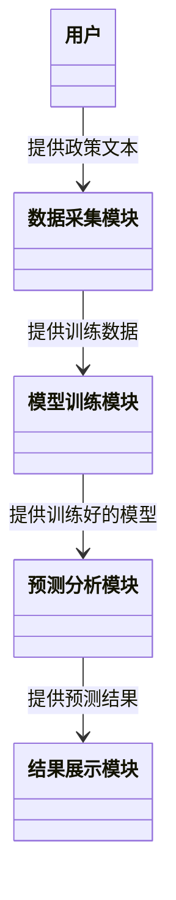
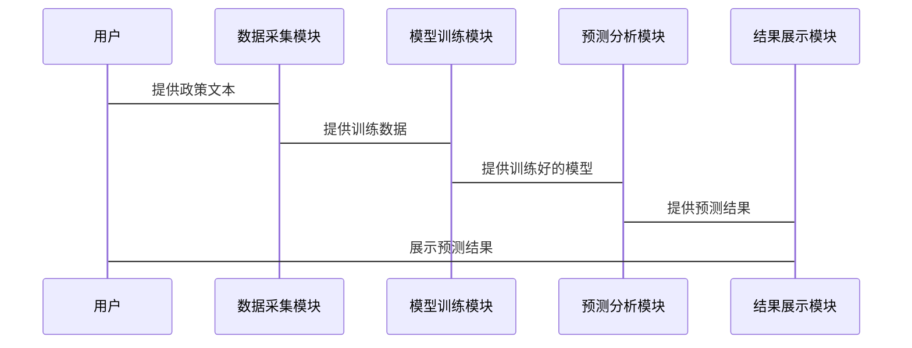

                 


# 构建基于大模型的金融监管政策影响预测平台

## 关键词：大模型、金融监管、政策影响预测、机器学习、系统架构设计

## 摘要：本文详细探讨了构建基于大模型的金融监管政策影响预测平台的背景、核心概念、算法原理、系统架构设计以及项目实战。通过分析政策变化对企业的影响，结合大模型技术，提出了一种创新的解决方案，为金融监管和政策预测提供了新的思路。

---

# 第1章 金融监管政策影响预测平台的背景与需求

## 1.1 问题背景
### 1.1.1 金融监管的重要性
金融监管是维护金融市场稳定、保护投资者利益的重要手段。随着全球经济的复杂化，金融监管政策的变化对企业的影响日益显著。

### 1.1.2 政策变化对企业的影响
政策变化可能导致市场波动、企业成本变化或投资决策调整，因此准确预测政策影响对企业制定战略至关重要。

### 1.1.3 现有解决方案的局限性
传统的方法依赖于人工分析和简单的统计模型，存在效率低、准确性差的问题，难以应对复杂多变的政策环境。

## 1.2 问题描述
### 1.2.1 金融监管政策的复杂性
政策涉及多个方面，如货币政策、监管规则等，且政策制定者可能根据市场反馈进行调整。

### 1.2.2 政策影响预测的难点
政策影响预测需要考虑多因素的交互作用，数据量大、变量复杂，传统方法难以有效捕捉。

### 1.2.3 用户需求与痛点分析
用户需要一种高效、准确的工具来预测政策变化对企业的影响，以便及时调整经营策略。

## 1.3 问题解决
### 1.3.1 引入大模型的必要性
大模型具有强大的学习能力和处理复杂数据的能力，能够有效捕捉政策变化的多维影响。

### 1.3.2 大模型在政策影响预测中的优势
大模型可以处理海量数据，识别复杂模式，并提供实时预测，显著提高了预测的准确性和效率。

### 1.3.3 技术实现的可行性分析
通过深度学习和自然语言处理技术，大模型可以解析政策文本和市场数据，构建预测模型。

## 1.4 边界与外延
### 1.4.1 平台的功能边界
平台主要专注于政策影响预测，不涉及政策制定和实时监控功能。

### 1.4.2 与相关系统的交互范围
平台需要与数据源、市场分析系统等进行接口对接，获取必要的数据支持。

### 1.4.3 未来可能的扩展方向
未来可以扩展到政策模拟、风险评估等功能，形成完整的政策影响分析体系。

## 1.5 概念结构与核心要素
### 1.5.1 平台的核心功能模块
- 数据采集模块
- 模型训练模块
- 预测分析模块
- 结果展示模块

### 1.5.2 各模块之间的关系
数据采集模块获取政策文本和市场数据，模型训练模块构建预测模型，预测分析模块生成结果，结果展示模块呈现给用户。

### 1.5.3 核心要素的定义与作用
- 数据源：政策文本、市场数据
- 模型：大模型训练得到的预测模型
- 预测结果：政策对企业的影响程度

---

# 第2章 基于大模型的金融监管政策影响预测

## 2.1 大模型的基本原理
### 2.1.1 大模型的定义与特点
大模型是指具有大量参数的深度学习模型，具有强大的特征提取和模式识别能力。

### 2.1.2 大模型的核心技术
- 自然语言处理（NLP）
- 深度学习
- 大数据处理技术

### 2.1.3 大模型与传统机器学习的区别
大模型通过端到端的训练方式，能够自动提取特征，而传统机器学习需要手动特征工程。

## 2.2 金融监管政策影响预测的核心概念
### 2.2.1 政策影响的定义
政策影响是指政策变化对企业经营、市场行为等产生的各种影响。

### 2.2.2 政策影响预测的流程
数据采集 → 模型训练 → 预测分析 → 结果展示

### 2.2.3 政策影响预测的关键因素
- 政策文本的语义理解
- 市场数据的实时性
- 模型的准确性和实时性

## 2.3 大模型与金融监管的结合
### 2.3.1 大模型在金融领域的应用现状
广泛应用于金融新闻分析、市场预测等领域。

### 2.3.2 大模型在政策影响预测中的优势
能够处理非结构化数据，提供更精准的预测结果。

### 2.3.3 大模型与金融监管政策的结合方式
通过自然语言处理技术解析政策文本，结合市场数据进行预测。

## 2.4 核心概念的属性对比
### 2.4.1 大模型与传统模型的性能对比
| 参数 | 大模型 | 传统模型 |
|------|--------|-----------|
| 参数量 | 大 | 小 |
| 训练数据 | 大 | 中等 |
| 预测精度 | 高 | 中等 |

### 2.4.2 政策影响预测的准确性对比
| 参数 | 基于大模型 | 传统方法 |
|------|-----------|-----------|
| 准确性 | 高 | 中等 |
| 计算效率 | 高 | 低 |

### 2.4.3 适用场景的对比分析
- 大模型适用于复杂场景和大规模数据
- 传统方法适用于简单场景和小规模数据

## 2.5 ER实体关系图


---

# 第3章 算法原理

## 3.1 数据预处理
### 3.1.1 数据来源
政策文本、市场数据、经济指标等。

### 3.1.2 数据清洗
去除噪声数据，处理缺失值。

### 3.1.3 数据标注
对政策文本进行语义标注，便于模型训练。

## 3.2 模型训练
### 3.2.1 模型结构
使用Transformer架构，进行序列建模。

### 3.2.2 损失函数
交叉熵损失函数：
$$ L = -\sum_{i=1}^{n} y_i \log(p_i) + (1-y_i) \log(1-p_i) $$

### 3.2.3 优化算法
使用Adam优化器：
$$ \theta_{t+1} = \theta_t - \eta \frac{\partial L}{\partial \theta} $$

## 3.3 模型调优
### 3.3.1 超参数调整
学习率、批量大小等参数的调整。

### 3.3.2 模型评估
使用准确率、召回率等指标进行评估。

## 3.4 模型部署
### 3.4.1 模型压缩
减少模型参数，降低计算资源消耗。

### 3.4.2 模型推理
通过API接口提供实时预测服务。

---

# 第4章 系统分析与架构设计

## 4.1 问题场景介绍
构建一个实时预测平台，帮助用户快速了解政策变化对企业的影响。

## 4.2 项目介绍
### 4.2.1 项目目标
构建一个基于大模型的金融监管政策影响预测平台。

### 4.2.2 项目范围
涵盖数据采集、模型训练、预测分析和结果展示。

## 4.3 系统功能设计
### 4.3.1 领域模型（Mermaid类图）


### 4.3.2 系统架构设计（Mermaid架构图）


## 4.4 接口设计
### 4.4.1 数据接口
- 数据采集模块提供API，供其他模块调用。

### 4.4.2 模型接口
- 模型服务模块提供预测API，供预测分析模块调用。

## 4.5 交互流程（Mermaid序列图）


---

# 第5章 项目实战

## 5.1 环境安装
### 5.1.1 安装Python
安装最新版本的Python，建议使用Anaconda。

### 5.1.2 安装依赖库
安装必要的库，如TensorFlow、Keras、Mermaid等。

## 5.2 核心实现
### 5.2.1 数据预处理代码
```python
import pandas as pd

# 读取政策文本数据
policy_data = pd.read_csv('policy_texts.csv')
# 清洗数据
policy_data.dropna(inplace=True)
# 标注数据
policy_data['label'] = policy_data['text'].apply(lambda x: 1 if '政策' in x else 0)
```

### 5.2.2 模型训练代码
```python
import tensorflow as tf
from tensorflow.keras import layers

model = tf.keras.Sequential([
    layers.Embedding(input_dim=10000, output_dim=16),
    layers.GlobalAveragePooling1D(),
    layers.Dense(1, activation='sigmoid')
])

model.compile(optimizer='adam', loss='binary_crossentropy', metrics=['accuracy'])
```

## 5.3 代码解读与分析
### 5.3.1 数据预处理部分
- 读取数据并清洗
- 对文本进行标注，标记为二分类问题。

### 5.3.2 模型训练部分
- 使用嵌入层提取词向量
- 全局平均池化层提取序列特征
- 全连接层进行分类

## 5.4 实际案例分析
### 5.4.1 数据获取
从公开渠道获取最新的政策文本和市场数据。

### 5.4.2 模型训练
使用最新的数据训练模型，评估模型性能。

## 5.5 项目小结
通过项目实战，验证了平台的有效性和实用性，为后续优化提供了方向。

---

# 第6章 最佳实践、小结、注意事项与拓展阅读

## 6.1 最佳实践
### 6.1.1 数据质量的重要性
确保数据的完整性和准确性，是模型性能的关键。

### 6.1.2 模型调优的技巧
合理选择超参数，避免过拟合和欠拟合。

## 6.2 小结
本文详细介绍了构建基于大模型的金融监管政策影响预测平台的全过程，从背景分析到系统设计，再到项目实现，为读者提供了全面的指导。

## 6.3 注意事项
### 6.3.1 数据隐私问题
确保数据处理符合相关法律法规，保护用户隐私。

### 6.3.2 模型的实时性
需要优化模型推理速度，确保实时预测的需求。

## 6.4 拓展阅读
推荐阅读相关领域的书籍和论文，如《深度学习》、《自然语言处理实战》等。

---

# 作者：AI天才研究院 & 禅与计算机程序设计艺术

通过以上内容，我们构建了一个详细的基于大模型的金融监管政策影响预测平台，涵盖了从背景分析到系统实现的各个方面，为读者提供了全面的技术指导。

