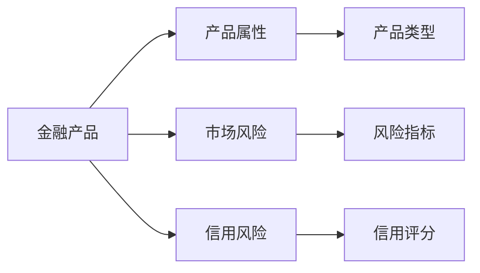
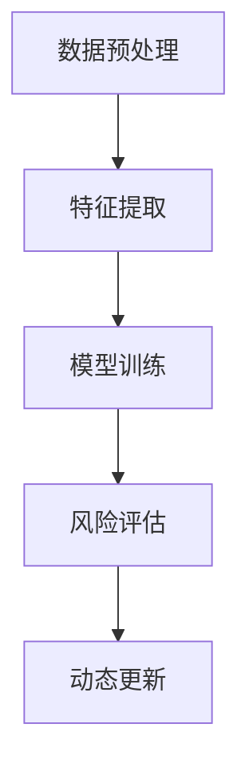
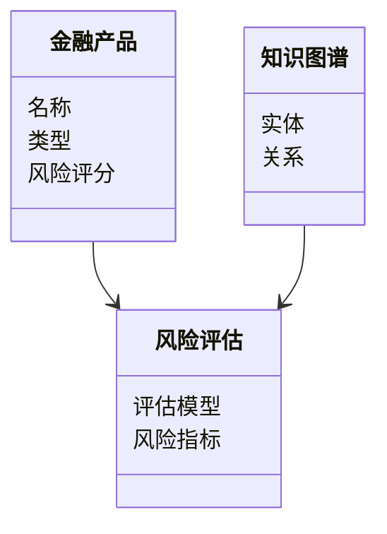
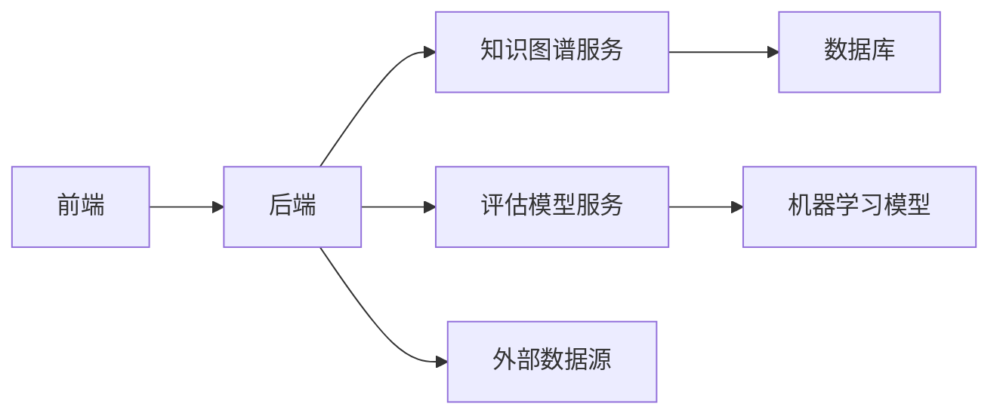
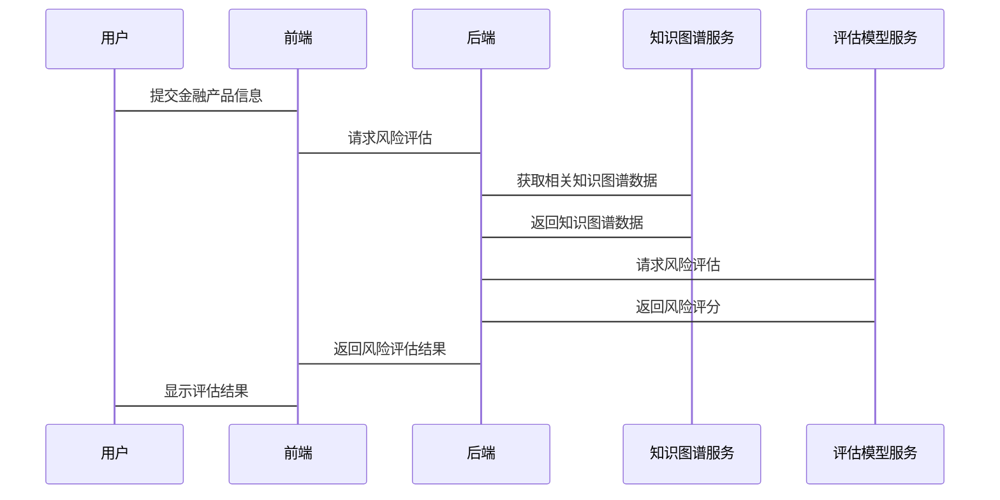

                 


# 构建基于知识图谱的金融产品全生命周期风险动态评估系统

> 关键词：知识图谱，金融产品，风险评估，动态评估，系统架构

> 摘要：本文详细探讨了如何利用知识图谱技术构建金融产品全生命周期的动态风险评估系统。通过分析金融产品全生命周期的关键阶段，结合知识图谱的构建与应用，提出了一套基于知识图谱的动态风险评估方法，并通过系统架构设计和实际案例分析，展示了该系统的可行性和实际应用价值。

---

# 第一部分: 背景介绍与核心概念

## 第1章: 问题背景与问题描述

### 1.1 问题背景

#### 1.1.1 金融产品的全生命周期管理
金融产品从设计、发行、销售到终止，涉及多个阶段和参与者。每个阶段都伴随着不同的风险，例如市场风险、信用风险、操作风险等。传统的风险评估方法通常基于静态数据，难以捕捉动态变化中的风险信号。

#### 1.1.2 传统金融风险评估的局限性
传统金融风险评估方法主要依赖历史数据和统计模型，存在以下问题：
- 数据孤岛：金融产品涉及多个数据源，难以有效整合。
- 动态变化：金融市场的波动性高，静态模型难以捕捉实时风险。
- 关联性不足：传统模型难以发现跨产品、跨市场的关联风险。

#### 1.1.3 知识图谱技术的引入与优势
知识图谱是一种结构化的数据表示方法，能够整合异构数据并发现隐含关系。通过知识图谱技术，可以构建金融产品全生命周期的知识网络，实时监控风险信号。

### 1.2 问题描述

#### 1.2.1 金融产品风险评估的核心挑战
- 数据分散：金融产品涉及多方数据，整合难度大。
- 动态变化：市场环境和产品特性实时变化，需要动态评估。
- 关联性复杂：金融产品之间的关联性高，单一产品的风险可能影响整个市场。

#### 1.2.2 知识图谱在金融领域的应用现状
知识图谱已在金融领域得到广泛应用，例如实体识别、关系挖掘、风险预警等。然而，现有应用多为静态分析，难以满足动态风险评估的需求。

#### 1.2.3 动态风险评估的需求与目标
动态风险评估的目标是实时监控金融产品的风险状态，及时发现潜在风险，并提供预警。通过知识图谱的动态更新能力，可以实现对金融产品全生命周期的实时风险评估。

---

## 第2章: 核心概念与问题解决

### 2.1 核心概念

#### 2.1.1 知识图谱的定义与特点
知识图谱是一种以图结构形式表示知识的技术，由节点（实体）和边（关系）组成。其特点包括：
- 结构化：数据以实体和关系的形式组织。
- 异构性：支持多种数据类型和关系。
- 动态性：能够实时更新和扩展。

#### 2.1.2 金融产品全生命周期管理
金融产品全生命周期包括设计、发行、销售、运行和终止五个阶段。每个阶段都涉及不同的风险类型和管理策略。

#### 2.1.3 风险动态评估的定义与方法
风险动态评估是通过对金融产品全生命周期的数据进行实时分析，评估其风险状态，并提供预警。

### 2.2 问题解决

#### 2.2.1 知识图谱如何支持风险评估
知识图谱通过整合金融产品相关的多源数据，构建知识网络，帮助发现潜在风险和关联关系。

#### 2.2.2 动态评估的核心算法与技术
动态评估需要结合知识图谱的实时更新和机器学习算法，实现对金融产品风险的动态预测和预警。

#### 2.2.3 系统构建的目标与实现路径
目标是构建一个基于知识图谱的金融产品全生命周期风险动态评估系统，实现对金融产品的实时风险评估和预警。

---

## 第3章: 核心概念与联系

### 3.1 核心概念原理

#### 3.1.1 知识图谱的构建原理
知识图谱的构建包括数据抽取、存储、推理和可视化四个步骤。

#### 3.1.2 风险评估的数学模型
风险评估可以通过概率模型、回归分析等方法进行建模。

#### 3.1.3 动态评估的算法原理
动态评估需要结合知识图谱的实时更新和机器学习算法，实现对金融产品风险的动态预测。

### 3.2 概念属性特征对比表

| 概念 | 属性 | 特征 |
|------|------|------|
| 知识图谱 | 结构化 | 节点和边表示实体和关系 |
| 金融产品 | 生命周期 | 设计、发行、销售、运行、终止 |

### 3.3 ER实体关系图



---

# 第二部分: 算法原理与数学模型

## 第4章: 算法原理讲解

### 4.1 算法流程



### 4.2 算法实现

```python
def risk_assessment(data):
    # 数据预处理
    processed_data = preprocess(data)
    
    # 特征提取
    features = extract_features(processed_data)
    
    # 模型训练
    model = train_model(features)
    
    # 风险评估
    risk_score = model.predict(features)
    
    return risk_score
```

### 4.3 数学模型与公式

#### 4.3.1 概率模型
$$ P(A|B) = \frac{P(B|A)P(A)}{P(B)} $$

#### 4.3.2 回归分析
$$ y = \beta_0 + \beta_1x + \epsilon $$

---

## 第5章: 系统分析与架构设计方案

### 5.1 系统分析

#### 5.1.1 项目背景
本文旨在构建一个基于知识图谱的金融产品全生命周期风险动态评估系统，实现对金融产品的实时风险评估和预警。

#### 5.1.2 系统功能设计

##### 领域模型类图



### 5.2 系统架构设计

#### 5.2.1 系统架构图



#### 5.2.2 系统接口设计
- 前端接口：提供用户交互界面，接收输入并返回评估结果。
- 后端接口：处理前端请求，调用知识图谱服务和评估模型服务。
- 数据库接口：提供数据存储和查询功能。

#### 5.2.3 系统交互序列图



---

## 第6章: 项目实战

### 6.1 环境安装

#### 6.1.1 安装依赖
```bash
pip install numpy pandas
pip install networkx
pip install scikit-learn
```

### 6.2 核心代码实现

#### 6.2.1 数据预处理

```python
import pandas as pd
import numpy as np

def preprocess(data):
    # 删除缺失值
    data = data.dropna()
    # 标准化处理
    from sklearn.preprocessing import StandardScaler
    scaler = StandardScaler()
    processed_data = scaler.fit_transform(data)
    return processed_data
```

#### 6.2.2 特征提取

```python
from sklearn.feature_selection import SelectKBest
from sklearn.feature_selection import chi2

def extract_features(data):
    selector = SelectKBest(score_func=chi2, k=5)
    features = selector.fit_transform(data)
    return features
```

#### 6.2.3 模型训练

```python
from sklearn.model import LogisticRegression

def train_model(features):
    model = LogisticRegression()
    model.fit(features, labels)
    return model
```

---

## 第7章: 最佳实践与总结

### 7.1 最佳实践

#### 7.1.1 数据质量
确保数据的准确性和完整性，避免数据偏差。

#### 7.1.2 模型选择
根据实际需求选择合适的模型，并进行模型调优。

#### 7.1.3 系统维护
定期更新知识图谱和模型，确保系统的实时性和准确性。

### 7.2 小结

通过本文的探讨，我们构建了一个基于知识图谱的金融产品全生命周期风险动态评估系统。该系统能够实时监控金融产品的风险状态，并提供预警，为金融风险管理提供了新的思路和方法。

### 7.3 注意事项

- 系统的安全性和稳定性需要重点关注。
- 数据隐私和合规性需要符合相关法律法规。
- 系统的可扩展性需要充分考虑未来业务需求的变化。

### 7.4 拓展阅读

- 知识图谱相关书籍：《知识图谱：概念、方法与应用》
- 机器学习相关书籍：《机器学习实战》

---

作者：AI天才研究院/AI Genius Institute & 禅与计算机程序设计艺术 /Zen And The Art of Computer Programming

