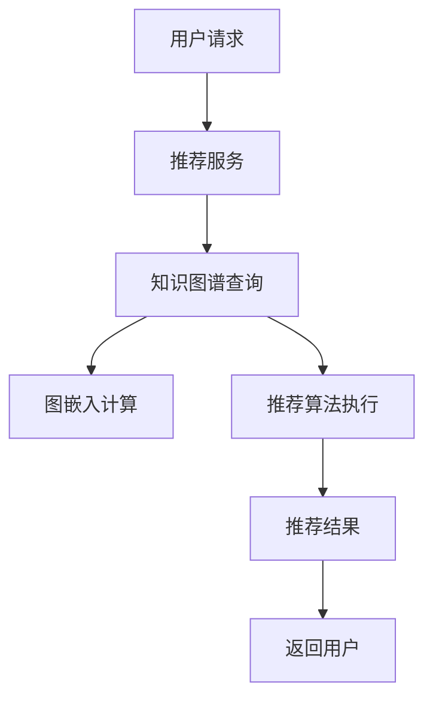

                 


# 构建基于知识图谱的金融产品推荐引擎

## 关键词：知识图谱，金融推荐系统，图嵌入，推荐算法，系统架构

## 摘要：  
本文详细探讨了基于知识图谱的金融产品推荐引擎的构建方法。通过分析金融推荐系统的需求和挑战，结合知识图谱的强大语义表达能力，提出了从数据构建、图嵌入、推荐算法到系统架构的完整解决方案。文章还通过实际案例分析，展示了如何利用知识图谱提升推荐系统的准确性和可解释性，并提供了具体的实现步骤和最佳实践。

---

# 第一部分: 背景与概述

## 第1章: 知识图谱与金融推荐系统概述

### 1.1 知识图谱的背景与概念  
知识图谱是一种以图结构形式表示知识的语义网络，由实体和关系构成，能够将分散的数据组织成有意义的知识网络。其核心特点包括：  
1. **语义性**：通过实体和关系描述数据之间的语义联系。  
2. **结构化**：支持复杂的语义查询和推理。  
3. **动态性**：能够实时更新和扩展。  

在金融领域，知识图谱可以用于客户画像、风险评估、产品推荐等场景。  

### 1.2 金融推荐系统的背景与挑战  
传统推荐系统主要依赖协同过滤或基于内容的推荐方法，但在金融领域面临以下挑战：  
1. **数据稀疏性**：金融数据通常分布不均，用户行为数据较少。  
2. **实时性要求**：金融市场的动态变化要求推荐系统具备实时性。  
3. **可解释性**：用户需要了解推荐的依据，以建立信任。  

知识图谱通过引入语义信息，能够有效解决这些问题，提升推荐系统的准确性和可解释性。  

---

# 第二部分: 核心概念与联系

## 第2章: 知识图谱的核心概念与原理  

### 2.1 知识图谱的构建过程  
知识图谱的构建包括以下步骤：  
1. **数据采集**：从多种数据源（如数据库、API、文本）获取数据。  
2. **实体识别与关系抽取**：通过自然语言处理技术提取实体及其关系。  
3. **知识融合**：对多源数据进行清洗、合并和冲突消解。  
4. **存储与管理**：使用图数据库（如Neo4j）存储知识图谱。  

**示例：ER实体关系图**  
以下是一个简单的ER实体关系图，展示了客户、产品和市场的关系：  
```mermaid
erd
    %%{init: {'theme': 'default', 'auto OR': true}}%%

    database "金融知识图谱"

    entity 客户 {
        id: int
        姓名: string
        账户余额: decimal
    }

    entity 产品 {
        id: int
        名称: string
        风险等级: string
    }

    entity 市场 {
        id: int
        名称: string
        指数: decimal
    }

    relationship 关系：客户 -> 持有 -> 产品
    relationship 关系：市场 -> 影响 -> 产品
```

### 2.2 推荐系统的原理与分类  
推荐系统主要分为以下几类：  
1. **协同过滤**：基于用户行为的相似性进行推荐。  
2. **基于内容的推荐**：分析产品特征进行推荐。  
3. **基于知识图谱的推荐**：结合语义信息进行推荐。  

### 2.3 知识图谱与推荐系统的结合  
知识图谱为推荐系统提供了以下优势：  
1. **语义关联**：通过实体关系揭示产品之间的隐含联系。  
2. **知识推理**：利用图结构进行关联推理，发现潜在的推荐机会。  
3. **可解释性**：能够为推荐结果提供语义解释。  

---

# 第三部分: 算法原理与数学模型  

## 第3章: 知识图谱嵌入算法  

### 3.1 图嵌入算法概述  
图嵌入算法将图结构数据转化为低维向量，常用算法包括：  
1. **Word2Vec**：最初用于文本处理，后扩展到图嵌入。  
2. **GraphSAGE**：通过归纳式学习生成节点向量。  
3. **Node2Vec**：通过随机游走生成节点表示。  

### 3.2 推荐算法的数学模型  
推荐算法的数学模型主要基于矩阵分解和神经网络。  

#### 3.2.1 矩阵分解模型  
矩阵分解是协同过滤的核心方法，其数学表达式为：  
$$X = U \cdot V^T$$  
其中，$X$ 是用户-产品矩阵，$U$ 和 $V$ 分别是用户和产品的隐向量矩阵。  

#### 3.2.2 神经网络模型  
基于神经网络的推荐模型通常采用多层感知机（MLP）结构，其损失函数为：  
$$L = \sum_{u,i} (r_{ui} - \hat{r}_{ui})^2$$  
其中，$r_{ui}$ 是真实评分，$\hat{r}_{ui}$ 是预测评分。  

---

## 第4章: 算法实现与案例分析  

### 4.1 知识图谱嵌入算法的实现  
以下是一个基于GraphSAGE的实现示例：  
```python
def graphsage_layer(x, graph, hidden_size):
    # x: 输入特征矩阵
    # graph: 图结构
    # hidden_size: 隐层大小
    with tf.variable_scope('graphsage'):
        w = tf.get_variable('weights', [x.shape[1], hidden_size])
        b = tf.get_variable('bias', [hidden_size])
        embed = tf.nn.relu(tf.matmul(x, w) + b)
        # 根据图结构聚合邻居节点的特征
        aggregated = tf.reduce_mean(tf.nn.embedding_lookup(embed, graph), axis=1)
        return aggregated
```

### 4.2 推荐算法的实现  
以下是一个基于矩阵分解的推荐算法实现：  
```python
def train_model():
    # 初始化参数
    U = np.random.randn(num_users, k)
    V = np.random.randn(num_products, k)
    
    for _ in range(num_epochs):
        # 前向传播
        pred = np.dot(U, V.T)
        # 计算损失
        loss = np.mean((R - pred)**2)
        # 反向传播
        dU = np.dot((R - pred).T, V)
        dV = np.dot(pred.T, R - pred)
        # 更新参数
        U += learning_rate * dU
        V += learning_rate * dV
    return U, V
```

---

# 第四部分: 系统分析与架构设计  

## 第5章: 系统架构设计  

### 5.1 问题场景介绍  
本文设计的推荐引擎主要用于银行客户的产品推荐，目标是通过分析客户的资产配置、风险偏好和市场趋势，推荐合适的金融产品。  

### 5.2 系统功能设计  
系统功能包括：  
1. **数据采集**：从数据库中获取客户、产品和市场数据。  
2. **知识图谱构建**：构建客户-产品-市场的知识图谱。  
3. **推荐服务**：基于知识图谱生成推荐结果。  

### 5.3 系统架构设计  
以下是一个简化的系统架构图：  


---

## 第6章: 项目实战  

### 6.1 环境安装  
推荐引擎的实现需要以下工具：  
- Python 3.8+  
- TensorFlow 2.0+  
- Neo4j 4.0+  

### 6.2 核心实现代码  
以下是推荐引擎的核心代码：  
```python
# 知识图谱构建
class KnowledgeGraph:
    def __init__(self, nodes, relationships):
        self.graph = {}  # 关系图
        self.nodes = nodes  # 节点列表
        self.relationships = relationships  # 关系列表

    def add_relationship(self, a, b, rel_type):
        if a not in self.graph:
            self.graph[a] = []
        self.graph[a].append((b, rel_type))

# 推荐算法实现
class Recommender:
    def __init__(self, graph):
        self.graph = graph

    def get_recommendations(self, user, num_results=5):
        # 基于知识图谱的推荐逻辑
        recommendations = []
        # 实现具体的推荐算法
        return recommendations
```

### 6.3 案例分析  
以下是一个实际案例：  
假设客户A的风险偏好为低风险，资产规模为10万元。知识图谱分析显示，客户A与产品X在风险等级和资产规模上具有相似性，因此推荐产品X。  

---

# 第五部分: 最佳实践与总结  

## 第7章: 最佳实践  

### 7.1 性能优化  
- 使用分布式训练加速模型训练。  
- 采用增量式更新提升实时性。  

### 7.2 模型调优  
- 调整矩阵分解的维度参数。  
- 优化神经网络的层数和节点数。  

### 7.3 安全性考虑  
- 确保数据隐私合规。  
- 防范模型被恶意攻击。  

---

## 第8章: 总结与展望  

本文详细探讨了基于知识图谱的金融产品推荐引擎的构建方法，从理论到实践提供了完整的解决方案。未来的研究方向包括：  
1. **动态知识图谱**：实时更新知识图谱以应对市场变化。  
2. **多模态推荐**：结合文本、图像等多种数据源进行推荐。  
3. **可解释性优化**：进一步提升推荐结果的可解释性。  

---

# 作者：AI天才研究院 & 禅与计算机程序设计艺术

