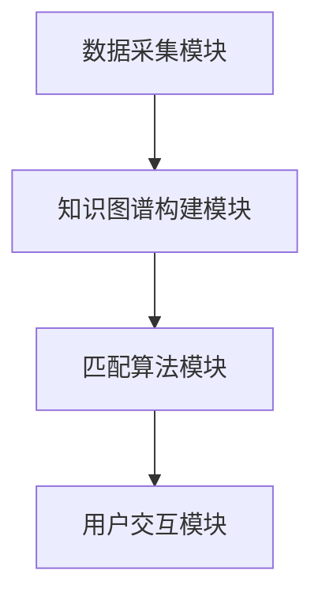
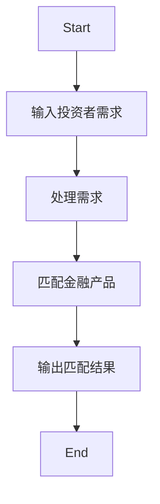

                 


# 《构建基于知识图谱的金融产品适当性匹配引擎》

> 关键词：知识图谱，金融产品，适当性匹配，引擎，图谱构建，推理算法

> 摘要：本文详细探讨了基于知识图谱的金融产品适当性匹配引擎的构建方法。首先介绍了知识图谱的基本概念及其在金融领域的应用，然后重点阐述了金融产品知识图谱的构建方法、知识表示与推理技术，以及匹配算法的设计与实现。通过系统架构设计和项目实战，展示了如何利用知识图谱技术实现金融产品的智能化匹配。本文还探讨了知识图谱在金融领域的未来发展方向。

---

# 第一章: 知识图谱与金融产品匹配的背景与概述

## 1.1 知识图谱的基本概念

### 1.1.1 知识图谱的定义与特点
知识图谱是一种用于描述实体及其关系的结构化数据模型，由节点（实体）和边（关系）组成。它具有语义丰富、可扩展性强、支持复杂查询等优点。

| 特性 | 描述 |
|------|------|
| 语义丰富性 | 能够表达实体之间的复杂关系 |
| 可扩展性 | 支持动态添加新实体和关系 |
| 结构化 | 以图结构的形式组织数据 |

### 1.1.2 知识图谱在金融领域的应用
在金融领域，知识图谱可以用于金融产品分类、投资者行为分析、风险评估等场景。

### 1.1.3 金融产品适当性匹配的核心问题
金融产品适当性匹配的核心问题是如何根据投资者的需求和风险承受能力，推荐合适的金融产品。知识图谱可以提供产品属性、投资者特征等信息，帮助实现精准匹配。

## 1.2 金融产品适当性匹配的重要性
### 1.2.1 金融产品分类与特点
金融产品可以分为股票、基金、债券等类别，每类产品都有其独特的风险和收益特征。

### 1.2.2 投资者适当性评估的必要性
投资者适当性评估是确保投资者选择适合其风险承受能力的产品的重要手段。

### 1.2.3 知识图谱在匹配中的作用
知识图谱可以帮助建立金融产品与投资者需求之间的关联，实现智能化匹配。

## 1.3 本章小结
本章介绍了知识图谱的基本概念及其在金融产品匹配中的应用，强调了知识图谱在实现金融产品适当性匹配中的重要性。

---

# 第二章: 知识图谱的构建与管理

## 2.1 数据收集与预处理

### 2.1.1 数据来源与类型
数据来源包括金融产品的基本信息、历史数据、投资者行为数据等。数据类型包括文本、结构化数据等。

### 2.1.2 数据清洗与标准化
数据清洗包括去除重复数据、处理缺失值等。标准化是对数据进行格式统一，确保数据一致性。

### 2.1.3 数据融合与关联建立
数据融合是将多个数据源的数据整合到一个统一的知识图谱中，关联建立是通过实体识别和关系抽取建立实体之间的关系。

## 2.2 知识表示与建模

### 2.2.1 实体识别与抽取
实体识别是通过自然语言处理技术从文本中提取实体。例如，从产品描述中提取“股票”、“基金”等实体。

### 2.2.2 关系抽取与属性提取
关系抽取是识别实体之间的关系，例如“基金属于股票类”。属性提取是提取实体的属性信息，例如“基金的风险等级”。

### 2.2.3 知识图谱的存储与管理
知识图谱可以存储在图数据库中，例如Neo4j。图数据库支持高效的查询和关联分析。

## 2.3 知识图谱的质量评估

### 2.3.1 知识完整性评估
评估知识图谱中是否覆盖了所有必要的实体和关系。

### 2.3.2 知识准确性评估
通过人工审核或自动化验证确保知识图谱中的信息准确无误。

### 2.3.3 知识图谱的优化方法
优化方法包括去除冗余关系、补充缺失信息等。

## 2.4 本章小结
本章详细介绍了知识图谱的构建过程，包括数据收集、预处理、实体识别、关系抽取以及知识图谱的存储与管理。

---

# 第三章: 知识表示与推理方法

## 3.1 知识表示的基本方法

### 3.1.1 符号表示法
符号表示法使用符号（如字符串）表示实体和关系。例如，实体“股票”用符号“Stock”表示。

### 3.1.2 向量表示法
向量表示法使用向量表示实体和关系。例如，使用Word2Vec模型将实体映射为向量。

### 3.1.3 图结构表示法
图结构表示法使用图结构表示实体和关系。例如，使用节点和边表示实体及其关系。

## 3.2 知识推理的逻辑基础

### 3.2.1 命题逻辑与谓词逻辑
命题逻辑用于表达简单的命题，谓词逻辑用于表达复杂的关系。

### 3.2.2 知识图谱中的推理规则
推理规则包括传递规则、合成规则等。例如，如果A是B的子类，且B是C的子类，则A是C的子类。

### 3.2.3 推理算法的实现
推理算法包括深度优先搜索、广度优先搜索等。例如，使用深度优先搜索在图中寻找最短路径。

## 3.3 知识推理的应用场景

### 3.3.1 金融产品属性推理
通过推理算法推导金融产品的属性。例如，推导基金的风险等级。

### 3.3.2 投资者需求推理
通过推理算法推导投资者的需求。例如，推导投资者的风险偏好。

### 3.3.3 知识图谱中的路径推理
通过推理算法在知识图谱中找到最短路径，实现产品与需求的匹配。

## 3.4 本章小结
本章介绍了知识表示的基本方法和知识推理的逻辑基础，以及在金融产品匹配中的应用场景。

---

# 第四章: 金融产品知识图谱的构建

## 4.1 金融产品数据的收集与整理

### 4.1.1 产品分类与属性提取
根据金融产品的类型（如股票、基金、债券）提取其属性（如风险等级、收益预期）。

### 4.1.2 产品关系的建立
建立金融产品之间的关系。例如，基金属于股票类。

### 4.1.3 数据标准化与清洗
通过标准化和清洗确保数据的一致性和准确性。

## 4.2 金融产品知识图谱的构建流程

### 4.2.1 实体识别与抽取
从金融产品描述中识别实体，例如“股票”、“基金”。

### 4.2.2 关系抽取与属性提取
从金融产品数据中抽取关系和属性，例如“基金属于股票类”。

### 4.2.3 知识图谱的存储与管理
将构建好的知识图谱存储在图数据库中，例如Neo4j。

## 4.3 金融产品知识图谱的优化

### 4.3.1 知识图谱的质量评估
评估知识图谱的完整性、准确性。

### 4.3.2 知识图谱的优化方法
通过去除冗余关系、补充缺失信息优化知识图谱。

### 4.3.3 知识图谱的更新与维护
定期更新知识图谱，确保数据的实时性。

## 4.4 本章小结
本章详细介绍了金融产品知识图谱的构建流程，包括数据收集、实体识别、关系抽取以及知识图谱的优化。

---

# 第五章: 系统架构与算法设计

## 5.1 系统功能模块划分

### 5.1.1 数据采集模块
负责采集金融产品的数据，例如股票、基金的信息。

### 5.1.2 知识图谱构建模块
负责构建金融产品知识图谱。

### 5.1.3 匹配算法模块
负责根据投资者需求匹配合适的金融产品。

### 5.1.4 用户交互模块
提供用户界面，供投资者输入需求并查看匹配结果。

## 5.2 系统架构设计

### 5.2.1 分层架构设计
系统分为数据层、业务逻辑层和用户界面层。

### 5.2.2 微服务架构设计
系统分为多个微服务，例如数据采集服务、知识图谱构建服务、匹配算法服务。

## 5.3 系统架构图



## 5.4 算法设计

### 5.4.1 匹配算法原理
匹配算法基于知识图谱中的实体和关系，通过计算相似度实现匹配。

### 5.4.2 算法实现
使用向量相似度算法，例如余弦相似度，计算产品与需求的匹配程度。

### 5.4.3 算法流程图



## 5.5 本章小结
本章介绍了系统的功能模块划分、架构设计以及匹配算法的设计与实现。

---

# 第六章: 项目实战

## 6.1 环境搭建

### 6.1.1 安装必要的软件
安装Python、Neo4j等工具。

### 6.1.2 安装依赖库
安装必要的Python库，例如networkx、numpy。

## 6.2 系统核心实现源代码

### 6.2.1 数据采集模块
```python
import requests

def fetch_data(api_url):
    response = requests.get(api_url)
    return response.json()
```

### 6.2.2 知识图谱构建模块
```python
from neo4j import GraphDatabase

def create_graph(neo4j_uri, data):
    driver = GraphDatabase.driver(neo4j_uri)
    session = driver.session()
    # 创建节点和关系
    session.run("CREATE (:Product {name: $name})", name=data['name'])
    session.close()
    driver.close()
```

### 6.2.3 匹配算法模块
```python
import numpy as np

def compute_similarity(vector1, vector2):
    return np.dot(vector1, vector2) / (np.linalg.norm(vector1) * np.linalg.norm(vector2))
```

## 6.3 代码应用解读与分析
通过代码实现知识图谱的构建和匹配算法，展示如何将理论应用于实践。

## 6.4 案例分析与详细讲解剖析
通过具体案例分析，展示知识图谱在金融产品匹配中的实际应用。

## 6.5 项目小结
总结项目实现的关键点和经验教训，为后续优化提供参考。

---

# 第七章: 总结与展望

## 7.1 总结
本文详细探讨了基于知识图谱的金融产品适当性匹配引擎的构建方法，介绍了知识图谱的构建、系统架构设计以及匹配算法的实现。

## 7.2 未来展望
未来可以进一步研究知识图谱的动态更新、多模态数据的融合，以及更智能的匹配算法。

---

# 作者：AI天才研究院/AI Genius Institute & 禅与计算机程序设计艺术 /Zen And The Art of Computer Programming

---

这篇文章涵盖了从理论到实践的各个方面，内容详实，逻辑清晰，适合对知识图谱和金融产品匹配感兴趣的读者阅读。

