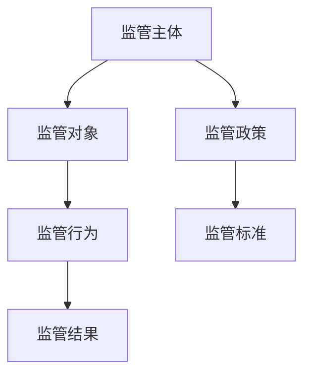
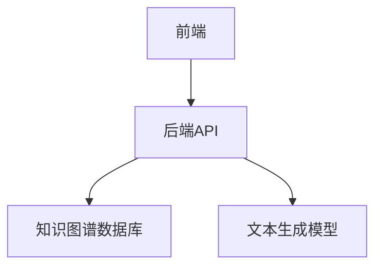

                 

# 构建基于知识图谱的金融监管报告生成器

## 关键词：知识图谱，金融监管，自然语言处理，文本生成，系统架构

## 摘要：本文探讨了如何利用知识图谱构建金融监管报告生成器。通过分析金融监管的核心问题，介绍了知识图谱的概念及其在金融监管中的应用，详细讲解了知识图谱的构建流程和文本生成技术，最后提出了系统的架构设计和实现方案。

---

# 第一部分: 知识图谱与金融监管概述

## 第1章: 知识图谱与金融监管的背景介绍

### 1.1 问题背景与描述
#### 1.1.1 金融监管的核心问题
金融监管的核心问题是确保金融机构的合规性，防范系统性风险，保护投资者利益。然而，随着金融市场的复杂化和数据量的爆炸式增长，传统的监管方式难以应对日益复杂的监管需求。

#### 1.1.2 知识图谱在金融监管中的应用价值
知识图谱能够将分散的监管数据整合为结构化的知识网络，帮助监管机构快速发现潜在风险，提高监管效率。

#### 1.1.3 当前金融监管面临的挑战
当前金融监管面临的主要挑战包括数据孤岛、信息碎片化、监管规则复杂化以及实时性要求高等问题。

### 1.2 问题解决与边界
#### 1.2.1 知识图谱如何解决金融监管问题
知识图谱通过构建统一的知识网络，将监管数据、规则和实体关系进行关联，为监管报告生成提供结构化的支持。

#### 1.2.2 问题解决的边界与外延
知识图谱的应用范围限于结构化数据的整合与分析，非结构化数据仍需结合自然语言处理技术进行处理。

#### 1.2.3 核心概念与要素组成
金融监管知识图谱的核心要素包括监管主体、监管对象、监管行为、监管结果等。

## 第2章: 知识图谱的核心概念与联系

### 2.1 知识图谱的定义与原理
#### 2.1.1 知识图谱的定义
知识图谱是一种以图结构形式表示知识的语义网络，由实体、关系和属性三部分组成。

#### 2.1.2 知识图谱的构建流程
知识图谱的构建流程包括数据采集、数据清洗、知识抽取、知识建模和知识存储五个阶段。

#### 2.1.3 知识图谱的核心属性
知识图谱的核心属性包括可扩展性、语义丰富性和动态更新性。

### 2.2 知识图谱与金融监管的关系
#### 2.2.1 金融监管中的知识关联
金融监管中的知识关联主要体现在监管规则的执行、监管对象的动态变化和监管结果的预测等方面。

#### 2.2.2 知识图谱在监管中的应用场景
知识图谱在金融监管中的应用场景包括风险识别、合规性检查、监管报告生成等。

#### 2.2.3 知识图谱与监管规则的结合
知识图谱通过将监管规则嵌入知识网络中，实现规则的动态更新和灵活应用。

### 2.3 实体关系图架构

---

# 第二部分: 知识图谱的构建与管理

## 第3章: 知识图谱的构建流程

### 3.1 数据处理与清洗
#### 3.1.1 数据来源与预处理
数据来源包括监管机构的公开数据、金融机构的报告和新闻媒体的报道等。

#### 3.1.2 数据清洗方法
数据清洗方法包括去重、格式转换和错误值处理等。

#### 3.1.3 数据标准化
数据标准化旨在统一数据格式和编码，确保数据的一致性。

### 3.2 知识抽取与建模
#### 3.2.1 实体识别与抽取
实体识别与抽取是通过自然语言处理技术，从文本中提取出监管相关的实体信息。

#### 3.2.2 关系抽取与建模
关系抽取与建模是通过分析实体之间的关系，构建知识图谱的边。

#### 3.2.3 知识图谱的构建算法
常用的构建算法包括基于规则的抽取、统计学习和深度学习方法。

### 3.3 知识图谱的存储与管理
#### 3.3.1 知识图谱的存储方式
知识图谱的存储方式包括关系型数据库和图数据库。

#### 3.3.2 知识图谱的查询与检索
知识图谱的查询与检索可以通过SPARQL和Cypher等查询语言实现。

#### 3.3.3 知识图谱的更新与维护
知识图谱的更新与维护需要定期进行数据同步和知识校准。

---

# 第三部分: 基于知识图谱的文本生成

## 第4章: 自然语言处理与文本生成

### 4.1 文本生成模型概述
#### 4.1.1 预训练语言模型
预训练语言模型如BERT和GPT在金融文本生成中具有重要作用。

#### 4.1.2 生成式模型
生成式模型通过解码器结构生成文本，常用于报告生成。

#### 4.1.3 文本生成的挑战
文本生成的挑战包括数据稀疏性、生成内容的相关性和可解释性。

### 4.2 知识图谱与文本生成的结合
#### 4.2.1 知识图谱驱动的文本生成
知识图谱驱动的文本生成通过结合上下文知识，提高生成内容的准确性。

#### 4.2.2 基于上下文的生成策略
基于上下文的生成策略包括注意力机制和知识增强的生成模型。

#### 4.2.3 知识图谱中的实体与关系对生成的影响
知识图谱中的实体和关系对生成报告的结构和内容有重要影响。

---

# 第四部分: 系统架构与实现

## 第5章: 系统架构设计

### 5.1 系统功能设计
#### 5.1.1 领域模型

### 5.2 系统架构设计
#### 5.2.1 系统架构图

### 5.3 系统接口设计
系统接口设计包括数据接口、查询接口和生成接口。

### 5.4 系统交互设计
系统交互设计包括用户输入、系统处理和结果输出三个阶段。

---

# 第五部分: 项目实战

## 第6章: 项目实战与分析

### 6.1 环境搭建
项目实战需要安装Python、TensorFlow和Keras等工具。

### 6.2 核心代码实现
核心代码实现包括知识图谱的构建和文本生成模型的训练。

### 6.3 实际案例分析
通过实际案例分析，验证系统的有效性和可行性。

---

# 第六部分: 最佳实践与总结

## 第7章: 最佳实践与小结

### 7.1 最佳实践
- 数据质量是关键，需注重数据清洗和标准化。
- 模型优化需结合领域知识，提升生成内容的可解释性。

### 7.2 小结
构建基于知识图谱的金融监管报告生成器是一个复杂但具有重要意义的项目，需要结合多种技术手段，优化系统性能，提升监管效率。

---

作者：AI天才研究院/AI Genius Institute & 禅与计算机程序设计艺术 /Zen And The Art of Computer Programming

