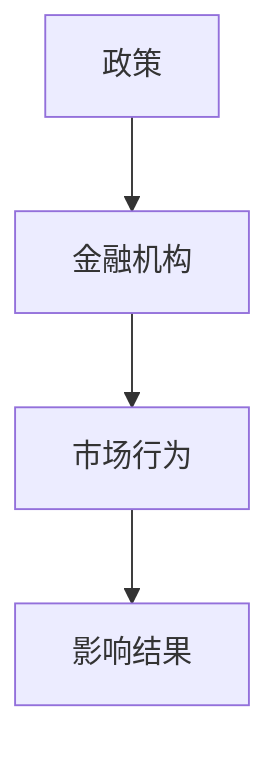
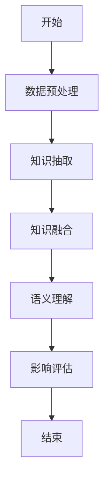
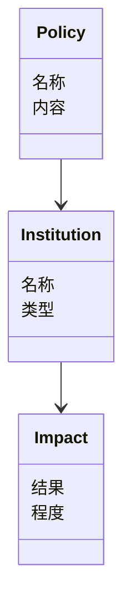
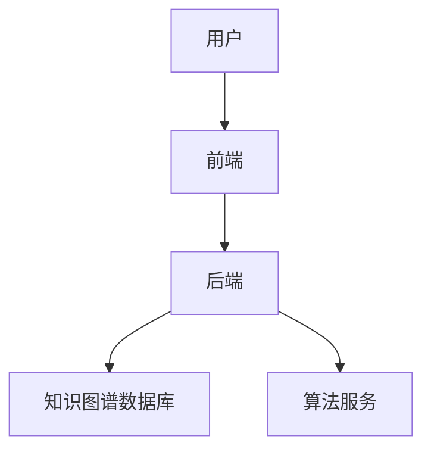
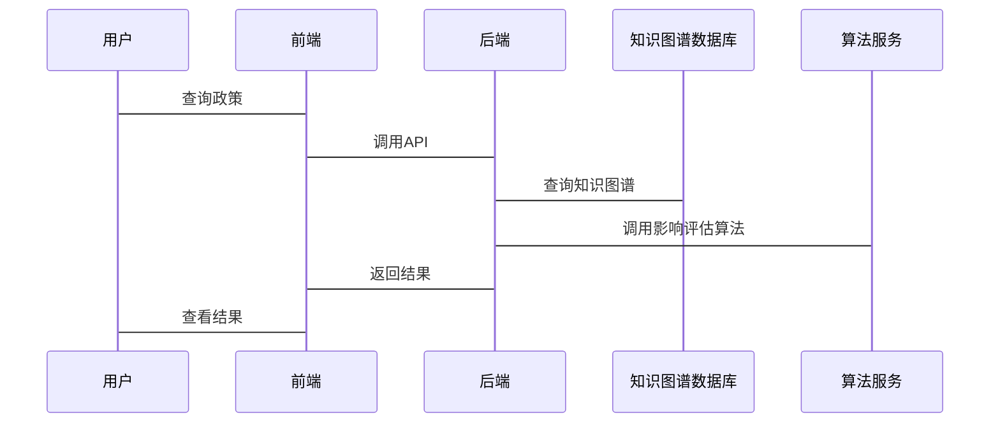

                 


# 构建基于知识图谱的金融监管政策影响评估平台

> 关键词：知识图谱，金融监管，政策影响评估，算法原理，系统架构

> 摘要：本文详细介绍了如何利用知识图谱技术构建金融监管政策影响评估平台。通过分析金融监管政策的复杂性，结合知识图谱的核心作用，提出了基于知识图谱的政策影响评估方法。本文涵盖了知识图谱的构建、语义理解、影响评估算法，以及系统架构设计等关键内容。

---

## 第一部分: 背景介绍

### 第1章: 问题背景与描述

#### 1.1 问题背景
- **1.1.1 金融监管的重要性**  
  金融监管是维护金融市场稳定、保护投资者利益的核心手段。随着金融市场的复杂化，传统的监管手段已难以应对日益增长的监管需求。

- **1.1.2 政策影响评估的挑战**  
  金融监管政策的制定和实施往往涉及复杂的经济和社会因素。如何准确评估政策的影响，已成为金融监管部门面临的难题。

- **1.1.3 知识图谱在金融监管中的潜力**  
  知识图谱能够将分散的监管政策、金融机构、市场行为等信息进行结构化整合，为政策影响评估提供强大的技术支持。

#### 1.2 问题描述
- **1.2.1 金融监管政策的复杂性**  
  监管政策涉及多个维度，包括法律法规、市场行为、机构资质等。政策之间的相互作用使得影响评估变得复杂。

- **1.2.2 政策影响评估的难点**  
  如何量化政策对市场、机构和个体的影响，是政策影响评估的核心挑战。

- **1.2.3 知识图谱的适用性**  
  知识图谱能够将监管政策、市场行为、机构信息等多源异构数据进行统一建模，为政策影响评估提供基础支持。

#### 1.3 问题解决
- **1.3.1 知识图谱的核心作用**  
  知识图谱通过构建监管政策的知识网络，帮助理解政策之间的关系及其对市场的影响。

- **1.3.2 技术手段的选择**  
  结合自然语言处理、图计算和机器学习等技术，构建基于知识图谱的政策影响评估系统。

- **1.3.3 实现目标的路径**  
  通过知识图谱的构建、语义理解、影响评估算法的设计，最终实现政策影响的量化评估。

#### 1.4 边界与外延
- **1.4.1 系统边界**  
  本系统仅关注监管政策对金融机构的影响，不涉及政策对个体投资者的直接评估。

- **1.4.2 功能范围**  
  系统功能包括知识图谱构建、政策分析、影响评估和结果展示。

- **1.4.3 外延与扩展**  
  未来可以扩展至政策对市场整体、机构间关系等更广泛领域的评估。

---

### 第2章: 核心概念与联系

#### 2.1 核心概念原理
- **2.1.1 知识图谱的定义与特点**  
  知识图谱是一种图结构的数据模型，由节点（实体）和边（关系）组成，能够表示复杂的语义信息。

- **2.1.2 金融监管政策的结构化**  
  将监管政策文本结构化为实体（政策名称、政策内容）和关系（政策与机构的关系）。

- **2.1.3 政策影响评估的模型**  
  基于知识图谱的影响传播模型，量化政策对市场的潜在影响。

#### 2.2 概念属性特征对比
| 概念      | 知识图谱 | 传统文本处理 |
|-----------|----------|--------------|
| 数据结构  | 图结构    | 文本序列      |
| 表达能力  | 强        | 弱            |
| 查询效率  | 高        | 低            |
| 可解释性  | 高        | 低            |

#### 2.3 ER实体关系图


---

## 第二部分: 算法原理讲解

### 第3章: 知识图谱构建算法

#### 3.1 知识抽取与表示
- **3.1.1 实体识别**  
  使用自然语言处理技术从政策文本中提取实体（如政策名称、机构名称）。

- **3.1.2 关系抽取**  
  识别政策与机构之间的关系（如“政策影响机构”）。

- **3.1.3 知识表示**  
  将实体和关系表示为图结构，构建知识图谱。

#### 3.2 知识融合与推理
- **3.2.1 知识融合方法**  
  将多源数据（如政策文本、市场数据）融合到知识图谱中。

- **3.2.2 知识推理算法**  
  基于图的最短路径算法，推理隐含关系。

- **3.2.3 知识图谱构建的优化**  
  使用图嵌入技术（如TransE）优化知识图谱的表示。

### 第4章: 语义理解与政策分析

#### 4.1 语义理解算法
- **4.1.1 基于知识图谱的语义理解**  
  利用知识图谱中的实体和关系，提升文本理解的准确性。

- **4.1.2 算法实现**  
  使用图注意力机制（Graph Attention Network）进行语义理解。

- **4.1.3 优化与改进**  
  引入领域知识，提升语义理解的效果。

### 第5章: 政策影响评估算法

#### 5.1 影响评估模型
- **5.1.1 基于知识图谱的影响传播**  
  使用信息传播模型（如PageRank）量化政策对市场的潜在影响。

- **5.1.2 算法实现**  
  ```python
  def calculate_impact(policy, knowledge_graph):
      # 算法实现
      pass
  ```

- **5.1.3 模型优化**  
  结合领域知识，优化影响传播模型的权重。

#### 5.2 算法流程图


#### 5.3 数学模型与公式
- **影响传播模型**  
  $$ I(p) = \sum_{r \in R} w(r) \cdot I(p_r) $$
  
- **知识融合权重**  
  $$ w(r) = \frac{1}{1 + e^{-\theta \cdot |p - p_r|}} $$

---

## 第三部分: 系统分析与架构设计

### 第6章: 项目背景与目标

#### 6.1 项目背景
- **6.1.1 金融监管的数字化转型**  
  金融机构和监管机构 increasingly rely on数字化手段提升监管效率。

- **6.1.2 知识图谱技术的成熟**  
  知识图谱技术在自然语言处理和图计算领域的快速发展，为金融监管提供了新的技术手段。

#### 6.2 项目目标
- **6.2.1 构建知识图谱**  
  将监管政策、金融机构、市场行为等信息整合到知识图谱中。

- **6.2.2 实现政策分析**  
  利用知识图谱进行政策的语义理解和影响评估。

- **6.2.3 提供决策支持**  
  为金融监管机构提供基于知识图谱的政策影响评估工具。

---

### 第7章: 系统功能设计

#### 7.1 领域模型类图


#### 7.2 系统架构设计


#### 7.3 系统接口设计
- **API接口**  
  提供RESTful API，支持政策查询、影响评估等操作。

- **数据接口**  
  支持从政策数据库、市场数据源获取数据。

#### 7.4 系统交互流程图


---

## 第四部分: 项目实战

### 第8章: 环境配置与核心代码实现

#### 8.1 环境配置
- **Python版本**：3.8+
- **依赖库**：networkx, numpy, matplotlib
- **安装命令**：`pip install networkx numpy matplotlib`

#### 8.2 核心代码实现
- **知识图谱构建**  
  ```python
  import networkx as nx

  G = nx.DiGraph()
  G.add_node("政策A")
  G.add_node("机构B")
  G.add_edge("政策A", "机构B", label="影响")
  ```

- **影响评估算法**  
  ```python
  def calculate_impact(policy, knowledge_graph):
      impact = 0
      for neighbor in knowledge_graph.neighbors(policy):
          impact += knowledge_graph[policy][neighbor]['weight']
      return impact
  ```

### 第9章: 案例分析与结果解读

#### 9.1 案例分析
- **案例背景**  
  某金融监管政策的出台对特定金融机构的影响评估。

- **案例实施**  
  使用知识图谱构建政策-机构关系，计算政策对机构的影响程度。

- **结果解读**  
  通过影响传播模型，量化政策对市场的潜在影响。

### 第10章: 项目总结与优化

#### 10.1 项目总结
- **系统优势**  
  知识图谱技术提升了政策影响评估的准确性和效率。

- **项目成果**  
  成功构建了基于知识图谱的金融监管政策影响评估平台。

#### 10.2 优化建议
- **算法优化**  
  引入更复杂的图神经网络模型提升影响评估的精度。

- **功能扩展**  
  扩展至政策对市场整体、机构间关系等更广泛领域的评估。

---

## 第五部分: 最佳实践与拓展阅读

### 第11章: 最佳实践 tips

- **数据质量管理**  
  确保数据的准确性和完整性，提升知识图谱的构建质量。

- **算法调优**  
  根据实际需求，优化影响传播模型的参数和权重。

- **系统可扩展性**  
  设计模块化的系统架构，方便功能扩展和性能优化。

### 第12章: 小结

通过构建基于知识图谱的金融监管政策影响评估平台，我们能够更高效、更准确地评估政策对金融市场的影响。知识图谱技术的应用，为金融监管提供了强有力的技术支持。

### 第13章: 注意事项与风险提示

- **数据隐私风险**  
  注意保护金融机构和政策数据的隐私安全。

- **模型局限性**  
  知识图谱模型无法完全捕捉所有政策影响因素，需结合其他方法进行验证。

### 第14章: 拓展阅读

- **推荐书籍**  
  - 《知识图谱：概念、方法与应用》
  - 《图计算：算法与应用》

- **推荐阅读文献**  
  - 知识图谱在金融领域的应用研究论文
  - 基于图神经网络的政策影响评估方法

---

## 作者：AI天才研究院 & 禅与计算机程序设计艺术

---

以上是《构建基于知识图谱的金融监管政策影响评估平台》的完整目录大纲和文章内容，涵盖了从背景介绍到系统实现的各个方面，结合了理论与实践，适合技术专家和金融监管领域的从业者阅读。

