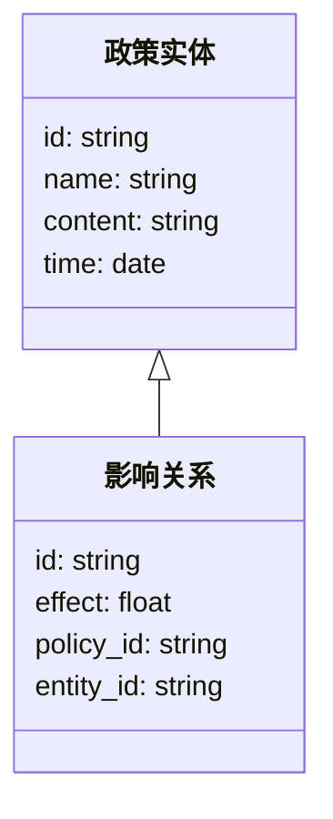
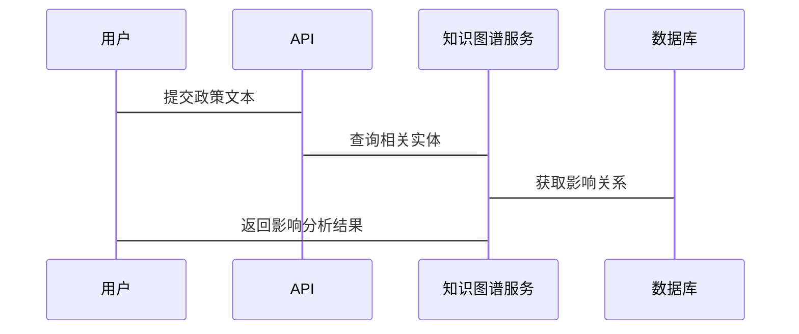

                 


# 构建基于知识图谱的金融监管政策影响追踪系统

> 关键词：知识图谱、金融监管、政策影响、系统构建、算法原理

> 摘要：本文详细探讨了如何利用知识图谱构建金融监管政策影响追踪系统。通过分析金融监管的核心需求，结合知识图谱的构建方法，设计了系统的整体架构，并详细讲解了从数据采集、实体识别到关系抽取的完整流程。本文还提出了基于图的传播模型来评估政策影响，并通过实际案例验证了系统的有效性。最后，本文总结了系统的实现过程，并展望了未来的发展方向。

---

## 第一部分：背景介绍

### 第1章：问题背景与需求分析

#### 1.1 问题背景
金融监管是维护金融市场稳定的重要手段，但政策的复杂性和多变性使得追踪政策影响变得极具挑战性。传统的政策影响分析方法依赖于人工梳理和统计分析，效率低下且难以捕捉复杂关系。

#### 1.2 需求分析
- **用户需求分析**：金融机构和监管机构需要实时了解政策变化及其影响，以便及时调整业务策略。
- **功能需求概述**：系统需要实现政策文本的自动解析、政策影响的可视化展示以及影响程度的量化评估。
- **性能需求与边界条件**：系统需要处理大规模数据，支持实时更新，并保证分析结果的准确性。

### 第2章：知识图谱与金融监管的结合

#### 2.1 知识图谱的基本概念
- **定义**：知识图谱是一种以图结构形式表示知识的数据库，由实体和关系组成。
- **构建过程**：包括数据采集、实体识别、关系抽取等步骤。
- **表示方法**：常用RDF（资源描述框架）或图数据库（如Neo4j）进行存储。

#### 2.2 金融监管中的知识图谱应用
- **金融监管的核心要素**：包括金融机构、监管政策、市场行为等。
- **知识图谱在金融监管中的作用**：通过构建知识图谱，可以发现隐藏的关系和模式，辅助政策分析和风险预警。

---

## 第二部分：核心概念与联系

### 第3章：核心概念的详细分析

#### 3.1 知识图谱构建的核心概念
- **实体识别**：通过NLP技术从文本中提取具体实体（如公司名称、政策名称）。
- **关系抽取**：识别实体之间的关系（如“政策X影响市场Y”）。
- **实体链接**：将提取的实体与知识库中的标准实体进行映射。

#### 3.2 金融监管政策追踪的核心概念
- **政策影响分析**：研究政策如何影响市场行为。
- **政策传播模型**：模拟政策在金融体系中的传播路径。
- **政策效果评估**：量化政策对市场的具体影响。

### 第4章：核心概念的属性对比

#### 4.1 知识图谱构建的属性对比
| 实体类型 | 关系类型 | 实体属性 |
|----------|----------|----------|
| 公司、政策 | 影响、关联 | 名称、时间、来源 |

#### 4.2 政策追踪系统的属性对比
| 数据来源 | 数据处理方式 | 数据分析方法 |
|----------|-------------|-------------|
| 政策文本、市场数据 | 文本挖掘、关联分析 | 图传播、统计分析 |

### 第5章：ER实体关系图

#### 5.1 知识图谱的ER图
```mermaid
erd
    entity 实体 {
        id: string
        name: string
        type: string
    }
    entity 关系 {
        id: string
        name: string
        start_id: string
        end_id: string
    }
    实体 -[many] 关系
```

#### 5.2 政策追踪系统的ER图
```mermaid
erd
    entity 政策 {
        id: string
        name: string
        content: string
        time: date
    }
    entity 影响 {
        id: string
        effect: float
        policy_id: string
        entity_id: string
    }
    政策 -[many] 影响
```

---

## 第三部分：算法原理讲解

### 第6章：知识图谱构建算法

#### 6.1 实体识别算法
- **基于规则的实体识别**：利用正则表达式匹配特定模式。
- **基于统计的实体识别**：使用机器学习模型（如CRF）进行序列标注。
- **基于深度学习的实体识别**：利用BERT等预训练模型进行编码。

#### 6.2 关系抽取算法
- **基于模板的关系抽取**：定义模板匹配特定关系。
- **基于规则的关系抽取**：使用句法分析提取关系。
- **基于机器学习的关系抽取**：训练模型识别关系类型。

#### 6.3 实体链接算法
- **基于相似度的链接**：计算实体名称的余弦相似度。
- **基于图结构的链接**：利用知识图谱中的上下文信息进行链接。

### 第7章：政策影响传播算法

#### 7.1 政策传播模型
- **定义**：通过图结构传播政策影响，量化每个实体受政策影响的程度。
- **实现步骤**：
  1. 构建金融实体图。
  2. 初始化政策影响权重。
  3. 迭代传播影响。

#### 7.2 算法流程图
```mermaid
graph TD
    A[开始] -> B[初始化影响权重]
    B -> C[遍历图中每个节点]
    C -> D[计算影响传播]
    D -> E[更新影响权重]
    E -> F[检查收敛条件]
    F -> G[收敛完成]
    G -> H[结束]
```

#### 7.3 数学公式
- **影响传播公式**：
  $$
  influence_{new}(v) = \alpha \cdot influence_{old}(v) + (1-\alpha) \cdot \sum_{u \in neighbors(v)} influence_{old}(u)
  $$
  其中，$\alpha$ 是遗忘系数，$neighbors(v)$ 是节点$v$的邻居。

---

## 第四部分：系统分析与架构设计

### 第8章：系统功能设计

#### 8.1 领域模型


#### 8.2 系统架构


### 第9章：接口设计与交互流程

#### 9.1 系统接口
- **API接口**：
  - `/api/policy-analysis`：接收政策文本，返回影响分析结果。
  - `/api/influence-tracking`：跟踪特定政策的影响路径。

#### 9.2 交互流程


---

## 第五部分：项目实战

### 第10章：环境安装与核心实现

#### 10.1 环境安装
- **安装Python环境**：使用Anaconda或virtualenv。
- **安装依赖库**：`numpy`, `pandas`, `networkx`, `spacy`, `neo4j`。

#### 10.2 核心代码实现
```python
# 实体识别示例代码
import spacy

nlp = spacy.load("en_core_web_sm")
doc = nlp("The policy affects banks and stock markets.")
entities = [ent.text for ent in doc.ents]
print(entities)
```

### 第10章：案例分析与项目总结

#### 10.3 案例分析
- **案例背景**：某金融监管政策的出台。
- **分析过程**：
  1. 从政策文本中提取相关实体。
  2. 构建知识图谱。
  3. 使用传播模型计算影响程度。
- **结果展示**：生成可视化报告，显示受影响的金融机构及其影响程度。

#### 10.4 项目总结
- **实现价值**：提高了政策影响分析的效率和准确性。
- **技术亮点**：结合知识图谱和图传播模型，实现了复杂关系的自动分析。

---

## 第六部分：最佳实践与小结

### 第11章：最佳实践

#### 11.1 实践建议
- 数据质量是关键：确保数据来源可靠，清洗充分。
- 模型调优：根据实际需求调整传播模型的参数。
- 可视化工具：使用图表清晰展示分析结果。

### 第12章：小结与未来展望

#### 12.1 小结
- 本文详细介绍了基于知识图谱的金融监管政策影响追踪系统的构建过程，从理论到实践，完整展示了系统的实现步骤。

#### 12.2 未来展望
- 结合实时数据流，实现动态政策影响分析。
- 引入机器学习模型，提升预测准确性。
- 扩展应用领域，如合规性自动检查。

---

## 作者信息

作者：AI天才研究院/AI Genius Institute & 禅与计算机程序设计艺术/Zen And The Art of Computer Programming

---

# 结束语

本文通过系统化的构建过程，展示了如何利用知识图谱技术解决金融监管中的复杂问题。希望本文能够为相关领域的研究者和实践者提供有价值的参考和启发。

