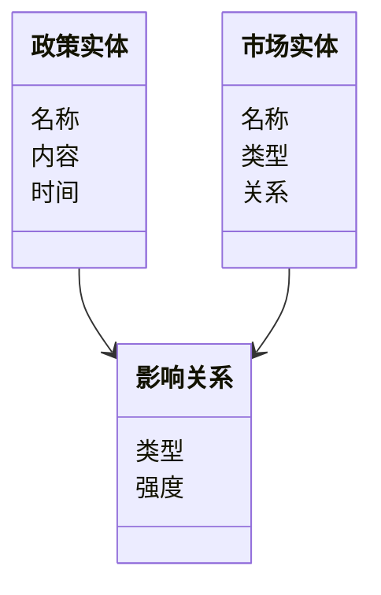
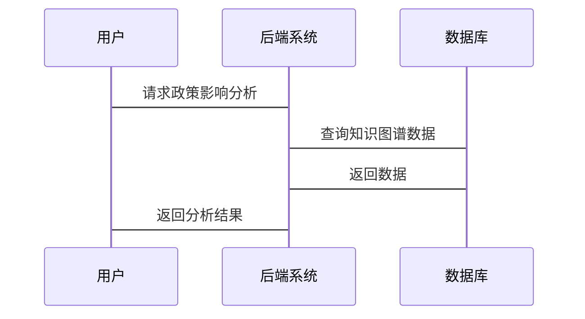

                 


# 构建基于知识图谱的金融监管政策影响链追踪与预测系统

## 关键词：知识图谱，金融监管，政策影响链，路径分析，图神经网络

## 摘要：本文详细介绍了如何利用知识图谱技术构建金融监管政策影响链的追踪与预测系统。文章从问题背景出发，分析了知识图谱在金融监管中的应用，探讨了影响链的追踪方法，提出了基于知识图谱的算法模型，并通过系统架构设计和项目实战展示了系统的实现过程。最后，总结了项目的最佳实践和未来研究方向。

---

## 第一部分：背景介绍

### 第1章：问题背景与核心概念

#### 1.1 问题背景
##### 1.1.1 金融监管政策的重要性
金融市场的稳定运行离不开有效的监管政策。监管政策的制定和实施直接影响市场的参与方，如金融机构、企业、投资者等。然而，传统监管手段难以实时追踪政策的影响，且预测政策效果具有挑战性。

##### 1.1.2 现有监管体系的局限性
现有的金融监管体系主要依赖于事后监管和经验判断，难以对政策的影响进行实时追踪和量化分析。政策的传播路径复杂，涉及多个市场参与者，传统的监管手段难以捕捉这些复杂关系。

##### 1.1.3 知识图谱技术的引入
知识图谱是一种语义网络，能够有效地表示实体及其关系。通过构建金融监管领域的知识图谱，可以将政策、市场参与者、交易行为等要素结构化，为分析政策影响链提供有力工具。

#### 1.2 核心概念
##### 1.2.1 知识图谱的定义与特点
知识图谱是一种图结构数据，由节点（实体）和边（关系）组成。其特点包括结构化、语义化和可扩展性。

##### 1.2.2 金融监管政策的影响链
影响链是指政策从制定到实施，通过市场参与者传递到整个市场的路径。理解影响链有助于预测政策效果。

##### 1.2.3 政策影响链追踪与预测的目标
目标是通过知识图谱分析政策如何影响市场参与者，并预测其对市场整体的影响。

#### 1.3 问题解决与边界
##### 1.3.1 问题的解决思路
构建知识图谱，分析政策影响路径，建立预测模型。

##### 1.3.2 系统的边界与外延
限定于政策影响链的分析，不涉及具体的市场操作。

##### 1.3.3 核心要素与组成结构
包括政策文本、市场实体、影响关系。

---

### 第2章：核心概念与联系

#### 2.1 知识图谱原理
##### 2.1.1 知识图谱的构建过程
包括数据收集、清洗、结构化、建模、存储。

##### 2.1.2 实体与关系的定义
政策、机构、市场参与者等实体，及其相互作用关系。

##### 2.1.3 知识图谱的存储与查询
使用图数据库（如Neo4j）存储，支持高效的查询操作。

#### 2.2 金融监管政策分析
##### 2.2.1 政策文本的结构化处理
将政策文本中的条款转化为结构化的数据。

##### 2.2.2 政策影响的传播路径
政策如何通过市场参与者传递到整个市场。

##### 2.2.3 政策效果的量化评估
通过知识图谱分析政策对市场的具体影响。

#### 2.3 影响链追踪与预测
##### 2.3.1 影响链的定义与建模
政策影响从起点到终点的传播路径。

##### 2.3.2 知识图谱中的路径分析
使用图算法寻找影响链。

##### 2.3.3 预测模型的构建与应用
基于历史数据，建立预测模型。

---

### 第3章：算法原理与数学模型

#### 3.1 算法原理
##### 3.1.1 基于知识图谱的路径分析
使用BFS或DFS算法遍历图结构，寻找最短路径或重要路径。

##### 3.1.2 关联规则挖掘
寻找政策文本中的关联规则，识别影响链中的关键因素。

##### 3.1.3 图神经网络的应用
利用图卷积网络（GCN）学习节点特征，预测影响链。

#### 3.2 数学模型与公式
##### 3.2.1 知识图谱的表示学习
$$ E = -\sum_{(h,r,t) \in G} \log p(h,t|r) $$

##### 3.2.2 影响链的传播模型
$$ I(h,t) = \sum_{k=1}^{n} \alpha_k \cdot P(h,t|k) $$

##### 3.2.3 预测模型的损失函数
$$ L = \sum_{i=1}^{m} (y_i - \hat{y_i})^2 $$

#### 3.3 实例分析
##### 3.3.1 简单路径分析案例
分析一条政策如何影响特定金融机构。

##### 3.3.2 关联规则挖掘案例
识别政策文本中的关联规则，如“如果A，则B”。

##### 3.3.3 图神经网络案例
利用GCN预测政策对市场的潜在影响。

---

## 第四部分：系统分析与架构设计

### 第4章：系统分析与架构设计

#### 4.1 问题场景介绍
描述金融监管中的典型问题，如政策变化对市场的影响难以预测。引出构建知识图谱的必要性，帮助分析和预测政策影响。

#### 4.2 系统功能设计
##### 4.2.1 领域模型
使用Mermaid类图展示系统中的实体及其关系。


##### 4.2.2 系统架构设计
使用Mermaid架构图展示系统各模块的交互和依赖。


##### 4.2.3 接口设计
定义系统的主要接口，如API接口、数据接口。

##### 4.2.4 交互序列图
展示用户与系统之间的交互流程。


---

## 第五部分：项目实战

### 第5章：项目实战

#### 5.1 环境安装
安装必要的工具和库，如Python、TensorFlow、Keras、NetworkX、PyMermaid等。
示例安装命令：
```bash
pip install python-tensorflow
pip install networkx
pip install pymermaid
```

#### 5.2 核心代码实现
##### 5.2.1 知识图谱的构建
```python
import networkx as nx

# 创建知识图谱
G = nx.DiGraph()
G.add_nodes_from(["政策A", "机构B", "市场C"])
G.add_edges_from([("政策A", "机构B"), ("机构B", "市场C")])
```

##### 5.2.2 影响链的路径分析
```python
import networkx as nx

G = nx.DiGraph()
G.add_nodes_from(["政策A", "机构B", "市场C"])
G.add_edges_from([("政策A", "机构B"), ("机构B", "市场C")])

# 找到从“政策A”到“市场C”的所有路径
all_paths = nx.all_possible_paths(G, "政策A", "市场C")
for path in all_paths:
    print(path)
```

##### 5.2.3 预测模型的实现
```python
import tensorflow as tf
from tensorflow.keras import layers

# 构建图神经网络模型
model = tf.keras.Sequential([
    layers.InputLayer(input_shape=(input_dim,)),
    layers.Dense(64, activation='relu'),
    layers.Dense(1, activation='sigmoid')
])
model.compile(optimizer='adam', loss='binary_crossentropy', metrics=['accuracy'])
```

#### 5.3 案例分析
##### 5.3.1 案例背景
分析某项政策如何影响特定金融机构。

##### 5.3.2 数据准备
结构化政策文本和市场数据，构建知识图谱。

##### 5.3.3 分析与预测
使用路径分析和预测模型，展示政策对市场的潜在影响。

#### 5.4 项目小结
总结项目的主要成果，如成功构建了知识图谱，准确追踪了政策影响链。提出改进建议，如引入更多数据源，提高预测精度。

---

## 第六部分：最佳实践

### 第6章：最佳实践

#### 6.1 小结与经验分享
总结项目中的经验教训，如数据质量的重要性，模型选择的影响。

#### 6.2 注意事项
提醒读者在构建知识图谱时，注意数据的准确性和完整性。强调模型的可解释性，确保监管机构能够理解分析结果。

#### 6.3 拓展阅读
推荐相关领域的书籍和论文，如深度学习在金融监管中的应用，知识图谱的最新研究。

#### 6.4 小贴士
数据预处理的重要性：确保数据清洗和结构化，提高分析结果的准确性。系统维护：定期更新知识图谱，保持系统的实时性和准确性。

---

## 第七章：总结与展望

### 7.1 总结
重申文章的主要内容，强调知识图谱在金融监管中的重要性。总结各章节的核心内容，确保读者对整体框架有清晰的理解。

### 7.2 未来展望
展望知识图谱技术在金融监管中的未来应用，如实时监控、智能预警。提出可能的改进方向，如结合大数据分析，提高预测模型的准确性。

---

**作者：AI天才研究院 & 禅与计算机程序设计艺术**

---

这篇文章详细介绍了如何构建基于知识图谱的金融监管政策影响链追踪与预测系统，涵盖了从背景介绍、核心概念、算法原理、系统架构设计到项目实战的各个方面，并提出了未来的研究方向和最佳实践建议。

