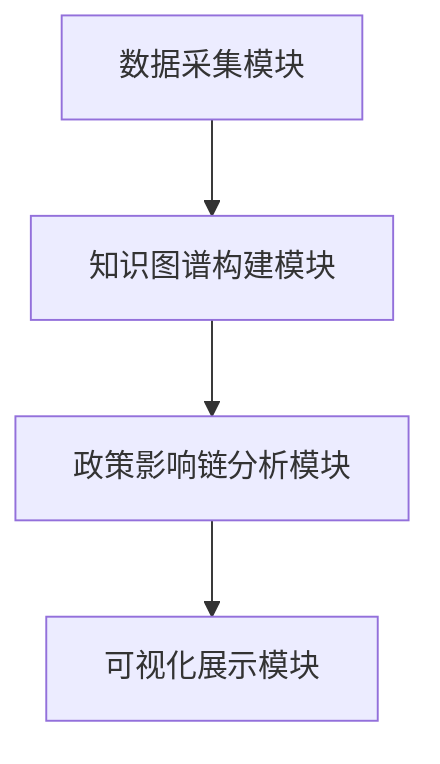

                 


# 构建基于知识图谱的金融监管政策影响链追踪系统

## 关键词：知识图谱、金融监管、政策影响链、自然语言处理、图论、系统架构

## 摘要：  
本文探讨了如何利用知识图谱技术构建金融监管政策影响链的追踪系统。通过分析政策与金融市场的关联，结合自然语言处理和图论算法，构建政策影响链的知识图谱，并设计高效的系统架构，以实现政策效果的可视化追踪与优化。本文旨在为金融监管机构提供一种创新的技术解决方案，帮助其实现政策执行的精准化和透明化。

---

# 第一部分: 知识图谱与金融监管政策影响链概述

## 第1章: 知识图谱与金融监管政策概述

### 1.1 知识图谱的基本概念

#### 1.1.1 知识图谱的定义与特点

知识图谱是一种以图结构形式表示知识的技术，由节点（实体）和边（关系）组成，节点代表具体的概念或实体，边表示它们之间的关系。知识图谱具有语义丰富、结构化程度高、可扩展性强等特点，能够将分散的、异构的数据整合成一个统一的知识网络。

#### 1.1.2 金融监管政策的基本概念

金融监管政策是指政府或监管机构为维护金融市场秩序、保护投资者利益、促进金融稳定而制定的一系列规则和措施。这些政策涵盖了金融机构的运营、市场行为规范、风险防控等多个方面。

#### 1.1.3 政策影响链的定义与作用

政策影响链是指政策的制定、发布、执行、反馈等环节中，政策对金融市场、金融机构和市场参与者产生的连锁反应。通过分析政策影响链，可以更好地理解政策的效果，优化政策设计，提高监管效率。

### 1.2 知识图谱在金融监管中的应用背景

#### 1.2.1 金融监管的现状与挑战

随着金融市场的复杂化和全球化，金融监管面临以下挑战：
- 数据分散：政策文件、市场数据、新闻报道等信息来源多样且分散。
- 关系复杂：政策与金融机构、市场行为之间的关系错综复杂，难以直观分析。
- 实时性要求高：金融市场变化快，监管机构需要实时追踪政策效果。

#### 1.2.2 知识图谱技术的优势

知识图谱技术能够将非结构化数据（如政策文本、新闻报道）转化为结构化知识，帮助监管机构：
- 提高数据整合能力。
- 深度挖掘政策与市场行为之间的关系。
- 实现实时政策效果追踪。

#### 1.2.3 政策影响链追踪的必要性

政策影响链的追踪有助于：
- 量化政策效果。
- 及时发现政策执行中的问题。
- 提供数据支持，优化后续政策设计。

### 1.3 本章小结

本章介绍了知识图谱的基本概念、金融监管政策的核心内容以及政策影响链的定义与作用。同时，分析了知识图谱在金融监管中的应用背景及其优势，为后续章节奠定了理论基础。

---

## 第2章: 知识图谱的核心概念与构建方法

### 2.1 知识图谱的核心概念

#### 2.1.1 实体与关系的定义

- **实体**：知识图谱中的基本单元，可以是人、组织、概念等。
- **关系**：实体之间的关联，如“政策影响”、“机构执行”等。

#### 2.1.2 属性与类型的关系

- **属性**：描述实体的特征，如“政策类型”、“机构类型”等。
- **类型**：实体的分类，如“监管政策”、“金融机构”等。

#### 2.1.3 知识图谱的构建流程

1. 数据采集。
2. 数据清洗与预处理。
3. 实体识别与关系抽取。
4. 知识图谱的存储与管理。
5. 可视化与应用。

### 2.2 知识图谱的构建方法

#### 2.2.1 数据采集与预处理

- 数据来源：政策文件、新闻报道、市场数据等。
- 预处理步骤：去除噪声、分词、归一化等。

#### 2.2.2 实体识别与关系抽取

- 实体识别：利用自然语言处理技术，从文本中提取实体。
- 关系抽取：识别实体之间的关系，并标注关系类型。

#### 2.2.3 知识图谱的存储与管理

- 数据库选择：使用图数据库（如Neo4j）或关系型数据库。
- 数据建模：设计合理的数据模型，支持高效的查询和分析。

### 2.3 本章小结

本章详细介绍了知识图谱的核心概念，包括实体、关系、属性和类型等，并讨论了知识图谱的构建方法。通过这些方法，可以将非结构化数据转化为结构化的知识图谱，为后续的政策影响链分析奠定了基础。

---

# 第二部分: 知识图谱的算法原理与数学模型

## 第3章: 知识图谱构建的算法原理

### 3.1 实体识别算法

#### 3.1.1 基于规则的实体识别

- **原理**：通过预定义的规则和模式，从文本中提取实体。
- **优缺点**：简单易实现，但规则覆盖率有限。

#### 3.1.2 基于机器学习的实体识别

- **原理**：使用训练好的模型（如CRF、SVM）进行实体识别。
- **优缺点**：准确率高，但需要大量标注数据。

#### 3.1.3 基于深度学习的实体识别

- **原理**：使用RNN、LSTM等深度学习模型，自动学习实体特征。
- **优缺点**：准确率高，但计算资源消耗大。

### 3.2 关系抽取算法

#### 3.2.1 基于规则的关系抽取

- **原理**：通过预定义的关系模式，从文本中提取关系。
- **优缺点**：简单易实现，但灵活性差。

#### 3.2.2 基于统计模型的关系抽取

- **原理**：利用统计模型（如CRF）进行关系抽取。
- **优缺点**：准确率较高，但依赖于标注数据。

#### 3.2.3 基于深度学习的关系抽取

- **原理**：使用卷积神经网络（CNN）或变压器（Transformer）模型进行关系抽取。
- **优缺点**：准确率高，但模型训练复杂。

### 3.3 知识图谱的融合与推理算法

#### 3.3.1 知识图谱的融合方法

- **对齐技术**：将不同来源的知识图谱对齐。
- **冲突处理**：解决知识图谱中的冲突和冗余。

#### 3.3.2 基于图的推理算法

- **最短路径算法**：用于寻找实体之间的最短路径。
- **路径扩展算法**：用于扩展已知的关系，发现新的关联。

#### 3.3.3 知识图谱的可解释性

- **可视化工具**：通过图谱可视化，帮助理解实体之间的关系。
- **规则解释**：通过可解释的规则，提高图谱的透明度。

### 3.4 本章小结

本章详细介绍了知识图谱构建中的核心算法，包括实体识别、关系抽取和图谱推理。这些算法为构建金融监管政策影响链的知识图谱提供了理论和技术支持。

---

## 第4章: 知识图谱的数学模型与公式

### 4.1 知识图谱的表示模型

#### 4.1.1 基于向量的表示方法

- **词向量**：通过Word2Vec、GloVe等技术，将实体表示为向量。
- **句向量**：通过BERT等技术，将句子表示为向量。

#### 4.1.2 基于图的表示方法

- **邻接矩阵**：表示实体之间的关系，如：
  $$ A = [a_{ij}] $$，其中$a_{ij}=1$表示存在关系，否则为0。

- **邻接列表**：将实体关系表示为边列表。

### 4.2 知识图谱的推理模型

#### 4.2.1 最短路径算法

- **Dijkstra算法**：用于寻找两个节点之间的最短路径。
- **Floyd-Warshall算法**：用于计算图中所有节点对之间的最短路径。

#### 4.2.2 基于图的分类算法

- **图卷积网络（GCN）**：通过图的结构信息，进行节点分类。

### 4.3 本章小结

本章通过数学模型和公式，详细描述了知识图谱的表示和推理方法。这些方法为后续的政策影响链分析提供了理论支持。

---

# 第三部分: 系统分析与架构设计

## 第5章: 金融监管政策影响链追踪系统的分析与设计

### 5.1 系统应用场景与目标

- **应用场景**：政策制定、政策执行、政策评估。
- **系统目标**：构建知识图谱，实现政策影响链的可视化追踪。

### 5.2 系统功能需求分析

#### 5.2.1 数据采集与处理模块

- **功能**：从多种数据源采集政策文本、市场数据等。
- **技术**：使用爬虫技术、文本解析工具。

#### 5.2.2 知识图谱构建模块

- **功能**：将采集到的数据转化为知识图谱。
- **技术**：实体识别、关系抽取、图谱存储。

#### 5.2.3 政策影响链分析模块

- **功能**：分析政策与市场行为之间的关系。
- **技术**：基于图的推理算法。

#### 5.2.4 可视化展示模块

- **功能**：以图谱形式展示政策影响链。
- **技术**：使用图谱可视化工具（如Gephi）。

### 5.3 系统架构设计

#### 5.3.1 系统架构图



#### 5.3.2 模块交互设计

- 数据采集模块将数据传递给知识图谱构建模块。
- 知识图谱构建模块生成图谱数据，传递给政策影响链分析模块。
- 政策影响链分析模块生成分析结果，传递给可视化展示模块。

### 5.4 本章小结

本章通过系统分析与架构设计，详细描述了金融监管政策影响链追踪系统的功能需求和系统架构。为后续的系统实现奠定了基础。

---

## 第6章: 项目实战与系统实现

### 6.1 项目实战：构建政策影响链知识图谱

#### 6.1.1 环境配置

- **安装工具**：Python、Jupyter Notebook、爬虫框架（如Scrapy）、图数据库（如Neo4j）。
- **安装依赖**：`pip install neo4j`、`pip install scrapy`、`pip install spacy`.

#### 6.1.2 核心代码实现

```python
# 数据采集示例代码
import requests
from bs4 import BeautifulSoup

url = "https://www.gov.cn/zhengce/index.htm"
response = requests.get(url)
soup = BeautifulSoup(response.text, "html.parser")
titles = soup.find_all("h2", class_="title")
for title in titles:
    print(title.text)
```

#### 6.1.3 案例分析

以某金融监管政策为例，展示如何构建知识图谱，并分析政策对金融机构的影响。

---

## 第7章: 总结与展望

### 7.1 总结

本文详细探讨了基于知识图谱的金融监管政策影响链追踪系统的构建方法。通过知识图谱技术，能够高效地整合政策文本、市场数据等信息，实现政策影响链的可视化分析。

### 7.2 展望

未来，可以进一步研究知识图谱的动态更新、实时分析等技术，以应对金融市场变化的挑战。同时，探索与其他技术（如区块链）的结合，提升系统的安全性和可信度。

---

# 作者：AI天才研究院/AI Genius Institute & 禅与计算机程序设计艺术 /Zen And The Art of Computer Programming

---

**文章标题**: 构建基于知识图谱的金融监管政策影响链追踪系统

**关键词**: 知识图谱、金融监管、政策影响链、自然语言处理、图论、系统架构

**摘要**: 本文探讨了如何利用知识图谱技术构建金融监管政策影响链的追踪系统。通过分析政策与金融市场的关联，结合自然语言处理和图论算法，构建政策影响链的知识图谱，并设计高效的系统架构，以实现政策效果的可视化追踪与优化。本文旨在为金融监管机构提供一种创新的技术解决方案，帮助其实现政策执行的精准化和透明化。

---

**文章内容**: [请根据上述目录和内容继续撰写文章正文部分。]

