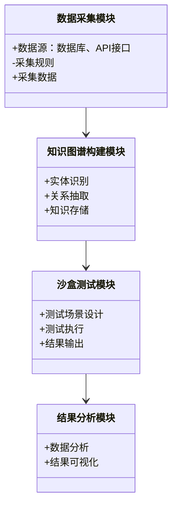
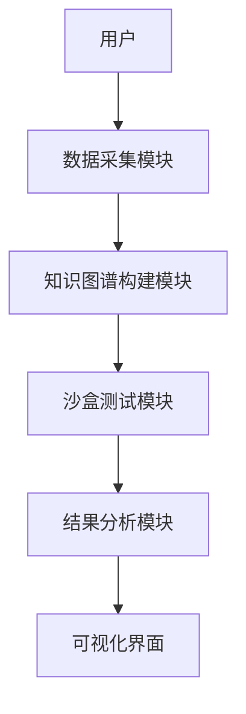
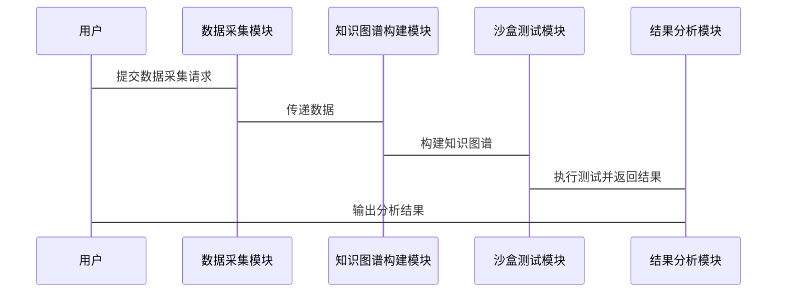

                 


# 构建基于知识图谱的金融监管沙盒测试平台

> 关键词：知识图谱、金融监管、监管沙盒、风险管理、金融科技

> 摘要：本文详细探讨了如何构建基于知识图谱的金融监管沙盒测试平台，从背景介绍、核心概念、算法原理、系统架构设计到项目实战，全面解析了该平台的构建过程和实际应用。文章结合理论与实践，通过详细的代码实现和案例分析，展示了如何利用知识图谱技术提升金融监管的效率和准确性。

---

# 第一部分: 知识图谱与金融监管沙盒概述

## 第1章: 知识图谱与金融监管沙盒的背景与概念

### 1.1 知识图谱的基本概念

#### 1.1.1 知识图谱的定义
知识图谱是一种以图结构表示知识的技术，节点表示实体或概念，边表示实体之间的关系。知识图谱通过将分散的知识点连接起来，形成一个大规模的语义网络，能够帮助机器理解和推理知识。

#### 1.1.2 知识图谱的核心特点
- **结构化**：通过实体和关系的明确定义，构建清晰的知识网络。
- **可扩展性**：支持大规模数据的整合与扩展。
- **语义理解**：通过语义关联，提升数据的理解和推理能力。

#### 1.1.3 知识图谱在金融领域的应用
在金融领域，知识图谱可以用于风险评估、关联交易分析、合规检查等场景。例如，通过构建金融机构之间的关系图谱，可以发现潜在的系统性风险。

### 1.2 金融监管沙盒的概念

#### 1.2.1 金融监管沙盒的定义
金融监管沙盒是指一个虚拟的测试环境，允许金融机构在受控的环境中测试新产品、服务或流程，同时确保这些测试活动不会对实际市场造成风险。

#### 1.2.2 金融监管沙盒的目的与作用
- **风险隔离**：在沙盒中测试新产品，避免对实际市场造成影响。
- **快速迭代**：允许金融机构在受控环境中快速测试和优化产品。
- **监管合规**：通过沙盒环境，确保新产品符合监管要求。

#### 1.2.3 金融监管沙盒的实施框架
金融监管沙盒的实施通常包括以下几个步骤：
1. **环境搭建**：搭建虚拟测试环境。
2. **数据准备**：收集和整理相关数据。
3. **测试设计**：设计测试场景和测试用例。
4. **执行测试**：在沙盒中执行测试。
5. **结果分析**：分析测试结果并优化产品。

### 1.3 本章小结

---

# 第二部分: 知识图谱构建的核心概念与联系

## 第2章: 知识图谱的核心概念与联系

### 2.1 知识图谱的核心概念

#### 2.1.1 实体与关系
- **实体**：知识图谱中的基本单元，表示具体的人、事、物或概念。
- **关系**：实体之间的关联，描述实体之间的联系。

#### 2.1.2 属性与概念
- **属性**：描述实体的特征，例如“年龄”、“性别”等。
- **概念**：抽象的类别，例如“人”、“动物”等。

#### 2.1.3 知识图谱的构建流程
知识图谱的构建通常包括数据采集、实体识别、关系抽取、知识融合和知识存储等步骤。

### 2.2 知识图谱与金融监管沙盒的关系

#### 2.2.1 知识图谱在金融监管中的应用
- **风险评估**：通过分析金融机构之间的关系，识别潜在的风险。
- **合规检查**：利用知识图谱进行关联交易分析，确保合规性。

#### 2.2.2 金融监管沙盒中的知识图谱构建
在金融监管沙盒中，知识图谱可以用于模拟金融机构之间的关系，帮助监管机构更好地理解市场结构。

#### 2.2.3 知识图谱与监管规则的结合
通过将监管规则嵌入知识图谱，监管机构可以实时监控市场动态，发现违规行为。

### 2.3 知识图谱的ER实体关系图

```mermaid
erDiagram
    actor 用户 {
        +string 用户ID
        +string 用户名
        +string 密码
    }
    actor 监管机构 {
        +string 机构ID
        +string 机构名称
        +string 联系方式
    }
    actor 被监管机构 {
        +string 机构ID
        +string 机构名称
        +string 联系方式
    }
    entity 实体 {
        +string 实体ID
        +string 实体名称
        +string 实体类型
    }
    entity 关系 {
        +string 关系ID
        +string 关系名称
        +string 关系类型
    }
    entity 属性 {
        +string 属性ID
        +string 属性名称
        +string 属性值
    }
    用户 --> 实体 : 操作
    监管机构 --> 实体 : 监管
    被监管机构 --> 实体 : 被监管
```

---

# 第三部分: 知识图谱构建的算法与实现

## 第3章: 知识图谱构建的算法与实现

### 3.1 实体识别算法

#### 3.1.1 实体识别的定义
实体识别是指从文本中识别出具体的人、事、物或概念。

#### 3.1.2 实体识别算法
常用的实体识别算法包括基于规则的方法、基于统计的方法和基于深度学习的方法。

#### 3.1.3 实体识别的实现
以下是一个基于规则的实体识别算法的Python代码示例：

```python
def extract_entities(text):
    entities = []
    # 假设规则基于关键词匹配
    keywords = ["公司", "机构", "银行"]
    for keyword in keywords:
        if keyword in text:
            entities.append(keyword)
    return entities

text = "中国银行是一家大型金融机构。"
print(extract_entities(text))  # 输出：['银行']
```

### 3.2 关系抽取算法

#### 3.2.1 关系抽取的定义
关系抽取是指从文本中抽取实体之间的关系。

#### 3.2.2 关系抽取算法
常用的关系抽取算法包括基于规则的方法、基于统计的方法和基于深度学习的方法。

#### 3.2.3 关系抽取的实现
以下是一个基于规则的关系抽取算法的Python代码示例：

```python
def extract_relations(text):
    relations = []
    # 假设规则基于关键词匹配
    relations_dict = {
        "银行": ["属于", "管理"],
        "公司": ["控制", "投资"]
    }
    for entity in relations_dict:
        for relation in relations_dict[entity]:
            if entity + relation in text:
                relations.append((entity, relation))
    return relations

text = "中国银行属于中国金融管理局。"
print(extract_relations(text))  # 输出：[('银行', '属于')]
```

---

# 第四部分: 金融监管沙盒测试平台的系统设计与实现

## 第4章: 系统设计与实现

### 4.1 系统功能设计

#### 4.1.1 功能模块划分
金融监管沙盒测试平台的功能模块包括：
1. 数据采集模块
2. 知识图谱构建模块
3. 沙盒测试模块
4. 结果分析模块

#### 4.1.2 功能模块的实现
以下是一个简单的功能模块类图：



---

### 4.2 系统架构设计

#### 4.2.1 系统架构图
以下是一个简单的系统架构图：



---

### 4.3 接口设计与交互流程

#### 4.3.1 系统接口设计
金融监管沙盒测试平台的接口包括：
1. 数据采集接口
2. 知识图谱构建接口
3. 沙盒测试接口
4. 结果分析接口

#### 4.3.2 系统交互流程图
以下是一个简单的系统交互流程图：



---

## 第5章: 项目实战与分析

### 5.1 项目环境安装

#### 5.1.1 环境要求
- Python 3.8+
- Jupyter Notebook
- Numpy、Pandas、networkx等库

#### 5.1.2 安装依赖
```bash
pip install numpy pandas networkx
```

### 5.2 核心代码实现

#### 5.2.1 数据预处理
```python
import pandas as pd

def preprocess_data(data):
    # 假设data是一个DataFrame
    data['实体'] = data['文本'].apply(lambda x: extract_entities(x))
    data['关系'] = data['文本'].apply(lambda x: extract_relations(x))
    return data

data = pd.DataFrame({'文本': ['中国银行属于中国金融管理局。', '工商银行投资于科技公司。']})
preprocess_data(data)
```

#### 5.2.2 知识图谱构建
```python
import networkx as nx

def build_knowledge_graph(entities, relations):
    G = nx.DiGraph()
    for entity in entities:
        G.add_node(entity)
    for relation in relations:
        G.add_edge(relation[0], relation[1], label=relation[2])
    return G

entities = ['中国银行', '中国金融管理局', '工商银行', '科技公司']
relations = [('中国银行', '属于', '中国金融管理局'), ('工商银行', '投资', '科技公司')]
G = build_knowledge_graph(entities, relations)
nx.draw(G, with_labels=True, edge_labels=True)
```

### 5.3 实际案例分析

#### 5.3.1 案例背景
假设我们有以下金融机构：
- 中国银行
- 工商银行
- 科技公司
- 中国金融管理局

#### 5.3.2 沙盒测试
在沙盒环境中，我们可以模拟中国银行投资于科技公司的场景，并分析其对市场的影响。

#### 5.3.3 测试结果分析
通过知识图谱，我们发现中国银行和工商银行之间的投资关系可能存在潜在的风险，需要进一步分析。

---

## 第6章: 总结与展望

### 6.1 本章总结
本文详细探讨了如何构建基于知识图谱的金融监管沙盒测试平台，从背景介绍、核心概念、算法原理、系统架构设计到项目实战，全面解析了该平台的构建过程和实际应用。

### 6.2 未来展望
未来，随着人工智能和大数据技术的不断发展，知识图谱在金融监管中的应用将更加广泛。我们需要进一步优化知识图谱构建算法，提升平台的智能化水平。

---

# 作者：AI天才研究院/AI Genius Institute & 禅与计算机程序设计艺术 /Zen And The Art of Computer Programming

---

**[END]**

