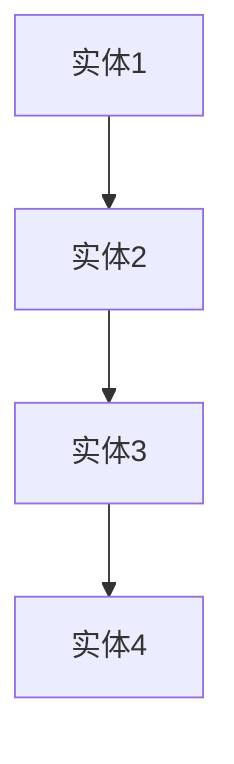
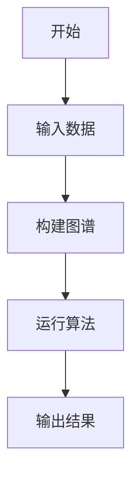
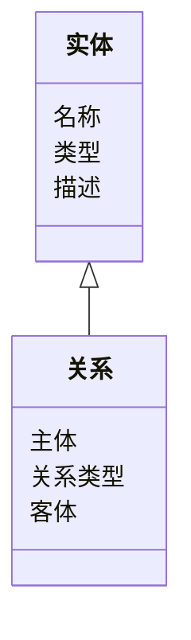
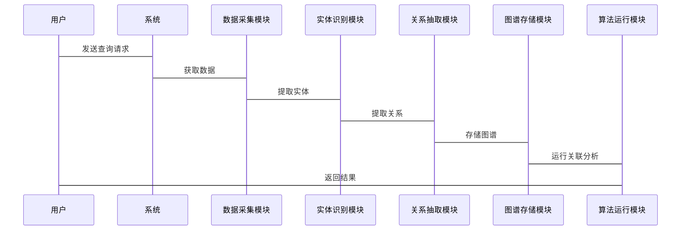

                 


```markdown
# 构建基于知识图谱的金融风险关联分析系统

## 关键词：知识图谱，金融风险，关联分析，系统设计，风险评估

## 摘要：本文系统地探讨了如何利用知识图谱技术构建金融风险关联分析系统，详细介绍了系统的核心概念、算法原理、架构设计及项目实现。通过案例分析，展示了知识图谱在金融风险评估中的应用价值，并为实际应用提供了指导和建议。

---

# 第1章: 问题背景与需求分析

## 1.1 问题背景

### 1.1.1 金融风险分析的现状与挑战
金融市场的复杂性和不确定性使得风险分析变得尤为重要。传统的基于统计的方法难以捕捉复杂的关联关系，而知识图谱的引入为解决这一问题提供了新的思路。

### 1.1.2 知识图谱技术的引入动机
知识图谱能够将分散的金融数据进行语义化关联，帮助发现隐藏的关系和模式，从而更全面地评估风险。

### 1.1.3 金融风险关联分析的重要性
通过分析不同实体之间的关联，可以更准确地预测和管理风险，提升金融机构的决策能力。

## 1.2 问题描述

### 1.2.1 金融风险的多维度关联性
金融风险不仅涉及单一因素，还可能由多个实体的复杂互动引发，例如公司、银行、政府政策等。

### 1.2.2 知识图谱在金融领域的应用潜力
知识图谱可以整合来自不同来源的数据，构建一个统一的语义网络，用于风险评估和预警。

### 1.2.3 当前系统的不足与改进方向
现有系统往往依赖单一数据源，缺乏对复杂关联关系的分析能力。知识图谱的引入可以弥补这一不足。

## 1.3 问题解决思路

### 1.3.1 知识图谱构建的基本思路
通过数据抽取、实体识别、关系抽取等步骤，构建金融领域的知识图谱。

### 1.3.2 关联分析的核心算法选择
选择适合的图挖掘算法，如路径分析、社区检测等，用于发现实体间的关联关系。

### 1.3.3 系统设计的整体框架
设计一个模块化的系统架构，包括数据采集、图谱构建、关联分析和结果展示等部分。

## 1.4 系统的边界与外延

### 1.4.1 系统功能的边界定义
明确系统的核心功能，如数据处理、图谱构建、关联分析等，避免功能过于复杂。

### 1.4.2 系统外延的扩展可能性
考虑未来的扩展需求，如支持更多数据源、引入机器学习模型等。

### 1.4.3 系统与现有金融系统的接口关系
设计接口规范，确保系统能够与现有的金融系统无缝集成。

## 1.5 概念结构与核心要素

### 1.5.1 知识图谱的基本概念
知识图谱是由实体、关系和属性构成的语义网络，能够描述现实世界中的各种关联。

### 1.5.2 金融风险关联的核心要素
包括公司、银行、政府、市场等实体，以及它们之间的关系，如投资、借贷、监管等。

### 1.5.3 系统功能模块的构成
系统主要包括数据采集模块、图谱构建模块、关联分析模块和结果展示模块。

---

# 第2章: 知识图谱的核心概念与联系

## 2.1 知识图谱的原理与构建流程

### 2.1.1 知识抽取与实体识别
通过自然语言处理技术从文本中提取实体和关系，例如从新闻中提取公司名称和事件。

### 2.1.2 关系抽取与属性提取
识别实体之间的关系，并提取相关属性，例如公司A投资了公司B。

### 2.1.3 知识融合与图谱构建
将抽取到的知识进行整合，构建一个统一的知识图谱，消除冗余和矛盾。

## 2.2 知识图谱的关键技术

### 2.2.1 实体识别与链接
通过实体识别技术将文本中的实体提取出来，并建立实体之间的映射关系。

### 2.2.2 关系抽取与推理
利用关系抽取技术识别实体之间的关系，并通过推理技术发现隐含的关系。

### 2.2.3 图谱存储与查询优化
选择适合的知识图谱存储技术，如图数据库，并优化查询性能。

## 2.3 实体关系图的 Mermaid 流程图



## 2.4 核心概念属性特征对比表

| 概念 | 属性1 | 属性2 | 属性3 |
|------|-------|-------|-------|
| 实体  | 名称   | 类型   | 描述   |
| 关系  | 主体   | 关系类型 | 客体   |
| 属性  | 名称   |

---

# 第3章: 算法原理讲解

## 3.1 算法原理概述

### 3.1.1 关联分析的核心算法
选择适合的图挖掘算法，如路径分析、社区检测等。

### 3.1.2 算法的数学模型
通过公式表示算法的核心思想，例如路径计数公式：

$$count(u, v) = number\ of\ paths\ between\ u\ and\ v$$

### 3.1.3 算法流程
使用 Mermaid 绘制算法流程图：



## 3.2 Python 实现

### 3.2.1 核心代码
```python
def count_paths(u, v):
    # 简单的路径计数算法
    count = 0
    visited = set()
    stack = [(u, [u])]
    while stack:
        node, path = stack.pop()
        if node == v:
            count += 1
            continue
        for neighbor in graph[node]:
            if neighbor not in visited:
                visited.add(neighbor)
                new_path = path + [neighbor]
                stack.append((neighbor, new_path))
    return count
```

### 3.2.2 代码解读
该代码通过深度优先搜索的方式遍历图中所有路径，统计从 u 到 v 的路径数。

### 3.2.3 示例分析
假设图谱中有节点 A、B、C，且 A 连接 B，B 连接 C，那么 count_paths(A, C) 返回 1。

---

# 第4章: 系统分析与架构设计方案

## 4.1 系统分析

### 4.1.1 项目背景
构建一个基于知识图谱的金融风险关联分析系统，帮助金融机构更好地识别和管理风险。

### 4.1.2 系统功能设计

#### 4.1.2.1 领域模型


### 4.1.2.2 系统架构
```mermaid
container 知识图谱构建模块 {
    component 数据采集
    component 实体识别
    component 关系抽取
}
container 关联分析模块 {
    component 图谱存储
    component 算法运行
}
```

### 4.1.2.3 接口设计
系统需要提供 RESTful API 接口，供其他系统调用分析结果。

### 4.1.2.4 交互流程图


## 4.2 系统设计

### 4.2.1 模块划分
系统分为数据采集模块、图谱构建模块、关联分析模块和结果展示模块。

### 4.2.2 模块交互
模块之间通过接口进行通信，确保系统的模块化和可扩展性。

### 4.2.3 系统架构图
```mermaid
container 数据采集模块 {
    component 数据源1
    component 数据源2
}
container 图谱构建模块 {
    component 实体识别
    component 关系抽取
}
container 关联分析模块 {
    component 算法运行
}
container 结果展示模块 {
    component 界面
}
```

---

# 第5章: 项目实战

## 5.1 环境安装

### 5.1.1 安装 Python
```bash
pip install python
```

### 5.1.2 安装图数据库
```bash
pip install neo4j
```

## 5.2 系统核心实现

### 5.2.1 数据采集模块
```python
import requests

def fetch_data(url):
    response = requests.get(url)
    return response.json()
```

### 5.2.2 图谱构建模块
```python
from neo4j import GraphDatabase

def create_graph(data):
    with GraphDatabase.driver("neo4j://localhost:7687") as driver:
        session = driver.session()
        # 创建节点和关系
        session.write_transaction(create_nodes_and_relations, data)
        session.close()
```

### 5.2.3 关联分析模块
```python
def analyze_associations(u, v):
    return count_paths(u, v)
```

## 5.3 案例分析

### 5.3.1 实际案例
分析某公司的投资关系，发现其与多家金融机构有投资关联，可能存在较高的风险。

### 5.3.2 分析结果解读
通过关联分析模块，发现某公司涉及多起投资事件，风险较高。

## 5.4 项目小结

### 5.4.1 实战经验
知识图谱的构建和关联分析需要结合具体业务需求，选择合适的算法和技术。

### 5.4.2 项目总结
系统成功实现了金融风险的关联分析，为金融机构的风险管理提供了有力支持。

---

# 第6章: 最佳实践

## 6.1 小结

### 6.1.1 核心知识点回顾
知识图谱的构建流程、关联分析算法、系统架构设计等。

### 6.1.2 实战经验总结
结合具体业务需求选择合适的技术和算法，注重系统的模块化设计。

## 6.2 注意事项

### 6.2.1 数据质量的重要性
确保数据的准确性和完整性，避免因数据问题影响分析结果。

### 6.2.2 系统性能优化
优化图谱存储和查询性能，提升系统的响应速度。

## 6.3 拓展阅读

### 6.3.1 相关技术领域
进一步学习图数据库、图挖掘算法等技术。

### 6.3.2 实际应用案例
阅读更多关于知识图谱在金融领域的应用案例，提升对技术的理解。

---

# 作者：AI天才研究院 & 禅与计算机程序设计艺术

---

通过以上目录大纲，我们可以系统地构建一个基于知识图谱的金融风险关联分析系统，从理论到实践，逐步深入，确保系统的完整性和实用性。
```

