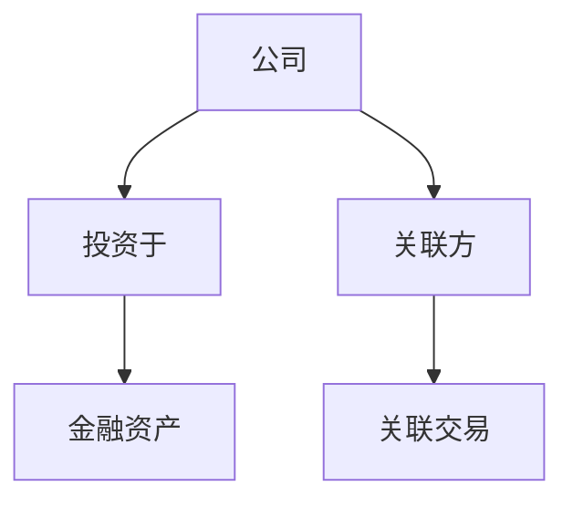
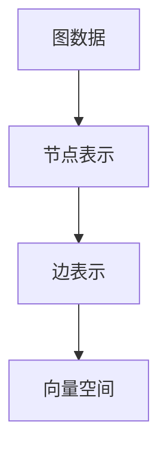
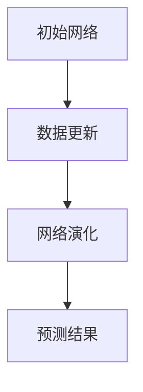
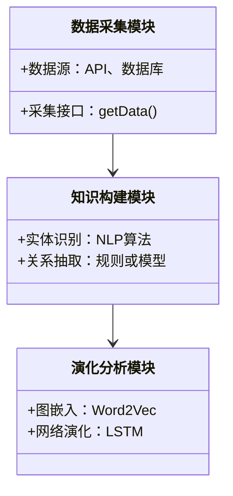
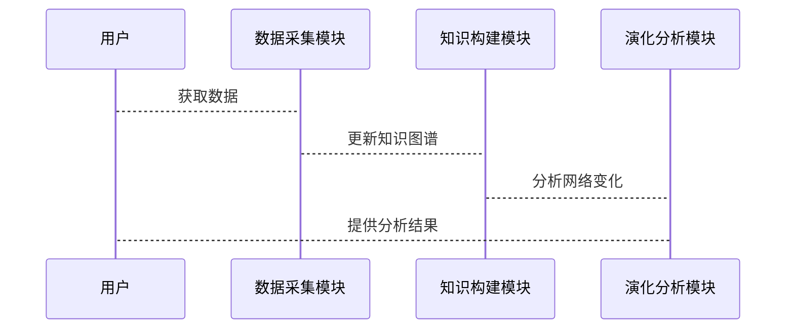

                 


```markdown
# 构建基于知识图谱的金融风险关联网络动态演化系统

> 关键词：知识图谱，金融风险，动态演化，关联网络，风险管理，系统架构

> 摘要：本文详细探讨了如何构建基于知识图谱的金融风险关联网络动态演化系统，从理论基础到系统设计，再到实际应用，全面分析了该系统的核心概念、算法原理和实现方法，为金融风险管理提供了一种创新的解决方案。

---

## 第一部分: 引言

### 1.1 背景与目标
金融市场的复杂性和不确定性使得风险管理变得至关重要。传统的风险管理方法依赖于静态的数据分析，难以捕捉复杂的关联关系。知识图谱作为一种强大的数据建模工具，能够有效表示金融实体之间的关系和属性，为动态风险关联网络的构建提供了新的可能性。

#### 问题背景
- 金融市场中的风险往往通过复杂的关联网络传播，传统的线性模型难以捕捉非线性关系。
- 数据孤岛和信息碎片化使得风险识别和预警变得困难。
- 动态变化的市场环境要求风险管理系统具备实时更新和自适应能力。

#### 问题描述
- 如何构建一个能够实时更新、捕捉复杂关联关系的金融风险管理系统？
- 如何利用知识图谱技术，将分散的金融数据整合为一个动态的风险关联网络？

#### 问题解决方法
- 利用知识图谱构建金融风险关联网络，通过图嵌入和网络演化模型，实现风险的动态识别和预测。
- 基于知识图谱的动态演化系统，提供实时的风险监控和预警功能。

#### 系统边界与外延
- 本系统专注于构建风险关联网络，不涉及具体的金融交易处理。
- 系统适用于银行、投资机构等金融领域的风险管理场景。

### 1.2 本书结构与内容概述
- **第1部分**：介绍背景、目标和方法。
- **第2部分**：详细讲解知识图谱的基础概念和构建方法。
- **第3部分**：探讨风险关联网络的构建方法和动态演化模型。
- **第4部分**：系统架构设计，包括功能模块和接口设计。
- **第5部分**：项目实战，提供实现步骤和代码示例。
- **第6部分**：总结与展望。

---

## 第二部分: 知识图谱基础

### 2.1 知识图谱的概念与特点
知识图谱是一种以图结构形式表示知识的语义网络，由节点（实体）和边（关系）组成，具有语义丰富、动态更新和可扩展性强的特点。

#### 核心属性对比
| 属性 | 描述 |
|------|------|
| 实体 | 表示具体事物或概念，如“公司”、“金融资产” |
| 关系 | 描述实体之间的关联，如“投资于”、“关联交易” |
| 属性 | 描述实体的特征或状态，如“资产规模”、“信用评级” |

#### 实体关系图（Mermaid）


### 2.2 知识图谱的构建方法
构建知识图谱需要经过数据采集、预处理、实体识别与链接、关系抽取和存储管理等多个步骤。

#### 数据采集与预处理
- 数据来源：金融市场公开数据、新闻资讯、监管报告等。
- 数据清洗：去除噪声数据，标准化处理。

#### 实体识别与链接
- 实体识别：利用自然语言处理技术从文本中提取实体。
- 实体链接：通过消歧算法将实体映射到统一的知识库中。

#### 关系抽取与构建
- 基于规则或深度学习模型抽取实体间的关系。
- 关系权重计算：根据关系的重要性进行加权。

### 2.3 知识图谱在金融领域的应用
知识图谱在金融领域的应用主要集中在风险识别、关联交易分析和监管合规等方面。

#### 风险识别
- 通过知识图谱发现潜在的风险节点和传播路径。
- 利用图嵌入技术将图结构转化为低维向量，用于机器学习模型的训练。

#### 关联交易分析
- 分析公司间的关联交易网络，识别潜在的财务风险。
- 基于知识图谱的可视化工具帮助用户理解复杂的关联关系。

---

## 第三部分: 金融风险关联网络构建

### 3.1 风险关联网络的概念与构建方法
风险关联网络是将金融实体及其关系表示为图结构，用于分析风险的传播和演化。

#### 核心算法
- **图嵌入算法**：将图结构转化为低维向量表示，常用算法包括Word2Vec、GloVe和GraphSAGE。
- **网络演化模型**：通过时间序列分析预测网络的变化趋势，常用模型包括GARMA和LSTM。

#### 图嵌入流程（Mermaid）


### 3.2 基于知识图谱的风险关联分析
#### 关键算法与实现
- **图嵌入算法**：使用GloVe对金融实体进行向量表示。
- **关系推理**：通过注意力机制增强关系的表达能力。

#### 代码示例
```python
import numpy as np
from sklearn.manifold import TSNE

# 假设我们有实体向量表示
entities = ['公司A', '公司B', '资产C']
vectors = np.random.rand(len(entities), 100)

# 使用t-SNE进行降维
tsne = TSNE(n_components=2)
tsne_vecs = tsne.fit_transform(vectors)

# 可视化
import matplotlib.pyplot as plt

plt.scatter(tsne_vecs[:, 0], tsne_vecs[:, 1], label=entities)
plt.legend()
plt.show()
```

### 3.3 风险关联网络的动态演化模型
#### 动态网络演化
- **增量式更新**：当新的金融数据到来时，动态更新知识图谱。
- **演化预测**：基于历史数据预测未来网络的变化。

#### 动态演化流程（Mermaid）


---

## 第四部分: 系统架构设计

### 4.1 系统功能模块设计
- **数据采集模块**：实时采集金融市场数据。
- **知识构建模块**：构建和更新知识图谱。
- **演化分析模块**：分析风险关联网络的动态变化。

#### 功能模块类图（Mermaid）


### 4.2 系统接口设计
- **数据接口**：提供REST API供其他系统调用。
- **用户接口**：Web界面供用户查询和分析。

#### 系统接口设计（Mermaid）


---

## 第五部分: 项目实战

### 5.1 环境配置
- **技术栈**：Python、TensorFlow、Neo4j、Flask
- **安装依赖**：`pip install neo4j numpy tensorflow`

### 5.2 核心代码实现
#### 知识图谱构建
```python
from neo4j import GraphDatabase
from neo4j.exceptions import ServiceUnavailable

def create_graph(driver):
    with driver.session() as session:
        session.run("CREATE (a:Asset {name: '资产A'})")
        session.run("CREATE (b:Company {name: '公司B'})")
        session.run("MATCH (a:Asset), (b:Company) CREATE (a)-[r:INVESTED_IN {weight: 0.8}]->(b)")
```

#### 动态演化预测
```python
import tensorflow as tf
from tensorflow.keras.layers import LSTM, Dense

model = tf.keras.Sequential([
    LSTM(64, input_shape=(None, 100)),
    Dense(1, activation='sigmoid')
])
model.compile(optimizer='adam', loss='binary_crossentropy')
model.fit(X_train, y_train, epochs=10)
```

### 5.3 案例分析
假设我们有以下数据：
- 公司A投资于资产B，资产B的风险指数为0.7。
- 公司C与公司A有关联交易，关联金额为1000万元。

通过知识图谱构建，我们可以发现公司C通过公司A间接持有资产B的风险，从而进行风险预警。

---

## 第六部分: 总结与展望

### 6.1 最佳实践 Tips
- 数据质量是构建知识图谱的关键，确保数据来源可靠。
- 在实际应用中，结合具体业务场景优化模型参数。

### 6.2 小结
本文详细介绍了基于知识图谱的金融风险关联网络动态演化系统的构建过程，从理论到实践，为金融风险管理提供了一种创新的解决方案。

### 6.3 注意事项
- 系统的实时性和准确性依赖于数据的及时更新和模型的优化。
- 在实际应用中，需考虑数据隐私和合规性问题。

### 6.4 拓展阅读
- 《Knowledge Graphs for Financial Risk Management》
- 《Dynamic Network Analysis in Financial Systems》

---

## 作者信息

作者：AI天才研究院 & 禅与计算机程序设计艺术
```

### 总结
这篇文章从背景介绍到系统设计，再到项目实战，全面阐述了基于知识图谱的金融风险关联网络动态演化系统的构建方法。通过结合理论与实践，为金融风险管理提供了一种创新的解决方案，帮助读者更好地理解和应用这一技术。

