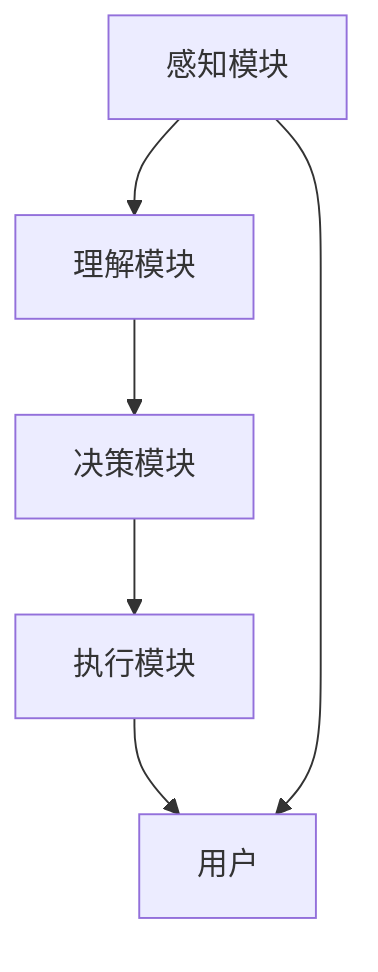
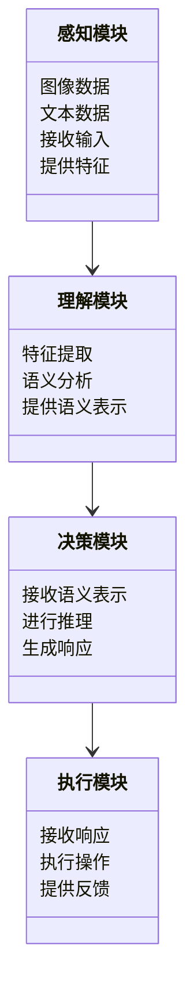
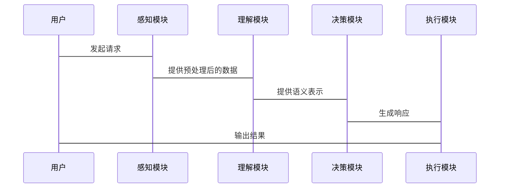

                 


# 第四部分: 多模态AI Agent的系统架构与设计

## # 第4章: 多模态AI Agent的系统架构设计

### 4.1 系统架构概述

#### 4.1.1 模块划分与功能分配
- **感知模块**：负责接收和处理多模态输入，包括图像和文本数据的采集与预处理。
- **理解模块**：对输入的多模态数据进行语义分析和特征提取，生成有意义的信息表示。
- **决策模块**：基于理解模块的输出，进行推理和决策，生成相应的响应。
- **执行模块**：根据决策模块的指令，执行相应的操作，输出结果。

#### 4.1.2 系统架构的分层设计
- **数据层**：处理原始输入数据，包括图像、文本和语音等。
- **处理层**：负责数据的预处理、特征提取和模型训练。
- **应用层**：实现用户交互、结果展示和系统管理功能。

### 4.2 系统架构设计

#### 4.2.1 系统架构图


#### 4.2.2 系统功能设计

##### 4.2.2.1 领域模型类图


##### 4.2.2.2 系统架构图


#### 4.2.3 系统接口设计

##### 4.2.3.1 感知模块接口
- `receive_input(data_type, data)`：接收输入数据，类型包括图像、文本和语音。
- `preprocess_data(data)`：对输入数据进行预处理，生成标准化的特征。

##### 4.2.3.2 理解模块接口
- `extract_features(data)`：从输入数据中提取特征。
- `semantic_analysis(features)`：对特征进行语义分析，生成语义表示。

##### 4.2.3.3 决策模块接口
- `inference(semantic_representation)`：根据语义表示进行推理，生成响应。
- `generate_response(output)`：生成可执行的输出指令。

##### 4.2.3.4 执行模块接口
- `execute_command(command)`：执行决策模块生成的指令，输出结果。
- `provide_feedback(feedback)`：提供执行后的反馈信息。

#### 4.2.4 系统交互序列图


### 4.3 系统实现细节

#### 4.3.1 系统核心实现源代码
```python
# 感知模块
class PerceptionModule:
    def __init__(self):
        self.image_processor = ImageProcessor()
        self.text_processor = TextProcessor()

    def receive_input(self, data_type, data):
        if data_type == 'image':
            return self.image_processor.preprocess(data)
        elif data_type == 'text':
            return self.text_processor.preprocess(data)
        else:
            return None

# 理解模块
class UnderstandingModule:
    def __init__(self):
        self.feature_extractor = FeatureExtractor()
        self.semantic Analyzer = SemanticAnalyzer()

    def process_features(self, features):
        return self.feature_extractor.extract(features)

    def semantic_analysis(self, features):
        return self.semantic_analyzer.analyze(features)

# 决策模块
class DecisionModule:
    def __init__(self):
        self.reasoner = Reasoner()
        self.response_generator = ResponseGenerator()

    def make_decision(self, semantic_representation):
        return self.reasoner.reason(semantic_representation)

    def generate_response(self, decision):
        return self.response_generator.generate(decision)

# 执行模块
class ExecutionModule:
    def __init__(self):
        self.executor = Executor()
        self.feedback_provider = FeedbackProvider()

    def execute_action(self, action):
        return self.executor.execute(action)

    def provide_feedback(self, feedback):
        return self.feedback_provider.provide(feedback)

# 示例用法
if __name__ == "__main__":
    perception = PerceptionModule()
    understanding = UnderstandingModule()
    decision = DecisionModule()
    execution = ExecutionModule()

    # 感知模块接收输入
    input_data = perception.receive_input('text', '今天天气不错。')
    # 理解模块处理特征
    features = understanding.process_features(input_data)
    # 语义分析
    semantic_rep = understanding.semantic_analysis(features)
    # 决策模块生成响应
    decision = decision.make_decision(semantic_rep)
    response = decision.generate_response(decision)
    # 执行模块执行操作
    execution.execute_action(response)
```

#### 4.3.2 代码实现解读
- **感知模块**：接收并预处理输入数据，包括图像和文本的处理。
- **理解模块**：提取特征并进行语义分析，生成语义表示。
- **决策模块**：基于语义表示进行推理，生成相应的响应。
- **执行模块**：根据决策结果执行操作，并提供反馈。

### 4.4 项目实战

#### 4.4.1 项目介绍
本项目旨在构建一个多模态AI Agent，整合视觉和语言能力，实现对多模态数据的处理和理解，最终生成相应的响应。

#### 4.4.2 系统功能设计
- 数据采集与预处理
- 多模态特征提取与语义分析
- 基于语义表示的推理与决策
- 多模态响应生成与执行

#### 4.4.3 代码实现
```python
# 数据预处理
def preprocess_image(image_path):
    # 图像预处理代码
    pass

def preprocess_text(text):
    # 文本预处理代码
    pass

# 特征提取与语义分析
def extract_features(data):
    # 特征提取代码
    pass

def semantic_analysis(features):
    # 语义分析代码
    pass

# 推理与决策
def make_decision(semantic_rep):
    # 推理代码
    pass

# 响应生成与执行
def generate_response(decision):
    # 响应生成代码
    pass

def execute_response(response):
    # 执行代码
    pass
```

#### 4.4.4 实际案例分析
通过一个具体的案例，如用户输入图像和文本，系统进行语义分析，生成相应的响应并执行操作，展示整个系统的运行流程。

### 4.5 系统优化与注意事项

#### 4.5.1 系统优化建议
- 提高模块之间的通信效率
- 优化数据预处理和特征提取的速度
- 增强模型的泛化能力和鲁棒性
- 提供更高效的接口设计

#### 4.5.2 注意事项
- 确保各模块的独立性和可扩展性
- 处理多模态数据时，注意数据格式和接口的统一性
- 优化系统的实时性和响应速度
- 加强系统的容错能力和异常处理机制

### 4.6 本章小结
本章详细介绍了多模态AI Agent的系统架构设计，包括模块划分、功能分配、系统架构图、系统功能设计、系统接口设计和系统交互序列图。通过实际的代码实现和案例分析，展示了系统的实现过程和运行机制。同时，提出了系统优化建议和注意事项，为实际应用提供了指导。

---

# 作者

作者：AI天才研究院 & 禅与计算机程序设计艺术

