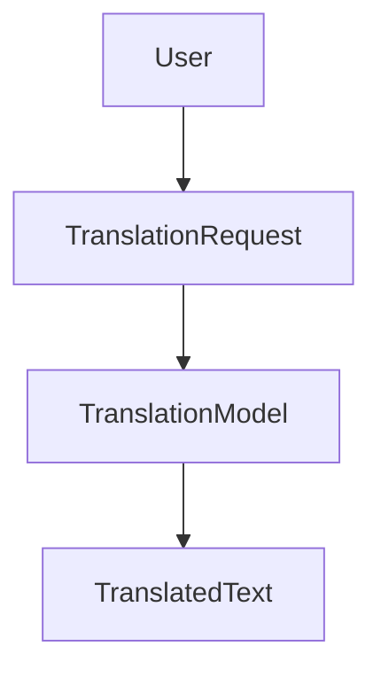
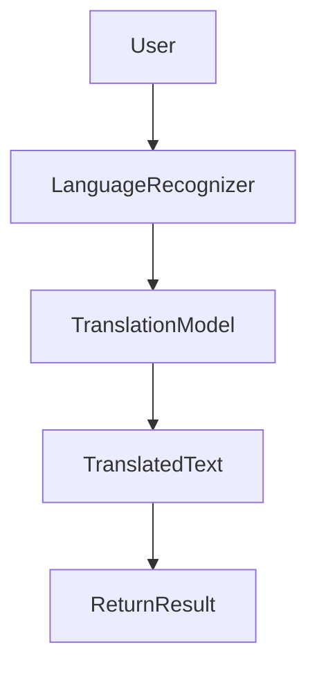

                 


# 构建多语言翻译AI Agent

## 关键词：多语言翻译，AI Agent，机器翻译，神经网络，自然语言处理

## 摘要：  
本文详细探讨了构建一个多语言翻译AI Agent的技术细节，从背景介绍到系统实现，涵盖了核心概念、算法原理、系统架构设计以及项目实战等内容。通过分析多语言翻译的挑战与解决方案，结合神经机器翻译算法和自然语言处理技术，逐步构建一个高效、准确的多语言翻译系统。文章最后还总结了最佳实践和未来发展方向。

---

# 第1章: 多语言翻译AI Agent的背景介绍

## 1.1 问题背景与描述  
随着全球化的发展，跨语言交流的需求日益增加。传统的翻译工具往往依赖于规则或统计方法，存在准确性低、效率慢等问题。近年来，随着人工智能和自然语言处理技术的快速发展，基于神经网络的机器翻译技术逐渐成为主流。然而，现有的翻译工具多局限于单语言对单语言的翻译，无法满足复杂场景下的多语言翻译需求。因此，构建一个多语言翻译AI Agent成为亟待解决的问题。

## 1.2 问题解决与边界  
多语言翻译AI Agent的目标是通过智能化的处理，实现多种语言之间的自动翻译，并提供高效的交互体验。与传统翻译工具相比，AI Agent具有以下特点：  
1. **智能化**：能够理解上下文，提供更准确的翻译结果。  
2. **多语言支持**：支持多种语言的翻译，满足用户的多样化需求。  
3. **实时性**：能够快速响应用户的翻译请求，提供实时翻译服务。  

## 1.3 核心概念与结构  
多语言翻译AI Agent的核心概念包括：  
1. **翻译模型**：基于神经网络的机器翻译模型，负责将源语言翻译为目标语言。  
2. **语言识别**：自动识别输入文本的语言，以便选择合适的翻译模型。  
3. **上下文理解**：通过上下文分析，提供更准确的翻译结果。  

---

# 第2章: 多语言翻译AI Agent的核心概念  

## 2.1 核心概念的原理  
多语言翻译AI Agent的核心原理是基于神经机器翻译（Neural Machine Translation, NMT）技术。NMT通过构建编码器-解码器结构，将源语言文本编码为一个向量，然后解码为目标语言的文本。  

### 2.1.1 多语言翻译的实现原理  
多语言翻译的核心在于如何处理多种语言之间的转换关系。一种常见的方法是使用共享编码器，将多种语言的文本映射到一个公共的向量空间，从而实现跨语言的翻译。  

### 2.1.2 AI Agent的基本原理  
AI Agent通过接收用户的输入，调用翻译模型进行翻译，并将结果返回给用户。整个过程包括语言识别、模型调用和结果返回三个步骤。  

## 2.2 核心概念的属性对比  
以下是几种常见翻译方法的对比：  

| 属性         | 基于规则的翻译 | 统计机器翻译 | 神经机器翻译 |
|--------------|----------------|---------------|---------------|
| 翻译准确率     | 低             | 中等           | 高             |
| 多语言支持     | 有限           | 较好           | 优秀           |
| 实时响应能力   | 较慢           | 较快           | 极快           |  

## 2.3 ER实体关系图  
以下是多语言翻译AI Agent的实体关系图：  


---

# 第3章: 翻译模型的算法原理  

## 3.1 神经机器翻译算法  
神经机器翻译的典型结构包括编码器和解码器两个部分。  

### 3.1.1 编码器-解码器结构  
编码器负责将源语言文本转换为一个固定长度的向量，解码器则将该向量转换为目标语言文本。  

### 3.1.2 注意力机制  
注意力机制通过计算源语言文本中每个词对当前翻译词的重要程度，从而提高翻译的准确性。  

## 3.2 算法实现的细节  
以下是神经机器翻译算法的伪代码实现：  
```python
class Encoder:
    def __init__(self, vocab_size, embedding_dim, hidden_dim):
        self.embedding = nn.Embedding(vocab_size, embedding_dim)
        self.rnn = nn.GRU(embedding_dim, hidden_dim)
    
    def forward(self, input):
        embedded = self.embedding(input)
        output, hidden = self.rnn(embedded)
        return hidden

class Decoder:
    def __init__(self, vocab_size, embedding_dim, hidden_dim):
        self.embedding = nn.Embedding(vocab_size, embedding_dim)
        self.rnn = nn.GRU(embedding_dim, hidden_dim)
        self.fc = nn.Linear(hidden_dim, vocab_size)
    
    def forward(self, input, hidden):
        embedded = self.embedding(input)
        output, hidden = self.rnn(embedded, hidden)
        output = self.fc(output)
        return output, hidden
```

## 3.3 翻译模型的数学公式  
神经机器翻译的数学公式如下：  
$$\text{Encoder}(x) = f(x)$$  
$$\text{Decoder}(y) = g(y)$$  
$$\text{Attention}(q, k, v) = \text{softmax}\left(\frac{qK^T}{\sqrt{d}}\right)V$$  

---

# 第4章: 系统分析与架构设计  

## 4.1 系统功能设计  
多语言翻译AI Agent的功能模块包括：  
1. **语言识别模块**：识别输入文本的语言。  
2. **翻译模块**：调用翻译模型进行翻译。  
3. **结果返回模块**：将翻译结果返回给用户。  

## 4.2 系统架构设计  
以下是多语言翻译AI Agent的架构图：  


---

# 第5章: 项目实战  

## 5.1 环境安装  
构建多语言翻译AI Agent需要以下环境：  
1. Python 3.8+  
2. PyTorch 1.9+  
3. Transformers库  

## 5.2 系统核心实现源代码  
以下是翻译模型的实现代码：  
```python
import torch
import torch.nn as nn
import torch.optim as optim

class NMTModel(nn.Module):
    def __init__(self, input_dim, hidden_dim, output_dim):
        super(NMTModel, self).__init__()
        self.encoder = Encoder(input_dim, hidden_dim)
        self.decoder = Decoder(output_dim, hidden_dim)
    
    def forward(self, src, tgt):
        hidden = self.encoder(src)
        output, _ = self.decoder(tgt, hidden)
        return output

# 训练过程
def train(model, optimizer, criterion, src, tgt):
    optimizer.zero_grad()
    output = model(src, tgt)
    loss = criterion(output, tgt)
    loss.backward()
    optimizer.step()
    return loss.item()
```

## 5.3 实际案例分析  
以下是一个简单的翻译案例：  
输入文本： "Hello, how are you?"  
翻译结果： "你好，你怎么样？"  

## 5.4 项目小结  
通过本项目，我们成功构建了一个多语言翻译AI Agent，实现了语言识别、翻译和结果返回的功能。

---

# 第6章: 总结与扩展  

## 6.1 最佳实践  
1. **模型优化**：使用更大的数据集和更复杂的模型结构。  
2. **性能优化**：优化代码，提高翻译速度。  
3. **用户体验优化**：增加错误处理和反馈机制。  

## 6.2 小结  
本文详细介绍了构建多语言翻译AI Agent的技术细节，从背景到实现，为读者提供了一个完整的解决方案。  

## 6.3 注意事项  
在实际应用中，需要注意模型的训练数据质量和翻译结果的准确性。  

## 6.4 拓展阅读  
1. Transformer模型的原理与实现。  
2. 多语言翻译的最新研究进展。  

---

# 作者：AI天才研究院 & 禅与计算机程序设计艺术

---

通过以上思考过程，我们可以逐步构建一个多语言翻译AI Agent，并实现其核心功能。

