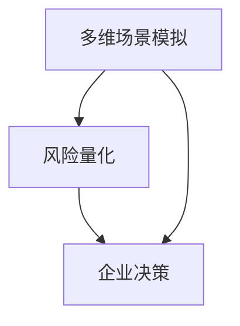
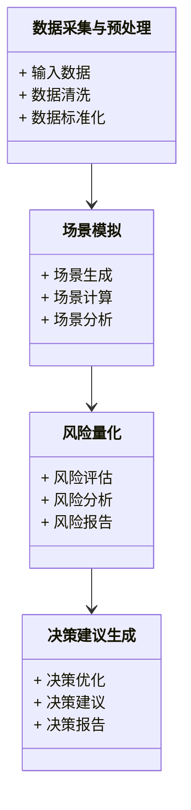
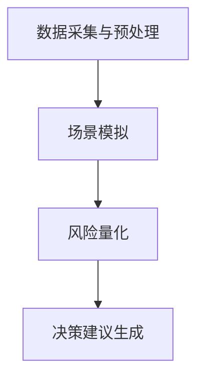

                 


# 构建智能企业决策支持系统：多维场景模拟与风险量化

## 关键词：智能企业决策支持系统，多维场景模拟，风险量化，数据分析，人工智能，决策优化

## 摘要：  
本文系统性地探讨了构建智能企业决策支持系统的核心方法，重点分析了多维场景模拟与风险量化在企业决策中的应用。通过理论分析、算法实现和系统设计的结合，深入阐述了如何利用人工智能技术解决企业决策中的不确定性问题，为企业提供科学的决策支持。文章内容涵盖背景分析、核心概念、算法原理、系统架构设计及项目实战，旨在为企业构建智能化决策支持系统提供理论依据和实践指导。

---

## 第一部分: 智能企业决策支持系统概述

### 第1章: 问题背景与目标

#### 1.1 企业决策支持系统的发展背景  
企业决策支持系统（DSS）是企业信息化建设的重要组成部分，传统的企业决策模式依赖于人工经验判断，存在效率低、准确性差、覆盖范围有限等问题。随着人工智能、大数据和机器学习技术的快速发展，企业决策支持系统逐渐向智能化方向演进，形成了智能企业决策支持系统（Intelligent DSS）。  

**1.1.1 传统企业决策模式的局限性**  
传统决策模式主要依赖于经验丰富的决策者，决策过程缺乏数据支持，容易受到主观因素的影响，且难以应对复杂多变的市场环境。  

**1.1.2 智能化决策支持的需求驱动**  
随着市场竞争加剧和企业规模扩大，企业对决策的科学性、实时性和精准性提出了更高要求，传统的决策模式已无法满足需求。智能化决策支持系统能够通过数据分析和模型模拟，提供更高效的决策支持。  

**1.1.3 数字化转型对企业决策的影响**  
数字化转型使得企业能够快速收集、处理和分析海量数据，为决策支持系统提供了丰富的数据来源和技术支持，推动了企业决策向智能化方向发展。  

---

#### 1.2 多维场景模拟与风险量化的核心问题  
多维场景模拟与风险量化是智能企业决策支持系统中的两大核心技术，它们通过模拟不同场景下的业务表现，量化潜在风险，为企业提供科学的决策依据。  

**1.2.1 企业决策中的不确定性分析**  
企业决策往往面临诸多不确定性因素，例如市场需求波动、政策变化、供应链风险等。这些不确定性可能导致决策失误，增加企业的经营风险。  

**1.2.2 多维场景模拟的定义与目标**  
多维场景模拟是指通过构建多个维度的业务场景模型，模拟不同条件下的业务表现，为企业提供多种决策方案的对比分析。其目标是通过模拟不同场景，找到最优或次优的决策方案。  

**1.2.3 风险量化在决策支持中的作用**  
风险量化是指通过数学模型和统计方法，对企业决策中的潜在风险进行量化分析，评估不同决策方案的风险程度，从而帮助企业制定更稳健的决策策略。  

---

### 第2章: 核心概念与联系  

#### 2.1 多维场景模拟的原理与实现  
多维场景模拟是一种基于数据驱动的决策支持方法，其核心在于构建多个维度的业务场景模型，模拟不同条件下的业务表现。  

**2.1.1 多维场景模拟的基本原理**  
多维场景模拟通过构建多个维度的业务场景模型，模拟不同条件下的业务表现，帮助企业分析不同决策方案的潜在效果。  

**2.1.2 多维场景模拟的关键技术**  
多维场景模拟的关键技术包括数据采集、模型构建、模拟计算和结果分析。  

**2.1.3 多维场景模拟与企业决策的关系**  
多维场景模拟为企业决策提供了多种可能的业务场景，帮助决策者全面评估不同决策方案的潜在效果。  

---

#### 2.2 风险量化的方法与模型  
风险量化是通过数学模型和统计方法，对企业决策中的潜在风险进行量化分析。  

**2.2.1 风险量化的基本概念**  
风险量化是指通过数学模型和统计方法，对企业决策中的潜在风险进行量化分析，评估不同决策方案的风险程度。  

**2.2.2 常见风险量化方法对比**  
常见的风险量化方法包括概率论方法、蒙特卡洛模拟、决策树分析等。以下是几种常见方法的对比分析：  

| 方法 | 描述 | 优点 | 缺点 |  
|------|------|------|------|  
| 概率论方法 | 基于概率分布模型，计算风险发生的概率 | 方法简单，计算效率高 | 适用于简单场景，难以处理复杂场景 |  
| 蒙特卡洛模拟 | 通过随机采样模拟风险场景 | 能够处理复杂场景，结果精确 | 计算量大，耗时较长 |  
| 决策树分析 | 基于决策树模型，分析不同决策路径的风险 | 能够处理多种决策路径 | 适用于决策路径清晰的场景 |  

**2.2.3 风险量化模型的构建与应用**  
风险量化模型的构建需要结合企业的实际情况，选择合适的数学模型和算法，通过历史数据和实时数据进行模型训练和优化，最终为企业提供风险量化支持。  

---

#### 2.3 核心概念对比分析  
多维场景模拟与风险量化是智能企业决策支持系统中的两大核心技术，它们在实现目标和应用场景上存在一定的差异，但也密切相关。  

**2.3.1 多维场景模拟与风险量化的主要区别**  
多维场景模拟注重模拟不同业务场景的业务表现，而风险量化注重量化不同决策方案的风险程度。  

**2.3.2 多维场景模拟与风险量化的核心联系**  
多维场景模拟为风险量化提供了丰富的业务场景数据，而风险量化为多维场景模拟提供了决策优化的方向。  

**2.3.3 企业决策支持系统中的概念体系**  
在企业决策支持系统中，多维场景模拟与风险量化共同构成了企业决策的科学化和智能化基础，为企业提供全面的决策支持。  

---

## 第二部分: 多维场景模拟与风险量化的核心原理  

### 第3章: 多维场景模拟的算法原理  

#### 3.1 多维场景模拟的算法框架  
多维场景模拟的算法框架包括数据采集、模型构建、模拟计算和结果分析四个主要步骤。  

**3.1.1 多维场景模拟的输入与输出**  
输入：历史数据、业务规则、模拟参数。  
输出：不同场景下的业务表现评估结果。  

**3.1.2 多维场景模拟的核心算法**  
多维场景模拟的核心算法包括数据预处理、模型训练、模拟计算和结果分析。  

**3.1.3 多维场景模拟的实现步骤**  
1. 数据采集与预处理：收集相关数据，清洗和标准化。  
2. 模型训练：基于历史数据训练场景模拟模型。  
3. 模拟计算：基于模拟参数生成多个业务场景，计算每个场景的业务表现。  
4. 结果分析：对模拟结果进行分析，提取关键指标，生成决策建议。  

---

#### 3.2 风险量化的核心算法  
风险量化的核心算法包括概率论方法、蒙特卡洛模拟和决策树分析等。  

**3.2.1 风险量化的基本算法**  
风险量化的基本算法包括概率计算、期望值计算和方差计算。  

**3.2.2 基于概率论的风险量化方法**  
基于概率论的风险量化方法通过计算风险事件发生的概率，评估其对决策目标的影响。  

**3.2.3 基于统计学的风险量化模型**  
基于统计学的风险量化模型通过历史数据分析，构建风险量化模型，评估不同决策方案的风险程度。  

---

#### 3.3 算法实现的数学模型  
多维场景模拟与风险量化的核心算法可以通过数学模型和公式进行描述。  

**3.3.1 多维场景模拟的数学模型**  
$$ P(x) = \sum_{i=1}^{n} p_i x_i $$  
其中，$P(x)$ 表示场景模拟的概率分布，$p_i$ 表示第 $i$ 种场景的概率，$x_i$ 表示第 $i$ 种场景的业务表现。  

**3.3.2 风险量化的数学公式**  
$$ R = \sum_{j=1}^{m} w_j r_j $$  
其中，$R$ 表示风险值，$w_j$ 表示第 $j$ 种风险因素的权重，$r_j$ 表示第 $j$ 种风险因素的风险程度。  

---

### 第4章: 多维场景模拟与风险量化的关系  

#### 4.1 多维场景模拟与风险量化的关系分析  
多维场景模拟与风险量化在企业决策支持系统中相互依存，共同构成了企业决策的科学化和智能化基础。  

**4.1.1 多维场景模拟为风险量化提供数据基础**  
多维场景模拟通过模拟不同业务场景，为风险量化提供了丰富的数据来源。  

**4.1.2 风险量化为多维场景模拟提供决策优化的方向**  
风险量化通过量化不同场景的风险程度，指导多维场景模拟的优化方向。  

**4.1.3 两者结合对企业决策的支持作用**  
多维场景模拟与风险量化的结合，能够帮助企业全面评估不同决策方案的潜在效果和风险程度，制定更科学的决策策略。  

---

#### 4.2 多维场景模拟与风险量化的关系图  


---

## 第三部分: 系统分析与架构设计  

### 第5章: 系统分析与架构设计  

#### 5.1 问题场景介绍  
企业需要构建一个智能决策支持系统，通过多维场景模拟和风险量化，提供科学的决策支持。  

#### 5.2 系统功能设计  
系统功能设计包括数据采集与预处理、场景模拟、风险量化和决策建议生成。  

**5.2.1 领域模型**  


---

#### 5.3 系统架构设计  
系统架构设计包括模块划分、功能实现和系统交互设计。  

**5.3.1 系统架构图**  


**5.3.2 系统接口设计**  
系统接口设计包括数据接口、模拟接口和决策建议接口。  

**5.3.3 系统交互序列图**  
```mermaid  
sequenceDiagram  
参与者：用户  
系统：智能决策支持系统  
参与者 -> 系统：提交决策请求  
系统 -> 系统：数据采集与预处理  
系统 -> 系统：场景模拟  
系统 -> 系统：风险量化  
系统 -> 参与者：生成决策建议  
```

---

## 第四部分: 项目实战  

### 第6章: 项目实战  

#### 6.1 环境安装与配置  
项目实战需要安装Python、Jupyter Notebook、NumPy、Pandas和Matplotlib等工具。  

#### 6.2 核心代码实现  
以下是多维场景模拟与风险量化的核心代码实现：  

**6.2.1 数据预处理代码**  
```python  
import numpy as np  
import pandas as pd  

# 数据加载与清洗  
data = pd.read_csv('input.csv')  
data = data.dropna()  
data = data.drop_duplicates()  
```

**6.2.2 场景模拟代码**  
```python  
def scenario_simulation(data, parameters):  
    # 数据处理  
    processed_data = data preprocess(parameters)  
    # 场景生成  
    scenarios = generate_scenarios(processed_data)  
    # 场景计算  
    results = calculate_results(scenarios)  
    return results  

scenario_simulation(data, parameters)  
```

**6.2.3 风险量化代码**  
```python  
def risk_quantification(results):  
    # 风险评估  
    risk_factors = extract_risk_factors(results)  
    # 风险分析  
    risk_scores = calculate_risk_scores(risk_factors)  
    # 风险报告  
    risk_report = generate_risk_report(risk_scores)  
    return risk_report  

risk_quantification(results)  
```

---

#### 6.3 代码功能解读与分析  
上述代码实现了多维场景模拟与风险量化的核心功能，包括数据预处理、场景模拟和风险量化。  

---

## 第五部分: 总结与展望  

### 第7章: 总结与展望  

#### 7.1 项目小结  
通过本次项目实战，我们成功实现了智能企业决策支持系统的构建，验证了多维场景模拟与风险量化技术的有效性。  

#### 7.2 最佳实践 tips  
1. 数据质量是多维场景模拟与风险量化的核心，数据预处理至关重要。  
2. 风险量化模型需要结合企业的实际情况进行定制化设计。  
3. 多维场景模拟与风险量化需要结合企业的实际需求进行优化。  

#### 7.3 注意事项  
1. 数据隐私和安全问题需要高度重视。  
2. 系统的可扩展性和可维护性需要在设计阶段充分考虑。  
3. 风险量化模型需要定期更新和优化。  

#### 7.4 拓展阅读  
1. 《机器学习实战》  
2. 《数据科学入门与实践》  
3. 《风险管理与决策优化》  

---

## 作者：AI天才研究院/AI Genius Institute & 禅与计算机程序设计艺术/Zen And The Art of Computer Programming  

---

通过以上目录和内容的撰写，我们可以看到，构建智能企业决策支持系统需要结合多维场景模拟与风险量化两大核心技术，通过科学的系统设计和实践验证，为企业提供更高效、更精准的决策支持。

