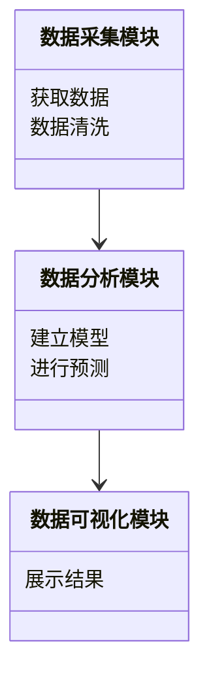
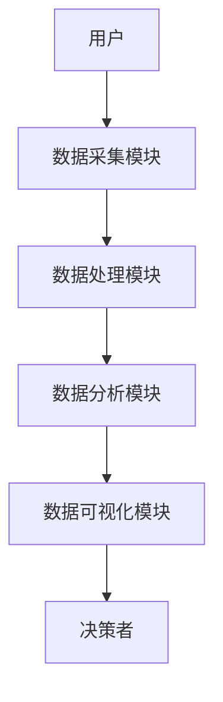

                 


# 构建智能企业决策支持系统：多维度数据分析与建议

> 关键词：智能决策支持系统、多维度数据分析、机器学习、人工智能、数据可视化、企业决策

> 摘要：本文详细探讨了构建智能企业决策支持系统的各个方面，包括多维度数据分析、机器学习算法、系统架构设计以及实际项目实现。通过理论与实践相结合的方式，帮助读者理解如何利用现代技术提升企业的决策效率和准确性。

---

## 第1章: 企业决策支持系统背景

### 1.1 问题背景与需求分析

#### 1.1.1 传统企业决策的局限性
传统的企业决策过程往往依赖于经验丰富的管理者或部门的专业知识，这种方式存在以下问题：
- 数据来源单一，难以全面反映企业的实际情况。
- 决策周期长，难以及时应对市场变化。
- 数据分析缺乏深度，难以挖掘潜在的商业机会。

#### 1.1.2 数据驱动决策的必要性
随着信息技术的飞速发展，企业积累的数据量呈现指数级增长。利用这些数据进行分析，可以帮助企业在以下方面做出更明智的决策：
- 提高市场预测的准确性。
- 优化资源配置，降低运营成本。
- 提升客户满意度，增强竞争力。

#### 1.1.3 智能决策支持系统的定义与目标
智能决策支持系统（Intelligent Decision Support System, IDSS）是一种结合人工智能、大数据分析和专家系统等技术的决策辅助工具。其目标是通过自动化数据处理和智能分析，为企业的战略决策提供科学依据。

---

### 1.2 多维度数据分析的重要性

#### 1.2.1 数据多样性对企业决策的影响
企业数据来源多样，包括结构化数据（如数据库中的交易记录）和非结构化数据（如文本、图像）。这些数据的综合分析能够提供更全面的决策支持。

#### 1.2.2 数据融合与整合的挑战
不同数据源之间可能存在格式不一致、语义不统一等问题，如何有效地将这些数据进行融合和整合是数据预处理的关键。

#### 1.2.3 数据可视化在决策支持中的作用
通过数据可视化工具（如图表、仪表盘等），可以将复杂的数据转化为易于理解的直观信息，帮助决策者快速掌握关键信息。

---

### 1.3 智能决策支持系统的应用场景

#### 1.3.1 金融领域的智能决策
在金融领域，智能决策支持系统可以用于风险评估、投资组合优化、欺诈检测等场景。

#### 1.3.2 零售行业的智能决策
通过分析销售数据、客户行为数据等，帮助企业优化库存管理、制定精准的营销策略。

#### 1.3.3 制造业的智能决策支持
在制造业中，智能决策支持系统可以帮助企业进行生产计划优化、质量控制、供应链管理等。

---

## 第2章: 核心概念与技术框架

### 2.1 数据挖掘与分析

#### 2.1.1 数据挖掘的基本概念
数据挖掘是从大量数据中提取有用信息的过程，主要包括数据清洗、特征提取、模式识别等步骤。

#### 2.1.2 数据预处理与清洗
数据清洗是数据挖掘过程中的关键步骤，包括处理缺失值、去除异常值、数据标准化等。

#### 2.1.3 数据特征提取与选择
特征提取是指从原始数据中提取具有代表性的特征，特征选择则是从这些特征中选出对目标分析最有用的部分。

---

### 2.2 机器学习在决策支持中的应用

#### 2.2.1 监督学习与无监督学习
- **监督学习**：基于标记的数据进行训练，用于分类和回归任务。
- **无监督学习**：在无标记数据中发现隐藏的模式或结构。

#### 2.2.2 常见机器学习算法
- **决策树**：通过树状结构进行分类和回归。
- **随机森林**：通过集成多个决策树模型提高准确率。

#### 2.2.3 模型评估与优化
常用的模型评估指标包括准确率、召回率、F1分数等。

---

### 2.3 人工智能与知识图谱

#### 2.3.1 人工智能的基本原理
人工智能通过模拟人类的思维方式，实现问题求解、模式识别等功能。

#### 2.3.2 知识图谱的构建与应用
知识图谱是一种结构化的数据表示方式，广泛应用于语义搜索、实体识别等领域。

#### 2.3.3 自然语言处理在决策支持中的作用
自然语言处理技术可以帮助企业从文本数据中提取有用信息，例如从客户反馈中识别情感倾向。

---

## 第3章: 数据分析与决策支持的数学模型

### 3.1 数据分析的基本数学模型

#### 3.1.1 数据分布与统计分析
通过统计分析方法，可以了解数据的分布情况，例如均值、方差等。

#### 3.1.2 数据相关性分析
相关性分析用于衡量变量之间的关系，常用皮尔逊相关系数和斯皮尔曼相关系数。

#### 3.1.3 数据回归分析
回归分析用于建立变量之间的关系模型，常用于预测和趋势分析。

---

### 3.2 机器学习算法的数学基础

#### 3.2.1 线性回归的数学公式
线性回归的损失函数为：
$$ L = \sum_{i=1}^{n} (y_i - \hat{y_i})^2 $$
其中，$\hat{y_i}$ 是预测值，$y_i$ 是真实值。

#### 3.2.2 决策树的分裂准则
决策树的分裂准则包括信息增益、基尼指数等，常用信息增益公式：
$$ \text{信息增益} = \text{熵}(D) - \sum_{k} \text{熵}(D_k) $$
其中，$D$ 是数据集，$D_k$ 是划分后的子集。

---

### 3.3 数据挖掘中的数学方法

#### 3.3.1 聚类算法的数学推导
聚类算法（如K-means）的目标是最小化簇内平方误差之和：
$$ \text{损失函数} = \sum_{i=1}^{k} \sum_{j=1}^{n_i} (x_{ij} - \mu_i)^2 $$
其中，$k$ 是簇的数量，$\mu_i$ 是第$i$簇的中心点。

#### 3.3.2 分类算法的评估指标
常用的分类算法评估指标包括准确率、召回率、F1分数等。

#### 3.3.3 时间序列分析的数学模型
时间序列分析常用ARIMA模型，其数学表达式为：
$$ ARIMA(p, d, q) $$
其中，$p$ 是自回归阶数，$d$ 是差分阶数，$q$ 是移动平均阶数。

---

## 第4章: 系统架构与设计

### 4.1 系统功能设计

#### 4.1.1 数据采集模块
数据采集模块负责从多种数据源（如数据库、API接口等）获取数据。

#### 4.1.2 数据处理模块
数据处理模块包括数据清洗、特征提取等步骤。

#### 4.1.3 数据分析模块
数据分析模块利用机器学习算法对数据进行建模和预测。

#### 4.1.4 数据可视化模块
数据可视化模块将分析结果以图表形式展示给用户。

---

### 4.2 系统架构设计

#### 4.2.1 领域模型类图
领域模型类图展示了系统中各个实体及其关系，可以用mermaid表示如下：



#### 4.2.2 系统架构图
系统架构图展示了系统的整体结构，可以用mermaid表示如下：



---

## 第5章: 项目实战

### 5.1 环境安装与配置

#### 5.1.1 安装Python环境
使用Anaconda安装Python 3.8及以上版本。

#### 5.1.2 安装必要的库
安装pandas、numpy、scikit-learn等库：
```bash
pip install pandas numpy scikit-learn
```

---

### 5.2 核心代码实现

#### 5.2.1 数据预处理代码
```python
import pandas as pd
import numpy as np

# 读取数据
data = pd.read_csv('data.csv')

# 处理缺失值
data = data.dropna()

# 数据标准化
from sklearn.preprocessing import StandardScaler
scaler = StandardScaler()
scaled_data = scaler.fit_transform(data)
```

#### 5.2.2 机器学习模型实现
```python
from sklearn.tree import DecisionTreeClassifier
from sklearn.metrics import accuracy_score

# 训练模型
model = DecisionTreeClassifier()
model.fit(scaled_data, labels)

# 预测
predictions = model.predict(test_data)
print('准确率:', accuracy_score(test_labels, predictions))
```

---

### 5.3 案例分析与解读

#### 5.3.1 案例背景
以客户流失预测为例，利用决策树模型进行分析。

#### 5.3.2 数据分析与结果展示
通过分析客户的行为数据，识别出高流失风险的客户群体，并生成可视化报告。

---

## 第6章: 总结与展望

### 6.1 最佳实践 Tips
- 数据预处理是数据分析的关键步骤。
- 选择合适的算法可以提高模型的准确率。
- 数据可视化是展示分析结果的重要手段。

### 6.2 项目小结
通过本项目，我们了解了智能决策支持系统的构建过程，掌握了数据分析和机器学习的基本方法。

### 6.3 未来展望
随着人工智能技术的不断发展，智能决策支持系统将在更多领域得到应用，为企业创造更大的价值。

---

作者：AI天才研究院 & 禅与计算机程序设计艺术

