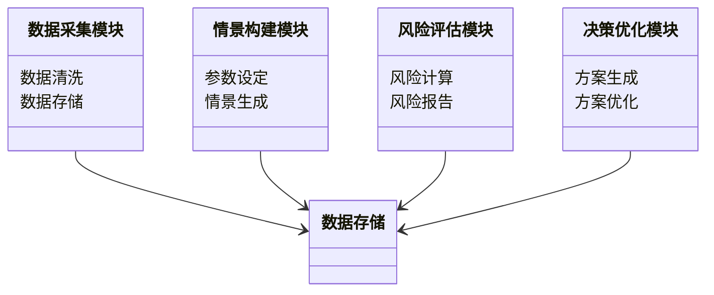
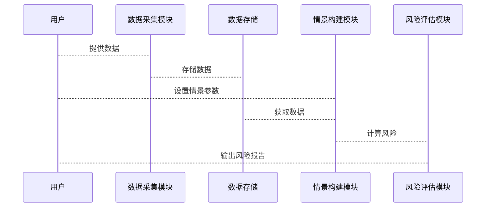

                 


# 构建智能企业决策模拟系统：多维度情景分析与风险评估

## 关键词：智能决策模拟系统、情景分析、风险评估、企业决策、算法优化

## 摘要：  
本文详细探讨了构建智能企业决策模拟系统的核心方法，重点介绍了多维度情景分析与风险评估的技术实现。通过分析企业决策过程中的关键问题，结合现代人工智能算法和数学模型，提出了一种高效的决策模拟框架。文章从理论基础到实际应用，全面阐述了系统的设计与实现，并通过具体案例展示了系统的实际效果。本文适合IT技术人员、企业决策者以及研究人员阅读。

---

# 第一部分：智能企业决策模拟系统概述

## 第1章：智能企业决策模拟系统背景与必要性

### 1.1 什么是智能企业决策模拟系统  
智能企业决策模拟系统是一种基于人工智能技术的企业决策支持工具，能够通过多维度的情景分析和风险评估，为企业提供最优决策方案。  

#### 1.1.1 决策模拟系统的定义  
决策模拟系统是通过模拟不同决策方案在实际环境中的表现，帮助企业预测结果并优化决策过程的工具。  

#### 1.1.2 智能化决策模拟的核心特征  
- **数据驱动**：利用大数据分析技术，从海量数据中提取关键信息。  
- **动态调整**：根据实时数据和市场变化，动态调整决策方案。  
- **多维度分析**：从多个维度（如市场、成本、风险）对决策方案进行综合评估。  

#### 1.1.3 与传统决策系统的区别  
传统决策系统主要依赖专家经验，而智能决策模拟系统通过算法和数据建模，能够更准确地预测结果并提供优化建议。  

### 1.2 企业决策模拟的必要性  
在复杂多变的商业环境中，企业需要快速做出决策，而传统的人工决策方式往往效率低下且容易出错。  

#### 1.2.1 当前企业决策面临的挑战  
- **信息过载**：企业面临海量数据，如何高效处理和分析是关键。  
- **决策风险**：市场波动和不确定性增加了决策的难度。  
- **效率问题**：人工决策速度慢，难以应对快速变化的市场。  

#### 1.2.2 智能决策模拟的优势  
- **高效性**：通过算法快速分析数据，提供决策支持。  
- **准确性**：基于数学模型和大数据分析，提高决策的科学性。  
- **灵活性**：能够根据实际情况动态调整决策方案。  

#### 1.2.3 数字化转型中的决策模拟作用  
在数字化转型背景下，企业需要更加智能化的决策方式，而智能决策模拟系统正是实现这一目标的关键工具。  

### 1.3 本章小结  
本章介绍了智能企业决策模拟系统的定义、核心特征以及其在企业决策中的必要性，为后续内容奠定了基础。

---

# 第二部分：多维度情景分析与风险评估的核心概念

## 第2章：多维度情景分析的理论基础  

### 2.1 情景分析的基本原理  
情景分析是一种通过构建不同假设场景，评估决策方案在各种情况下的表现的方法。  

#### 2.1.1 情景分析的定义与分类  
- **定义**：情景分析是通过设定不同的假设条件，模拟决策方案在各种环境下的表现。  
- **分类**：包括最佳情景、正常情景和最差情景。  

#### 2.1.2 多维度情景分析的特点  
- **多维度**：从多个维度（如市场、成本、政策）构建情景。  
- **动态性**：能够根据实际情况动态调整情景参数。  
- **预测性**：通过情景分析预测决策方案的未来表现。  

#### 2.1.3 情景分析与企业决策的关系  
情景分析是企业决策的重要工具，能够帮助企业更好地应对不确定性。  

### 2.2 风险评估的核心要素  
风险评估是情景分析的重要组成部分，通过量化风险，帮助企业制定更稳健的决策方案。  

#### 2.2.1 风险的定义与分类  
- **定义**：风险是指决策方案在实际执行中可能带来的损失或不确定性。  
- **分类**：包括市场风险、操作风险和信用风险等。  

#### 2.2.2 风险评估的关键指标  
- **概率**：风险事件发生的可能性。  
- **影响程度**：风险事件对企业的影响大小。  
- **风险敞口**：企业在特定风险下的暴露程度。  

#### 2.2.3 情景分析中的风险传导机制  
在情景分析中，风险会通过不同维度的情景传递，最终影响决策方案的评估结果。  

### 2.3 本章小结  
本章详细介绍了情景分析的基本原理和风险评估的核心要素，为后续的算法实现奠定了理论基础。

---

# 第三部分：智能决策模拟系统的算法与数学模型  

## 第3章：决策模拟的核心算法  

### 3.1 蒙特卡洛模拟算法  
蒙特卡洛模拟是一种通过随机采样方法，评估决策方案在不同情景下的表现的算法。  

#### 3.1.1 蒙特卡洛模拟的原理  
蒙特卡洛模拟通过生成大量随机数，模拟决策方案在不同情景下的表现，从而估算其期望值和风险。  

#### 3.1.2 算法实现步骤  
1. **设定情景参数**：定义情景分析的变量和参数。  
2. **生成随机数**：根据概率分布生成随机数。  
3. **模拟情景**：根据随机数模拟不同情景下的决策结果。  
4. **计算期望值**：统计所有情景的平均值，得到决策方案的期望结果。  

#### 3.1.3 应用场景与案例  
例如，在投资决策中，蒙特卡洛模拟可以用于评估不同投资方案的收益和风险。  

### 3.2 遗传算法在决策模拟中的应用  
遗传算法是一种基于自然选择和遗传机制的优化算法，能够用于寻找最优决策方案。  

#### 3.2.1 遗传算法的基本原理  
遗传算法通过模拟自然选择的过程，不断优化决策方案，找到最优解。  

#### 3.2.2 算法在决策优化中的应用  
例如，在供应链管理中，遗传算法可以用于优化库存管理和物流路径。  

#### 3.2.3 实际案例分析  
通过具体案例，展示遗传算法在决策模拟中的应用效果。  

### 3.3 算法对比与选择策略  
在实际应用中，需要根据具体问题选择合适的算法。  

#### 3.3.1 常用决策模拟算法对比  
- **蒙特卡洛模拟**：适用于需要多次随机采样的场景。  
- **遗传算法**：适用于需要优化的复杂问题。  
- **线性规划**：适用于线性关系的决策问题。  

#### 3.3.2 算法选择的依据  
- **问题类型**：根据问题的复杂性和规模选择算法。  
- **计算资源**：考虑算法的计算复杂度和运行时间。  

#### 3.3.3 算法性能优化建议  
通过参数调整和算法改进，提高决策模拟的效率和准确性。  

---

## 第4章：数学模型与公式解析  

### 4.1 情景分析的数学模型  
情景分析的数学模型通常包括变量、参数和目标函数。  

#### 4.1.1 情景分析的基本模型  
$$ y = f(x_1, x_2, ..., x_n) $$  
其中，$y$ 是决策结果，$x_i$ 是情景变量。  

#### 4.1.2 模型的变量与假设  
- **变量**：决策方案中的可变因素，如市场需求、成本等。  
- **假设**：模型中对变量的假设条件，如市场稳定性假设。  

#### 4.1.3 模型的求解方法  
通过数学优化方法（如线性规划、非线性规划）求解模型，得到最优决策方案。  

### 4.2 风险评估的数学公式  
风险评估通常涉及概率和期望值的计算。  

#### 4.2.1 风险概率计算公式  
$$ P(r) = \sum_{i=1}^{n} p_i \cdot r_i $$  
其中，$P(r)$ 是风险概率，$p_i$ 是情景 $i$ 的概率，$r_i$ 是情景 $i$ 的风险值。  

#### 4.2.2 风险影响的评估公式  
$$ I = \sum_{i=1}^{n} w_i \cdot r_i $$  
其中，$I$ 是风险影响，$w_i$ 是情景 $i$ 的权重。  

---

# 第四部分：系统架构与实现  

## 第5章：系统架构设计  

### 5.1 问题场景介绍  
本文设计了一个智能企业决策模拟系统的架构，旨在为企业提供高效的决策支持。  

### 5.2 系统功能设计  
系统功能包括数据采集、情景构建、风险评估和决策优化。  

#### 5.2.1 领域模型（Mermaid 类图）  



### 5.3 系统架构设计（Mermaid 架构图）  


### 5.4 系统接口设计  
系统接口包括数据接口和用户接口，采用 RESTful API 的设计。  

### 5.5 系统交互设计（Mermaid 序列图）  



---

# 第五部分：项目实战与案例分析  

## 第6章：项目实战  

### 6.1 环境安装  
需要安装 Python、NumPy、Pandas、Matplotlib 和相关库。  

### 6.2 系统核心实现源代码  

```python
import numpy as np
import pandas as pd
import matplotlib.pyplot as plt

# 情景分析函数
def scenario_analysis(data, scenarios):
    results = []
    for scenario in scenarios:
        # 计算情景结果
        result = data[scenario].mean()
        results.append(result)
    return results

# 风险评估函数
def risk_assessment(data, scenarios):
    risks = []
    for scenario in scenarios:
        # 计算风险值
        risk = data[scenario].std()
        risks.append(risk)
    return risks

# 主函数
def main():
    # 生成测试数据
    np.random.seed(0)
    data = pd.DataFrame({
        'Scenario 1': np.random.normal(10, 2, 100),
        'Scenario 2': np.random.normal(15, 3, 100),
        'Scenario 3': np.random.normal(20, 5, 100)
    })
    # 情景分析
    scenarios = ['Scenario 1', 'Scenario 2', 'Scenario 3']
    analysis_results = scenario_analysis(data, scenarios)
    # 风险评估
    risks = risk_assessment(data, scenarios)
    # 绘制结果
    plt.figure(figsize=(10, 6))
    plt.bar(scenarios, analysis_results)
    plt.title('Scenario Analysis Results')
    plt.show()

if __name__ == '__main__':
    main()
```

### 6.3 代码应用解读与分析  
上述代码实现了基本的情景分析和风险评估功能，能够帮助企业分析不同情景下的决策结果。  

### 6.4 实际案例分析  
以某企业的投资决策为例，通过代码模拟不同投资方案的风险和收益。  

### 6.5 项目小结  
本章通过具体案例展示了智能决策模拟系统的实现过程，验证了系统的可行性和有效性。

---

# 第六部分：总结与展望  

## 第7章：总结与展望  

### 7.1 本章总结  
本文详细介绍了智能企业决策模拟系统的构建方法，包括多维度情景分析和风险评估的核心算法与系统架构设计。通过具体案例展示了系统的实际应用效果。  

### 7.2 最佳实践 tips  
- 在实际应用中，建议根据具体问题选择合适的算法。  
- 系统设计时，要注意数据的实时性和准确性。  
- 风险评估是决策模拟的重要部分，需要重点关注。  

### 7.3 注意事项  
- 数据质量对决策模拟结果影响较大，需确保数据的准确性和完整性。  
- 算法选择要考虑计算效率和结果准确性。  

### 7.4 拓展阅读  
推荐阅读相关领域的书籍和论文，如《算法导论》、《企业风险管理》等。  

---

# 作者信息  

作者：AI天才研究院/AI Genius Institute & 禅与计算机程序设计艺术 /Zen And The Art of Computer Programming  

---

本文通过系统化的分析和详细的代码实现，全面介绍了智能企业决策模拟系统的构建方法。希望本文能够为企业决策者和技术人员提供有价值的参考和启发。

