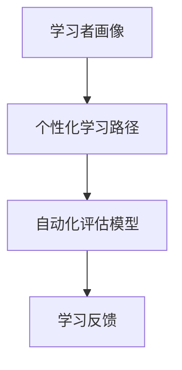
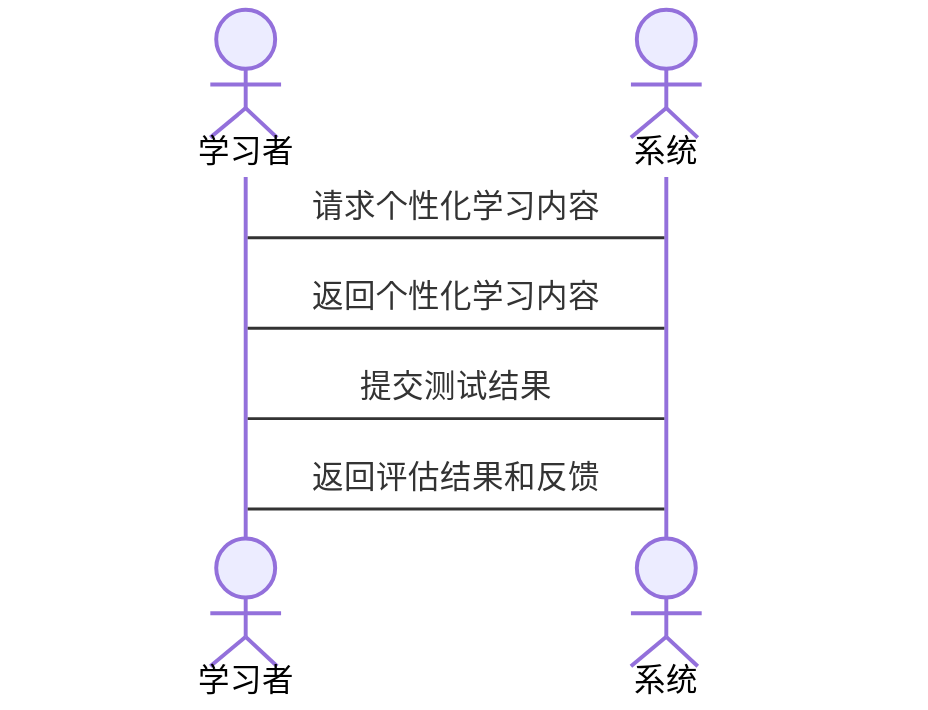

                 


# 构建智能企业合规培训系统：个性化学习内容与评估的自动化

---

## 关键词：
智能企业合规培训系统、个性化学习、自动化评估、数据驱动、人工智能、机器学习

---

## 摘要：
随着企业合规需求的不断增长，传统的合规培训方式已难以满足个性化和高效性的要求。本文将详细介绍如何构建一个智能企业合规培训系统，通过个性化学习内容和自动化评估的结合，解决传统培训中的痛点。文章从背景、核心概念、算法原理、系统架构到项目实战，全面阐述了智能合规培训系统的构建过程，最后给出了最佳实践和未来展望。

---

# 正文

---

## 第一部分：智能企业合规培训系统背景与核心概念

---

### 第1章：企业合规培训的挑战与机遇

#### 1.1 企业合规培训的重要性
企业合规培训是确保员工遵守法律法规和企业规章制度的重要手段。然而，传统培训方式存在以下问题：
- **内容千篇一律**：无法针对不同岗位和员工的需求提供个性化内容。
- **效率低下**：培训时间长，效果难以衡量。
- **缺乏反馈机制**：无法实时了解员工的学习进度和掌握情况。

智能化合规培训系统的引入，能够通过个性化学习和自动化评估，显著提高培训效果和效率。

#### 1.2 智能化合规培训的核心价值
1. **提高培训效率**：通过自动化评估和个性化推荐，减少无效学习时间。
2. **个性化学习体验**：根据员工特点推荐学习内容，提升学习积极性。
3. **实时反馈与改进**：通过自动化评估，及时发现学习薄弱环节并进行调整。

#### 1.3 本章小结
本章介绍了企业合规培训的重要性和传统方式的不足，提出了智能化合规培训的必要性及其核心价值。

---

### 第2章：智能企业合规培训系统的核心概念

#### 2.1 个性化学习内容
个性化学习内容是基于员工的特点（如岗位职责、知识水平、学习风格）定制的学习材料。例如：
- **岗位定制内容**：为销售部门员工提供《反商业贿赂法规》相关内容。
- **能力导向内容**：为新员工提供《入职合规手册》。

#### 2.2 自动化评估与反馈
自动化评估系统能够实时分析员工的学习行为和测试结果，提供针对性反馈。例如：
- **实时测试评估**：员工完成测试后，系统立即生成报告并提出改进建议。
- **行为数据分析**：通过学习时间、点击率等数据，判断员工的学习状态。

#### 2.3 数据驱动的合规培训
数据驱动的合规培训通过分析员工数据，优化培训策略。例如：
- **数据采集**：通过学习平台收集员工的学习行为数据。
- **数据处理**：利用大数据技术分析数据，生成个性化学习路径。

#### 2.4 核心概念对比表
| 概念         | 描述                                                                 |
|--------------|----------------------------------------------------------------------|
| 个性化学习   | 根据员工特点定制学习内容                                           |
| 自动化评估    | 通过算法实时评估学习效果并提供反馈                                 |
| 数据驱动     | 利用数据优化培训策略                                               |

#### 2.5 本章小结
本章详细介绍了智能企业合规培训系统的核心概念，包括个性化学习、自动化评估和数据驱动的特点及其作用。

---

### 第3章：智能企业合规培训系统的核心要素

#### 3.1 学习者画像
学习者画像是基于员工数据构建的个性化特征模型，用于推荐学习内容。例如：
- **岗位画像**：根据员工所在部门和岗位定制学习内容。
- **能力画像**：根据员工的知识水平推荐适合的学习材料。

#### 3.2 个性化学习路径
个性化学习路径是根据员工的学习需求和能力水平动态调整的学习计划。例如：
- **初级员工路径**：从基础法规知识开始，逐步深入。
- **高级员工路径**：直接进入专业法规内容。

#### 3.3 自动化评估模型
自动化评估模型通过机器学习算法分析员工的学习数据，生成评估结果。例如：
- **测试评估模型**：通过测试分数判断员工的掌握程度。
- **行为评估模型**：通过学习时间和互动频率判断学习效果。

#### 3.4 核心要素关系图（Mermaid）


#### 3.5 本章小结
本章详细讲解了智能企业合规培训系统的核心要素，包括学习者画像、个性化学习路径和自动化评估模型的关系。

---

## 第二部分：智能企业合规培训系统的算法与架构

---

### 第4章：个性化学习推荐算法

#### 4.1 推荐算法概述
推荐算法是个性化学习的核心技术，常用的算法包括：
1. **基于内容的推荐**：根据学习内容的相似性推荐。
2. **基于协同过滤的推荐**：根据其他学习者的相似行为推荐。

#### 4.2 个性化学习推荐算法实现
推荐算法的实现步骤如下：
1. 数据预处理：清洗和归一化数据。
2. 特征提取：提取学习者画像和学习内容的特征。
3. 模型训练：训练推荐模型。
4. 推荐结果：生成个性化推荐列表。

#### 4.3 算法实现代码示例
```python
def collaborative_filtering(user_data, item_data):
    # 计算用户相似性
    user_similarity = cosine_similarity(user_data)
    
    # 推荐目标用户的相似用户
    similar_users = user_similarity[user_id]
    
    # 根据相似用户的评分预测目标用户的评分
    predicted_rating = np.dot(similar_users, item_data)
    
    return predicted_rating.argsort()[::-1]
```

#### 4.4 本章小结
本章详细介绍了个性化学习推荐算法的实现过程，包括算法原理和代码实现。

---

### 第5章：自动化评估模型的构建与优化

#### 5.1 评估模型概述
自动化评估模型是通过机器学习算法分析学习者的行为数据，生成评估结果。常用的模型包括：
1. **基于规则的评估模型**：根据预设规则进行评估。
2. **基于机器学习的评估模型**：通过训练数据预测评估结果。

#### 5.2 自动化评估模型的构建
评估模型的构建步骤如下：
1. 数据准备：收集学习者的行为数据。
2. 特征工程：提取相关特征。
3. 模型训练：训练评估模型。
4. 模型优化：调参和验证。

#### 5.3 评估模型优化代码示例
```python
from sklearn.model import LogisticRegression

def optimize_model(X, y):
    # 调参
    param_grid = {'C': [0.1, 1, 10]}
    grid_search = GridSearchCV(LogisticRegression(), param_grid)
    grid_search.fit(X, y)
    
    # 输出最佳参数
    print("Best parameters:", grid_search.best_params_)
    
    return grid_search.best_estimator_
```

#### 5.4 本章小结
本章详细讲解了自动化评估模型的构建和优化过程，包括模型选择和调参方法。

---

## 第三部分：系统分析与架构设计

---

### 第6章：系统分析与架构设计

#### 6.1 问题场景介绍
企业合规培训系统需要解决以下问题：
1. 如何实现个性化学习内容推荐。
2. 如何进行自动化评估和反馈。

#### 6.2 系统功能设计
系统功能设计包括：
1. 学习者画像构建。
2. 个性化学习路径生成。
3. 自动化评估与反馈。

#### 6.3 系统架构设计（Mermaid）


#### 6.4 系统接口设计
系统接口包括：
1. 学习者画像接口。
2. 学习内容推荐接口。
3. 自动化评估接口。

#### 6.5 系统交互流程图（Mermaid）


#### 6.6 本章小结
本章详细描述了智能企业合规培训系统的分析与架构设计，包括功能设计、架构图和交互流程图。

---

## 第四部分：项目实战

---

### 第7章：项目实战

#### 7.1 环境安装
需要安装以下工具：
1. Python 3.x
2. scikit-learn
3. pandas
4. matplotlib

#### 7.2 核心功能实现
核心功能包括：
1. 学习者画像构建。
2. 个性化学习推荐。
3. 自动化评估与反馈。

#### 7.3 代码实现示例
```python
import pandas as pd
from sklearn.model import LogisticRegression

def main():
    # 读取数据
    data = pd.read_csv('train.csv')
    
    # 特征工程
    X = data[['feature1', 'feature2']]
    y = data['label']
    
    # 模型训练
    model = LogisticRegression()
    model.fit(X, y)
    
    # 预测
    prediction = model.predict(X)
    
    # 输出结果
    print("预测结果:", prediction)

if __name__ == "__main__":
    main()
```

#### 7.4 实际案例分析
以某企业为例，分析系统如何实现个性化学习推荐和自动化评估。

#### 7.5 本章小结
本章通过实际项目案例，详细讲解了智能企业合规培训系统的实现过程。

---

## 第五部分：最佳实践与总结

---

### 第8章：最佳实践与总结

#### 8.1 最佳实践 tips
1. 数据隐私保护：确保学习者数据的安全性。
2. 系统维护：定期更新学习内容和评估模型。
3. 用户反馈：根据用户反馈优化系统功能。

#### 8.2 本章小结
总结全文内容，强调智能企业合规培训系统的重要性及其未来发展方向。

---

## 作者：
AI天才研究院/AI Genius Institute & 禅与计算机程序设计艺术 /Zen And The Art of Computer Programming

---

以上是《构建智能企业合规培训系统：个性化学习内容与评估的自动化》的完整目录大纲和文章结构。

