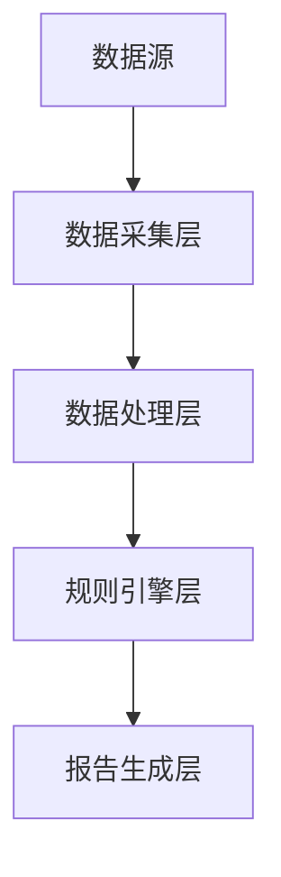
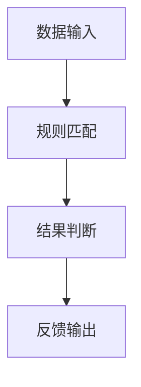
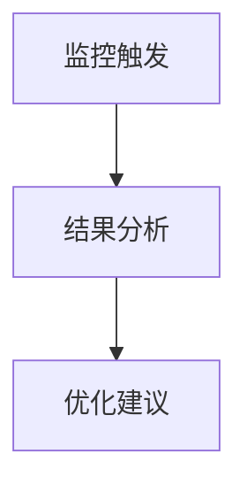
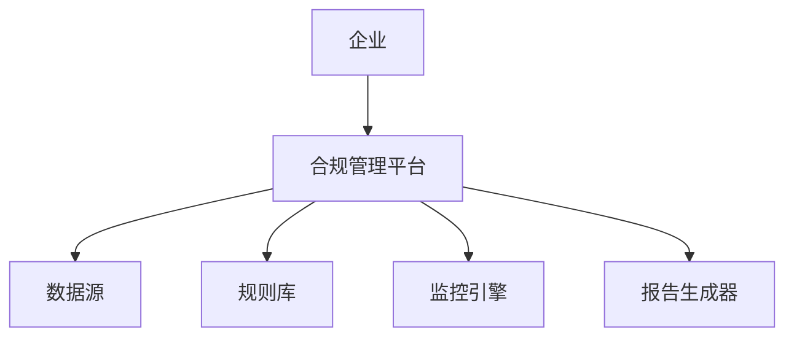
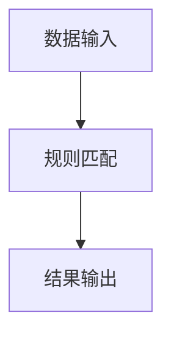
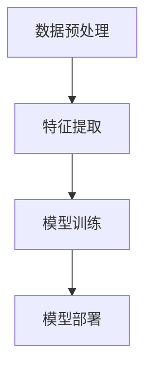

                 


# 构建智能企业合规管理平台：自动化监控与报告

> 关键词：企业合规管理，智能监控，自动化报告，数据驱动，AI技术，实时监控

> 摘要：本文详细探讨了构建智能企业合规管理平台的关键技术与实现方案，重点分析了自动化监控与报告的核心原理、系统架构设计、算法实现及实际应用场景。通过理论与实践相结合的方式，为读者提供一套完整的智能化合规管理解决方案。

---

# 第一部分：企业合规管理平台的背景与意义

## 第1章：企业合规管理平台的背景与意义

### 1.1 合规管理的基本概念

#### 1.1.1 合规管理的定义
合规管理是指企业在经营过程中，依据相关法律法规、行业标准及内部规章制度，确保其行为合法、合规的管理活动。合规管理的核心目标是降低企业经营风险，避免因违规行为导致的法律纠纷和经济损失。

#### 1.1.2 企业合规管理的重要性
- **法律风险防控**：合规管理是企业规避法律风险的重要手段，尤其是在金融、医疗、能源等高风险行业。
- **提升企业信誉**：合规管理能够增强企业在客户、合作伙伴及监管机构中的信任度。
- **优化运营效率**：通过合规管理，企业可以减少因违规行为导致的停业整顿、罚款等损失，从而优化运营效率。

#### 1.1.3 合规管理的核心要素
- 数据采集：合规管理的第一步是数据的采集与处理。
- 规则制定：根据法律法规和企业内部制度，制定具体的合规规则。
- 监控执行：通过技术手段对企业的行为进行实时监控。
- 报告分析：定期生成合规报告，分析监控结果并提出改进建议。

### 1.2 传统合规管理的痛点

#### 1.2.1 人工检查的低效性
传统合规管理主要依赖人工检查，这种方式效率低下、成本高昂，且容易受到主观因素的影响。

#### 1.2.2 数据分散与信息孤岛
企业内部数据分散在不同的部门和系统中，缺乏统一的数据平台，导致信息孤岛现象严重，难以进行有效的合规监控。

#### 1.2.3 规则更新的滞后性
法律法规和企业内部制度不断变化，传统合规管理难以及时更新规则，导致合规监控的滞后性。

### 1.3 智能化合规管理的必要性

#### 1.3.1 AI技术在合规管理中的应用
人工智能技术（AI）可以通过自然语言处理（NLP）、机器学习（ML）等技术，帮助企业自动识别合规风险，优化合规管理流程。

#### 1.3.2 自动化监控的优势
- 实时监控：通过自动化系统，企业可以实时监控各项业务活动，确保合规性。
- 高效性：自动化监控可以大幅提高合规管理的效率，降低人工成本。
- 智能性：AI技术可以自动学习和优化合规规则，提升监控的准确性。

#### 1.3.3 数据驱动的合规管理新趋势
随着大数据技术的发展，企业可以通过数据驱动的方式，对合规管理进行深度分析，发现潜在风险，并提出预防措施。

---

## 第2章：智能企业合规管理平台的核心概念

### 2.1 合规管理平台的框架

#### 2.1.1 数据采集层
数据采集层负责从企业各个系统中采集数据，包括财务数据、业务数据、日志数据等。

#### 2.1.2 数据处理层
数据处理层对采集到的数据进行清洗、转换和存储，确保数据的准确性和可用性。

#### 2.1.3 规则引擎层
规则引擎层是合规管理平台的核心模块，负责根据预设的合规规则对数据进行分析和判断。

#### 2.1.4 报告生成层
报告生成层根据监控结果生成合规报告，报告内容包括合规情况分析、风险提示和改进建议。

### 2.2 合规管理平台的模型

#### 2.2.1 数据流模型
数据流模型描述了数据在合规管理平台中的流动过程，包括数据的采集、处理、分析和报告生成。



#### 2.2.2 规则执行模型
规则执行模型描述了合规规则在平台中的执行过程，包括规则匹配、结果判断和反馈输出。



#### 2.2.3 监控反馈模型
监控反馈模型描述了合规监控的反馈机制，包括监控触发、结果分析和优化建议。



### 2.3 合规管理平台的属性特征对比

| 属性 | 传统合规管理 | 智能合规管理 |
|------|-------------|--------------|
| 效率 | 低效         | 高效         |
| 成本 | 高           | 低           |
| 准确性 | 低           | 高           |
| 及时性 | 迟缓         | 实时         |
| 可扩展性 | 有限         | 强大         |
| 自适应性 | 低           | 高           |

### 2.4 实体关系图



---

## 第3章：智能合规管理平台的算法原理

### 3.1 基于规则的监控算法

#### 3.1.1 规则匹配流程



#### 3.1.2 示例代码
```python
def is_compliant(data, rules):
    for rule in rules:
        if not rule.check(data):
            return False
    return True
```

### 3.2 机器学习模型的应用

#### 3.2.1 模型训练流程



#### 3.2.2 示例代码
```python
import pandas as pd
from sklearn.model_selection import train_test_split
from sklearn.

