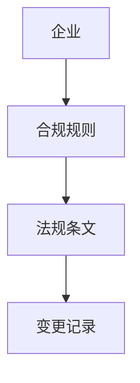

                 


# 构建智能企业合规管理系统：法规变更追踪与自动化更新

> 关键词：智能合规管理，法规变更追踪，自动化更新，自然语言处理，机器学习，规则引擎

> 摘要：随着企业面临越来越复杂的法规环境，构建一个智能企业合规管理系统变得至关重要。本文详细探讨了如何利用自然语言处理、机器学习和规则引擎等技术，实现法规变更的自动追踪与更新。通过系统化的架构设计和算法实现，本文提供了一个从理论到实践的全面解决方案。

---

## 第一部分：智能企业合规管理系统的背景与核心概念

### 第1章：企业合规管理的背景与挑战

#### 1.1 合规管理的核心概念

##### 1.1.1 企业合规管理的定义与范围
企业合规管理是指确保企业在经营活动中遵守相关法律法规、行业标准和企业内部规章制度的管理过程。其范围涵盖数据隐私、反腐败、环境保护、劳动法等多个领域。

##### 1.1.2 合规管理在企业中的重要性
合规管理是企业风险管理的重要组成部分。合规不仅帮助企业避免法律风险和罚款，还能提升企业的声誉和市场竞争力。

##### 1.1.3 数字化合规管理的必要性
随着法律法规的复杂性和更新频率的增加，传统的手动合规管理方式已难以应对。数字化合规管理通过技术手段实现自动化和智能化，显著提高了效率和准确性。

#### 1.2 法规变更追踪的挑战

##### 1.2.1 法规变更的复杂性
法律法规的变更往往涉及多个相关领域，且变更内容可能隐晦或模糊，增加了变更检测的难度。

##### 1.2.2 传统合规管理的局限性
传统合规管理依赖人工审核和手动更新，效率低且容易遗漏重要变更，难以满足企业对实时合规的需求。

##### 1.2.3 自动化合规管理的需求
企业需要一种能够实时跟踪法规变更、自动更新合规策略的技术解决方案，以应对快速变化的法规环境。

### 第2章：智能企业合规管理系统的概念与目标

#### 2.1 智能合规管理系统的定义
智能企业合规管理系统是一种基于人工智能和大数据技术的系统，能够自动采集、分析和更新法律法规，帮助企业实时保持合规状态。

#### 2.2 法规变更追踪与自动化更新的实现

##### 2.2.1 法规文本的结构化处理
通过自然语言处理技术，将非结构化的法规文本转化为结构化的数据，便于后续的分析和处理。

##### 2.2.2 变更检测的算法原理
利用机器学习算法，检测法规文本的变更部分，并生成变更报告。

##### 2.2.3 自动化更新的实现机制
基于变更检测结果，系统自动生成更新建议，并指导企业调整相关业务流程和系统。

### 第3章：智能合规管理系统的架构与核心模块

#### 3.1 系统架构设计

##### 3.1.1 分层架构概述
系统采用分层架构，包括数据采集层、分析层、规则引擎层和用户界面层。

##### 3.1.2 模块划分与功能说明
系统主要模块包括法规采集模块、变更检测模块、规则引擎模块和自动化更新模块。

#### 3.2 核心模块详解

##### 3.2.1 法规采集模块
负责从官方渠道采集法律法规文本，并进行清洗和预处理。

##### 3.2.2 变更检测模块
利用自然语言处理和机器学习算法，检测法规文本的变更部分。

##### 3.2.3 规则引擎模块
根据变更检测结果，生成合规规则，并指导企业调整相关流程。

##### 3.2.4 自动化更新模块
根据规则引擎的输出，自动更新企业的合规策略和相关系统。

---

## 第二部分：法规变更追踪与自动化更新的核心算法

### 第4章：法规文本的自然语言处理

#### 4.1 文本预处理与特征提取

##### 4.1.1 分词与词性标注
使用分词工具（如jieba）对法规文本进行分词，并进行词性标注。

##### 4.1.2 命题抽取与实体识别
通过NER（命名实体识别）技术，识别法规文本中的实体，如“公司”、“数据”等。

#### 4.2 基于序列标注的法规条文识别

##### 4.2.1 条款边界识别
使用条件随机场（CRF）模型，识别法规条文的开始和结束位置。

##### 4.2.2 条款内容提取
根据识别的边界，提取具体的法规条文内容。

### 第5章：法规变更检测算法

#### 5.1 基于规则的变更检测

##### 5.1.1 规则定义与匹配
定义变更检测的规则，如“增加某一条款”、“修改某一条款”等，并通过正则表达式匹配。

#### 5.2 基于机器学习的变更检测

##### 5.2.1 特征选择与模型训练
选择文本相似度、编辑距离等特征，训练分类模型（如SVM、随机森林）进行变更检测。

##### 5.2.2 模型评估与优化
通过准确率、召回率等指标评估模型性能，并进行超参数优化。

### 第6章：自动化更新的实现机制

#### 6.1 变更影响分析

##### 6.1.1 变更范围评估
分析变更对企业的具体影响范围，如涉及哪些部门、哪些业务流程等。

##### 6.1.2 影响程度评估
评估变更对企业的合规风险和业务流程的影响程度。

#### 6.2 自动化更新流程

##### 6.2.1 更新策略制定
根据变更影响分析结果，制定更新策略，如优先处理高风险变更。

##### 6.2.2 更新操作执行
根据策略自动更新企业的合规规则和相关系统。

---

## 第三部分：智能企业合规管理系统的系统设计与实现

### 第7章：系统功能设计

#### 7.1 领域模型设计

##### 7.1.1 实体关系图（ER图）


##### 7.1.2 功能模块划分
系统功能模块包括法规采集、变更检测、规则引擎和自动化更新。

### 第8章：系统接口与交互设计

#### 8.1 系统接口设计

##### 8.1.1 API定义
系统提供RESTful API接口，包括：
- `GET /api/rules`：获取所有合规规则
- `POST /api/rules/update`：提交规则更新请求

#### 8.2 系统交互设计

##### 8.2.1 用户界面设计
用户界面包括法规浏览、变更通知、规则管理等功能模块。

##### 8.2.2 交互流程
用户登录系统，浏览法规，查看变更通知，管理合规规则，系统自动更新。

---

## 第四部分：项目实战与总结

### 第9章：项目实战

#### 9.1 环境安装

##### 9.1.1 安装Python和相关库
安装Python和自然语言处理库（如jieba、spaCy）、机器学习库（如scikit-learn）。

#### 9.2 核心代码实现

##### 9.2.1 法规采集模块
```python
import requests
from bs4 import BeautifulSoup

def fetch_regulations(url):
    response = requests.get(url)
    soup = BeautifulSoup(response.text, 'html.parser')
    regulations = soup.find_all('div', class_='regulation')
    return [r.text for r in regulations]
```

##### 9.2.2 变更检测模块
```python
from sklearn.feature_extraction.text import TfidfVectorizer
from sklearn.svm import SVC

def detect_changes(new_text, old_text):
    vectorizer = TfidfVectorizer()
    tfidf_new = vectorizer.fit_transform([new_text])
    tfidf_old = vectorizer.transform([old_text])
    model = SVC()
    model.fit(tfidf_new, [1])
    prediction = model.predict(tfidf_old)
    return prediction[0] == 1
```

#### 9.3 实际案例分析
以《数据保护法》为例，展示系统如何检测法规变更并自动生成更新建议。

### 第10章：总结与展望

#### 10.1 最佳实践
- 定期更新法规库，确保系统的准确性和全面性。
- 与企业的业务系统集成，实现合规管理的自动化。

#### 10.2 小结
智能企业合规管理系统通过自然语言处理、机器学习和规则引擎等技术，实现了法规变更的自动追踪与更新，显著提高了企业的合规效率和准确性。

---

## 作者：AI天才研究院 & 禅与计算机程序设计艺术

