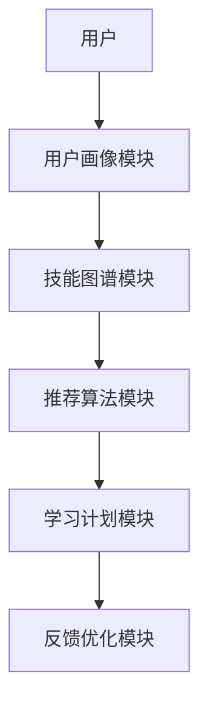

                 


# 构建智能企业学习管理系统：技能图谱与个性化发展规划

## 关键词
智能企业学习管理系统, 技能图谱, 个性化学习, AI推荐算法, 系统架构设计

## 摘要
在企业学习管理系统中，传统的学习模式逐渐暴露出效率低下、个性化不足的问题。本文通过构建智能企业学习管理系统，结合技能图谱和个性化发展规划，提出了基于AI的推荐算法和系统架构设计，以提高学习效率和效果。文章详细探讨了技能图谱的构建、个性化学习的实现、推荐算法的原理，以及系统的实际应用案例，为构建高效、智能的企业学习管理系统提供了理论和实践指导。

---

# 第1章 企业学习管理系统的发展与挑战

## 1.1 传统企业学习管理系统的局限性
### 1.1.1 传统学习管理系统的特点
传统企业学习管理系统通常依赖固定的学习路径和课程推荐，难以满足个性化学习需求。学习者的学习体验单一，缺乏针对性和灵活性。

### 1.1.2 传统系统在个性化学习中的不足
传统系统难以分析学习者的真实需求和能力水平，导致推荐的课程可能与实际需求不符，学习效果有限。

### 1.1.3 技能图谱与个性化发展的需求
随着企业对员工技能要求的提高，学习者需要更精准的学习规划和技能提升路径，技能图谱成为个性化发展的关键工具。

## 1.2 智能企业学习管理系统的优势
### 1.2.1 基于AI的个性化学习规划
智能系统通过AI算法分析学习者的特点和需求，提供个性化的学习建议和路径。

### 1.2.2 技能图谱的应用价值
技能图谱能够清晰展示技能之间的关系和层次，帮助学习者制定高效的学习计划。

### 1.2.3 提高学习效率与效果
智能系统通过精准推荐和实时反馈，显著提高学习效率和效果，使学习者更快掌握所需技能。

## 1.3 本章小结
本章分析了传统企业学习管理系统的局限性，提出了智能学习管理系统的必要性，强调技能图谱在个性化学习中的重要性。

---

# 第2章 技能图谱与个性化发展的核心概念

## 2.1 技能图谱的定义与构建
### 2.1.1 技能图谱的定义
技能图谱是一种以图结构表示的技能网络，展示技能之间的关系和层次。

### 2.1.2 技能图谱的构建方法
技能图谱的构建通常包括数据采集、节点构建、关系构建和可视化四个步骤。

### 2.1.3 技能图谱的层次结构
技能图谱分为基础技能、中级技能和高级技能三个层次，形成一个完整的技能网络。

## 2.2 个性化学习发展的原理
### 2.2.1 个性化学习的基本概念
个性化学习指根据学习者的特点和需求，制定差异化的学习计划。

### 2.2.2 数据驱动的个性化推荐
通过分析学习者的行为数据和特征，系统推荐适合的学习内容和路径。

### 2.2.3 学习者画像与需求分析
学习者画像包括学习目标、技能水平、学习风格等因素，是个性化推荐的基础。

## 2.3 技能图谱与个性化发展的关联
### 2.3.1 技能图谱在个性化学习中的应用
技能图谱为个性化学习提供了结构化的技能框架，帮助制定学习计划。

### 2.3.2 个性化发展对技能图谱的反馈影响
个性化学习的反馈能够优化技能图谱的结构和内容，使其更贴合实际需求。

### 2.3.3 两者的协同作用机制
技能图谱提供知识框架，个性化发展提供学习路径，两者协同实现高效学习。

## 2.4 本章小结
本章详细阐述了技能图谱和个性化发展的核心概念，并分析了它们的协同作用。

---

# 第3章 技能图谱与个性化发展的核心概念联系

## 3.1 技能图谱的属性特征对比
### 3.1.1 技能节点的属性分析
技能节点包括技能名称、技能类型、技能难度等属性。

### 3.1.2 技能关系的属性分析
技能关系描述技能之间的依赖关系，如“需要”、“包含”等。

### 3.1.3 学习者特征的属性分析
学习者特征包括学习目标、初始技能水平、学习风格等。

## 3.2 技能图谱的ER实体关系图
```mermaid
er
    actor: 学习者
    role: 管理员
    skill: 技能节点
    relation: 技能关系
    plan: 学习计划
    goal: 学习目标
    ac
```

---

## 3.3 个性化学习发展的核心概念联系
### 3.3.1 技能图谱的构建过程
通过收集和分析数据，构建技能图谱并更新其结构。

### 3.3.2 个性化学习的实现步骤
从学习者画像到技能图谱匹配，再到个性化推荐和反馈优化。

### 3.3.3 技能图谱与个性化学习的协同设计
技能图谱为个性化学习提供结构化框架，个性化学习为技能图谱提供反馈和优化。

---

## 3.4 本章小结
本章通过对比分析，明确了技能图谱和个性化发展的核心概念，并通过ER实体关系图展示了它们的联系。

---

# 第4章 基于技能图谱的个性化推荐算法

## 4.1 基于协同过滤的推荐算法
### 4.1.1 协同过滤的基本原理
通过相似用户的行为数据，推荐学习者可能感兴趣的内容。

### 4.1.2 协同过滤的实现步骤
数据预处理、相似度计算、推荐生成。

## 4.2 基于深度学习的推荐算法
### 4.2.1 基于神经网络的推荐模型
利用神经网络提取学习者和技能之间的潜在关系。

### 4.2.2 深度学习模型的优势
能够捕捉复杂的特征关系，提高推荐准确率。

## 4.3 技能图谱中的推荐算法实现
### 4.3.1 基于技能图谱的节点嵌入
通过图嵌入技术，将技能节点转化为向量表示。

### 4.3.2 基于向量的推荐模型
将学习者画像与技能向量匹配，生成个性化推荐。

---

## 4.4 本章小结
本章详细讲解了基于技能图谱的推荐算法，包括协同过滤和深度学习模型，并展示了其实现步骤。

---

# 第5章 智能企业学习管理系统的架构设计

## 5.1 系统功能设计
### 5.1.1 学习者画像模块
收集和分析学习者的行为数据，生成学习者画像。

### 5.1.2 技能图谱构建模块
构建和更新技能图谱，支持个性化推荐。

## 5.2 系统架构设计


### 5.2.1 技能图谱构建模块
负责技能节点和关系的构建与更新。

### 5.2.2 推荐算法模块
基于学习者画像和技能图谱，生成个性化推荐。

## 5.3 系统接口设计
### 5.3.1 用户接口
提供学习者进行学习计划查看和反馈提交的界面。

### 5.3.2 管理员接口
用于管理技能图谱和系统设置。

## 5.4 系统交互设计
### 5.4.1 学习者与系统的交互流程
学习者登录、查看推荐、执行学习、反馈结果。

### 5.4.2 管理员与系统的交互流程
管理员维护技能图谱、监控系统运行、优化推荐算法。

---

## 5.5 本章小结
本章详细设计了智能企业学习管理系统的架构，包括功能模块、接口设计和交互流程。

---

# 第6章 项目实战：智能企业学习管理系统开发

## 6.1 环境安装与配置
### 6.1.1 开发工具安装
安装Python、TensorFlow、Kafka等开发工具。

### 6.1.2 数据库配置
选择MySQL或MongoDB作为数据存储。

## 6.2 核心代码实现
### 6.2.1 学习者画像模块
编写代码收集学习者的行为数据，生成画像。

### 6.2.2 技能图谱构建模块
实现技能节点和关系的构建与更新。

## 6.3 代码解读与分析
### 6.3.1 推荐算法实现
展示基于协同过滤和深度学习的推荐代码。

### 6.3.2 系统交互流程
详细描述学习者和管理员的系统交互流程。

## 6.4 案例分析与实际应用
### 6.4.1 某企业案例分析
分析某企业应用智能学习系统的实际效果。

### 6.4.2 应用中的问题与优化
总结系统应用中的问题并提出优化建议。

## 6.5 本章小结
本章通过项目实战，展示了智能企业学习管理系统的开发过程和实际应用。

---

# 第7章 总结与扩展

## 7.1 本章总结
总结本文的主要内容和研究成果，强调技能图谱和个性化发展的重要性。

## 7.2 未来扩展方向
提出未来可能的研究方向，如更智能的推荐算法、多模态数据的应用等。

## 7.3 最佳实践 tips
### 7.3.1 系统优化建议
优化算法性能和系统架构，提升用户体验。

### 7.3.2 数据隐私保护
加强数据隐私保护，确保用户信息安全。

## 7.4 作者寄语
感谢读者的支持，鼓励更多人关注智能学习管理系统的发展。

---

# 作者
作者：AI天才研究院 & 禅与计算机程序设计艺术

---

以上是文章的完整内容，涵盖了从背景介绍到系统实现的各个部分，结构清晰，内容详实，旨在为企业学习管理系统的设计和优化提供理论支持和实践指导。

