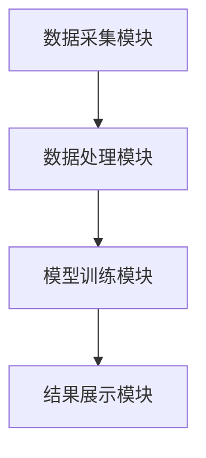

                 


# 《构建智能企业市场调研系统：AI辅助数据分析》

---

## 关键词：AI，数据分析，市场调研，机器学习，数据可视化，系统架构

---

## 摘要：  
本文详细探讨了如何利用人工智能技术构建智能企业市场调研系统，通过AI辅助数据分析，帮助企业高效、精准地进行市场调研。文章从传统市场调研的局限性入手，分析了AI技术在市场调研中的应用价值，并详细阐述了系统的设计与实现过程，包括数据预处理、特征提取、模型训练、结果可视化等关键步骤。通过实际案例和系统架构设计，展示了AI辅助数据分析在企业市场调研中的巨大潜力和实际应用价值。

---

# 第1章: 企业市场调研的现状与挑战

## 1.1 传统市场调研方法的局限性  
传统的市场调研方法主要依赖人工数据收集和分析，存在以下问题：  
1. **数据收集效率低**：手动收集数据耗时耗力，且容易遗漏重要信息。  
2. **数据分析复杂**：人工分析需要大量时间，且容易受到主观因素影响。  
3. **结果准确性差**：由于人为因素干扰，调研结果可能存在偏差。  

## 1.2 AI技术在市场调研中的应用价值  
人工智能技术的引入，为市场调研带来了革命性的变化：  
1. **提高数据处理效率**：AI能够快速处理海量数据，减少人工干预。  
2. **增强数据分析能力**：通过机器学习算法，AI能够发现数据中的隐含规律。  
3. **提升结果准确性**：AI通过数学模型确保分析结果的客观性和准确性。  

## 1.3 企业市场调研系统的目标与意义  
智能企业市场调研系统的建设目标是：  
1. 提高市场调研的效率和准确性。  
2. 为企业决策提供数据支持。  
3. 降低市场调研成本。  
通过构建智能市场调研系统，企业能够更快地洞察市场趋势，抓住商机，提升竞争力。  

---

# 第2章: AI辅助数据分析的核心概念

## 2.1 数据预处理与特征提取  
数据预处理是AI辅助分析的基础，主要包括以下步骤：  
1. **数据清洗**：去除噪声数据和重复数据。  
2. **数据标准化与归一化**：统一数据格式，便于模型训练。  
3. **特征选择与降维**：提取关键特征，减少计算复杂度。  

### 2.1.1 数据清洗示例  
假设我们收集了以下数据：  
| ID | Age | Income | Purchase Intent |  
|----|-----|--------|----------------|  
| 1  | 25  | 3000   | 低             |  
| 2  | 30  | 4000   | 高             |  
| 3  | 22  | 2500   | 中             |  
| 4  | 22  | 2500   | 中             |  

清洗后，数据变为：  
| ID | Age | Income | Purchase Intent |  
|----|-----|--------|----------------|  
| 1  | 25  | 3000   | 低             |  
| 2  | 30  | 4000   | 高             |  
| 3  | 22  | 2500   | 中             |  

---

## 2.2 AI算法在数据分析中的应用  
AI算法在数据分析中的应用主要集中在以下方面：  
1. **监督学习**：用于分类和回归问题，如客户 churn 预测。  
2. **无监督学习**：用于聚类和关联规则挖掘，如客户群体划分。  
3. **深度学习**：用于复杂模式识别，如自然语言处理。  

### 2.2.1 逻辑回归算法  
逻辑回归是一种常用的分类算法，其数学模型如下：  
$$ P(y=1|x) = \frac{1}{1 + e^{-(\beta_0 + \beta_1 x)}} $$  

---

## 2.3 数据可视化与结果解读  
数据可视化是将分析结果直观呈现的重要手段，常用工具包括：  
1. **Matplotlib**：Python中的绘图库，适合复杂数据可视化。  
2. **Seaborn**：基于Matplotlib的高级绘图库，适合统计分析。  
3. **Tableau**：专业的数据可视化工具，适合企业级分析。  

---

# 第3章: 智能企业市场调研系统的架构设计

## 3.1 系统功能模块划分  
智能市场调研系统主要包括以下功能模块：  
1. **数据采集模块**：负责数据的采集与存储。  
2. **数据处理模块**：进行数据清洗和特征提取。  
3. **模型训练模块**：基于机器学习算法进行模型训练。  
4. **结果展示模块**：将分析结果以可视化形式呈现。  

## 3.2 系统架构设计  
系统采用分层架构，各模块之间的交互关系如下：  


---

# 第4章: 系统实现与项目实战

## 4.1 环境安装与配置  
首先，需要安装以下工具：  
1. **Python**：建议使用Python 3.8及以上版本。  
2. **Jupyter Notebook**：用于代码编写与调试。  
3. **Scikit-learn**：机器学习库。  
4. **Matplotlib**：数据可视化库。  

## 4.2 数据加载与预处理  
以客户购买意图分析为例，数据如下：  
```python
import pandas as pd
data = pd.read_csv('market_survey.csv')
print(data.head())
```

---

## 4.3 模型训练与结果分析  
使用逻辑回归模型进行客户购买意图分类：  
```python
from sklearn.model_selection import train_test_split
from sklearn.linear_model import LogisticRegression
from sklearn.metrics import accuracy_score

# 数据分割
X = data[['Age', 'Income']]
y = data['Purchase Intent']
X_train, X_test, y_train, y_test = train_test_split(X, y, test_size=0.2)

# 模型训练
model = LogisticRegression()
model.fit(X_train, y_train)

# 模型预测
y_pred = model.predict(X_test)

# 模型评估
print("Accuracy:", accuracy_score(y_test, y_pred))
```

---

## 4.4 数据可视化与结果展示  
使用Matplotlib绘制分类结果：  
```python
import matplotlib.pyplot as plt

plt.scatter(X_test['Age'], X_test['Income'], c=y_pred, cmap='viridis')
plt.xlabel('Age')
plt.ylabel('Income')
plt.title('Customer Purchase Intent Classification')
plt.show()
```

---

# 第5章: 总结与展望

## 5.1 系统特点与优势  
智能市场调研系统具有以下特点：  
1. **智能化**：AI技术自动处理数据，减少人工干预。  
2. **高效性**：快速分析海量数据，提高调研效率。  
3. **准确性**：基于数学模型，确保分析结果客观准确。  
4. **可视化**：直观呈现分析结果，便于决策者理解。  

## 5.2 未来发展方向  
1. **模型优化**：引入更复杂的深度学习模型，提高分析精度。  
2. **实时分析**：构建实时数据流处理系统，实现动态市场分析。  
3. **多模态数据**：结合文本、图像等多种数据源，提升分析维度。  
4. **行业定制化**：针对不同行业需求，开发定制化解决方案。  

## 5.3 实践中的注意事项  
1. 数据质量是关键，需确保数据的完整性和准确性。  
2. 模型调优需要结合业务场景，避免过度拟合。  
3. 结果解读需结合业务背景，避免误读分析结果。  

---

# 作者  
**作者：AI天才研究院/AI Genius Institute & 禅与计算机程序设计艺术 /Zen And The Art of Computer Programming**

---

