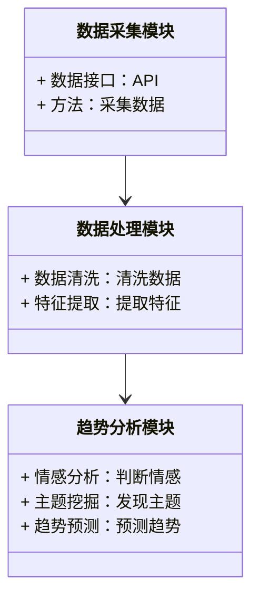
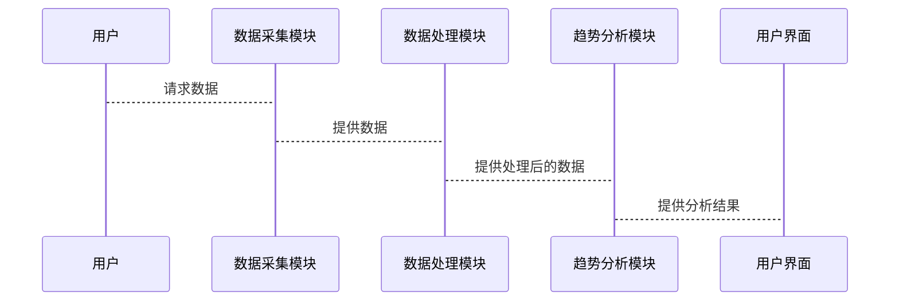

                 


# 构建智能企业市场调研系统：社交媒体聆听与趋势分析

## 关键词：市场调研，社交媒体聆听，趋势分析，自然语言处理，数据挖掘，系统架构设计

## 摘要：  
随着社交媒体的广泛应用，企业能够通过收集和分析社交媒体上的海量数据来了解市场动态、消费者需求和行业趋势。本文将详细探讨如何构建一个智能企业市场调研系统，利用自然语言处理和数据挖掘技术，从社交媒体数据中提取有价值的信息，进行趋势分析，并为企业决策提供支持。本文将从系统背景、核心概念、算法原理、系统架构设计、项目实战等多个方面展开，深入分析智能市场调研系统的构建过程。

---

## 第一部分: 背景与核心概念

### 第1章: 市场调研的背景与重要性

#### 1.1 市场调研的核心概念
- 市场调研的定义：通过收集、整理和分析与市场相关的数据，为企业决策提供支持的过程。
- 数据来源：包括社交媒体数据、问卷调查、行业报告等。
- 市场调研的目标：帮助企业了解市场趋势、竞争对手、消费者需求等。

#### 1.2 传统市场调研的局限性
- 数据来源单一：传统市场调研主要依赖问卷调查和行业报告，数据量有限。
- 数据处理复杂：数据清洗和分析需要大量人工干预，效率低下。
- 实时性不足：传统方法难以快速响应市场变化。

#### 1.3 智能化市场调研的优势
- 数据来源广泛：利用社交媒体数据，获取海量实时信息。
- 自动化处理：通过自然语言处理和数据挖掘技术，实现数据的自动清洗和分析。
- 高效实时：能够快速捕捉市场变化，提供实时趋势分析。

### 第2章: 社交媒体聆听的背景

#### 2.1 社交媒体数据的特性
- 文本数据：社交媒体上的评论、帖子等文本信息。
- 用户行为数据：用户的点赞、评论、分享等行为数据。
- 数据量大：社交媒体数据呈指数级增长，具有海量特性。

#### 2.2 社交媒体在市场调研中的作用
- 消费者情绪分析：通过分析社交媒体上的用户评论，了解消费者对产品的看法和情感。
- 竞争对手分析：通过分析竞争对手的社交媒体数据，了解其市场策略和用户反馈。
- 市场趋势预测：通过分析社交媒体上的热门话题和关键词，预测市场趋势。

#### 2.3 数据量与实时性的挑战
- 数据量大：社交媒体数据的海量特性要求系统具备高效的处理能力。
- 实时性要求高：企业需要实时获取市场动态，对系统的响应速度提出更高要求。

### 第3章: 趋势分析的必要性

#### 3.1 趋势分析的基本概念
- 趋势分析的定义：通过对历史数据的分析，预测未来的发展方向。
- 数据驱动的决策：基于数据分析结果，制定科学的市场策略。
- 趋势分析的应用场景：市场预测、产品开发、营销策略等。

#### 3.2 数据驱动的决策优势
- 数据的客观性：通过数据分析，避免主观判断带来的偏差。
- 高效性：数据驱动的决策能够快速响应市场变化。
- 精准性：通过数据分析，提高决策的准确性。

#### 3.3 趋势分析的实现路径
- 数据采集：从社交媒体等渠道获取数据。
- 数据清洗：对数据进行预处理，去除噪音数据。
- 数据分析：利用数据挖掘和机器学习技术，提取有价值的信息。
- 趋势预测：基于分析结果，预测未来市场趋势。

### 第4章: 智能企业市场调研系统的核心概念

#### 4.1 社交媒体数据的分类与特征
- 文本数据：社交媒体上的评论、帖子等文本信息。
- 用户行为数据：用户的点赞、评论、分享等行为数据。
- 数据特征：文本数据的情感倾向、关键词提取等。

#### 4.2 市场调研需求的层次化分析
- 需求层次化：根据企业需求的不同层次，进行分类和分析。
- 需求分析：通过数据分析，了解消费者需求的深层次特征。
- 需求与数据的对应关系：明确不同层次的需求对应的数据类型和分析方法。

#### 4.3 系统功能模块的核心要素
- 数据采集模块：负责从社交媒体获取数据。
- 数据处理模块：对数据进行清洗、转换和存储。
- 趋势分析模块：利用算法进行趋势预测和分析。

## 第5章: 系统架构与核心功能

### 5.1 系统架构的组成
- 数据源：社交媒体平台、企业内部数据等。
- 数据处理模块：负责数据清洗、转换和存储。
- 趋势分析模块：利用算法进行趋势预测和分析。
- 用户界面：供用户查看分析结果和操作系统。

### 5.2 核心功能模块的设计
- 数据采集模块：实现数据的实时采集和存储。
- 数据预处理模块：对数据进行清洗、分词和特征提取。
- 趋势预测模块：利用机器学习算法，进行趋势预测。

### 5.3 系统功能模块的交互设计
- 用户界面设计：用户友好的界面，方便操作和查看结果。
- 功能模块的交互流程：数据采集、处理、分析和展示的流程设计。
- 系统功能的扩展性：系统具备良好的扩展性，方便后续功能的添加和优化。

---

## 第二部分: 算法原理与实现

### 第6章: 数据预处理与特征提取

#### 6.1 数据清洗的原理
- 数据清洗的目标：去除噪音数据，提高数据质量。
- 常用的数据清洗方法：去重、填充缺失值、去除异常值等。
- 数据清洗的步骤：数据收集、数据检查、数据转换、数据存储。

#### 6.2 数据分词与特征提取
- 数据分词：对文本数据进行分词处理，提取关键词。
- 特征提取：通过TF-IDF等方法，提取文本数据的特征向量。

### 第7章: 情感分析算法原理与实现

#### 7.1 情感分析的定义
- 情感分析：通过分析文本数据，判断其情感倾向（正面、负面、中性）。

#### 7.2 基于机器学习的情感分析算法
- 算法原理：利用机器学习算法（如SVM、随机森林）进行情感分类。
- 数据预处理：文本分词、去除停用词、特征提取。
- 模型训练：使用训练数据训练情感分类模型。
- 模型预测：对新的文本数据进行情感分类。

#### 7.3 情感分析算法的实现步骤
1. 数据收集：从社交媒体获取评论数据。
2. 数据清洗：去除噪音数据，提取有效评论。
3. 文本分词：对评论进行分词处理，提取关键词。
4. 特征提取：使用TF-IDF等方法，提取文本特征。
5. 模型训练：使用训练数据训练情感分类模型。
6. 模型预测：对新的评论进行情感分类。

### 第8章: 主题挖掘算法原理与实现

#### 8.1 主题挖掘的定义
- 主题挖掘：通过对文本数据进行聚类，发现隐藏的主题或主题分布。

#### 8.2 基于LDA的主题挖掘算法
- LDA（Latent Dirichlet Allocation）：一种常用的主题建模算法。
- 算法原理：通过概率模型，发现文本数据的主题分布。
- 算法步骤：数据预处理、主题建模、主题识别。

### 第9章: 趋势预测算法原理与实现

#### 9.1 趋势预测的定义
- 趋势预测：通过对历史数据的分析，预测未来的发展趋势。

#### 9.2 基于ARIMA的时序预测算法
- ARIMA（Autoregressive Integrated Moving Average）：一种常用的时序预测算法。
- 算法原理：通过模型参数的估计，预测未来的时间序列值。
- 算法步骤：数据预处理、模型选择、参数估计、模型验证、未来预测。

---

## 第三部分: 系统架构与设计

### 第10章: 系统功能设计

#### 10.1 系统功能模块的设计
- 数据采集模块：负责从社交媒体获取数据。
- 数据处理模块：对数据进行清洗、转换和存储。
- 趋势分析模块：利用算法进行趋势预测和分析。
- 用户界面：供用户查看分析结果和操作系统。

#### 10.2 领域模型类图


#### 10.3 系统架构图


#### 10.4 接口设计
- 数据采集接口：定义数据接口的格式和调用方式。
- 数据处理接口：定义数据清洗和特征提取的接口。
- 趋势分析接口：定义情感分析、主题挖掘和趋势预测的接口。

#### 10.5 系统交互流程


---

## 第四部分: 项目实战

### 第11章: 环境安装与配置

#### 11.1 环境要求
- 操作系统：Windows、Linux或macOS。
- Python版本：建议使用Python 3.8以上。
- 依赖库：自然语言处理库（如jieba、nltk）、数据处理库（pandas、numpy）、机器学习库（scikit-learn、xgboost）、可视化库（matplotlib、seaborn）。

#### 11.2 环境配置步骤
1. 安装Python。
2. 安装所需的依赖库。
3. 配置开发环境（如PyCharm、VS Code）。

### 第12章: 核心代码实现

#### 12.1 数据采集模块的实现
```python
import requests

def fetch_data(api_url, params):
    response = requests.get(api_url, params=params)
    return response.json()

# 示例调用
data = fetch_data('https://api.socialmedia.com/data', {'query': 'product'})
```

#### 12.2 数据处理模块的实现
```python
from sklearn.feature_extraction.text import TfidfVectorizer

def preprocess_text(text):
    vectorizer = TfidfVectorizer()
    X = vectorizer.fit_transform([text])
    return X

# 示例调用
text = "This is a sample text."
tfidf_matrix = preprocess_text(text)
```

#### 12.3 趋势预测模块的实现
```python
from statsmodels.tsa.arima_model import ARIMA

def predict_trend(data, order):
    model = ARIMA(data, order=order)
    model_fit = model.fit(disp=0)
    forecast = model_fit.forecast(steps=1)
    return forecast[0]

# 示例调用
data = [1, 2, 3, 4, 5]
order = (1, 1, 0)
prediction = predict_trend(data, order)
print(prediction)
```

### 第13章: 项目总结与优化

#### 13.1 项目总结
- 项目目标：构建一个智能企业市场调研系统，实现社交媒体数据的采集、处理和趋势分析。
- 实现功能：数据采集、数据处理、情感分析、主题挖掘、趋势预测。
- 项目成果：系统能够帮助企业快速获取市场动态，支持决策。

#### 13.2 项目优化方向
- 数据采集效率：优化数据采集模块，提高数据采集速度。
- 数据分析效率：优化算法，提高数据分析速度和准确性。
- 系统扩展性：增加更多的功能模块，如竞争对手分析、客户细分等。

---

## 第五部分: 总结与展望

### 第14章: 总结

#### 14.1 项目回顾
- 项目背景：社交媒体数据的广泛应用，企业对市场调研的需求增加。
- 项目目标：构建智能企业市场调研系统，实现社交媒体数据的采集、处理和趋势分析。
- 项目成果：系统能够帮助企业快速获取市场动态，支持决策。

### 第15章: 未来展望

#### 15.1 未来研究方向
- 更高效的数据处理方法：研究更高效的数据处理算法，提高数据分析速度。
- 更智能的分析模型：研究更智能的分析模型，提高分析结果的准确性。
- 更广泛的应用场景：探索更多的应用场景，如客户细分、精准营销等。

---

## 作者：AI天才研究院/AI Genius Institute & 禅与计算机程序设计艺术 /Zen And The Art of Computer Programming

---

以上是《构建智能企业市场调研系统：社交媒体聆听与趋势分析》的技术博客文章的详细目录大纲和部分章节内容。如需进一步扩展或调整，请随时告知！

