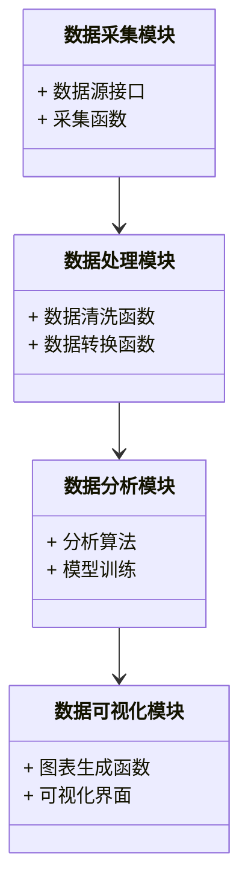

                 


# 构建智能企业市场调研系统：自动化数据收集与分析

## 关键词：市场调研系统、自动化数据收集、智能化分析、AI驱动、数据挖掘

## 摘要：本文将详细探讨如何构建一个智能企业市场调研系统，重点介绍自动化数据收集与分析的核心技术与实现方法。通过系统化的分析和实际案例，我们将揭示如何利用人工智能和大数据技术，实现市场调研的高效与精准，为企业决策提供有力支持。

---

# 第1章: 背景介绍与问题分析

## 1.1 问题背景

### 1.1.1 传统市场调研的痛点
传统的市场调研依赖于人工数据收集和分析，存在效率低、成本高、准确性差的问题。企业需要从多种数据源（如问卷调查、社交媒体、行业报告等）收集数据，但数据清洗和整理的过程耗时且容易出错。此外，人工分析数据的主观性和经验依赖性较强，难以保证结果的客观性和一致性。

### 1.1.2 数据收集与分析的效率瓶颈
在当今快速变化的市场环境中，企业需要实时获取最新的市场信息，但传统方法无法满足快速响应的需求。数据量的爆炸性增长也让人工分析变得越来越不可行。

### 1.1.3 企业市场调研的智能化需求
随着人工智能和大数据技术的快速发展，企业对市场调研的智能化需求日益迫切。通过自动化数据收集和智能化分析，企业可以更快地获取洞察，支持决策。

## 1.2 问题描述

### 1.2.1 数据来源的多样性与复杂性
市场调研需要从多种数据源获取信息，包括社交媒体、行业报告、竞争对手分析等。不同数据源的格式和结构差异大，增加了数据整合的难度。

### 1.2.2 数据质量与准确性的挑战
数据可能存在噪声、缺失值或不一致性，如何确保数据质量是市场调研系统的关键挑战。

### 1.2.3 人工分析的局限性与成本问题
人工分析不仅效率低，还容易受到主观因素的影响。此外，高昂的人力成本也限制了企业进行大规模市场调研的能力。

## 1.3 问题解决：智能市场调研系统

### 1.3.1 自动化数据收集的核心价值
通过自动化技术，系统可以实时从多个数据源收集数据，减少人工干预，提高效率。

### 1.3.2 数据分析的智能化优势
利用机器学习和自然语言处理技术，系统可以自动识别数据中的模式和趋势，提供更精准的分析结果。

### 1.3.3 系统化解决方案的构建思路
构建一个智能市场调研系统需要整合数据收集、数据清洗、数据分析和结果可视化等多个模块，形成一个系统化的解决方案。

## 1.4 系统的边界与外延

### 1.4.1 系统功能的边界划分
系统的核心功能包括数据收集、清洗、分析和可视化，但不包括数据源的生成和外部系统的集成。

### 1.4.2 与其他系统的接口关系
系统需要与数据源（如API接口）、企业内部数据库以及用户界面进行交互。

### 1.4.3 系统的可扩展性与灵活性
系统设计应具有良好的扩展性，能够根据需求添加新的数据源或分析算法。

## 1.5 核心概念与系统架构

### 1.5.1 系统组成模块的结构
智能市场调研系统由数据采集模块、数据处理模块、数据分析模块和结果展示模块组成。

### 1.5.2 核心功能模块的交互关系
数据从采集模块进入系统，经过清洗和预处理后，进入分析模块，最后通过可视化模块呈现给用户。

### 1.5.3 系统的核心要素与组成
系统的核心要素包括数据源、数据存储、分析算法和用户界面。

## 1.6 本章小结

---

# 第2章: 市场调研系统的核心概念

## 2.1 数据收集模块

### 2.1.1 数据源的分类与特点
数据源可以分为结构化数据（如数据库）和非结构化数据（如文本、图像）。每种数据源都有其特点和采集方式。

### 2.1.2 数据采集的实现方式
常用的采集方式包括API调用、网络爬取和数据库连接。每种方式都有其优缺点。

### 2.1.3 数据预处理的关键步骤
数据预处理包括数据清洗、去重和格式转换。这些步骤是确保数据质量的重要环节。

## 2.2 数据分析模块

### 2.2.1 数据分析的算法选择
根据具体需求选择合适的算法，如文本挖掘中的TF-IDF和聚类分析中的K-means。

### 2.2.2 数据挖掘的核心方法
数据挖掘方法包括分类、回归和聚类。选择合适的方法可以提高分析的准确性。

### 2.2.3 数据可视化的基本原理
数据可视化是通过图表将数据结果呈现给用户，帮助用户更好地理解数据。

## 2.3 系统功能模块对比表

| 功能模块 | 核心功能 | 输入 | 输出 | 备注 |
|----------|----------|------|------|------|
| 数据采集 | 收集数据 | 数据源 | 数据 | 多源采集 |
| 数据处理 | 清洗数据 | 数据 | 数据 | 数据预处理 |
| 数据分析 | 分析数据 | 数据 | 分析结果 | 算法驱动 |
| 可视化展示 | 展示结果 | 分析结果 | 图表 | 用户交互 |

## 2.4 系统实体关系图


---

# 第3章: 数据分析算法原理

## 3.1 文本挖掘算法

### 3.1.1 TF-IDF算法

TF-IDF是一种常用的文本挖掘算法，用于计算关键词的重要性。其公式为：

$$ TF-IDF = TF \times (1 + \log IDF) $$

其中，TF是关键词在文本中的频率，IDF是关键词的逆向文件频率。

### 3.1.2 TF-IDF实现的Python代码示例

```python
from sklearn.feature_extraction.text import TfidfVectorizer

# 示例文本
text = ["The cat sits on the mat.", "The cat likes milk."]

# 创建TF-IDF对象
vectorizer = TfidfVectorizer()
tfidf = vectorizer.fit_transform(text)

# 打印TF-IDF矩阵
print(tfidf.toarray())
```

## 3.2 机器学习模型

### 3.2.1 线性回归模型

线性回归是一种常用的回归分析方法，其数学模型为：

$$ y = \beta_0 + \beta_1 x + \epsilon $$

其中，$\beta_0$和$\beta_1$是模型参数，$\epsilon$是误差项。

### 3.2.2 线性回归实现的Python代码示例

```python
import numpy as np
from sklearn.linear_model import LinearRegression

# 示例数据
X = np.array([[1, 2], [3, 4], [5, 6]])
y = np.array([7, 8, 9])

# 创建线性回归模型
model = LinearRegression()
model.fit(X, y)

# 预测结果
print(model.predict([[7, 8]]))
```

## 3.3 算法流程图


---

# 第4章: 系统架构设计

## 4.1 系统功能设计

### 4.1.1 领域模型



## 4.2 系统架构设计

### 4.2.1 系统架构图


## 4.3 系统接口设计

### 4.3.1 数据采集模块接口

```python
# 示例接口
class DataCollector:
    def collect_data(self, source):
        pass
```

### 4.3.2 数据分析模块接口

```python
# 示例接口
class Analyzer:
    def analyze(self, data):
        pass
```

## 4.4 系统交互序列图

```mermaid
graph LR
    A[用户] --> B[数据采集模块]: 请求数据
    B --> C[数据存储模块]: 存储数据
    C --> D[数据分析模块]: 请求分析
    D --> E[数据可视化模块]: 请求可视化
    E --> A: 展示结果
```

---

# 第5章: 项目实战

## 5.1 环境安装

### 5.1.1 安装Python和必要的库
安装Python和以下库：
- `pandas`
- `numpy`
- `scikit-learn`
- `matplotlib`

### 5.1.2 安装步骤示例

```bash
pip install pandas numpy scikit-learn matplotlib
```

## 5.2 系统核心代码实现

### 5.2.1 数据采集模块

```python
import requests

def fetch_data(url):
    response = requests.get(url)
    return response.json()
```

### 5.2.2 数据处理模块

```python
import pandas as pd

def preprocess_data(data):
    df = pd.DataFrame(data)
    df.dropna(inplace=True)
    return df
```

### 5.2.3 数据分析模块

```python
from sklearn.feature_extraction.text import TfidfVectorizer

def analyze_text(texts):
    vectorizer = TfidfVectorizer()
    tfidf = vectorizer.fit_transform(texts)
    return tfidf.toarray()
```

## 5.3 案例分析

### 5.3.1 数据来源与处理
假设我们从社交媒体获取用户评论，经过清洗和预处理后，使用TF-IDF算法进行关键词提取。

### 5.3.2 分析结果与可视化
将TF-IDF结果可视化为柱状图，展示关键词的重要性。

## 5.4 项目小结

---

# 第6章: 总结与展望

## 6.1 总结
本文详细介绍了智能企业市场调研系统的核心概念、算法原理和系统架构设计，并通过实际案例展示了系统的实现过程。

## 6.2 展望
未来，随着人工智能和大数据技术的进一步发展，智能市场调研系统将更加智能化和自动化，为企业决策提供更强大的支持。

---

# 附录

## 附录A: 数据格式与接口规范

### 附录A.1 数据格式
- 数据采集模块：JSON格式
- 数据存储模块：CSV或数据库

### 附录A.2 接口文档
- 数据采集模块接口：`/api/data`
- 数据分析模块接口：`/api/analyze`

---

作者：AI天才研究院/AI Genius Institute & 禅与计算机程序设计艺术 /Zen And The Art of Computer Programming

