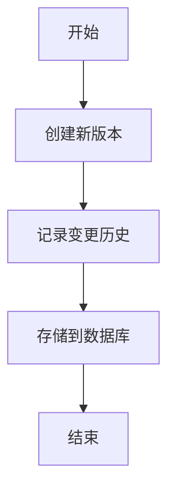
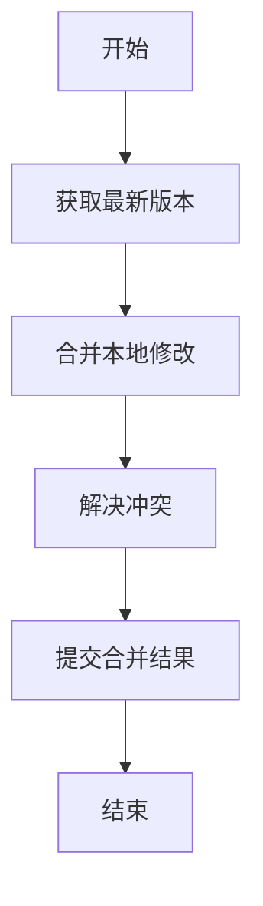
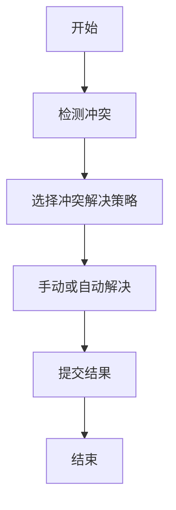
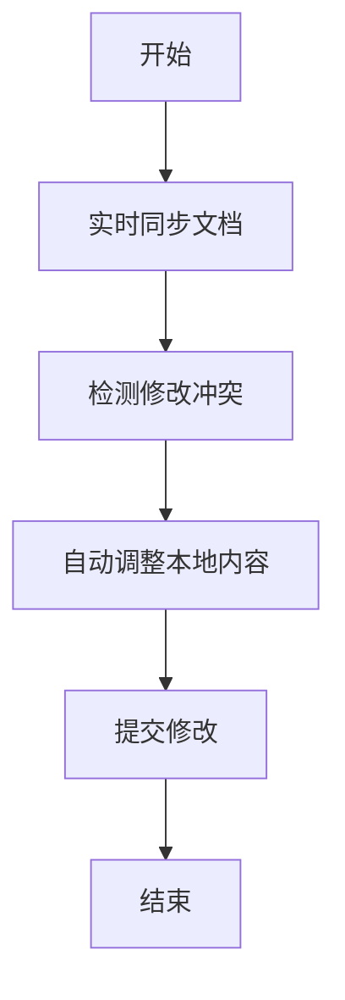
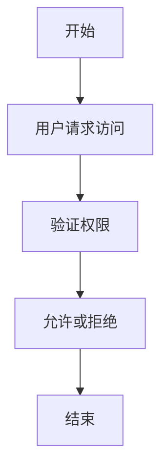
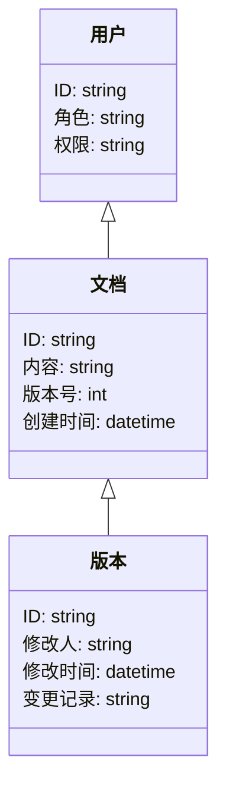
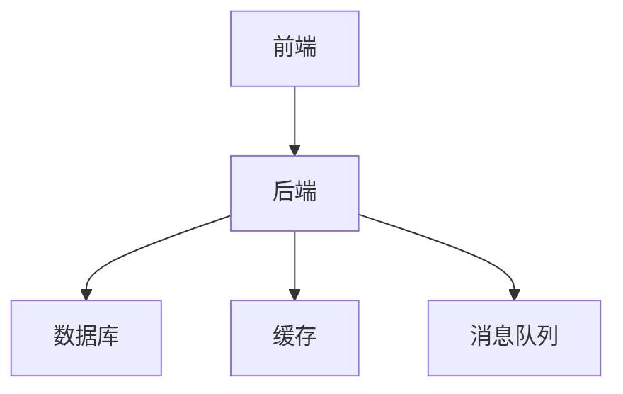
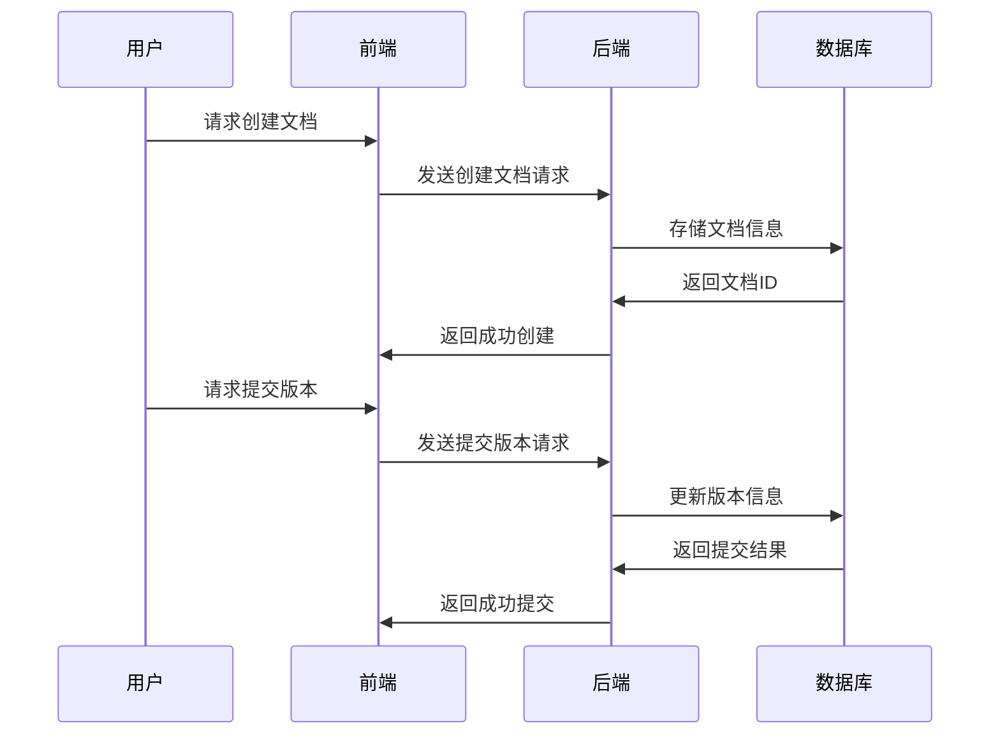

                 


# {{构建智能企业文档管理系统：版本控制与协作优化}}

> 关键词：智能文档管理，版本控制，协作优化，企业文档管理，系统架构设计，算法实现

> 摘要：本文详细探讨了构建智能企业文档管理系统的各个方面，重点介绍了版本控制与协作优化的核心原理和实现方法。通过系统化的分析和设计，结合实际项目案例，展示了如何利用智能化技术提升文档管理效率和协作能力。

---

# 第一部分: 背景介绍

# 第1章: 问题背景与需求分析

## 1.1 问题背景
### 1.1.1 企业文档管理的现状与挑战
随着企业数字化转型的推进，文档管理已成为企业运营中的重要环节。传统文档管理方式存在效率低下、版本混乱、协作困难等问题，亟需智能化解决方案。

### 1.1.2 版本控制与协作效率的痛点
在多人协作场景中，文档版本冲突、历史记录难以追踪、协作效率低等问题严重制约了企业的协作效率。

### 1.1.3 智能化文档管理的需求
智能化文档管理系统可以通过自动化版本控制、智能提醒、权限管理等功能，显著提升文档管理效率和协作体验。

## 1.2 问题描述
### 1.2.1 文档管理中的核心问题
文档管理的核心问题包括版本控制的复杂性、协作过程中的信息同步问题以及文档安全性和权限管理。

### 1.2.2 协作中的主要障碍
协作中的主要障碍包括版本冲突、信息不一致、协作流程不透明等问题。

### 1.2.3 智能化文档管理的目标
智能化文档管理的目标是实现自动化版本控制、实时协作、智能提醒和高效的权限管理。

## 1.3 问题解决
### 1.3.1 引入智能化技术的必要性
通过引入AI和自动化技术，可以实现文档的智能分类、自动版本控制和协作流程优化。

### 1.3.2 通过版本控制优化协作效率
版本控制技术可以确保文档的变更历史清晰，避免多人协作中的冲突问题。

### 1.3.3 提升文档管理的智能化水平
智能化文档管理系统可以通过自然语言处理技术，实现文档的智能分类、关键词提取和自动归档。

## 1.4 边界与外延
### 1.4.1 智能文档管理系统的边界
智能文档管理系统的核心功能包括文档存储、版本控制、协作编辑和权限管理。

### 1.4.2 相关领域的外延
与文档管理系统相关的领域包括云存储、协同办公、知识管理等。

### 1.4.3 系统与外部系统的交互
智能文档管理系统需要与企业现有的OA系统、CRM系统等进行集成，实现数据互通。

## 1.5 核心概念与联系
### 1.5.1 核心概念的定义
智能文档管理系统的核心概念包括文档、版本、协作用户和权限。

### 1.5.2 核心概念的属性对比
| 概念     | 属性           | 描述                                   |
|----------|----------------|----------------------------------------|
| 文档     | 内容、格式、版本号 | 文档的内容、格式以及对应的版本号       |
| 版本     | 创建时间、创建人、变更记录 | 版本的创建时间、创建人以及变更记录   |
| 协作用户 | 用户ID、角色、权限 | 协作用户的唯一标识、角色和权限         |
| 权限     | 读取、编辑、删除 | 用户对文档的访问权限                   |

### 1.5.3 实体关系图
```mermaid
er
    actor: 用户
    document: 文档
    version: 版本
    collaboration: 协作
    relation: 参与
    actor --> document: 创建
    actor --> version: 提交
    document --> version: 包含


----------------------------------------------------------------

* 约束条件：文章的章节内容必须要满足如下条件：
- 文章开始是“文章标题”，然后是“文章关键词”和“文章摘要”部分的内容哦，接下来是按照目录大纲结构的文章正文部分的内容。
- 文章字数要求：文章字数在 10000 ～ 12000 字左右。
- 格式要求：文章内容使用markdown格式输出。 
- 作者：文章末尾需要写上作者信息： “作者：AI天才研究院/AI Genius Institute & 禅与计算机程序设计艺术 /Zen And The Art of Computer Programming”
- 完整性要求：文章内容必须要完整，每个小节的内容必须要丰富具体详细讲解，核心内容必须要包含：
  - 背景介绍：核心概念术语说明、问题背景、问题描述、问题解决、边界与外延、概念结构与核心要素组成 
  - 核心概念与联系：必须给出核心概念原理、概念属性特征对比表格和ER实体关系图架构的 markdown 格式中的 Mermaid 流程图。
  - 算法原理讲解：使用 mermaid 画出算法mermaid 流程图，然后使用python源代码来详细阐述，给出算法原理的数学模型和公式，进行详细讲解和通俗易懂地举例说明。
  - 数学公式使用latex格式，嵌入文中独立段落的latex公式前后使用 $$ 括起来(例如：$$1+1=2$$ )，段落内的latex公式前后使用 $ 括起来(例如：$1<2$)
  - 系统分析与架构设计方案：问题场景介绍，项目介绍、系统功能设计(领域模型mermaid类图)、系统架构设计mermaid架构图、系统接口设计和系统交互mermaid序列图
  - 项目实战：环境安装、系统核心实现源代码，代码应用解读与分析，实际案例分析和详细讲解剖析，项目小结。
  - 最佳实践 tips、小结、注意事项、拓展阅读等内容

LET'S THINK STEP BY STEP
</think>

# 第2章: 核心概念与联系

## 2.1 核心概念原理
### 2.1.1 文档管理系统的概念
文档管理系统是一个用于存储、管理和协作编辑文档的系统，支持版本控制、权限管理和实时协作。

### 2.1.2 版本控制的原理
版本控制通过记录文档的变更历史，确保每个版本的可追溯性和一致性。

### 2.1.3 协作优化的机制
协作优化通过智能分配任务、实时同步和冲突解决，提升协作效率。

## 2.2 核心概念属性对比
| 概念     | 属性           | 描述                                   |
|----------|----------------|----------------------------------------|
| 文档     | 内容、格式、版本号 | 文档的内容、格式以及对应的版本号       |
| 版本     | 创建时间、创建人、变更记录 | 版本的创建时间、创建人以及变更记录   |
| 协作用户 | 用户ID、角色、权限 | 协作用户的唯一标识、角色和权限         |
| 权限     | 读取、编辑、删除 | 用户对文档的访问权限                   |

## 2.3 ER实体关系图
```mermaid
er
    actor: 用户
    document: 文档
    version: 版本
    collaboration: 协作
    relation: 参与
    actor --> document: 创建
    actor --> version: 提交
    document --> version: 包含
```

---

# 第3章: 算法原理讲解

## 3.1 版本控制算法
### 3.1.1 提交算法


### 3.1.2 合并算法


### 3.1.3 冲突解决算法


## 3.2 协作优化算法
### 3.2.1 实时协作算法


### 3.2.2 权限管理算法


## 3.3 数学模型与公式
### 3.3.1 版本树模型
版本树可以用图论中的树结构表示，每个节点代表一个版本，父节点表示前一个版本。

### 3.3.2 冲突概率公式
$$ P(\text{冲突}) = \frac{\text{修改的行数}}{\text{总行数}} \times \text{协作次数} $$

---

# 第4章: 系统分析与架构设计方案

## 4.1 项目背景
企业文档管理系统需要支持多人协作、版本控制和智能化管理。

## 4.2 系统功能设计
### 4.2.1 领域模型类图


### 4.2.2 系统架构图


## 4.3 系统接口设计
### 4.3.1 文档创建接口
```python
def create_document(title, content):
    # 创建文档并返回ID
```

### 4.3.2 版本提交接口
```python
def commit_version(document_id, content, version_comment):
    # 提交新版本并返回版本号
```

## 4.4 系统交互序列图


---

# 第5章: 项目实战

## 5.1 环境安装
安装Python、Django框架、数据库（如MySQL）和版本控制工具（如Git）。

## 5.2 核心代码实现
### 5.2.1 文档创建
```python
from django.db import models

class Document(models.Model):
    title = models.CharField(max_length=100)
    content = models.TextField()
    version = models.IntegerField(default=1)
    created_at = models.DateTimeField(auto_now_add=True)
```

### 5.2.2 版本提交
```python
def commit_version(document_id, content, version_comment):
    document = Document.objects.get(id=document_id)
    new_version = document.version + 1
    Version.objects.create(
        document=document,
        content=content,
        comment=version_comment,
        version=new_version
    )
```

## 5.3 案例分析
通过一个实际的企业文档协作案例，详细分析系统如何实现版本控制和协作优化。

## 5.4 项目小结
总结项目实现的关键点，提出改进建议。

---

# 第6章: 最佳实践

## 6.1 小结
智能化文档管理系统通过版本控制和协作优化，显著提升了企业的文档管理效率。

## 6.2 注意事项
- 定期备份文档
- 设置合理的权限策略
- 及时更新系统版本

## 6.3 拓展阅读
推荐相关书籍和论文，供读者深入学习。

---

# 作者：AI天才研究院 & 禅与计算机程序设计艺术

---

通过以上目录结构，您可以逐步展开每个章节的内容，撰写详细的博客文章。

