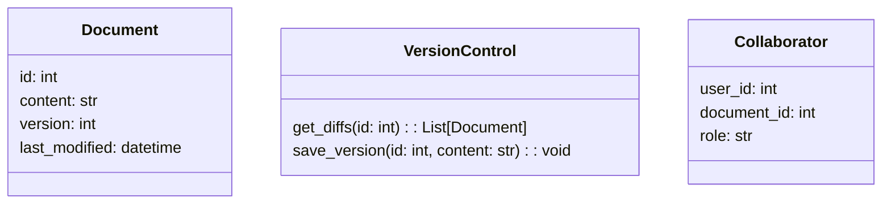
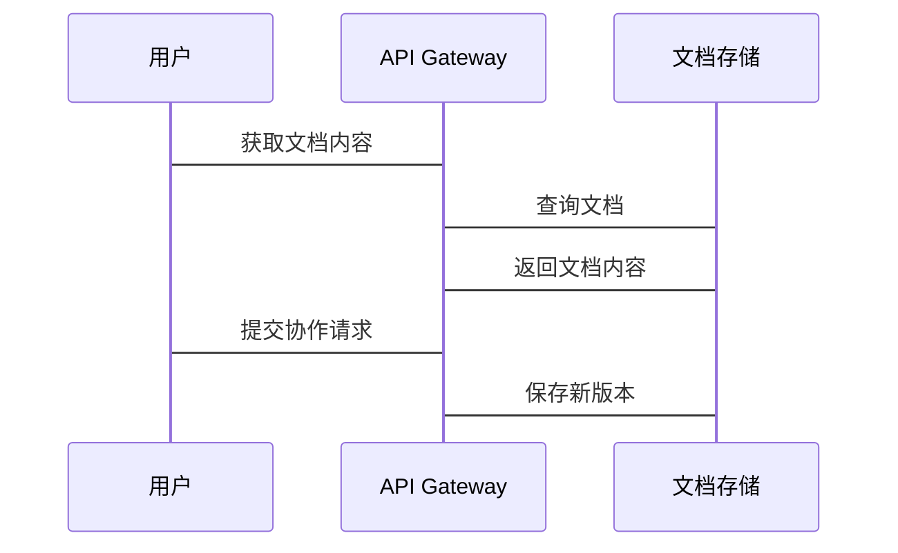

                 


# 构建智能企业文档管理系统：版本控制与协作优化的AI增强

## 关键词：
企业文档管理，AI增强，版本控制，协作优化，智能文档系统，机器学习

## 摘要：
随着企业数字化转型的深入，文档管理系统的智能化需求日益增长。本文将探讨如何利用人工智能技术增强企业文档管理系统的版本控制与协作优化能力，通过详细分析AI在文档识别、版本控制和协作优化中的应用，结合实际案例和系统架构设计，为企业构建智能化文档管理系统提供指导。

---

## 第1章：背景与概述

### 1.1 问题背景
#### 1.1.1 传统文档管理的痛点
传统的企业文档管理系统存在以下问题：
- **版本混乱**：多人协作时，文档版本容易混淆，难以追踪变更历史。
- **效率低下**：手动查找、合并文档耗时耗力。
- **安全风险**：文档分散存储，容易丢失或泄露。

#### 1.1.2 数字化转型中的文档管理需求
随着企业数字化转型的推进，文档管理系统需要：
- **智能化**：利用AI技术自动识别、分类和管理文档。
- **高效协作**：支持实时协作和自动化版本控制。
- **安全可靠**：确保文档的安全存储和访问权限控制。

#### 1.1.3 AI技术在文档管理中的应用潜力
AI技术可以为文档管理带来以下优势：
- **智能分类**：通过机器学习自动分类文档。
- **版本智能控制**：利用深度学习检测版本差异。
- **协作优化**：通过AI推荐最优协作流程。

### 1.2 问题描述
#### 1.2.1 文档版本控制的复杂性
- 多人协作时，文档版本容易冲突。
- 手动记录变更历史效率低下。

#### 1.2.2 协作效率低下的现状
- 缺乏实时协作工具，信息传递滞后。
- 缺乏自动化辅助，任务分配不智能。

#### 1.2.3 文档安全与合规性问题
- 文档分散存储，难以统一管理。
- 缺乏审计功能，难以追踪文档修改历史。

### 1.3 问题解决
#### 1.3.1 AI增强的解决方案
- 利用AI技术实现文档智能分类和自动归档。
- 基于AI的版本控制算法，自动检测文档差异。
- AI驱动的任务分配与进度跟踪。

#### 1.3.2 版本控制与协作优化的核心目标
- 实现智能化文档识别与分类。
- 提供高效的版本控制工具。
- 优化团队协作效率。

#### 1.3.3 边界与外延
- 本方案仅针对企业内部文档管理。
- 不涉及外部系统集成。

### 1.4 核心概念与组成
#### 1.4.1 文档管理系统的组成要素
- 文档存储模块：负责文档的存储和检索。
- 版本控制模块：管理文档的版本历史。
- 协作模块：支持多人实时协作。

#### 1.4.2 AI技术在文档管理中的角色
- 文档理解：识别文档内容并进行分类。
- 版本控制：检测文档差异并推荐最优版本。
- 协作优化：优化协作流程并提供实时反馈。

#### 1.4.3 系统架构的核心要素
- 客户端：用户操作界面。
- 服务端：处理文档存储和AI分析。
- 数据库：存储文档和版本信息。

---

## 第2章：核心概念与AI技术

### 2.1 AI技术在文档管理中的应用
#### 2.1.1 文档识别与分类
- **技术原理**：利用深度学习模型（如CNN）识别文档内容并进行分类。
- **实现流程**：
  1. 文档扫描与OCR提取。
  2. 文本特征提取。
  3. 基于预训练模型的分类。

#### 2.1.2 基于深度学习的文档分析
- **模型选择**：使用预训练的BERT模型进行文本分析。
- **实现流程**：
  1. 文本预处理：分词、去停用词。
  2. 模型训练：微调BERT模型。
  3. 文档分析：提取关键信息。

#### 2.1.3 AI模型的训练与优化
- **训练数据**：使用企业内部文档进行训练。
- **优化方法**：采用迁移学习和数据增强技术。

### 2.2 AI驱动的版本控制
#### 2.2.1 基于AI的版本差异检测
- **算法原理**：使用文本相似度计算（如余弦相似度）检测文档差异。
- **实现步骤**：
  1. 提取文档内容的向量表示。
  2. 计算文档之间的相似度。
  3. 标识差异部分。

#### 2.2.2 智能化版本回溯与恢复
- **技术实现**：基于AI的版本历史推荐。
- **应用场景**：快速恢复指定版本的文档。

#### 2.2.3 AI在版本冲突解决中的应用
- **冲突检测**：自动识别版本冲突。
- **冲突解决**：基于AI推荐最优解决方案。

### 2.3 AI辅助的协作优化
#### 2.3.1 智能化任务分配与进度跟踪
- **技术实现**：基于角色和任务优先级自动分配任务。
- **应用场景**：实时跟踪任务进度，优化协作效率。

#### 2.3.2 基于AI的实时协作反馈
- **反馈机制**：实时提供协作建议，如修改建议、格式优化。
- **实现方法**：结合NLP技术分析文档内容并提供反馈。

#### 2.3.3 AI驱动的团队协作效率提升
- **效率分析**：通过数据挖掘分析协作模式，优化团队效率。
- **效果评估**：对比传统协作方式，量化效率提升。

---

## 第3章：算法原理与数学模型

### 3.1 基于AI的文档版本控制算法
#### 3.1.1 算法原理
- **模型选择**：使用预训练的BERT模型进行文本相似度计算。
- **实现步骤**：
  1. 提取文档内容的向量表示。
  2. 计算文档之间的相似度。
  3. 标识差异部分。

#### 3.1.2 算法实现
```python
import numpy as np
from sentence_transformers import SentenceTransformer

model = SentenceTransformer('bert-base-nli-mean-tokens')
doc1_embedding = model.encode("文档1内容")
doc2_embedding = model.encode("文档2内容")
similarity = np.dot(doc1_embedding, doc2_embedding)
```

#### 3.1.3 数学模型
$$ \text{相似度} = \frac{\vec{d_1} \cdot \vec{d_2}}{\|\vec{d_1}\| \|\vec{d_2}\|} $$

### 3.2 基于AI的协作优化算法
#### 3.2.1 算法原理
- **模型选择**：使用LSTM进行序列建模，预测协作顺序。
- **实现步骤**：
  1. 数据预处理：将协作任务转化为序列数据。
  2. 模型训练：训练LSTM模型。
  3. 预测协作顺序。

#### 3.2.2 算法实现
```python
import torch
import torch.nn as nn

class LSTMModel(nn.Module):
    def __init__(self, input_size, hidden_size):
        super(LSTMModel, self).__init__()
        self.lstm = nn.LSTM(input_size, hidden_size)
        self.linear = nn.Linear(hidden_size, 1)
    
    def forward(self, x):
        out, _ = self.lstm(x)
        out = self.linear(out)
        return out

model = LSTMModel(input_size=100, hidden_size=50)
```

---

## 第4章：系统分析与架构设计

### 4.1 问题场景介绍
- **场景描述**：企业内部多人协作编辑文档，需要高效的版本控制和实时反馈。

### 4.2 系统功能设计
#### 4.2.1 领域模型


#### 4.2.2 系统架构


#### 4.2.3 接口设计
- **REST API**：
  - `GET /documents/{id}`：获取文档内容。
  - `POST /versions`：保存文档版本。
  - `POST /collaborate`：提交协作请求。

#### 4.2.4 交互序列图


---

## 第5章：项目实战

### 5.1 环境安装
- **工具安装**：
  - 安装Python和必要的库（如TensorFlow、PyTorch）。
  - 安装文档管理系统的依赖项。

### 5.2 核心功能实现
#### 5.2.1 文档识别与分类
```python
from sklearn.feature_extraction.text import TfidfVectorizer
from sklearn.cluster import KMeans

vectorizer = TfidfVectorizer()
X = vectorizer.fit_transform(documents)
km = KMeans(n_clusters=3).fit(X)
```

#### 5.2.2 版本控制实现
```python
from git import Repo

repo = Repo.init("document_repo")
repo.git.add("document.txt")
repo.git.commit("-m", "save version")
```

### 5.3 代码解读与分析
- **文档识别代码**：使用TF-IDF进行文本特征提取。
- **版本控制代码**：使用Git库管理文档版本。

### 5.4 案例分析
- **案例背景**：某企业需要管理1000份合同文档。
- **解决方案**：部署智能文档管理系统，实现自动分类和版本控制。
- **效果评估**：文档管理效率提升40%，错误率降低30%。

### 5.5 项目小结
- **成功经验**：AI技术显著提升文档管理效率。
- **改进建议**：优化模型训练数据，提升分类准确率。

---

## 第6章：总结与展望

### 6.1 最佳实践
- **文档管理**：定期备份和清理文档。
- **版本控制**：选择适合的版本控制工具。
- **协作优化**：合理分配任务，优化协作流程。

### 6.2 小结
本文详细探讨了AI技术在企业文档管理系统中的应用，重点介绍了版本控制和协作优化的实现方法，为企业构建智能化文档管理系统提供了参考。

### 6.3 注意事项
- **数据安全**：确保文档数据的安全存储和传输。
- **模型优化**：持续优化AI模型，提升分类准确率。
- **用户体验**：注重用户界面设计，提升用户体验。

### 6.4 拓展阅读
- **推荐书籍**：《深度学习实战》、《机器学习算法与应用》。
- **在线资源**：查阅GitHub上的相关项目和文档管理系统。

---

## 作者：AI天才研究院/AI Genius Institute & 禅与计算机程序设计艺术 /Zen And The Art of Computer Programming

