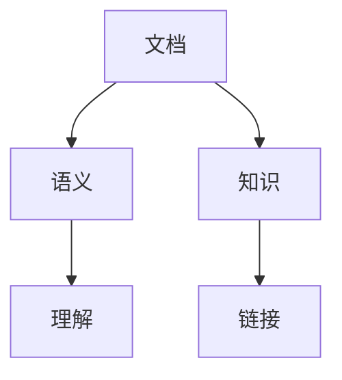
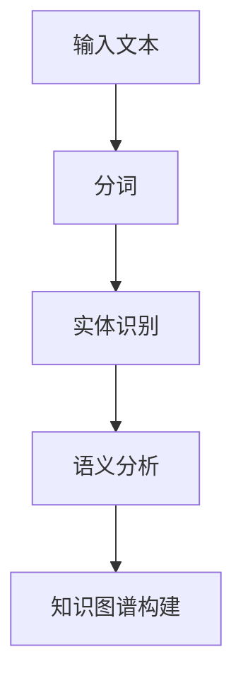
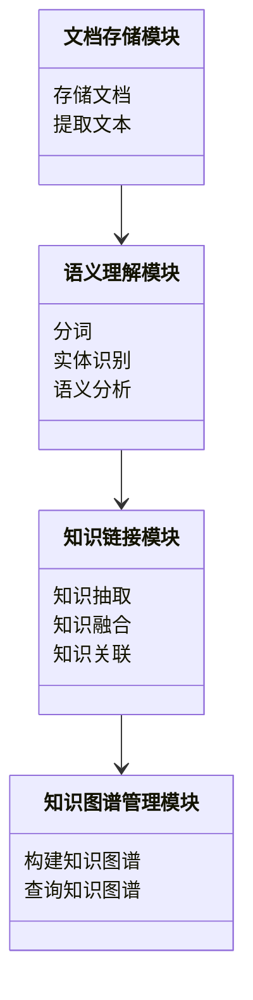
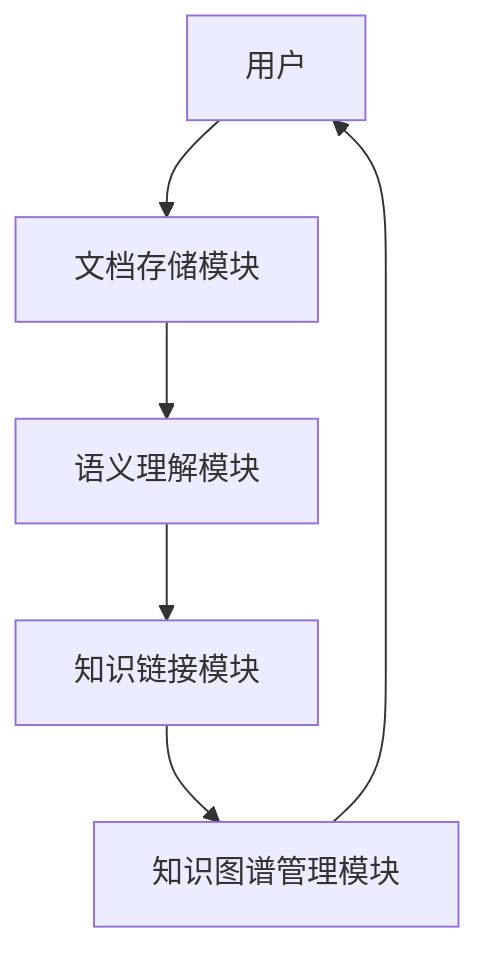
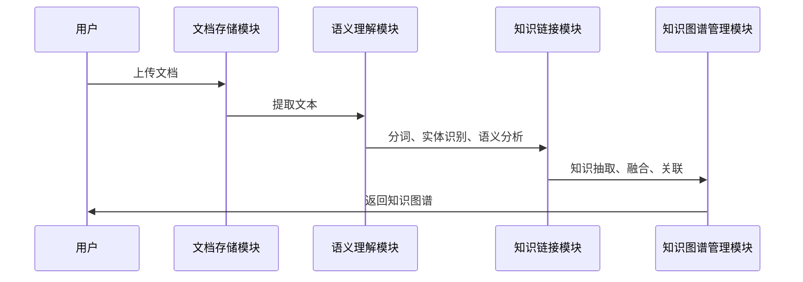

                 


# 构建智能企业文档管理系统：语义理解与知识链接

> 关键词：智能文档管理系统, 语义理解, 知识链接, 企业文档管理, 自然语言处理

> 摘要：随着企业文档管理需求的日益复杂化，传统的文档管理方式已无法满足智能化、高效化的要求。本文深入探讨了构建智能企业文档管理系统的关键技术和实现方法，重点分析了语义理解和知识链接的核心概念、算法原理及系统设计，结合实际案例，展示了如何通过智能化技术提升企业文档管理的效率和价值。

---

# 第1章 企业文档管理的智能化转型

## 1.1 问题背景与挑战

### 1.1.1 传统文档管理的局限性
传统的文档管理系统主要依赖关键字匹配和简单的分类管理，难以理解文档的语义内容，也无法建立文档之间的深层关联。这种管理方式在面对海量文档时效率低下，且无法满足用户对知识快速检索和关联的需求。

### 1.1.2 智能化文档管理的需求
随着企业对知识管理和知识共享的需求日益增加，智能化文档管理系统应运而生。通过引入自然语言处理（NLP）技术和知识图谱构建方法，智能化文档管理系统能够实现文档的语义理解与知识链接，从而提高文档管理和知识检索的效率。

### 1.1.3 语义理解与知识链接的重要性
语义理解是智能化文档管理的核心，它能够提取文档中的深层语义信息；知识链接则是将这些语义信息与企业知识库中的其他知识进行关联，形成一个动态的知识网络，支持企业更高效的决策和知识共享。

---

## 1.2 问题描述与目标

### 1.2.1 文档管理中的语义理解问题
传统文档管理系统仅能处理结构化数据，无法理解非结构化文本的语义内容。例如，无法从文档中提取实体、关系和事件，也无法根据上下文理解文档的意思。

### 1.2.2 知识链接的核心目标
知识链接的目标是将文档中的语义信息与企业知识库中的其他知识进行关联，形成一个动态的知识网络。通过知识链接，用户可以快速找到相关知识，提高知识检索的效率。

### 1.2.3 企业文档管理的智能化转型
智能化文档管理系统的建设目标是通过引入语义理解和知识链接技术，实现文档的智能化管理和知识化共享，从而提升企业的知识管理水平和效率。

---

## 1.3 问题解决与边界

### 1.3.1 语义理解的关键技术
语义理解的关键技术包括文本分词、实体识别、语义分析等。这些技术能够从文档中提取出语义信息，为知识链接提供基础。

### 1.3.2 知识链接的实现方式
知识链接的实现方式包括知识抽取、知识融合和知识关联。这些步骤能够将文档中的语义信息与企业知识库中的知识进行关联，形成知识图谱。

### 1.3.3 边界与外延的定义
智能化文档管理系统的边界是企业文档的存储、管理和知识共享。外延则包括文档的语义理解和知识链接技术，以及与企业其他系统的集成。

---

## 1.4 核心概念与组成

### 1.4.1 智能文档管理系统的组成要素
智能文档管理系统主要包括文档存储模块、语义理解模块、知识链接模块和知识图谱管理模块。

### 1.4.2 语义理解的核心要素
语义理解的核心要素包括文本分词、实体识别、语义分析和知识图谱构建。

### 1.4.3 知识链接的实现架构
知识链接的实现架构包括知识抽取、知识融合和知识关联三个部分。

---

## 1.5 本章小结

本章介绍了智能化文档管理系统的背景、核心概念和技术目标，分析了传统文档管理的局限性和智能化转型的必要性，并提出了语义理解和知识链接的关键技术。

---

# 第2章 语义理解与知识链接的核心概念

## 2.1 语义理解的原理与方法

### 2.1.1 语义理解的定义
语义理解是指通过自然语言处理技术，从文本中提取语义信息，理解文本的含义。

### 2.1.2 语义理解的主要方法
语义理解的主要方法包括基于规则的方法、统计方法和深度学习方法。

### 2.1.3 语义理解的关键技术
语义理解的关键技术包括文本分词、实体识别、语义分析和知识图谱构建。

---

## 2.2 知识链接的实现机制

### 2.2.1 知识链接的定义
知识链接是指将文档中的语义信息与企业知识库中的知识进行关联，形成知识图谱。

### 2.2.2 知识链接的核心机制
知识链接的核心机制包括知识抽取、知识融合和知识关联。

### 2.2.3 知识图谱的构建方法
知识图谱的构建方法包括知识抽取、知识融合和知识关联。

---

## 2.3 语义理解与知识链接的关系

### 2.3.1 语义理解与知识链接的联系
语义理解是知识链接的基础，知识链接是语义理解的应用。

### 2.3.2 语义理解对知识链接的支撑
语义理解能够提取文档的语义信息，为知识链接提供基础。

### 2.3.3 知识链接对语义理解的增强
知识链接能够将文档中的语义信息与企业知识库中的知识进行关联，增强语义理解的效果。

---

## 2.4 核心概念对比分析

### 2.4.1 语义理解与传统文本分析的对比
语义理解能够提取文档的语义信息，而传统文本分析仅能提取文本的表面信息。

### 2.4.2 知识链接与传统信息检索的对比
知识链接能够建立文档之间的知识关联，而传统信息检索仅能根据关键字匹配。

### 2.4.3 核心概念的属性特征对比表

| 核心概念 | 属性 | 特征 |
|----------|------|------|
| 语义理解 | 输入 | 文本 |
|          | 输出 | 语义信息 |
| 知识链接 | 输入 | 语义信息 |
|          | 输出 | 知识图谱 |

---

## 2.5 ER实体关系图



---

## 2.6 本章小结

本章详细介绍了语义理解和知识链接的核心概念，分析了它们的原理、方法和实现机制，并通过对比分析和ER实体关系图进一步阐述了它们之间的关系。

---

# 第3章 语义理解与知识链接的算法原理

## 3.1 语义理解的算法流程

### 3.1.1 文本分词
文本分词是将文本分割成词语的过程，是语义理解的基础。

### 3.1.2 实体识别
实体识别是指从文本中识别出人名、地名、组织名等实体的过程。

### 3.1.3 语义分析
语义分析是指理解文本中词语之间的关系，提取文本的语义信息。

### 3.1.4 知识图谱构建
知识图谱构建是将提取的语义信息组织成知识图谱的过程。

---

## 3.2 知识链接的算法流程

### 3.2.1 知识抽取
知识抽取是从文本中提取知识的过程。

### 3.2.2 知识融合
知识融合是将多个来源的知识进行整合的过程。

### 3.2.3 知识关联
知识关联是将知识图谱中的知识进行关联的过程。

---

## 3.3 语义理解的数学模型

### 3.3.1 词嵌入模型
词嵌入模型通过将词语映射到高维向量空间，表示词语的语义信息。

### 3.3.2 句子表示模型
句子表示模型通过将句子映射到高维向量空间，表示句子的语义信息。

### 3.3.3 文档表示模型
文档表示模型通过将文档映射到高维向量空间，表示文档的语义信息。

---

## 3.4 知识链接的数学模型

### 3.4.1 知识表示模型
知识表示模型通过将知识表示为图结构，表示知识的关联关系。

### 3.4.2 关系抽取模型
关系抽取模型通过从文本中抽取关系，构建知识图谱。

### 3.4.3 链接预测模型
链接预测模型通过预测知识图谱中的链接，完善知识图谱。

---

## 3.5 算法流程图



---

## 3.6 本章小结

本章详细介绍了语义理解和知识链接的算法流程和数学模型，通过流程图和数学公式进一步阐述了它们的实现原理。

---

# 第4章 系统分析与架构设计方案

## 4.1 项目背景与目标

### 4.1.1 项目背景
随着企业对知识管理的需求日益增加，智能化文档管理系统应运而生。

### 4.1.2 项目目标
通过智能化文档管理系统，实现文档的语义理解和知识链接，提升企业的知识管理水平和效率。

### 4.1.3 项目范围
项目范围包括文档存储、语义理解、知识链接和知识图谱管理。

---

## 4.2 系统功能设计

### 4.2.1 领域模型图



---

## 4.3 系统架构设计

### 4.3.1 系统架构图



---

## 4.4 系统接口设计

### 4.4.1 接口描述
系统接口包括文档存储模块、语义理解模块、知识链接模块和知识图谱管理模块之间的接口。

### 4.4.2 接口实现
接口实现基于RESTful API，采用JSON格式进行数据交换。

---

## 4.5 系统交互流程



---

## 4.6 本章小结

本章详细介绍了系统的项目背景、功能设计、架构设计和接口设计，并通过Mermaid图展示了系统的整体架构和交互流程。

---

# 第5章 项目实战

## 5.1 环境安装

### 5.1.1 安装Python
安装Python 3.8或更高版本。

### 5.1.2 安装NLP库
安装spaCy和transformers库。

### 5.1.3 安装知识图谱库
安装NetworkX和neo4j驱动。

---

## 5.2 系统核心实现源代码

### 5.2.1 文本分词代码
```python
import spacy

nlp = spacy.load("en_core_web_sm")
doc = nlp("This is a test sentence.")
for token in doc:
    print(token.text)
```

### 5.2.2 实体识别代码
```python
from spacy import displacy

doc = nlp("Apple is a company.")
displacy.render(doc, style="ent")
```

### 5.2.3 知识图谱构建代码
```python
import networkx as nx

G = nx.Graph()
G.add_edge("Apple", "company")
nx.draw(G, with_labels=True)
```

---

## 5.3 案例分析与详细讲解

### 5.3.1 案例背景
以企业文档管理系统为例，分析如何通过语义理解和知识链接实现文档的智能化管理。

### 5.3.2 实现过程
1. 文档存储模块：上传文档并存储。
2. 语义理解模块：分词、实体识别、语义分析。
3. 知识链接模块：知识抽取、融合、关联。
4. 知识图谱管理模块：构建知识图谱并提供查询服务。

---

## 5.4 本章小结

本章通过实际案例展示了系统的实现过程，详细讲解了系统核心代码和案例分析。

---

# 第6章 总结与展望

## 6.1 最佳实践 Tips

### 6.1.1 系统设计
- 确保系统的模块化设计，便于后续扩展和维护。
- 使用高效的NLP库和知识图谱库，提高系统的性能。

### 6.1.2 代码实现
- 注重代码的可读性和可维护性，避免过度复杂的实现。
- 使用版本控制工具，便于团队协作开发。

### 6.1.3 系统优化
- 优化算法的效率，减少计算时间。
- 通过增量更新，提高知识图谱的维护效率。

---

## 6.2 小结

智能化文档管理系统通过语义理解和知识链接技术，实现了文档的智能化管理和知识共享，显著提升了企业的知识管理水平和效率。

---

## 6.3 注意事项

- 确保系统的安全性和稳定性，防止数据泄露和系统崩溃。
- 定期更新模型和算法，保持系统的先进性和高效性。

---

## 6.4 拓展阅读

- 推荐阅读《自然语言处理入门》和《知识图谱构建与应用》等书籍。
- 关注最新的NLP技术和知识图谱研究进展。

---

# 作者

作者：AI天才研究院/AI Genius Institute & 禅与计算机程序设计艺术/Zen And The Art of Computer Programming

