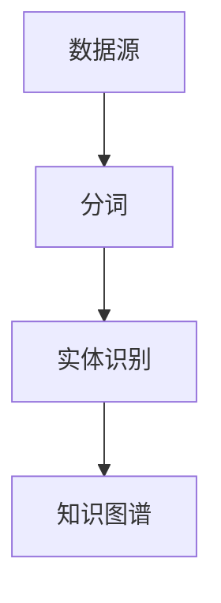
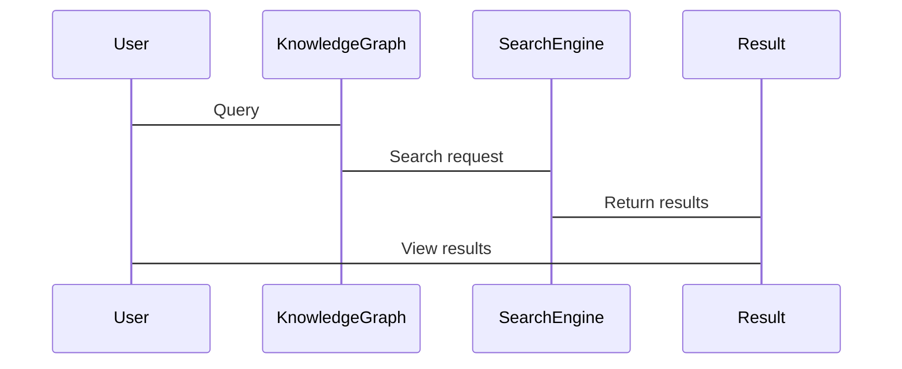

                 


# 构建智能企业知识管理平台：动态知识图谱与语义检索系统

> 关键词：知识图谱，语义检索，动态知识图谱，企业知识管理，智能检索系统

> 摘要：本文详细探讨了构建智能企业知识管理平台的核心技术，重点介绍了动态知识图谱和语义检索系统的原理、实现方法及其在企业知识管理中的应用。文章从背景、概念、算法、系统架构、项目实战到最佳实践，全面解析了如何利用这些技术提升企业的知识管理水平，为企业智能化转型提供理论支持和实践指导。

---

## 第1章: 知识管理平台的演变与挑战

### 1.1 知识管理平台的定义与背景

知识管理平台（Knowledge Management Platform）是指通过技术手段对企业内外部知识进行采集、存储、组织、检索和应用的系统。随着企业信息化程度的提高，知识管理的重要性日益凸显。传统的知识管理方式依赖于文件存储和简单的关键字检索，存在知识分散、检索效率低、语义理解能力弱等问题。

近年来，人工智能技术的快速发展为企业知识管理带来了新的机遇。动态知识图谱和语义检索技术的结合，使得知识管理平台能够更高效地处理非结构化数据，理解上下文语义，为企业决策提供更精准的支持。

### 1.2 动态知识图谱的核心特性

动态知识图谱是一种能够实时更新和适应变化的知识表示方法。与静态知识图谱相比，动态知识图谱具有以下特点：

1. **动态更新**：能够根据实时数据自动更新知识图谱，保持知识的鲜活性。
2. **语义自适应**：能够根据上下文理解语义，支持多语言、多领域的知识表示。
3. **可扩展性**：支持大规模数据的存储和处理，适应企业的快速增长需求。

### 1.3 语义检索系统的作用与价值

语义检索系统通过理解用户的查询意图，能够在海量数据中快速找到相关性最高的信息。与传统关键字检索相比，语义检索具有以下优势：

1. **语义理解**：能够理解用户的深层需求，提供更精准的检索结果。
2. **上下文感知**：能够根据上下文调整检索策略，提升检索效果。
3. **实时反馈**：能够根据用户行为实时调整检索结果，提供更个性化的服务。

---

## 第2章: 动态知识图谱与语义检索的核心概念

### 2.1 知识图谱的构建流程

知识图谱的构建是一个复杂的过程，主要包括以下几个步骤：

1. **数据采集**：从企业内外部获取结构化和非结构化数据。
2. **数据预处理**：清洗、去重和标注数据。
3. **知识抽取**：从文本中提取实体、关系和属性。
4. **知识建模**：构建知识图谱的模型，定义实体之间的关系。
5. **动态更新**：根据实时数据更新知识图谱。

### 2.2 语义检索系统的工作原理

语义检索系统的核心是将文本转换为向量表示，然后通过计算向量之间的相似度来匹配用户的查询。以下是其实现流程：

1. **文本表示**：将文本转换为高维向量，常用的方法有 Word2Vec、BERT 等。
2. **向量检索**：使用向量数据库进行高效的相似度计算和检索。
3. **结果排序**：根据检索结果的相关性进行排序，返回最相关的文档。

### 2.3 核心概念对比与ER实体关系图

以下是核心概念的对比表：

| 概念       | 描述                                                                 |
|------------|----------------------------------------------------------------------|
| 实体       | 知识图谱中的基本单元，表示具体事物或概念。                           |
| 关系       | 实体之间的关联，如“属于”、“包含”等。                             |
| 属性       | 实体的描述性特征，如“名称”、“类型”等。                             |

以下是 ER 实体关系图的 Mermaid 表示：

```mermaid
er
actor: 用户
KnowledgeGraph: 知识图谱
SearchEngine: 检索引擎
relation: 关系
```

---

## 第3章: 动态知识图谱的构建算法与实现

### 3.1 知识抽取算法

知识抽取是构建知识图谱的关键步骤，主要包括实体识别和关系抽取。

1. **实体识别**：基于规则或深度学习模型，从文本中提取实体。例如，使用正则表达式识别“公司名”或使用 LSTM 进行序列标注。
2. **关系抽取**：通过模式匹配或关系分类，识别实体之间的关系。例如，从句子“甲公司收购乙公司”中提取“收购”关系。

以下是实体识别的 Mermaid 流程图：



### 3.2 知识图谱动态更新算法

动态知识图谱需要根据实时数据进行更新，常用算法包括：

1. **增量更新**：只更新发生变化的部分，减少计算量。
2. **基于图的最短路径算法**：通过计算实体之间的最短路径，更新相关实体的信息。

以下是增量更新的数学模型：

$$
\text{更新量} = \sum_{i=1}^{n} \Delta x_i
$$

其中，$\Delta x_i$ 表示第 $i$ 个实体的变化量。

### 3.3 算法实现的 Python 代码示例

以下是实体识别的 Python 代码示例：

```python
import spacy

# 加载预训练模型
nlp = spacy.load("en_core_web_sm")

# 定义实体识别函数
def extract_entities(text):
    doc = nlp(text)
    entities = []
    for ent in doc.ents:
        entities.append((ent.start, ent.end, ent.label_, ent.text))
    return entities

# 示例文本
text = "Apple is a technology company based in California."
entities = extract_entities(text)
print(entities)
```

输出结果为：

```
[(0, 1, 'ORG', 'Apple'), (5, 8, 'GPE', 'California')]
```

---

## 第4章: 语义检索系统的核心算法与实现

### 4.1 文本表示与语义分析

文本表示是语义检索的核心，常用的方法包括：

1. **词袋模型**：将文本表示为词频向量。
2. **词嵌入模型**：如 Word2Vec、GloVe 等，将词表示为低维向量。
3. **深度学习模型**：如 BERT、RoBERTa 等，能够捕捉文本的上下文语义。

### 4.2 向量空间模型与相似度计算

向量空间模型将文本表示为向量，通过计算向量之间的相似度进行检索。常用的相似度计算方法包括：

1. **余弦相似度**：
$$
\text{相似度} = \frac{\vec{A} \cdot \vec{B}}{|\vec{A}| |\vec{B}|}
$$

2. **欧氏距离**：
$$
\text{距离} = \sqrt{\sum_{i=1}^{n} (A_i - B_i)^2}
$$

### 4.3 结果排序与优化

结果排序是提升检索效果的重要步骤，常用的方法包括：

1. **BM25 算法**：基于概率的检索模型。
2. **学习到的排序（LTR）**：通过机器学习模型优化排序效果。

---

## 第5章: 系统架构与设计

### 5.1 系统功能设计

知识管理平台的主要功能包括：

1. **知识采集**：从多种数据源采集知识。
2. **知识存储**：将知识存储到数据库中。
3. **知识检索**：根据用户查询检索相关知识。
4. **知识更新**：动态更新知识图谱。

以下是系统功能设计的 Mermaid 类图：

```mermaid
classDiagram

class KnowledgeGraph {
    String name;
    String description;
}

class SearchEngine {
    List<Document> documents;
    void search(String query);
}

class Document {
    String content;
    String title;
}

KnowledgeGraph o SearchEngine
```

### 5.2 系统架构设计

以下是系统架构设计的 Mermaid 架构图：

```mermaid
rect
User --> KnowledgeGraph
KnowledgeGraph --> SearchEngine
SearchEngine --> Result
```

### 5.3 系统交互设计

以下是系统交互设计的 Mermaid 序列图：



---

## 第6章: 项目实战

### 6.1 环境搭建

需要安装以下工具：

- Python
- TensorFlow 或 PyTorch
- SpaCy
- FAISS（向量检索库）

### 6.2 核心实现

以下是知识图谱构建的 Python 代码示例：

```python
import spacy

nlp = spacy.load("en_core_web_sm")

def build_knowledge_graph(texts):
    graph = {}
    for text in texts:
        doc = nlp(text)
        for ent in doc.ents:
            if ent.label_ not in graph:
                graph[ent.label_] = []
            graph[ent.label_].append(ent.text)
    return graph

texts = ["Apple is a technology company.", "Apple was founded in 1971."]
graph = build_knowledge_graph(texts)
print(graph)
```

输出结果为：

```
{
    'ORG': ['Apple'],
    'DATE': ['1971']
}
```

### 6.3 案例分析

假设我们有一个关于公司新闻的数据集，我们可以使用知识图谱和语义检索系统来提取公司名称、成立时间、主营业务等信息，并支持用户通过自然语言查询获取相关公司信息。

---

## 第7章: 总结与展望

### 7.1 核心观点总结

本文详细介绍了动态知识图谱和语义检索系统的核心概念、算法实现和系统设计，展示了它们在企业知识管理中的应用价值。

### 7.2 未来展望

未来，随着人工智能技术的进一步发展，知识管理平台将更加智能化和个性化。动态知识图谱和语义检索系统将在企业知识管理中发挥更重要的作用，为企业决策提供更强大的支持。

---

## 作者

作者：AI天才研究院/AI Genius Institute & 禅与计算机程序设计艺术 /Zen And The Art of Computer Programming

---

以上是文章的完整目录和部分内容示例，您可以根据需要扩展各章节的内容，添加更多细节和案例分析。

