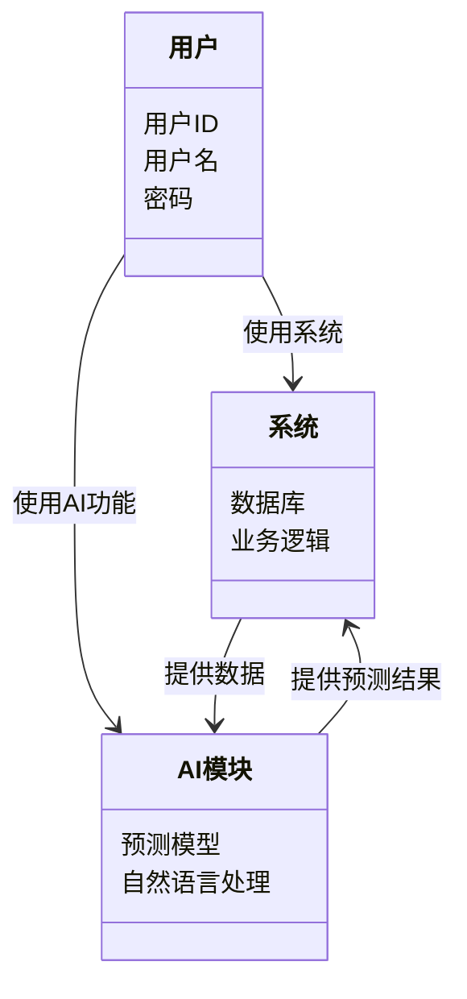

                 


# 构建智能企业资源规划(ERP)系统：AI的深度集成

> **关键词**：智能ERP系统、AI、企业资源规划、深度集成、系统架构、算法原理  
> **摘要**：本文详细探讨了如何在企业资源规划（ERP）系统中深度集成人工智能技术，分析了AI技术对ERP系统功能的提升，包括智能预测、自然语言处理、机器学习算法的应用，以及系统架构设计和项目实现。通过理论与实践结合，展示了如何构建一个高效、智能的ERP系统。

---

## 第一部分: 背景与概念

### 第1章: 智能企业资源规划（ERP）系统概述

#### 1.1 企业资源规划（ERP）的基本概念
企业资源规划（ERP）是一种整合企业各个业务模块（如财务、采购、生产、销售、库存等）的管理信息系统，通过数据共享和流程优化，实现企业资源的高效利用。ERP系统的核心功能包括：
- **数据集成**：整合企业各个部门的数据，消除信息孤岛。
- **流程管理**：优化业务流程，提高效率。
- **决策支持**：基于数据分析提供决策支持。

#### 1.2 AI与ERP系统的结合
随着人工智能技术的发展，AI逐渐被集成到ERP系统中，以增强其智能化水平。AI技术可以通过以下方式提升ERP系统的能力：
- **智能预测**：利用机器学习算法预测销售趋势、库存需求等。
- **自然语言处理**：支持自然语言交互，方便用户查询和操作。
- **自动化决策**：基于AI模型自动优化供应链、库存管理等。

#### 1.3 核心概念与联系
ERP系统的核心功能模块包括：
1. **财务模块**：管理财务数据，如 accounts payable, accounts receivable 等。
2. **采购模块**：管理采购订单、供应商信息。
3. **生产模块**：监控生产过程，管理生产计划。
4. **销售模块**：管理销售订单、客户信息。
5. **库存模块**：管理库存水平，优化库存周转。

AI技术的核心功能模块包括：
1. **机器学习模型**：用于预测和分类。
2. **自然语言处理（NLP）**：用于文本理解和生成。
3. **深度学习模型**：用于图像识别和语音识别。

通过将AI技术与ERP系统结合，可以实现以下功能：
- 智能预测：基于历史数据和市场趋势，预测销售和库存需求。
- 自动化决策：利用AI算法优化供应链和生产计划。
- 智能交互：支持自然语言查询和操作。

---

### 第2章: 智能ERP系统的核心概念与联系

#### 2.1 实体关系图架构
以下是智能ERP系统的实体关系图（ER图）：

```mermaid
erDiagram
    actor 用户 "User" {
        <- (角色: 管理员)
        <- (角色: 采购员)
        <- (角色: 销售员)
    }
    actor 系统 "ERP System" {
        <- (功能: 数据采集)
        <- (功能: 数据处理)
        <- (功能: 数据分析)
    }
    actor AI模块 "AI Module" {
        <- (功能: 预测模型)
        <- (功能: 自然语言处理)
        <- (功能: 自动化决策)
    }
    用户 --> 系统 : 使用系统
    用户 --> AI模块 : 使用AI功能
    系统 --> AI模块 : 提供数据
    AI模块 --> 系统 : 提供预测结果
```

#### 2.2 核心概念属性特征对比
以下是ERP系统功能模块与AI技术应用模块的属性特征对比：

| 属性         | ERP系统功能模块         | AI技术应用模块         |
|--------------|------------------------|------------------------|
| 核心功能     | 数据采集、流程管理     | 预测、分类、自然语言处理 |
| 输入         | 结构化数据（如订单、库存） | 文本、图像、语音         |
| 输出         | 结构化数据（如报告、预测） | 文本、语音、决策建议     |
| 技术基础     | 数据库、业务逻辑       | 机器学习、深度学习     |
| 应用场景     | 企业内部管理           | 企业智能化管理           |

---

## 第二部分: 技术基础

### 第3章: 智能ERP系统的核心算法原理

#### 3.1 机器学习算法在ERP中的应用
机器学习算法可以用于预测销售趋势和库存需求。以下是线性回归算法的数学模型：

$$ y = \beta_0 + \beta_1 x + \epsilon $$

其中：
- $y$ 是目标变量（如销售量）。
- $x$ 是自变量（如时间）。
- $\beta_0$ 是截距。
- $\beta_1$ 是回归系数。
- $\epsilon$ 是误差项。

#### 3.2 自然语言处理（NLP）在ERP中的应用
NLP可以用于处理用户输入的自然语言查询。例如，用户输入“预测下个月的销售量”，系统会解析并返回结果。

#### 3.3 深度学习算法在ERP中的应用
深度学习算法可以用于图像识别和语音识别。例如，利用卷积神经网络（CNN）识别产品缺陷。

---

### 第4章: 智能ERP系统的系统分析与架构设计

#### 4.1 系统功能设计
以下是智能ERP系统的领域模型设计：



#### 4.2 系统架构设计
以下是智能ERP系统的架构图：

```mermaid
archiDiagram
    架构 {
        前端模块
        后端模块
        数据库模块
        AI模块
    }
    前端模块 --> 后端模块 : 发送请求
    后端模块 --> 数据库模块 : 查询数据
    后端模块 --> AI模块 : 调用AI服务
    AI模块 --> 前端模块 : 返回结果
```

---

## 第三部分: 项目实战

### 第5章: 智能ERP系统的核心代码实现

#### 5.1 环境安装
以下是Python环境安装步骤：
1. 安装Python：`sudo apt-get install python3`
2. 安装依赖库：`pip install numpy scikit-learn`

#### 5.2 核心代码实现
以下是机器学习模型的代码示例：

```python
from sklearn.linear_model import LinearRegression
import numpy as np

# 示例数据
X = np.array([1, 2, 3, 4, 5]).reshape(-1, 1)
y = np.array([2, 4, 6, 8, 10])

# 训练模型
model = LinearRegression()
model.fit(X, y)

# 预测
print(model.predict([[6]]))  # 输出：[[12]]
```

---

## 第四部分: 最佳实践

### 第6章: 智能ERP系统的最佳实践

#### 6.1 小结
- AI技术可以显著提升ERP系统的智能化水平。
- 通过机器学习和NLP技术，可以实现智能预测和自然语言交互。
- 系统架构设计需要考虑数据流和模块之间的交互。

#### 6.2 注意事项
- 在集成AI技术时，需要确保数据质量和模型的准确性。
- 系统设计时，需要考虑可扩展性和可维护性。

#### 6.3 扩展阅读
- 《机器学习实战》
- 《深度学习入门：基于Python和Keras》
- 《ERP系统设计与实现》

---

## 作者信息

作者：AI天才研究院/AI Genius Institute & 禅与计算机程序设计艺术 /Zen And The Art of Computer Programming

---

通过本文，读者可以全面了解如何在ERP系统中深度集成AI技术，从理论到实践，掌握构建智能ERP系统的核心方法和技巧。

