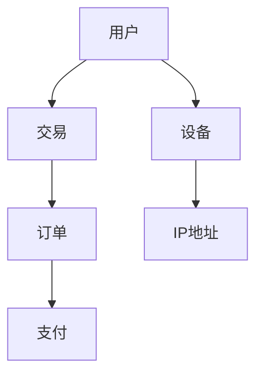
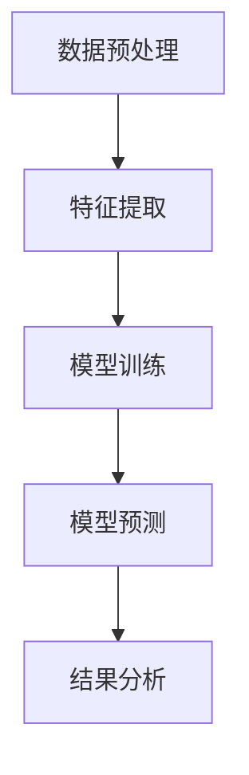
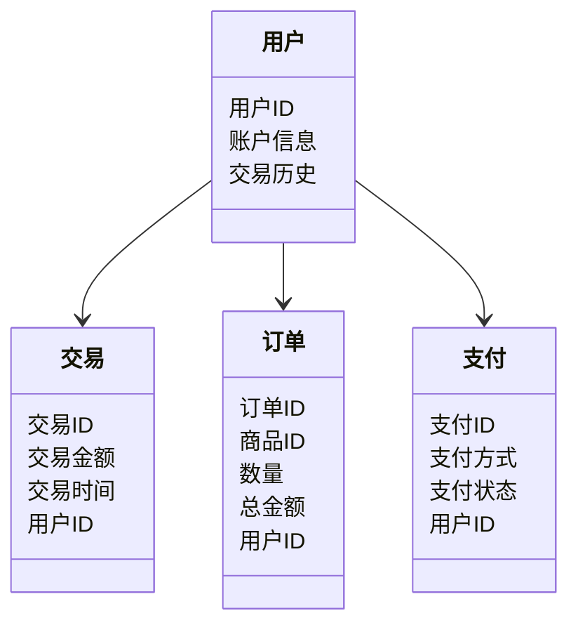
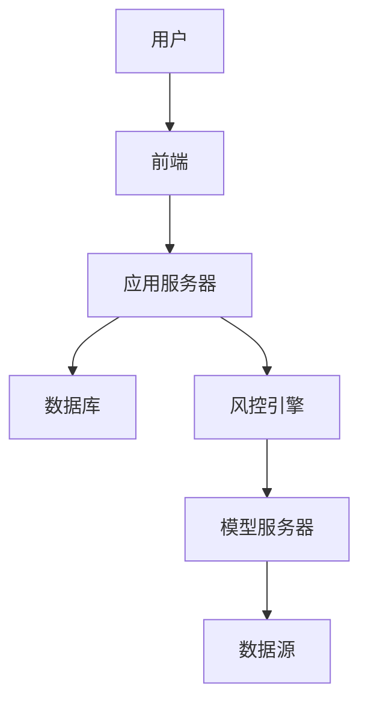
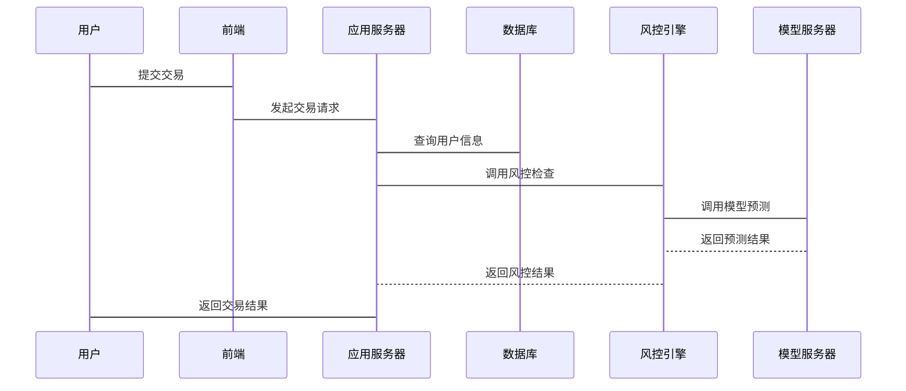

                 


# 构建智能企业风控系统：实时交易监控与欺诈检测

> 关键词：智能风控系统，实时交易监控，欺诈检测，机器学习，系统架构，数据安全

> 摘要：本文详细探讨了构建智能企业风控系统的各个方面，重点介绍了实时交易监控和欺诈检测的核心技术。通过分析背景、核心概念、算法原理、系统架构设计以及项目实战，为读者提供了一个全面的视角，帮助其理解并掌握构建智能风控系统的能力。

---

## 第一部分: 智能企业风控系统概述

### 第1章: 企业风控系统背景与挑战

#### 1.1 企业风控系统概述

##### 1.1.1 什么是企业风控系统
企业风控系统是一种通过收集、分析和处理企业内外部数据，识别潜在风险并进行预警和干预的系统。它旨在保护企业的资产安全、合规性和业务连续性。

##### 1.1.2 企业风控系统的核心目标
- 保护企业资产免受欺诈、滥用和误用
- 确保业务操作的合规性
- 提高企业运营效率和决策能力
- 实时监控和响应潜在风险

##### 1.1.3 企业风控系统的关键要素
- 数据采集与处理
- 风险评估与分析
- 风险预警与响应
- 系统集成与扩展

#### 1.2 实时交易监控与欺诈检测的背景

##### 1.2.1 交易监控的重要性
随着电子商务的快速发展，企业面临的交易风险也在不断增加。实时交易监控能够及时发现异常交易行为，防止欺诈和损失。

##### 1.2.2 欺诈检测的必要性
欺诈行为日益 sophisticated，传统的基于规则的欺诈检测方法逐渐失效。通过机器学习和大数据分析，企业可以更有效地检测和预防欺诈行为。

##### 1.2.3 数字化转型中的风控挑战
在数字化转型中，企业需要处理海量数据，实时响应客户需求，同时确保数据安全和合规性。这给风控系统提出了更高的要求。

#### 1.3 当前企业风控系统的痛点

##### 1.3.1 传统风控系统的局限性
- 数据处理能力有限
- 模型更新周期长
- 规则难以覆盖所有可能的欺诈场景

##### 1.3.2 数据量激增带来的挑战
- 数据存储和处理成本高
- 数据隐私和安全问题
- 数据实时性要求高

##### 1.3.3 欺诈手段的不断进化
- 欺诈手段多样化、隐蔽化
- 欺诈者利用技术漏洞进行攻击
- 欺诈行为的跨国性和复杂性

---

### 第2章: 智能风控系统的核心概念与联系

#### 2.1 核心概念解析

##### 2.1.1 实时交易监控
实时交易监控是指在交易发生时，系统立即对交易进行分析和判断，识别异常交易行为。它依赖于高效的实时数据处理和分析能力。

##### 2.1.2 欺诈检测
欺诈检测是通过分析交易数据、用户行为数据等，识别潜在的欺诈行为。它通常结合多种技术手段，如规则引擎、机器学习和深度学习。

##### 2.1.3 数据驱动的风控
数据驱动的风控系统依赖于大量的数据输入，通过分析数据来识别风险。它强调数据的多样性和实时性，利用先进的数据分析技术进行风险评估。

#### 2.2 核心概念的联系与区别

##### 2.2.1 实时交易监控与欺诈检测的关系
实时交易监控是欺诈检测的重要组成部分。通过实时监控交易行为，欺诈检测系统能够及时发现并阻止欺诈行为的发生。

##### 2.2.2 数据特征与模型选择的关联
数据特征直接影响模型的选择和性能。不同的数据特征可能导致不同的模型表现，因此在欺诈检测中，特征工程非常重要。

##### 2.2.3 系统架构与性能优化的平衡
系统架构的设计直接影响系统的性能和扩展性。在实现实时交易监控和欺诈检测时，需要在系统架构和性能优化之间找到平衡点。

#### 2.3 实体关系图（ER图）



---

### 第3章: 欺诈检测算法原理

#### 3.1 常见的欺诈检测算法

##### 3.1.1 基于规则的检测
基于规则的检测是一种简单但有效的欺诈检测方法。它通过预定义的规则来判断交易是否为欺诈。例如，如果一笔交易的金额远高于用户的历史交易金额，系统可以标记该交易为可疑。

##### 3.1.2 基于机器学习的检测
基于机器学习的检测利用历史数据训练模型，预测未来交易是否为欺诈。常用的算法包括逻辑回归、随机森林和神经网络等。

##### 3.1.3 基于深度学习的检测
基于深度学习的检测通过深度神经网络（DNN）来学习数据的特征，识别复杂的欺诈模式。这种方法在处理高维数据和非线性关系时表现尤为突出。

#### 3.2 算法流程图



#### 3.3 机器学习模型实现

##### 3.3.1 数据特征提取
特征提取是欺诈检测的关键步骤。常见的特征包括交易金额、交易时间、交易地点、用户行为等。

##### 3.3.2 模型选择与训练
选择合适的模型并进行训练是欺诈检测的核心。例如，可以使用逻辑回归模型，并通过交叉验证优化模型参数。

##### 3.3.3 模型评估与优化
评估模型的性能并进行优化是确保模型有效性的关键。常用的评估指标包括准确率、召回率和F1分数。

---

## 第4章: 系统分析与架构设计

### 4.1 问题场景介绍

##### 4.1.1 交易监控的场景
- 在线支付
- 电子商务
- 银行转账

##### 4.1.2 欺诈检测的场景
- 信用卡欺诈
- 账户盗用
- 虚假交易

### 4.2 系统功能设计

#### 4.2.1 领域模型类图



#### 4.2.2 系统架构设计

##### 4.2.2.1 系统架构图



##### 4.2.2.2 接口设计
系统需要提供以下接口：
- 数据采集接口：实时采集交易数据
- 数据处理接口：对数据进行清洗和特征提取
- 模型调用接口：调用机器学习模型进行预测
- 风控引擎接口：根据模型输出结果进行决策

##### 4.2.2.3 交互流程



---

## 第5章: 项目实战

### 5.1 环境安装

#### 5.1.1 安装Python
```bash
python --version
pip install --upgrade pip
```

#### 5.1.2 安装依赖库
```bash
pip install numpy pandas scikit-learn matplotlib
```

### 5.2 系统核心实现

#### 5.2.1 数据预处理

```python
import pandas as pd

# 读取数据
data = pd.read_csv('transactions.csv')

# 去除缺失值
data.dropna(inplace=True)

# 标准化处理
from sklearn.preprocessing import StandardScaler

scaler = StandardScaler()
data_scaled = scaler.fit_transform(data)
```

#### 5.2.2 模型训练

```python
from sklearn.model import LogisticRegression

model = LogisticRegression()
model.fit(X_train, y_train)
```

#### 5.2.3 模型预测

```python
# 预测结果
y_pred = model.predict(X_test)

# 评估指标
from sklearn.metrics import classification_report

print(classification_report(y_test, y_pred))
```

### 5.3 案例分析

#### 5.3.1 案例背景
某电子商务平台遭遇欺诈攻击，需要部署实时交易监控和欺诈检测系统。

#### 5.3.2 数据分析
通过对历史交易数据的分析，发现欺诈交易通常具有以下特征：
- 交易金额异常
- 交易时间集中
- 用户行为异常

#### 5.3.3 模型优化
通过调整模型参数和特征选择，提高模型的准确率和召回率。

#### 5.3.4 系统部署
将模型部署到生产环境中，实现实时监控和欺诈检测。

### 5.4 项目小结

#### 5.4.1 实战总结
通过项目实战，我们掌握了从数据预处理到模型部署的完整流程，熟悉了实时交易监控和欺诈检测的实现方法。

#### 5.4.2 经验教训
在项目过程中，我们发现数据质量和特征选择对模型性能影响很大，因此在后续项目中需要更加重视数据清洗和特征工程。

---

## 第6章: 总结与展望

### 6.1 全文总结

#### 6.1.1 核心内容回顾
本文详细介绍了智能企业风控系统的核心概念、算法原理、系统架构和项目实战，帮助读者全面理解构建智能风控系统的能力。

#### 6.1.2 关键点总结
- 数据驱动是风控系统的核心
- 实时监控和欺诈检测是系统的关键功能
- 机器学习和深度学习是提高系统性能的重要手段

### 6.2 未来展望

#### 6.2.1 技术发展
随着人工智能和大数据技术的不断发展，风控系统将更加智能化和自动化。

#### 6.2.2 应用场景
风控系统将被应用于更多的场景，如金融、电商、 healthcare 等行业。

#### 6.2.3 挑战与机遇
尽管面临技术挑战，但风控系统的应用为企业提供了巨大的机遇，能够帮助企业在数字化转型中更好地应对风险。

### 6.3 最佳实践 tips

#### 6.3.1 小结
- 理解核心概念，掌握算法原理
- 注重数据质量，优化模型性能
- 关注系统架构，确保性能和扩展性

#### 6.3.2 注意事项
- 数据隐私和安全是重点
- 模型需要不断更新和优化
- 系统需要高可用性和容错能力

#### 6.3.3 拓展阅读
- 《机器学习实战》
- 《深入浅出人工智能》
- 《大数据系统设计》

---

## 作者信息

作者：AI天才研究院/AI Genius Institute & 禅与计算机程序设计艺术 /Zen And The Art of Computer Programming

---

通过以上结构，我们可以系统地学习和理解构建智能企业风控系统的核心内容，从理论到实践，从算法到系统设计，全面掌握智能风控系统的构建方法。

