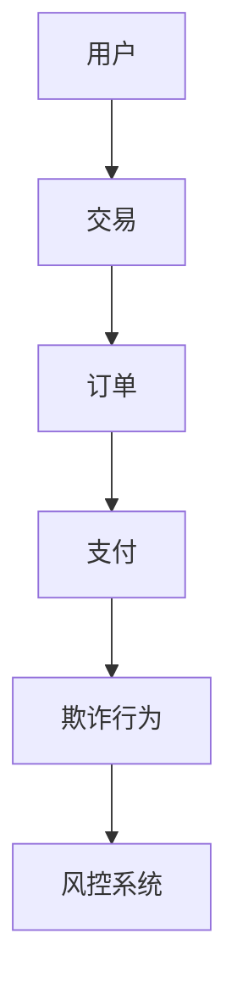
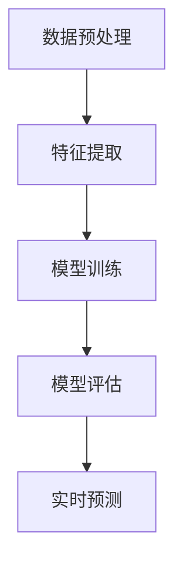
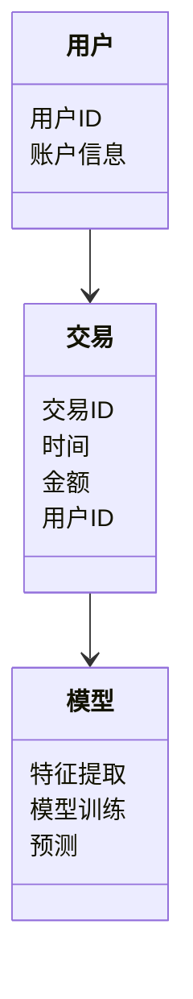
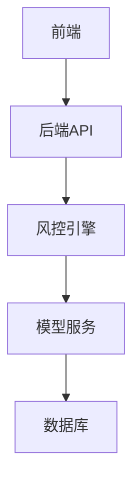
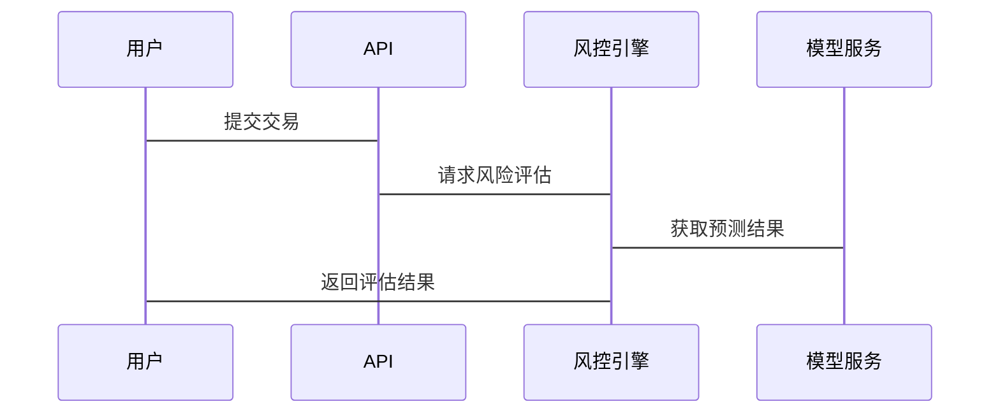

                 


# 构建智能企业风控系统：实时交易监控与欺诈检测的AI增强

> 关键词：企业风控，AI增强，实时交易监控，欺诈检测，智能系统

> 摘要：本文详细探讨了如何构建智能企业风控系统，特别是实时交易监控和欺诈检测的AI增强。通过分析核心概念、算法原理、系统架构，结合项目实战和最佳实践，展示了如何利用人工智能技术提升企业风控能力。

---

# 第一部分: 智能企业风控系统概述

## 第1章: 智能企业风控系统的背景与挑战

### 1.1 企业风控的重要性

#### 1.1.1 企业风控的核心概念
企业风控（Risk Management）是指识别、评估和应对企业运营中的潜在风险。在数字化时代，企业面临的风险包括欺诈、数据泄露、交易异常等，传统的风控手段已难以应对复杂多变的威胁。

#### 1.1.2 欺诈检测的现状与挑战
欺诈检测是企业风控的重要组成部分。传统的方法依赖规则和人工审核，效率低且难以捕捉复杂欺诈模式。随着AI技术的发展，利用机器学习和深度学习进行欺诈检测成为趋势。

#### 1.1.3 实时交易监控的挑战
实时交易监控要求系统在交易发生时立即识别异常行为。这对系统的实时性、准确性和可扩展性提出了更高要求。传统的批量处理方式无法满足实时监控的需求。

### 1.2 AI在企业风控中的作用

#### 1.2.1 AI技术如何增强风控能力
AI技术通过分析大量数据，识别潜在风险模式，帮助企业在交易发生前识别欺诈行为。例如，使用监督学习模型预测欺诈交易。

#### 1.2.2 智能风控系统的定义与特点
智能风控系统是结合AI技术的自动化风控系统，能够实时监控交易，自动识别和应对风险。其特点包括实时性、准确性、可扩展性和自适应性。

#### 1.2.3 智能风控系统的边界与外延
智能风控系统的边界包括数据输入、模型训练和实时监控。外延则涵盖数据源、模型部署和结果输出。

### 1.3 本章小结

#### 1.3.1 核心概念总结
企业风控、欺诈检测和实时交易监控是智能风控系统的核心概念。

#### 1.3.2 未来发展趋势展望
未来，AI技术将进一步融入风控系统，提升其智能化和自动化水平。

---

## 第2章: 智能企业风控系统的核心概念

### 2.1 核心概念的定义与解析

#### 2.1.1 实时交易监控
实时交易监控是指在交易发生时立即进行风险评估和异常检测。通过实时数据分析，快速识别潜在欺诈行为。

#### 2.1.2 欺诈检测
欺诈检测是通过分析交易数据，识别异常行为和欺诈交易。常用的技术包括监督学习和无监督学习。

#### 2.1.3 AI增强的风控模型
AI增强的风控模型结合传统规则和机器学习模型，提升欺诈检测的准确性和效率。

### 2.2 核心概念之间的联系

#### 2.2.1 实时交易监控与欺诈检测的关系
实时交易监控为欺诈检测提供实时数据，欺诈检测为监控提供决策支持。

#### 2.2.2 AI技术在风控系统中的应用
AI技术用于特征提取、模型训练和实时预测，提升风控系统的智能化水平。

#### 2.2.3 系统整体架构的分析
智能风控系统的整体架构包括数据采集、特征工程、模型训练和实时监控模块。

### 2.3 核心概念的属性特征对比

| 核心概念   | 实时性 | 准确性 | 可扩展性 |
|------------|--------|--------|----------|
| 实时交易监控 | 高     | 中     | 高       |
| 欺诈检测    | 中     | 高     | 中       |
| AI增强模型  | 中     | 高     | 高       |

### 2.4 ER实体关系图



### 2.5 本章小结

#### 2.5.1 核心概念总结
实时交易监控和欺诈检测是智能风控系统的核心，AI技术增强了系统的智能化水平。

#### 2.5.2 系统架构的初步理解
智能风控系统通过数据采集、特征工程、模型训练和实时监控实现风险控制。

---

## 第3章: 智能企业风控系统的算法原理

### 3.1 算法原理概述

#### 3.1.1 监督学习在欺诈检测中的应用
监督学习模型（如随机森林、XGBoost）通过标记数据训练，预测交易是否为欺诈。

#### 3.1.2 无监督学习在异常检测中的应用
无监督学习（如Isolation Forest）用于检测异常交易，无需标记数据。

#### 3.1.3 深度学习在实时监控中的应用
深度学习模型（如LSTM）用于时间序列分析，识别交易中的异常模式。

### 3.2 算法实现流程



#### 3.2.1 数据预处理
数据清洗、特征工程和数据增强是数据预处理的关键步骤。

#### 3.2.2 特征提取
从交易数据中提取特征，如时间、金额、用户行为等。

#### 3.2.3 模型训练
使用训练数据训练监督学习或无监督学习模型。

#### 3.2.4 模型评估
通过验证集评估模型性能，调整参数优化模型。

#### 3.2.5 实时预测
将实时交易数据输入模型，进行欺诈检测。

### 3.3 算法实现代码示例

```python
import pandas as pd
from sklearn.ensemble import RandomForestClassifier
from sklearn.metrics import accuracy_score

# 加载数据
data = pd.read_csv('transaction.csv')

# 特征提取
features = data[['amount', 'time', 'user_id']]
labels = data['is_fraud']

# 模型训练
model = RandomForestClassifier()
model.fit(features, labels)

# 预测
predictions = model.predict(features)

# 评估
accuracy = accuracy_score(labels, predictions)
print(f'准确率: {accuracy}')
```

### 3.4 数学模型与公式

#### 3.4.1 监督学习模型
随机森林模型的预测公式为：
$$
y = \text{ RandomForest.predict(X) }
$$

#### 3.4.2 无监督学习模型
Isolation Forest算法通过隔离异常点进行检测：
$$
\text{score} = \text{model.decision_function(X)}
$$

### 3.5 本章小结

#### 3.5.1 算法原理总结
监督学习、无监督学习和深度学习在风控系统中各有优劣，适用于不同的场景。

#### 3.5.2 算法实现的关键步骤
数据预处理、特征提取、模型训练和实时预测是实现AI增强风控系统的关键步骤。

---

## 第4章: 智能企业风控系统的系统分析与架构设计

### 4.1 系统分析

#### 4.1.1 问题场景介绍
实时交易监控系统需要处理高并发交易，快速识别欺诈行为。

#### 4.1.2 项目介绍
本文将构建一个基于AI的实时交易监控系统，实现欺诈检测和风险控制。

### 4.2 系统功能设计

#### 4.2.1 领域模型


#### 4.2.2 系统架构设计


### 4.3 系统接口设计

#### 4.3.1 API接口
- POST /api/transaction: 提交交易数据
- GET /api/risk: 获取风险评估结果

### 4.4 系统交互设计



### 4.5 本章小结

#### 4.5.1 系统架构总结
智能风控系统通过前端、后端API、风控引擎和模型服务实现实时监控和欺诈检测。

#### 4.5.2 关键技术点
- 高并发处理
- 实时数据处理
- 模型服务化

---

## 第5章: 智能企业风控系统的项目实战

### 5.1 环境安装

#### 5.1.1 安装Python依赖
```bash
pip install pandas scikit-learn mermaid4jupyter
```

#### 5.1.2 安装Jupyter Notebook
```bash
pip install jupyter
```

### 5.2 系统核心实现

#### 5.2.1 数据采集
```python
import pandas as pd
data = pd.read_csv('transaction.csv')
```

#### 5.2.2 特征工程
```python
features = data[['amount', 'time', 'user_id']]
```

#### 5.2.3 模型训练
```python
from sklearn.ensemble import RandomForestClassifier
model = RandomForestClassifier()
model.fit(features, labels)
```

#### 5.2.4 实时预测
```python
predictions = model.predict(features)
```

### 5.3 案例分析

#### 5.3.1 案例背景
分析信用卡交易数据，识别欺诈交易。

#### 5.3.2 数据分析
```python
print(data.describe())
```

#### 5.3.3 模型评估
```python
print(f'准确率: {accuracy}')
```

### 5.4 系统优化

#### 5.4.1 模型调优
调整随机森林模型的超参数，提升准确率。

#### 5.4.2 系统性能优化
优化数据库查询和API接口，提升处理速度。

### 5.5 本章小结

#### 5.5.1 项目实现总结
通过项目实战，掌握了AI增强风控系统的开发流程。

#### 5.5.2 系统优化的关键点
模型调优和系统性能优化是提升系统效率的重要手段。

---

## 第6章: 智能企业风控系统的最佳实践

### 6.1 最佳实践

#### 6.1.1 模型调优技巧
使用网格搜索和交叉验证优化模型性能。

#### 6.1.2 数据处理建议
确保数据质量和完整性，进行适当的数据增强。

#### 6.1.3 系统优化建议
优化数据库查询和API接口，提升系统响应速度。

### 6.2 小结

#### 6.2.1 核心要点总结
AI技术在企业风控中的应用前景广阔，需结合具体场景选择合适的算法。

#### 6.2.2 注意事项
- 数据隐私保护
- 模型解释性
- 系统可扩展性

### 6.3 拓展阅读

#### 6.3.1 推荐书籍
- 《机器学习实战》
- 《深度学习》

#### 6.3.2 推荐博客
- Medium上的AI相关博客
- GitHub上的开源项目

---

# 作者：AI天才研究院/AI Genius Institute & 禅与计算机程序设计艺术 /Zen And The Art of Computer Programming

---

通过本文的详细讲解，读者可以系统地了解如何构建智能企业风控系统，特别是实时交易监控和欺诈检测的AI增强。希望本文能为企业的风控体系建设提供有价值的参考和指导。

