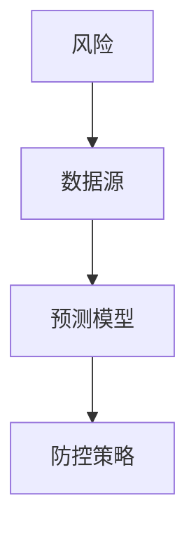
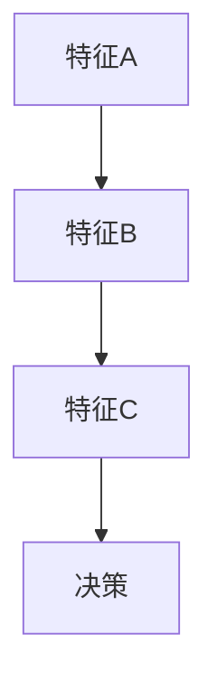
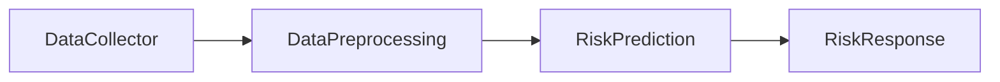

                 


# 构建智能企业风险管理系统：AI预测与防控

## 关键词：企业风险管理，人工智能，风险预测，防控策略，系统架构

## 摘要：  
随着企业经营环境的日益复杂化，传统的企业风险管理方法逐渐暴露出效率低下、覆盖面有限等问题。本文将深入探讨如何利用人工智能技术构建智能企业风险管理系统，通过AI预测与防控的结合，实现对企业风险的智能化识别、评估、预测与应对。文章将从核心概念、算法原理、系统架构到项目实战，全面解析智能企业风险管理系统的构建过程，并通过具体案例分析，展示AI技术在风险防控中的强大能力。

---

## 第一部分：智能企业风险管理系统的概述

### 第1章：企业风险管理的背景与挑战

#### 1.1 企业风险管理的背景
在当今全球化和信息化的商业环境中，企业面临的内外部风险种类和复杂性不断增加。从市场波动、供应链中断到政策变化、网络安全威胁，企业需要实时监测和应对各种潜在风险。传统的风险管理方法依赖于人工分析和经验判断，存在效率低、覆盖面有限、预测精度不足等问题。

#### 1.2 企业风险管理的核心目标
企业风险管理的核心目标是通过识别、评估、预测和应对潜在风险，降低损失，确保企业稳健运营。传统方法依赖于历史数据和人工经验，而智能化风险管理则通过AI技术实现数据驱动的实时预测和自动化应对。

#### 1.3 AI在企业风险管理中的作用
AI技术通过机器学习、深度学习和自然语言处理等手段，能够从海量数据中提取有价值的信息，构建风险预测模型，并实时监控潜在风险。AI的引入显著提高了风险管理的效率和精度，为企业提供更加智能化的解决方案。

---

### 第2章：智能企业风险管理的核心概念与联系

#### 2.1 风险管理的核心概念
- **风险识别**：通过数据分析和模型构建，识别潜在风险因素。
- **风险评估**：对识别出的风险进行量化评估，确定其影响程度。
- **风险预测**：利用AI算法预测风险发生的概率和时间。
- **风险应对**：根据预测结果制定应对策略，降低风险影响。

#### 2.2 AI在风险管理中的核心应用
- **数据驱动的预测模型**：通过机器学习算法训练模型，预测潜在风险。
- **实时监控与预警**：利用AI技术实时分析数据，触发预警机制。
- **自动化应对策略**：基于预测结果，系统自动生成应对方案。

#### 2.3 ER实体关系图架构


---

## 第二部分：AI预测与防控的算法原理

### 第3章：AI算法在风险管理中的应用

#### 3.1 常见AI算法及其应用
- **线性回归**：用于风险因素的量化分析。
- **决策树**：用于风险分类和预测。
- **随机森林**：用于处理高维数据，提高预测精度。
- **神经网络**：用于复杂非线性关系的建模。

#### 3.2 算法实现的Python代码
```python
import pandas as pd
from sklearn.model_selection import train_test_split
from sklearn.tree import DecisionTreeClassifier
from sklearn.metrics import accuracy_score

# 加载数据
data = pd.read_csv('risk_data.csv')
X = data.drop('risk', axis=1)
y = data['risk']

# 数据分割
X_train, X_test, y_train, y_test = train_test_split(X, y, test_size=0.2)

# 训练决策树模型
model = DecisionTreeClassifier()
model.fit(X_train, y_train)

# 预测与评估
y_pred = model.predict(X_test)
print("准确率:", accuracy_score(y_test, y_pred))
```

#### 3.3 算法原理的数学模型
线性回归模型的数学表达式为：
$$ y = \beta_0 + \beta_1x_1 + \beta_2x_2 + \dots + \beta_nx_n + \epsilon $$

决策树算法的分类逻辑可以用以下流程图表示：


---

## 第三部分：系统分析与架构设计

### 第4章：系统架构设计

#### 4.1 系统功能模块
- 数据采集模块：负责收集企业内外部数据。
- 数据预处理模块：清洗和转换数据，为模型提供输入。
- 风险预测模块：基于AI算法进行风险预测。
- 风险应对模块：根据预测结果生成应对策略。

#### 4.2 系统架构图


#### 4.3 接口设计
- 数据接口：与企业数据源对接，获取实时数据。
- 模型接口：与其他系统集成，提供风险预测服务。
- 用户接口：供企业管理人员查看风险报告和应对策略。

---

## 第四部分：项目实战

### 第5章：智能风险管理系统的实现

#### 5.1 环境安装
- 安装Python、Jupyter Notebook、Scikit-learn等工具。

#### 5.2 核心代码实现
```python
import numpy as np
from sklearn.ensemble import RandomForestClassifier

# 加载数据
data = np.loadtxt('risk_data.csv', delimiter=',')
X = data[:, :-1]
y = data[:, -1]

# 数据分割
X_train, X_test, y_train, y_test = train_test_split(X, y, test_size=0.2)

# 训练随机森林模型
model = RandomForestClassifier(n_estimators=100)
model.fit(X_train, y_train)

# 预测与评估
y_pred = model.predict(X_test)
print("准确率:", accuracy_score(y_test, y_pred))
```

#### 5.3 案例分析
以某企业为例，通过AI模型预测潜在的财务风险，并制定相应的应对策略，展示系统的实际应用效果。

---

## 第五部分：总结与展望

### 第6章：总结与展望

#### 6.1 系统优势
- 高效性：AI技术显著提高了风险预测的效率和精度。
- 智能性：系统能够自适应调整模型，优化预测结果。
- 实时性：实时监控和预警，帮助企业快速应对风险。

#### 6.2 展望
未来，随着AI技术的不断发展，智能企业风险管理系统将更加智能化和个性化，为企业提供更加全面的风险管理解决方案。

---

## 作者：AI天才研究院/AI Genius Institute & 禅与计算机程序设计艺术 /Zen And The Art of Computer Programming

