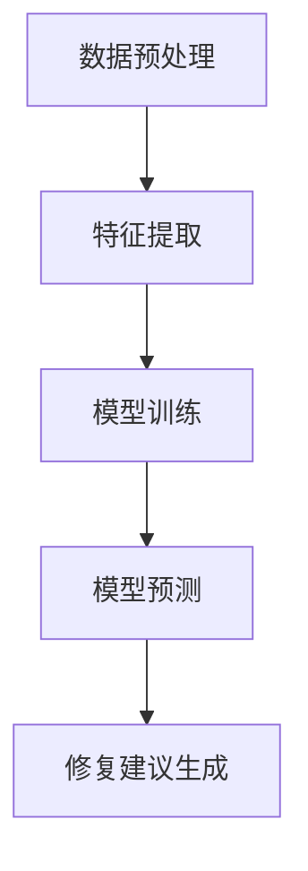
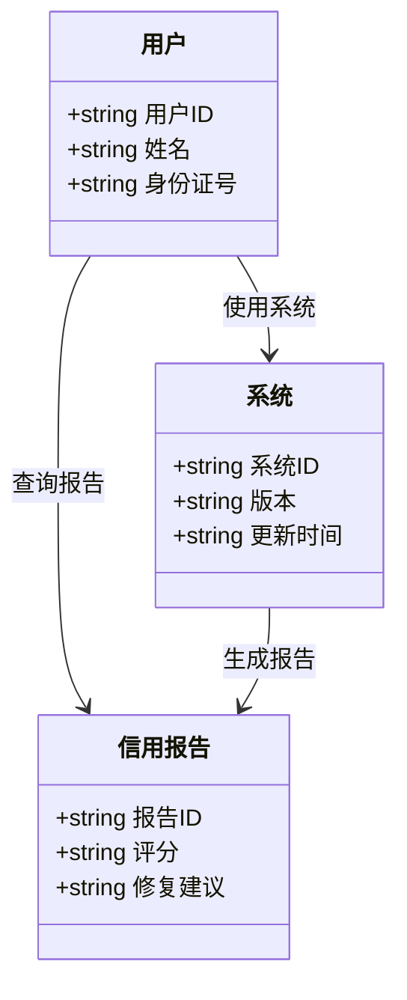

                 


# 构建智能化的个人信用修复助手系统

> 关键词：个人信用修复，信用评分模型，机器学习，智能化修复，数据处理

> 摘要：本文详细探讨了构建智能化个人信用修复助手系统的全过程，从背景介绍到系统架构设计，从算法实现到项目实战，全面分析了该系统的核心技术与实现方法。通过本文，读者可以深入了解信用评分模型的构建、智能化修复算法的设计与实现，以及系统架构的优化与扩展。

---

# 第一部分：背景介绍与核心概念

## 第1章：个人信用修复助手系统概述

### 1.1 问题背景与描述

#### 1.1.1 个人信用修复的重要性
在现代社会，个人信用记录的重要性不言而喻。无论是申请贷款、办理信用卡，还是租房、就业，信用记录都可能成为决定性因素。然而，由于各种原因，个人信用记录可能会出现负面信息，如逾期还款、违约记录等。修复信用记录不仅能够改善个人的财务状况，还能为未来提供更多机会。

#### 1.1.2 当前信用修复的主要痛点
1. **信息不透明**：个人难以了解自己的信用状况，也不知道如何有效修复。
2. **修复过程复杂**：传统信用修复过程涉及多个机构，流程繁琐，耗时较长。
3. **缺乏个性化建议**：不同人面临的信用问题不同，需要个性化的修复方案。

#### 1.1.3 信用修复助手系统的定位与目标
信用修复助手系统旨在通过智能化手段，帮助用户了解自己的信用状况，并提供个性化的修复建议。系统的目标是：
- 提供实时的信用评估服务。
- 自动生成修复计划。
- 监控修复进度，确保修复效果。

### 1.2 核心概念与问题解决

#### 1.2.1 信用评分模型的原理
信用评分模型是信用评估的核心工具。常见的评分模型包括FICO评分和Vantage评分。这些模型基于用户的信用历史、还款能力、信用使用情况等多个因素，计算出一个评分，反映用户的信用风险。

#### 1.2.2 智能化信用修复的实现路径
智能化信用修复助手系统通过以下步骤实现：
1. **数据采集**：收集用户的信用报告、银行流水、消费记录等数据。
2. **信用评估**：基于机器学习模型，评估用户的信用状况。
3. **修复建议**：根据评估结果，生成个性化的修复建议，如优化信用使用、增加信用记录等。

#### 1.2.3 边界与外延分析
信用修复助手系统的边界在于其仅提供修复建议，不直接操作用户的信用记录。系统的外延包括与银行、信用机构的接口对接，以及修复效果的长期监控。

### 1.3 系统核心要素与组成

#### 1.3.1 数据采集模块
数据采集模块负责从多个渠道获取用户的信用数据，包括：
- 信用报告：来自信用 bureau 的数据。
- 银行流水：用户的银行交易记录。
- 消费记录：用户的消费行为数据。

#### 1.3.2 信用评估模块
信用评估模块基于机器学习模型，对用户的信用状况进行评估。评估结果包括信用评分、风险等级等。

#### 1.3.3 修复建议模块
修复建议模块根据评估结果，生成个性化的修复建议。建议可能包括：
- 提高信用利用率。
- 及时还款，避免逾期。
- 建立新的信用记录。

---

## 第2章：核心概念与联系

### 2.1 核心概念原理

#### 2.1.1 信用评分模型的构建
信用评分模型通常采用逻辑回归或梯度提升树（如XGBoost、LightGBM）进行训练。模型的输入特征包括：
- 信用历史：如逾期次数、最长逾期天数。
- 还款能力：如收入、负债比。
- 信用使用情况：如信用卡利用率。

#### 2.1.2 智能化修复算法的实现
智能化修复算法基于强化学习或遗传算法，优化修复策略。算法的目标是最小化修复成本，同时最大化修复效果。

#### 2.1.3 数据处理与特征提取
数据处理包括数据清洗、特征工程等步骤。特征提取的目标是找到影响信用评分的关键因素，如用户的还款行为、消费习惯等。

### 2.2 核心概念对比表
以下表格对比了信用评分模型、智能化修复算法和数据特征的核心要素：

| 概念 | 描述 | 特性 |
|------|------|------|
| 信用评分模型 | 评估个人信用状况 | 客观性、准确性 |
| 智能化修复算法 | 自动优化修复方案 | 智能性、实时性 |
| 数据特征 | 影响信用评分的关键因素 | 关联性、可量化性 |

### 2.3 ER实体关系图
以下ER图展示了信用修复助手系统的实体关系：

```mermaid
erDiagram
    user [用户] {
        +string 用户ID
        +string 姓名
        +string 身份证号
    }
    credit_report [信用报告] {
        +string 报告ID
        +string 评分
        +string 修复建议
    }
    system [系统] {
        +string 系统ID
        +string 版本
        +string 更新时间
    }
    user --> credit_report : 查询报告
    user --> system : 使用系统
    system --> credit_report : 生成报告
```

---

## 第3章：算法原理与实现

### 3.1 算法原理

#### 3.1.1 信用评分模型的训练
信用评分模型的训练过程包括：
1. **数据预处理**：清洗数据，处理缺失值。
2. **特征提取**：选择对信用评分影响较大的特征。
3. **模型训练**：使用逻辑回归或随机森林进行训练。

#### 3.1.2 基于机器学习的修复建议生成
修复建议生成算法基于强化学习，通过模拟修复过程，找到最优修复策略。

#### 3.1.3 算法流程图
以下流程图展示了信用评分模型的训练过程：



### 3.2 算法实现

#### 3.2.1 信用评分模型的数学公式
信用评分模型通常采用逻辑回归模型：

$$ P(y=1) = \frac{e^{\beta_0 + \beta_1 x_1 + \beta_2 x_2 + \dots + \beta_n x_n}}{1 + e^{\beta_0 + \beta_1 x_1 + \beta_2 x_2 + \dots + \beta_n x_n}} $$

其中，$x_i$ 是输入特征，$\beta_i$ 是模型参数。

#### 3.2.2 Python代码实现
以下代码示例展示了信用评分模型的训练过程：

```python
import pandas as pd
from sklearn.linear_model import LogisticRegression
from sklearn.model_selection import train_test_split

# 数据加载
data = pd.read_csv('credit_data.csv')

# 特征选择
X = data[['收入', '负债', '信用利用率']]
y = data['信用评分']

# 数据划分
X_train, X_test, y_train, y_test = train_test_split(X, y, test_size=0.2, random_state=42)

# 模型训练
model = LogisticRegression()
model.fit(X_train, y_train)

# 模型预测
y_pred = model.predict(X_test)

print("模型准确率：", model.score(X_test, y_test))
```

---

## 第4章：系统分析与架构设计

### 4.1 问题场景介绍
信用修复助手系统需要处理多个场景，包括：
1. 用户查询信用报告。
2. 系统生成修复建议。
3. 监控修复进度。

### 4.2 项目介绍
本项目旨在构建一个智能化的信用修复助手系统，帮助用户快速修复信用记录。

### 4.3 系统功能设计

#### 4.3.1 领域模型
以下类图展示了系统的领域模型：



#### 4.3.2 系统架构设计
以下架构图展示了系统的整体架构：

```mermaid
archiDiagram
    系统边界
    数据采集模块
    信用评估模块
    修复建议模块
    用户界面
    数据存储
```

---

## 第5章：项目实战

### 5.1 环境安装

#### 5.1.1 安装Python
安装Python 3.8及以上版本。

#### 5.1.2 安装依赖
安装以下依赖：
```bash
pip install pandas scikit-learn mermaid4jupyter jupyterlab
```

### 5.2 系统核心实现

#### 5.2.1 数据处理代码
```python
import pandas as pd
from sklearn.impute import SimpleImputer
from sklearn.preprocessing import StandardScaler

# 数据加载
data = pd.read_csv('credit_data.csv')

# 处理缺失值
imputer = SimpleImputer(strategy='mean')
data_imputed = imputer.fit_transform(data)

# 标准化处理
scaler = StandardScaler()
data_scaled = scaler.fit_transform(data_imputed)
```

#### 5.2.2 模型训练代码
```python
from sklearn.linear_model import LogisticRegression
from sklearn.model_selection import train_test_split

X_train, X_test, y_train, y_test = train_test_split(data_scaled, data['信用评分'], test_size=0.2, random_state=42)

model = LogisticRegression()
model.fit(X_train, y_train)

print("模型准确率：", model.score(X_test, y_test))
```

---

## 第6章：总结与展望

### 6.1 最佳实践 tips
1. 数据清洗是关键，确保数据质量。
2. 选择合适的模型，避免过拟合。
3. 定期更新模型，适应市场变化。

### 6.2 小结
通过本文的详细讲解，读者可以掌握构建智能化个人信用修复助手系统的核心技术与实现方法。

### 6.3 注意事项
- 数据隐私保护是重中之重。
- 系统上线前进行充分测试。

### 6.4 拓展阅读
1. 《机器学习实战》
2. 《信用评分模型的构建与应用》

---

# 作者：AI天才研究院 & 禅与计算机程序设计艺术

---

本文详细介绍了构建智能化个人信用修复助手系统的全过程，从背景介绍到系统架构设计，从算法实现到项目实战，全面分析了该系统的核心技术与实现方法。通过本文，读者可以深入了解信用评分模型的构建、智能化修复算法的设计与实现，以及系统架构的优化与扩展。

