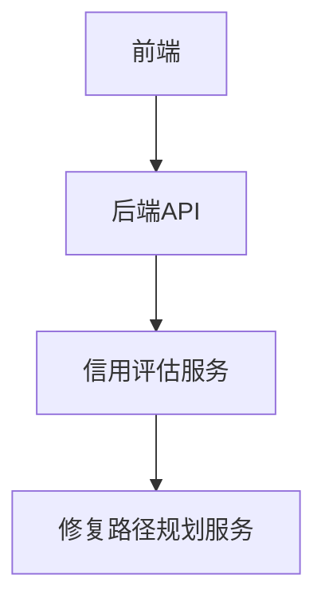
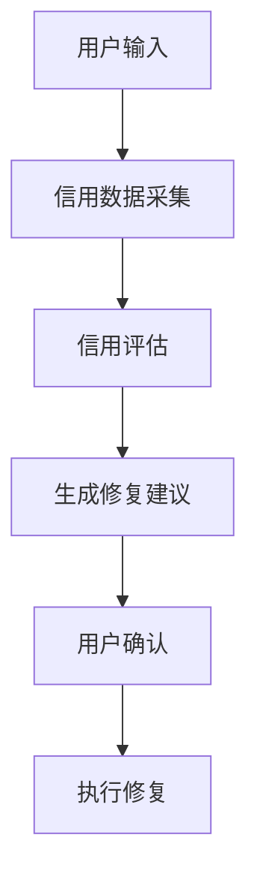

                 


# 构建智能化的个人信用修复路径规划系统

## 关键词：智能化、个人信用修复、路径规划、人工智能、系统架构

## 摘要

本文将详细探讨如何构建一个智能化的个人信用修复路径规划系统。通过对个人信用修复的背景分析、核心概念的阐述、系统架构的设计以及项目实战的展示，本文旨在为读者提供一套完整的解决方案，帮助个人高效地修复信用记录。我们将从系统的背景和核心概念入手，逐步深入分析其算法原理、系统架构设计、接口交互设计以及项目实现过程，最后通过实际案例展示系统的应用价值。

---

## 第一部分: 背景与核心概念

### 第1章: 个人信用修复的背景与问题描述

#### 1.1 信用修复的背景与意义

个人信用修复是现代社会中一个重要的问题。随着信用评分在金融、就业、租房等领域的广泛应用，个人信用记录的好坏直接影响到个人的生活质量。然而，由于各种原因，许多人可能因为逾期还款、违约行为等导致信用评分下降。传统的信用修复方法通常依赖于人工咨询和经验判断，效率低且缺乏个性化。在数字化时代，智能化的信用修复系统成为解决这一问题的关键。

#### 1.2 个人信用修复的核心问题

- **信用评分的计算逻辑**：信用评分通常基于个人的信用历史、还款能力、行为记录等因素，是一个复杂的评分系统。
- **信用修复的主要障碍**：包括信息不对称、修复路径不清晰、修复方法单一等。
- **信用修复的目标与边界**：目标是通过优化个人信用行为，提高信用评分；边界在于不涉及违法操作和不可行的修复方案。

### 第2章: 智能化信用修复系统的核心概念

#### 2.1 智能化信用修复系统的定义

智能化信用修复系统是一种基于人工智能技术，通过分析个人信用数据，提供个性化修复建议的系统。它能够自动识别信用问题、制定修复路径，并监控修复过程，确保修复方案的有效性。

#### 2.2 核心概念与联系

- **实体关系图（ER图）**：
  ```mermaid
  graph TD
    A[个人] --> B[信用记录]
    B --> C[信用评分]
    C --> D[修复建议]
  ```

  - 个人：系统的核心用户，拥有唯一的信用记录。
  - 信用记录：包括个人的借贷历史、还款记录等信息。
  - 信用评分：基于信用记录计算得出的分数，反映个人信用状况。
  - 修复建议：系统根据信用评分和修复目标生成的个性化修复方案。

---

## 第二部分: 系统设计与实现

### 第4章: 系统架构设计

#### 4.1 系统功能模块设计

- **数据采集模块**：负责收集个人信用数据，包括借贷记录、还款情况、消费行为等。
- **信用评估模块**：对个人信用数据进行分析，计算信用评分。
- **修复路径规划模块**：基于信用评分和修复目标，生成修复路径建议。
- **结果输出模块**：将修复建议以可视化形式呈现给用户。

#### 4.2 系统架构图



---

### 第5章: 系统接口与交互设计

#### 5.1 系统接口设计

- **数据接口**：用于与第三方信用机构对接，获取个人信用数据。
- **API接口**：提供给前端调用的接口，包括信用评分查询、修复建议生成等功能。

#### 5.2 系统交互流程图



---

## 第三部分: 项目实战

### 第6章: 项目实现与案例分析

#### 6.1 环境安装

- **技术选型**：
  - 前端：React.js
  - 后端：Python（Django框架）
  - 数据库：MySQL
  - 人工智能算法：基于Scikit-learn的机器学习模型

- **环境配置**：
  - 安装Python、Jupyter Notebook、Django、React.js等工具。

#### 6.2 核心代码实现

##### 信用评估模块代码

```python
from sklearn.linear_model import LinearRegression
import pandas as pd
import numpy as np

# 数据预处理
data = pd.read_csv('credit_data.csv')
X = data[['borrow_amount', ' repayment_history', 'credit_inquiry']]
y = data['credit_score']

# 训练模型
model = LinearRegression()
model.fit(X, y)

# 预测信用评分
def predict_credit_score(borrow_amount, repayment_history, credit_inquiry):
    return model.predict([[borrow_amount, repayment_history, credit_inquiry]])[0][0]
```

##### 修复路径规划模块代码

```python
import networkx as nx

def generate_repair_plan(credit_score):
    G = nx.DiGraph()
    G.add_nodes_from(['低分', '中分', '高分'])
    G.add_edges_from([('低分', '中分'), ('中分', '高分')])
    
    # 根据信用评分选择修复路径
    if credit_score < 500:
        return '低分 -> 中分 -> 高分'
    elif 500 <= credit_score < 700:
        return '中分 -> 高分'
    else:
        return '高分'

print(generate_repair_plan(600))
```

#### 6.3 实际案例分析

- **案例背景**：一位用户的信用评分为600分，希望通过修复提高至750分。
- **修复路径建议**：
  - 第一步：优化还款历史，确保按时还款。
  - 第二步：减少信用查询次数，降低信用负担。
  - 第三步：增加小额借款并按时还款，逐步提升信用评分。

---

## 第四部分: 总结与展望

### 7.1 系统总结

本文提出的智能化个人信用修复路径规划系统，通过人工智能算法和系统架构设计，为个人提供了一种高效、个性化的信用修复方法。系统的模块化设计和可视化界面，使得用户能够轻松理解和使用修复方案。

### 7.2 未来展望

未来，随着人工智能技术的不断发展，信用修复系统将更加智能化和个性化。可能的发展方向包括：
- **实时监控**：实时跟踪信用评分变化，动态调整修复方案。
- **多维度分析**：结合社交数据、消费行为等多种因素，提供更精准的修复建议。
- **自动化修复**：通过自动化手段，帮助用户自动完成部分信用修复工作。

---

## 作者：AI天才研究院/AI Genius Institute & 禅与计算机程序设计艺术 /Zen And The Art of Computer Programming

