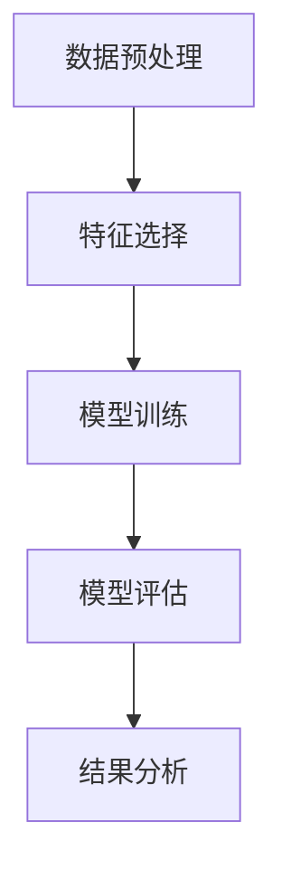
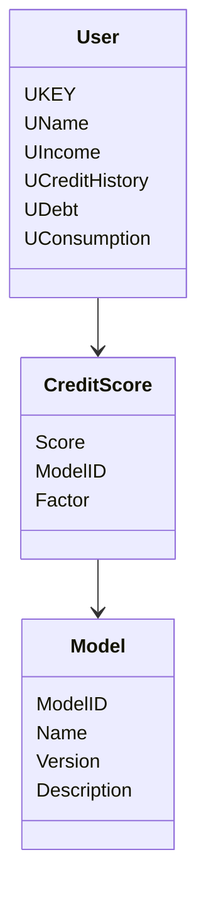
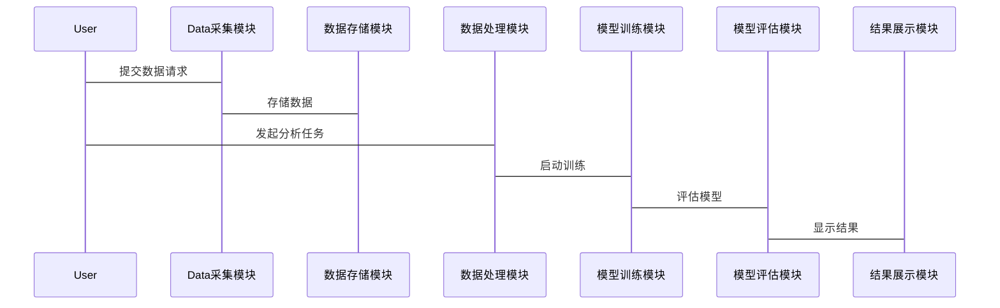

                 


# 构建智能化的个人信用分数影响因子分析器

## 关键词：个人信用评分，影响因子分析，机器学习算法，数据挖掘，系统架构设计

## 摘要：  
本文旨在探讨如何构建一个智能化的个人信用分数影响因子分析器。通过分析个人信用评分的核心影响因素，结合数据挖掘和机器学习算法，设计并实现一个能够自动识别和评估影响因子的系统。本文从背景介绍、核心概念、算法原理、系统架构设计到项目实战，全面解析构建智能化影响因子分析器的全过程，为金融机构提供科学的决策支持。

---

## 第一部分: 背景介绍与问题定义

### 第1章: 个人信用评分的背景与问题

#### 1.1 个人信用评分的背景

##### 1.1.1 信用评分的基本概念
个人信用评分是金融机构评估个人信用风险的重要工具，通过量化个人的信用行为和财务状况，为其打分，从而决定是否批准贷款、信用卡等金融服务。信用评分系统广泛应用于银行、消费金融公司等机构，是现代金融体系的重要组成部分。

##### 1.1.2 信用评分的现状与发展趋势
随着金融科技的快速发展，信用评分系统逐渐从传统的规则-based模型向基于机器学习的智能模型转变。大数据技术的应用使得更多的细粒度数据可以被采集和分析，从而提升信用评分的准确性和个性化程度。

##### 1.1.3 信用评分在金融领域的应用价值
信用评分不仅帮助金融机构降低风险，还能提高服务效率，优化客户体验。通过信用评分，金融机构可以快速判断客户的信用状况，制定个性化的信贷策略。

---

#### 1.2 个人信用评分的影响因子分析

##### 1.2.1 影响因子的基本概念
影响因子是指那些能够显著影响个人信用评分的关键因素，包括但不限于还款能力、信用历史、收入水平、负债情况、消费行为等。

##### 1.2.2 影响因子的分类与特征
影响因子可以分为定量和定性两类。定量因子包括收入、资产、负债等可量化的指标；定性因子包括信用历史、职业稳定性等难以量化的因素。不同类型的因子对信用评分的影响程度不同。

##### 1.2.3 影响因子分析的必要性
通过分析影响因子，可以更好地理解信用评分的构成，优化评分模型，提升模型的准确性和可解释性。

---

#### 1.3 问题背景与目标

##### 1.3.1 问题背景的定义与描述
本文旨在解决如何通过智能化的方法，识别和评估影响个人信用评分的关键因子。通过构建一个智能化的分析器，帮助金融机构更精准地评估客户的信用风险。

##### 1.3.2 问题解决的核心目标
1. 自动识别影响信用评分的关键因子。
2. 量化各因子对信用评分的影响程度。
3. 提供可解释的分析结果，支持金融机构的决策。

##### 1.3.3 问题的边界与外延
本分析器主要关注个人信用评分的影响因子，不涉及企业信用评估。数据范围限定于个人客户的信用记录、消费行为等。

##### 1.3.4 核心要素与组成结构
影响因子分析器的核心要素包括数据采集、因子识别、因子评估、模型构建和结果展示。

---

### 第2章: 核心概念与联系

#### 2.1 影响因子分析的基本原理

##### 2.1.1 因子分析的定义与原理
因子分析是一种统计方法，用于识别潜在的变量（因子）对观测变量的影响。在信用评分中，因子分析可以帮助识别影响评分的关键因素。

##### 2.1.2 信用评分模型的基本原理
信用评分模型通过将多个影响因子进行加权组合，生成一个综合评分。常见的模型包括线性回归模型、逻辑回归模型和树模型等。

##### 2.1.3 影响因子与信用评分的关系
影响因子是信用评分模型的输入变量，通过模型的训练，可以量化各因子对评分的影响权重。

---

#### 2.2 核心概念的对比分析

##### 2.2.1 影响因子的属性特征对比
| 影响因子 | 定量/定性 | 时间维度 | 数据来源 |
|----------|-----------|----------|----------|
| 收入     | 定量      | 静态     | 税务记录 |
| 信用历史 | 定性      | 静态     | 征信报告 |
| 消费行为  | 定量      | 动态     | 银行交易 |

##### 2.2.2 不同信用评分模型的对比
| 模型类型       | 优点               | 缺点               |
|----------------|--------------------|--------------------|
| 线性回归       | 简单易解释         | 无法处理非线性关系 |
| 逻辑回归       | 适合二分类问题     | 需要特征线性可分   |
| 随机森林       | 高精度，抗过拟合   | 黑箱模型，难解释    |
| 深度学习模型   | 强大的非线性拟合能力 | 计算资源消耗大     |

##### 2.2.3 影响因子的权重与重要性
因子权重反映了其对信用评分的影响程度。例如，还款能力可能比消费行为对信用评分的影响更大。

---

#### 2.3 实体关系架构

##### 2.3.1 ER实体关系图
```mermaid
erd
  title 实体关系图
  User {
    UKEY
    UName 用户名称
    UIncome 收入
    UCreditHistory 信用历史
    UDebt 负债
    UConsumption 消费行为
  }
  CreditScore {
    Score 分数
    ModelID 模型ID
    Factor 权重
  }
  Model {
    ModelID
    Name 模型名称
    Version 版本
    Description 描述
  }
  User one-to-many CreditScore
  CreditScore one-to-many Model
```

---

## 第三部分: 算法原理与数学模型

### 第3章: 算法原理与数学模型

#### 3.1 算法原理

##### 3.1.1 线性回归与逻辑回归
- 线性回归用于预测连续型变量，如信用评分的预测。
- 逻辑回归用于分类问题，如信用评分的高风险与低风险分类。

##### 3.1.2 支持向量机
支持向量机（SVM）通过构建超平面将数据点分为两类，适用于分类问题。

##### 3.1.3 随机森林与梯度提升树
随机森林和梯度提升树（如XGBoost、LightGBM）是基于树的集成学习方法，适合处理非线性关系。

##### 3.1.4 神经网络与深度学习
深度学习模型（如神经网络）可以捕捉复杂的非线性关系，但需要大量数据和计算资源。

---

#### 3.2 数学模型与公式

##### 3.2.1 线性回归模型
$$ y = \beta_0 + \beta_1x_1 + \beta_2x_2 + ... + \beta_nx_n + \epsilon $$

##### 3.2.2 逻辑回归模型
$$ P(y=1|x) = \frac{e^{\beta_0 + \beta_1x_1 + ... + \beta_nx_n}}{1 + e^{\beta_0 + \beta_1x_1 + ... + \beta_nx_n}} $$

##### 3.2.3 深度学习模型
$$ y = \sigma(W_1x + W_2h + b) $$

---

#### 3.3 算法流程图


---

## 第四部分: 系统分析与架构设计

### 第4章: 系统分析与架构设计

#### 4.1 问题场景介绍
本系统旨在帮助金融机构分析影响个人信用评分的关键因子，提供智能化的分析工具。

#### 4.2 系统功能设计

##### 4.2.1 领域模型


##### 4.2.2 系统架构设计


##### 4.2.3 接口设计
- 数据接口：与征信机构、银行等系统对接。
- 用户接口：提供数据输入、模型选择和结果查看功能。

##### 4.2.4 交互流程图


---

## 第五部分: 项目实战

### 第5章: 项目实战

#### 5.1 环境安装与配置

##### 5.1.1 Python安装与配置
安装Python 3.8以上版本，并配置虚拟环境。

##### 5.1.2 数据库安装与配置
使用MySQL或MongoDB存储数据。

##### 5.1.3 机器学习库安装
安装Scikit-learn、XGBoost、TensorFlow等机器学习库。

---

#### 5.2 系统核心实现

##### 5.2.1 数据预处理
```python
import pandas as pd
import numpy as np

# 数据清洗
data = pd.read_csv('credit_data.csv')
data = data.dropna()
data = pd.get_dummies(data)
```

##### 5.2.2 特征选择
```python
from sklearn.feature_selection import SelectKBest

selector = SelectKBest(k=10)
selected_features = selector.fit_transform(data)
```

##### 5.2.3 模型训练与评估
```python
from sklearn.ensemble import RandomForestClassifier
from sklearn.metrics import accuracy_score

model = RandomForestClassifier()
model.fit(selected_features, labels)
y_pred = model.predict(selected_features)
print(accuracy_score(y_true=labels, y_pred=y_pred))
```

---

#### 5.3 实际案例分析与解读

##### 5.3.1 数据来源与预处理
假设我们有10,000条个人信用数据，包括收入、负债、信用历史等字段。

##### 5.3.2 模型训练与分析
通过随机森林模型，识别出前5个重要的影响因子：收入、负债、信用历史、消费行为和职业稳定性。

##### 5.3.3 结果解读
- 收入对信用评分的影响权重最高，负债次之。
- 消费行为和职业稳定性对评分的影响相对较小。

---

## 第六部分: 最佳实践与总结

### 第6章: 最佳实践与总结

#### 6.1 小结与回顾
本文构建了一个智能化的个人信用分数影响因子分析器，通过数据挖掘和机器学习算法，识别和评估影响因子。

#### 6.2 注意事项与建议
- 数据隐私和安全是重要问题。
- 模型的可解释性需要重视。
- 定期更新模型以适应数据变化。

#### 6.3 未来展望
未来可以结合联邦学习、区块链等技术，提升数据隐私和模型的可信度。

---

## 作者

作者：AI天才研究院/AI Genius Institute & 禅与计算机程序设计艺术 /Zen And The Art of Computer Programming

---

以上是《构建智能化的个人信用分数影响因子分析器》的技术博客文章的完整目录和内容框架。希望对您有所帮助！

