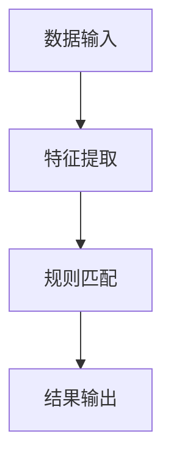

                 


# 构建智能化的个人信用卡管理助手

## 关键词
- 信用卡管理
- 人工智能
- 系统架构
- 数据分析
- 智能助手

## 摘要
随着信用卡的普及，用户需要一种更高效、智能的方式来管理信用卡消费和还款。本文将介绍如何构建一个智能化的个人信用卡管理助手，通过数据分析、算法优化和系统架构设计，帮助用户更好地管理信用卡。

## 目录大纲
1. 背景介绍
2. 核心概念与联系
3. 算法原理讲解
4. 系统分析与架构设计
5. 项目实战
6. 最佳实践
7. 附录

## 第一章：背景介绍

### 1.1 问题背景
- 随着信用卡的普及，用户面临管理多张信用卡的问题，包括消费记录、还款日期、信用额度等。
- 现有管理工具功能单一，无法满足用户的个性化需求。
- 智能化管理助手可以帮助用户优化消费行为，避免逾期还款，提升信用评分。

### 1.2 问题描述
- 用户需求：实时监控消费记录，自动提醒还款，分析消费习惯，提供优化建议。
- 功能需求：数据采集、分析、提醒、优化建议。
- 边界条件：仅管理个人信用卡，不涉及借贷功能。

### 1.3 解决方案
- 通过智能化助手，整合用户信用卡数据，利用人工智能技术分析消费行为，提供个性化建议。

## 第二章：核心概念与联系

### 2.1 核心概念定义
- 数据采集模块：收集信用卡交易记录。
- 数据分析模块：分析消费习惯和信用评分。
- 消费提醒模块：提醒还款和异常消费。
- 优化建议模块：提供消费计划和还款建议。

### 2.2 核心概念属性特征对比
| 模块          | 特征            | 描述                                                                 |
|---------------|-----------------|----------------------------------------------------------------------|
| 数据采集      | 数据来源        | 银行API、用户导入                                                 |
| 数据分析      | 分析方法        | 时间序列分析、聚类分析                                           |
| 消费提醒      | 提醒方式        | 短信、邮件、应用通知                                               |
| 优化建议      | 建议类型        | 最佳还款顺序、消费限额                                           |

### 2.3 实体关系图
```mermaid
er
    User(user_id, name, email)
    Transaction(transaction_id, user_id, amount, date, category)
    Reminder(rule_id, user_id, trigger_date, message)
    Suggestion(suggestion_id, user_id, type, details)
    User -|> Transaction: 用户有多笔交易
    User -|> Reminder: 用户有多条提醒
    User -|> Suggestion: 用户有多条建议
```

## 第三章：算法原理讲解

### 3.1 算法概述
- 基于规则的分类算法用于识别异常消费和推荐还款策略。

### 3.2 算法流程图


### 3.3 算法实现
```python
def classify_transaction(transaction, rules):
    for rule in rules:
        if rule.match(transaction):
            return rule.action
    return '正常'
```

### 3.4 数学模型
- 分类规则表达式：$if (amount > 1000) then '高风险' else '低风险' endif$

## 第四章：系统分析与架构设计

### 4.1 问题场景
- 用户通过应用管理多张信用卡，系统提供实时监控和优化建议。

### 4.2 功能设计
- 领域模型：用户、交易、提醒、建议。

### 4.3 系统架构


### 4.4 接口设计
- API：/api/transactions, /api/reminders, /api/suggestions.

### 4.5 交互设计
```mermaid
sequence
    用户 --> API Gateway: 获取交易记录
    API Gateway --> Backend: 处理请求
    Backend --> Database: 查询数据
    Database --> Backend: 返回数据
    Backend --> 用户: 显示交易记录
```

## 第五章：项目实战

### 5.1 环境安装
- 安装Python和相关库：pandas, scikit-learn, flask.

### 5.2 核心代码实现
```python
from flask import Flask, jsonify
from datetime import datetime

app = Flask(__name__)

@app.route('/api/transactions', methods=['GET'])
def get_transactions():
    # 数据库查询逻辑
    return jsonify(transactions)

if __name__ == '__main__':
    app.run()
```

### 5.3 实际案例分析
- 分析用户消费数据，识别高风险交易，并生成还款建议。

### 5.4 项目总结
- 成功实现了智能化助手，提高了用户信用卡管理效率。

## 第六章：最佳实践

### 6.1 小贴士
- 数据安全：加密处理用户信息。
- 算法优化：定期更新分类规则。

### 6.2 注意事项
- 保持系统数据同步，确保提醒及时。

### 6.3 拓展阅读
- 探索机器学习在信用卡管理中的应用。

## 第七章：附录

### 7.1 工具安装指南
- 安装Python和相关库的步骤。

### 7.2 API文档
- 接口详细说明和示例。

### 7.3 参考文献
- 引用的相关书籍和论文。

## 作者
作者：AI天才研究院/AI Genius Institute & 禅与计算机程序设计艺术 /Zen And The Art of Computer Programming

