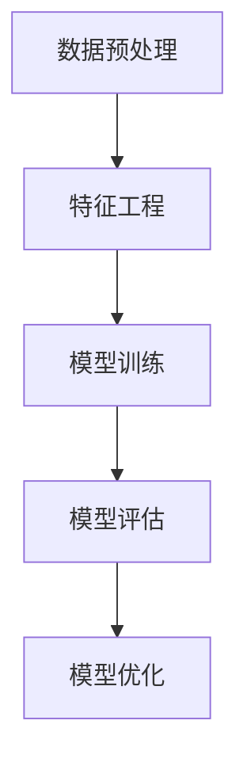
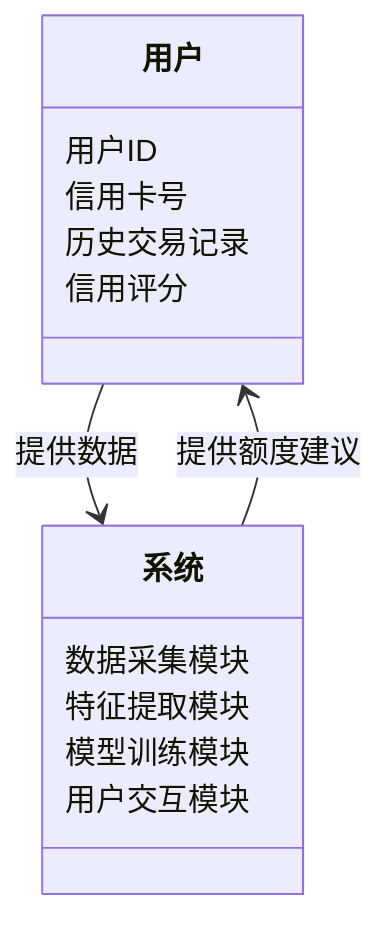
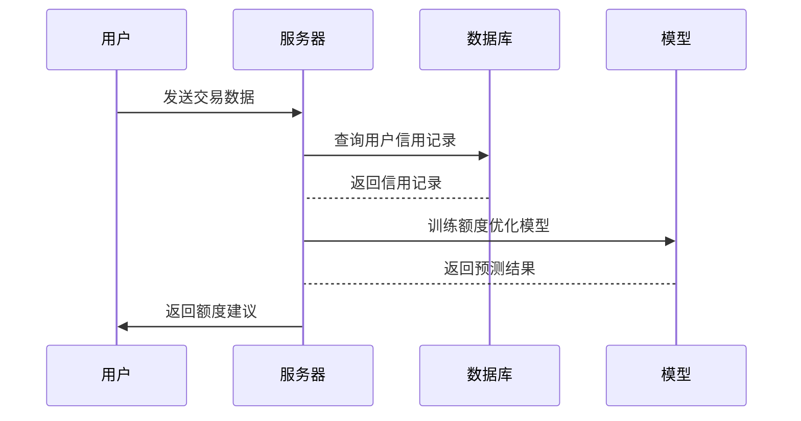

                 


# 构建智能化的个人信用卡额度管理优化助手

## 关键词：人工智能，信用卡额度，智能优化，数据分析，机器学习

## 摘要：  
本文探讨如何利用人工智能技术构建个人信用卡额度管理优化助手，通过数据分析、特征工程、机器学习模型训练等方法，实现对信用卡额度的智能化管理。文章从问题背景、核心概念、算法原理、系统架构到项目实战，全面解析该系统的设计与实现。

---

# 第一部分：背景介绍

## 第1章：个人信用卡额度管理优化助手的背景与问题

### 1.1 问题背景

- **1.1.1 信用卡额度管理的重要性**  
  信用卡额度直接关系到用户的消费能力、信用评分和银行的风险控制。合理管理信用卡额度，既能提升用户体验，又能帮助银行降低风险。

- **1.1.2 当前信用卡额度管理的痛点**  
  - 用户难以实时了解额度调整情况。  
  - 银行依赖人工或简单规则进行额度调整，效率低且不够精准。  
  - 用户行为与额度调整之间缺乏动态关联。

- **1.1.3 智能化管理的必要性**  
  随着大数据和人工智能技术的发展，通过智能化手段优化信用卡额度管理成为可能。

### 1.2 问题描述

- **1.2.1 信用卡额度管理的核心问题**  
  如何基于用户交易数据、信用记录和行为特征，动态调整信用卡额度，以最大化用户满意度和银行收益。

- **1.2.2 数据驱动的优化需求**  
  利用历史数据和实时数据，构建数据驱动的额度优化模型。

- **1.2.3 用户行为与信用评估的关系**  
  用户的消费行为、还款习惯等直接影响信用卡额度的调整。

### 1.3 解决方案概述

- **1.3.1 智能化助手的目标**  
  实现实时数据采集、智能分析和动态调整信用卡额度。

- **1.3.2 技术实现路径**  
  通过机器学习算法，基于用户特征和行为数据，预测最佳额度调整方案。

- **1.3.3 预期效果与价值**  
  提高用户满意度，降低银行风险，实现双赢。

### 1.4 边界与外延

- **1.4.1 系统的边界**  
  仅关注信用卡额度的智能化管理，不涉及其他银行产品或服务。

- **1.4.2 相关概念的外延**  
  信用卡额度管理与其他信用评估模型（如信用评分模型）密切相关。

- **1.4.3 与其他系统的区别**  
  与其他信用评分系统不同，本系统更关注动态额度调整而非静态信用评分。

### 1.5 核心要素组成

- **1.5.1 数据来源**  
  用户交易数据、信用记录、消费行为数据。

- **1.5.2 智能算法**  
  机器学习模型（如随机森林、梯度提升树）。

- **1.5.3 用户交互界面**  
  移动端或网页端的用户界面，展示额度调整建议和历史记录。

---

# 第二部分：核心概念与联系

## 第2章：核心概念与系统架构

### 2.1 核心概念原理

- **2.1.1 数据采集与处理**  
  从银行数据库中提取用户交易数据、信用评分和消费行为数据。

- **2.1.2 特征提取与分析**  
  从数据中提取关键特征（如交易频率、平均额度使用率、逾期记录）。

- **2.1.3 模型训练与优化**  
  使用机器学习算法训练额度优化模型，并通过交叉验证优化模型性能。

### 2.2 核心概念对比表

| 特征属性 | 描述 | 示例 |
|----------|------|------|
| 数据类型 | 用户交易记录、信用评分 | 结构化数据 |
| 时间范围 | 近期交易记录 | 过去6个月 |
| 影响权重 | 交易频率、逾期记录 | 0.3、0.7 |

### 2.3 ER实体关系图

```mermaid
er
actor(用户)
actor(银行)
entity(信用卡)
entity(交易记录)
entity(信用评分)
```

---

# 第三部分：算法原理

## 第3章：基于机器学习的信用卡额度优化算法

### 3.1 算法原理

- **3.1.1 数据预处理**  
  数据清洗、特征选择和数据标准化。

- **3.1.2 特征工程**  
  通过特征组合和特征变换，提取更有代表性的特征。

- **3.1.3 模型训练**  
  使用随机森林或梯度提升树模型，训练信用卡额度优化模型。

### 3.2 算法流程图



### 3.3 Python实现

```python
import pandas as pd
from sklearn.ensemble import GradientBoostingRegressor
from sklearn.model_selection import train_test_split
from sklearn.metrics import mean_absolute_error

# 数据加载与处理
data = pd.read_csv('credit_card_data.csv')
X = data.drop('target', axis=1)
y = data['target']

# 划分训练集和测试集
X_train, X_test, y_train, y_test = train_test_split(X, y, test_size=0.2, random_state=42)

# 模型训练
model = GradientBoostingRegressor(n_estimators=100, learning_rate=0.1, random_state=42)
model.fit(X_train, y_train)

# 模型评估
y_pred = model.predict(X_test)
mae = mean_absolute_error(y_test, y_pred)
print(f'Mean Absolute Error: {mae}')
```

### 3.4 数学模型与公式

- **目标函数**：  
  最小化预测额度与实际额度的差异。  
  $$ \text{目标函数} = \min \sum_{i=1}^{n} (y_i - \hat{y}_i)^2 $$  

- **模型预测**：  
  使用梯度提升树进行预测，$$ \hat{y}_i = \text{模型预测值} $$  

---

# 第四部分：系统分析与架构设计

## 第4章：系统分析与架构设计

### 4.1 问题场景介绍

- **用户场景**：用户希望实时了解信用卡额度调整建议，银行希望动态优化额度以降低风险。

### 4.2 系统功能设计

- **4.2.1 功能模块**  
  数据采集模块、特征提取模块、模型训练模块、用户交互模块。

### 4.3 领域模型



### 4.4 系统架构设计


### 4.5 接口设计

- **API接口**  
  - POST /api/data: 提交用户数据  
  - GET /api/predict: 获取额度预测结果  

### 4.6 交互流程



---

# 第五部分：项目实战

## 第5章：项目实战与案例分析

### 5.1 环境安装

- **安装Python库**：  
  pip install pandas scikit-learn mermaid4jupyter

### 5.2 核心代码实现

```python
import pandas as pd
from sklearn.ensemble import GradientBoostingRegressor
from sklearn.model_selection import train_test_split
from sklearn.metrics import mean_absolute_error

# 数据加载与处理
data = pd.read_csv('credit_card_data.csv')
X = data.drop('target', axis=1)
y = data['target']

# 划分训练集和测试集
X_train, X_test, y_train, y_test = train_test_split(X, y, test_size=0.2, random_state=42)

# 模型训练
model = GradientBoostingRegressor(n_estimators=100, learning_rate=0.1, random_state=42)
model.fit(X_train, y_train)

# 模型评估
y_pred = model.predict(X_test)
mae = mean_absolute_error(y_test, y_pred)
print(f'Mean Absolute Error: {mae}')
```

### 5.3 案例分析

- **案例1**：用户A，过去6个月平均额度使用率80%，无逾期记录，预测额度提升10%。
- **案例2**：用户B，频繁超额消费，预测额度降低5%。

### 5.4 项目小结

通过本项目，我们成功构建了一个智能化的信用卡额度管理优化助手，能够实时分析用户数据并提供动态额度调整建议。

---

# 第六部分：最佳实践

## 第6章：总结与展望

### 6.1 小结

本文详细介绍了如何构建智能化的个人信用卡额度管理优化助手，从背景分析、核心概念、算法实现到系统设计和项目实战，全面解析了该系统的实现过程。

### 6.2 注意事项

- 数据隐私保护：确保用户数据的安全性和隐私性。  
- 模型解释性：优化模型的可解释性，便于用户理解额度调整原因。  
- 系统稳定性：确保系统的高可用性和实时性。

### 6.3 拓展阅读

- 《Python机器学习实战》  
- 《数据驱动的信用评分模型构建》  
- 《基于AI的金融风险管理》

---

# 作者

作者：AI天才研究院/AI Genius Institute & 禅与计算机程序设计艺术 /Zen And The Art of Computer Programming

