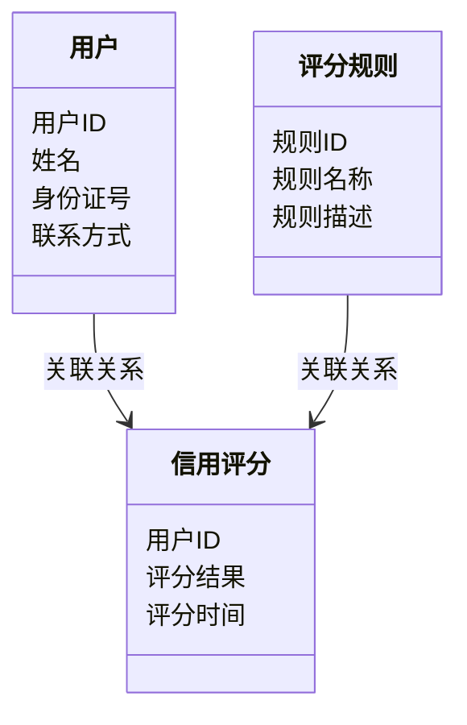

                 


# 构建智能化的个人信用评分解释系统

## 关键词
- 个人信用评分
- 人工智能
- 解释系统
- 机器学习
- 自然语言处理

## 摘要
随着人工智能和大数据技术的快速发展，个人信用评分系统在金融领域发挥着越来越重要的作用。然而，现有的信用评分系统往往缺乏透明度和可解释性，导致用户信任度不足。本文将详细介绍如何构建一个智能化的个人信用评分解释系统，涵盖系统的背景与概述、核心概念与技术基础、算法原理、系统分析与架构设计、项目实战以及总结与展望。通过本文的讲解，读者将能够理解如何利用机器学习和自然语言处理技术，构建一个高效、透明且易于解释的个人信用评分系统。

---

## 第一部分: 个人信用评分解释系统背景与概述

### 第1章: 个人信用评分的重要性与挑战

#### 1.1 信用评分的核心概念

##### 1.1.1 信用评分的定义与作用
信用评分是通过分析个人的信用历史、财务状况和行为数据，评估其信用风险的量化指标。信用评分的作用包括预测违约风险、辅助贷款决策、优化资源配置等。

##### 1.1.2 信用评分在金融领域的应用
信用评分广泛应用于银行贷款审批、信用卡额度设定、信用报告生成等领域，是金融机构风险管理的重要工具。

##### 1.1.3 信用评分系统的关键要素
信用评分系统的关键要素包括数据来源、评分模型、评分标准和评分输出等。

#### 1.2 个人信用评分的挑战

##### 1.2.1 数据获取与处理的难点
信用评分需要依赖多源异构数据，包括银行流水、信用报告、社交数据等，数据清洗和整合的难度较大。

##### 1.2.2 模型解释性与可信赖性
复杂的机器学习模型（如深度学习）往往缺乏可解释性，导致用户难以理解评分结果的依据，影响系统的可信度。

##### 1.2.3 系统的实时性与高效性
个人信用评分需要实时更新，对系统的计算效率和响应速度提出了较高的要求。

#### 1.3 构建智能化解释系统的必要性

##### 1.3.1 提高信用评分的透明度
通过可解释的评分系统，用户可以了解评分结果的依据，增强信任感。

##### 1.3.2 增强用户信任与合规性
可解释的评分系统有助于避免算法偏见，确保评分过程的公平性和合规性。

##### 1.3.3 优化信用评估的效率与准确性
智能化的解释系统可以通过特征工程和模型优化，提高评分的准确性和效率。

### 第2章: 信用评分系统的法律与伦理考量

#### 2.1 信用评分的法律框架

##### 2.1.1 数据隐私与保护
个人信用数据属于敏感信息，必须遵守数据隐私保护的相关法律法规，如《个人数据保护法》。

##### 2.1.2 反歧视与公平性要求
信用评分系统应避免基于种族、性别等敏感因素的歧视，确保评分的公平性。

##### 2.1.3 合规性与监管要求
信用评分系统需符合金融监管机构的合规要求，确保评分过程的透明和可追溯。

#### 2.2 信用评分系统的伦理问题

##### 2.2.1 避免算法偏见
在数据 preprocessing 和模型训练过程中，需注意避免算法偏见，确保评分结果的公正性。

##### 2.2.2 保护用户隐私
在处理个人数据时，需严格遵守隐私保护原则，避免数据泄露和滥用。

##### 2.2.3 透明化与可解释性
评分系统应向用户解释评分结果的依据，增强用户的信任感。

#### 2.3 系统设计中的法律与伦理平衡

##### 2.3.1 如何在系统中实现合规性
通过数据加密、访问控制等技术手段，确保数据处理的合规性。

##### 2.3.2 伦理设计的实践方法
在系统设计中融入伦理考量，确保评分过程的公平性和透明性。

##### 2.3.3 法律与伦理的动态变化
随着法律法规和伦理观念的变化，系统需不断优化和调整，以适应新的要求。

---

## 第二部分: 核心概念与技术基础

### 第3章: 信用评分的核心技术与算法

#### 3.1 信用评分的数学模型

##### 3.1.1 线性回归模型
线性回归模型是一种简单的评分模型，适用于线性关系的场景。其数学公式为：
$$ y = \beta_0 + \beta_1x_1 + \beta_2x_2 + ... + \beta_nx_n $$
其中，$y$ 是预测的信用评分，$x_i$ 是特征变量，$\beta_i$ 是模型参数。

##### 3.1.2 逻辑回归模型
逻辑回归模型常用于分类问题，其输出结果为概率值。其数学公式为：
$$ P(y=1|x) = \frac{e^{\beta_0 + \beta_1x_1 + ... + \beta_nx_n}}{1 + e^{\beta_0 + \beta_1x_1 + ... + \beta_nx_n}} $$

##### 3.1.3 支持向量机模型
支持向量机（SVM）是一种常用的分类算法，适用于高维数据的分类问题。

#### 3.2 机器学习在信用评分中的应用

##### 3.2.1 监督学习与无监督学习
监督学习适用于有标签的数据，如信用评分分类；无监督学习适用于无标签数据的聚类分析。

##### 3.2.2 特征选择与降维技术
特征选择通过选择重要的特征变量，提高模型的性能和效率；降维技术如主成分分析（PCA）可以降低数据维度。

##### 3.2.3 模型评估与优化
模型评估指标包括准确率、召回率、F1值等；模型优化方法包括参数调优、交叉验证等。

#### 3.3 自然语言处理在信用报告解读中的应用

##### 3.3.1 NLP的基本概念与技术
自然语言处理（NLP）技术包括文本分词、句法分析、情感分析等。

##### 3.3.2 信用报告文本分析的NLP方法
通过NLP技术，可以提取信用报告中的关键词和情感倾向，辅助信用评分。

##### 3.3.3 基于NLP的信用评分优化
结合NLP和机器学习技术，可以提高信用评分的准确性和解释性。

### 第4章: 评分模型的构建与优化

#### 4.1 评分模型的构建流程

##### 4.1.1 数据收集与预处理
数据收集包括从银行、征信机构等渠道获取数据；数据预处理包括数据清洗、特征提取等。

##### 4.1.2 特征工程与选择
特征工程通过选择和构造特征变量，提高模型的性能；特征选择包括基于统计的特征选择和基于模型的特征选择。

##### 4.1.3 模型训练与验证
模型训练通过优化算法和调整参数，提高模型的性能；模型验证通过交叉验证等方法评估模型的泛化能力。

#### 4.2 模型优化与调参

##### 4.2.1 参数优化方法
参数优化方法包括网格搜索、随机搜索和贝叶斯优化等。

##### 4.2.2 模型评估指标
模型评估指标包括准确率、精确率、召回率、F1值等。

##### 4.2.3 模型部署与监控
模型部署后需要进行实时监控，及时发现模型性能下降的问题。

#### 4.3 模型的可解释性与透明度

##### 4.3.1 可解释性的重要性
可解释的模型有助于用户理解评分结果的依据，增强系统的可信度。

##### 4.3.2 提高模型可解释性的方法
包括使用线性模型、特征重要性分析、局部可解释性方法等。

##### 4.3.3 可解释性与模型性能的平衡
在提高可解释性的过程中，需注意避免牺牲模型的性能。

---

## 第三部分: 系统分析与架构设计

### 第5章: 系统分析与架构设计

#### 5.1 问题场景介绍
个人信用评分系统需要处理多源异构数据，支持实时评分和解释性要求。

#### 5.2 系统功能设计

##### 5.2.1 领域模型
领域模型包括用户实体、信用评分实体、评分规则实体等。

##### 5.2.2 领域模型图


#### 5.3 系统架构设计

##### 5.3.1 系统架构图
```mermaid
client
    web
    mobile
server
    apiGateway
        controller
            service
                repository
                    database
                    cache
```

##### 5.3.2 接口设计
系统接口包括数据接口、评分接口、解释接口等。

##### 5.3.3 系统交互设计
系统交互设计包括用户请求评分、系统计算评分、返回评分结果和解释信息。

#### 5.4 系统实现方案

##### 5.4.1 技术选型
技术选型包括前端框架、后端框架、数据库选型、机器学习框架等。

##### 5.4.2 系统实现步骤
系统实现步骤包括需求分析、系统设计、编码实现、测试优化、部署上线等。

---

## 第四部分: 项目实战

### 第6章: 项目实战

#### 6.1 环境安装

##### 6.1.1 安装Python
安装Python 3.x版本，并配置环境变量。

##### 6.1.2 安装依赖库
安装必要的Python库，如scikit-learn、pandas、numpy等。

##### 6.1.3 安装NLP工具
安装NLP相关的工具，如spaCy、jieba等。

#### 6.2 系统核心实现

##### 6.2.1 数据预处理代码
```python
import pandas as pd
import numpy as np

# 读取数据
data = pd.read_csv('credit_data.csv')

# 数据清洗
data.dropna(inplace=True)
data = pd.get_dummies(data)
```

##### 6.2.2 模型训练代码
```python
from sklearn.linear_model import LogisticRegression
from sklearn.model_selection import train_test_split

# 划分训练集和测试集
X_train, X_test, y_train, y_test = train_test_split(data.drop('score', axis=1), data['score'], test_size=0.2)

# 训练模型
model = LogisticRegression()
model.fit(X_train, y_train)

# 模型评估
print('Accuracy:', model.score(X_test, y_test))
```

##### 6.2.3 解释系统实现
```python
def explain_prediction(model, feature_names, sample):
    importances = model.coef_[0]
    feature_importances = dict(zip(feature_names, importances))
    return feature_importances

# 解释具体样例
feature_names = X_train.columns.tolist()
sample = X_test.iloc[0]
print(explain_prediction(model, feature_names, sample))
```

#### 6.3 案例分析与实际应用

##### 6.3.1 案例分析
通过具体案例分析，展示系统的实际应用效果和解释能力。

##### 6.3.2 优化建议
根据案例分析结果，提出系统的优化建议。

#### 6.4 项目总结

##### 6.4.1 项目成果
总结项目的成果和意义。

##### 6.4.2 项目经验
总结项目实施过程中的经验教训。

##### 6.4.3 未来展望
展望系统的未来发展方向。

---

## 第五部分: 总结与展望

### 第7章: 总结与展望

#### 7.1 系统总结

##### 7.1.1 系统特点
系统的智能化、透明化和高效性特点。

##### 7.1.2 系统优势
系统的高准确率、高解释性和高效率优势。

#### 7.2 系统优化与改进

##### 7.2.1 系统优化方向
优化方向包括算法优化、系统性能优化、用户体验优化等。

##### 7.2.2 技术创新点
技术创新点包括基于NLP的信用评分优化、可解释性模型的应用等。

#### 7.3 未来展望

##### 7.3.1 人工智能技术的发展
人工智能技术的进一步发展对信用评分系统的影响。

##### 7.3.2 信用评分系统的未来方向
信用评分系统的未来发展方向，包括智能化、个性化、实时化等。

---

## 作者

作者：AI天才研究院/AI Genius Institute & 禅与计算机程序设计艺术 /Zen And The Art of Computer Programming

---

**本文是基于《构建智能化的个人信用评分解释系统》这一主题，以技术博客的形式进行的详细阐述。通过本文的讲解，读者可以系统地了解如何利用人工智能和大数据技术，构建一个高效、透明且易于解释的个人信用评分系统。**

