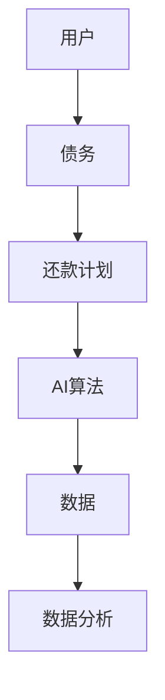
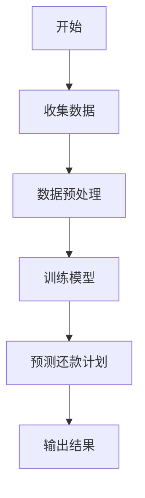
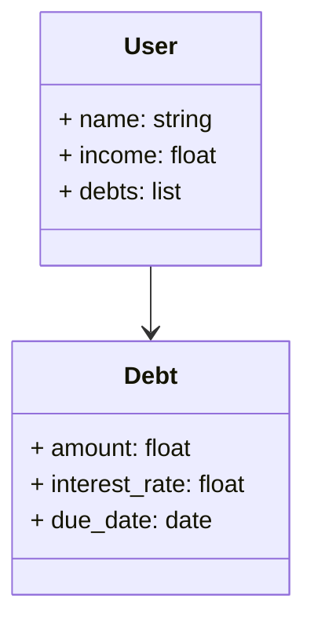
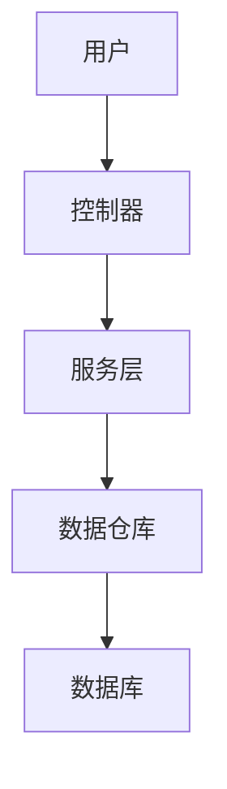
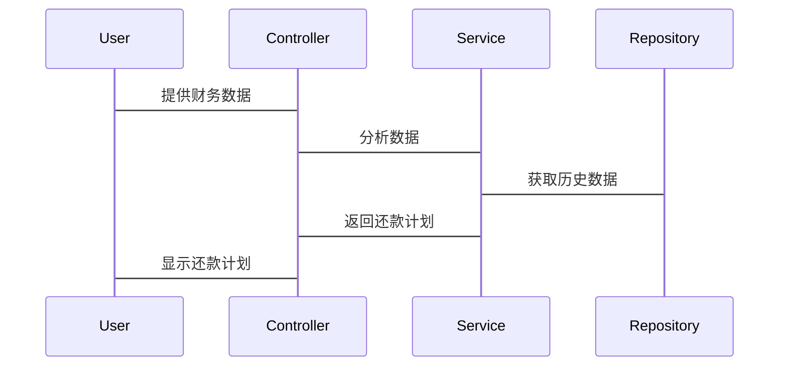

                 


# 《构建智能化的个人债务管理助手》

## 关键词：个人债务管理、人工智能、智能化助手、算法原理、系统架构、项目实战

## 摘要：  
智能化的个人债务管理助手通过结合人工智能技术，帮助个人优化债务结构、制定还款计划并实现财务健康。本文从背景、核心概念、算法原理、系统架构到项目实战，全面分析智能化债务管理助手的构建过程，旨在为读者提供理论与实践相结合的深度解析。

---

## 第一部分: 智能化个人债务管理助手的背景与核心概念

### 第1章: 个人债务管理的背景与问题描述

#### 1.1 个人债务管理的现状与挑战
- **1.1.1 个人债务管理的核心问题**  
  债务管理的核心问题在于如何在有限的收入下，合理分配资金用于偿还不同债务，同时优化还款顺序以降低总体利息支出。  
  例如，假设某人欠两笔债务：一笔高利率的信用卡债务和一笔低利率的房贷债务。优化还款顺序可以有效降低总体利息支出。

- **1.1.2 当前债务管理的主要痛点**  
  - 债务信息分散，难以统一管理。  
  - 还款计划复杂，难以手动优化。  
  - 缺乏个性化的还款策略，难以满足不同用户的财务状况需求。

- **1.1.3 人工智能在债务管理中的应用潜力**  
  人工智能可以通过数据分析和算法优化，帮助用户制定个性化的还款计划，实现债务的最优管理。

#### 1.2 个人债务管理的智能化需求
- **1.2.1 智能化债务管理的目标**  
  - 提供个性化的还款计划。  
  - 实现实时债务监控与预警。  
  - 优化债务结构，降低财务风险。

- **1.2.2 用户需求分析**  
  - 用户可能面临多笔债务，希望集中管理。  
  - 用户需要实时了解债务状况，避免逾期还款。  
  - 用户希望获得优化的还款建议，减少利息支出。

- **1.2.3 智能化债务管理的边界与外延**  
  - 边界：仅关注个人债务管理，不涉及企业债务。  
  - 外延：可扩展至财务规划、信用评分等领域。

#### 1.3 智能化债务管理助手的核心要素
- **1.3.1 数据驱动的决策机制**  
  通过收集用户的收入、支出、债务信息，构建数据模型，为决策提供支持。

- **1.3.2 AI算法的应用场景**  
  - 基于机器学习的还款计划优化。  
  - 利用自然语言处理技术分析用户的财务状况。

- **1.3.3 交互设计的关键因素**  
  - 界面简洁易用。  
  - 提供实时反馈与建议。  
  - 支持多种交互方式（如语音、文本）。

### 第2章: 智能化债务管理的核心概念与联系

#### 2.1 核心概念原理
- **2.1.1 债务管理的数学模型**  
  假设用户有两笔债务，分别为$D_1$和$D_2$，对应的年利率分别为$r_1$和$r_2$。用户每月有固定收入$I$，可用于偿还债务。目标是找到最优的还款顺序，使得总利息最小化。

- **2.1.2 AI算法的基本原理**  
  使用机器学习算法（如线性回归或决策树）对用户的财务数据进行分析，预测最优的还款计划。

- **2.1.3 数据驱动的决策机制**  
  通过分析用户的消费习惯、收入变化等数据，动态调整还款计划。

#### 2.2 核心概念对比分析
- **2.2.1 不同债务管理方法的对比**  
  | 方法         | 优点                     | 缺点                       |
  |--------------|--------------------------|---------------------------|
  | 等额还款       | 计算简单                 | 利息支出较高               |
  | 利息优先还款   | 利息支出较低             | 计算复杂                   |

- **2.2.2 AI算法与传统算法的对比**  
  | 特性         | AI算法                   | 传统算法                 |
  |--------------|--------------------------|--------------------------|
  | 处理复杂性    | 能处理非线性问题         | 主要处理线性问题           |
  | 可扩展性      | 高                      | 较低                     |

- **2.2.3 数据驱动与规则驱动的对比**  
  | 特性         | 数据驱动                 | 规则驱动                 |
  |--------------|--------------------------|--------------------------|
  | 灵活性        | 高                      | 低                      |
  | 适应性        | 能适应变化               | 适应性差                 |

#### 2.3 实体关系图


---

## 第二部分: 债务管理助手的算法原理与数学模型

### 第3章: 债务管理助手的算法原理

#### 3.1 基于AI的债务管理算法


#### 3.2 算法实现代
```python
import numpy as np
from sklearn.linear_model import LinearRegression

# 示例数据
X = np.array([[1000], [2000], [3000]])
y = np.array([100, 200, 300])

# 训练模型
model = LinearRegression()
model.fit(X, y)

# 预测结果
print(model.predict([[4000]]))
```

---

### 第4章: 债务管理助手的数学模型

#### 4.1 线性规划模型
$$
\text{目标函数：} \min \sum_{i=1}^{n} r_i D_i
$$
$$
\text{约束条件：} \sum_{i=1}^{n} D_i \leq I
$$

#### 4.2 算法流程
$$
\text{输入：} \text{收入}(I), \text{债务}(D_1, D_2, ..., D_n)
$$
$$
\text{输出：} \text{最优还款计划}
$$

---

## 第三部分: 系统分析与架构设计

### 第5章: 系统分析与架构设计

#### 5.1 问题场景介绍
- 用户希望集中管理多笔债务，实时了解债务状况，获得个性化的还款建议。

#### 5.2 系统功能设计
- **领域模型图**


- **系统架构设计**


- **系统接口设计**
- **系统交互设计**


---

## 第四部分: 项目实战

### 第6章: 项目实战

#### 6.1 环境安装
```bash
pip install numpy scikit-learn
```

#### 6.2 系统核心实现
```python
def optimize_payments(debts, income):
    # 示例优化算法
    pass
```

#### 6.3 实际案例分析
- **案例分析：**
  - 用户收入：$3000/月
  - 债务1：$5000，利率15%
  - 债务2：$3000，利率10%
  - 优化还款计划：优先偿还高利率债务。

---

## 第五部分: 最佳实践

### 第7章: 最佳实践

#### 7.1 小结
智能化个人债务管理助手通过AI技术，帮助用户优化债务结构，实现财务健康。

#### 7.2 注意事项
- 数据隐私保护至关重要。  
- 算法需要不断优化，以适应用户的财务变化。

#### 7.3 拓展阅读
- 推荐书籍：《个人财务管理的艺术》  
- 推荐博客：AI与金融技术博客

---

## 附录

### 附录A: 工具安装指南
```bash
pip install numpy scikit-learn
```

### 附录B: 术语表
- AI：人工智能  
- ML：机器学习  
- Debt：债务

---

## 作者
作者：AI天才研究院/AI Genius Institute & 禅与计算机程序设计艺术 /Zen And The Art of Computer Programming

---

希望这篇技术博客能够为读者提供关于构建智能化个人债务管理助手的全面解析，从理论到实践，帮助读者更好地理解和应用相关技术。

