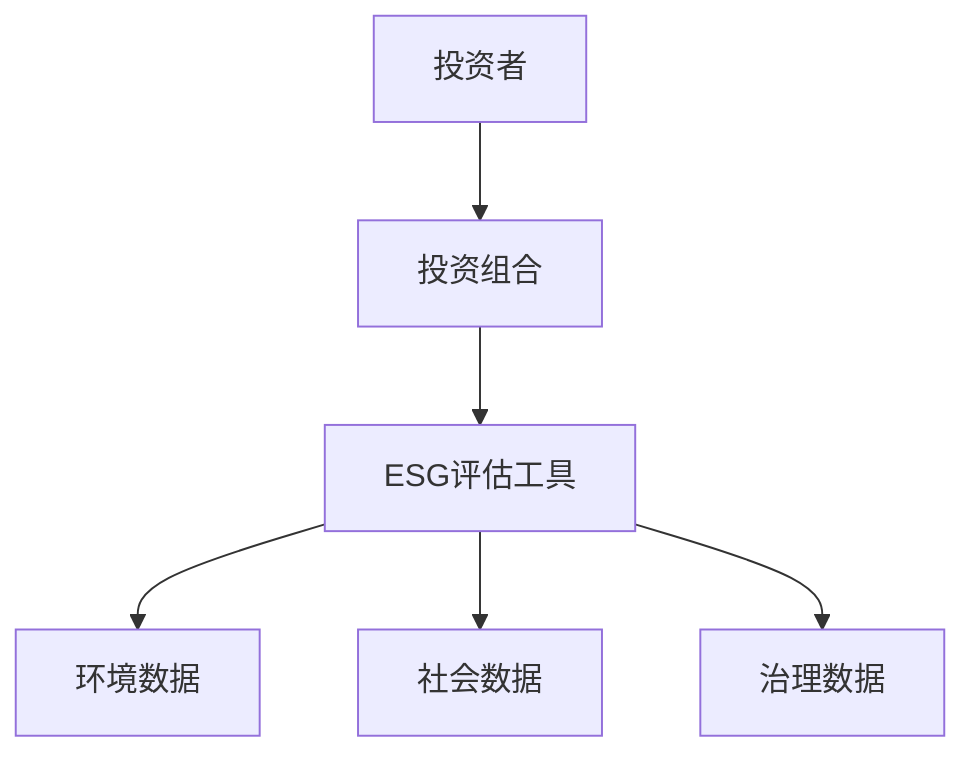
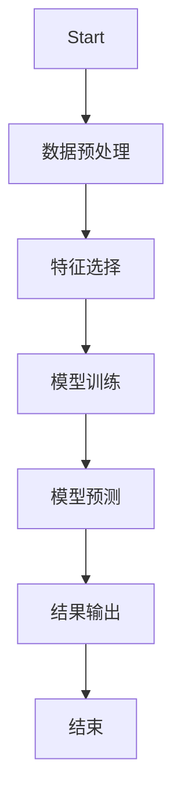
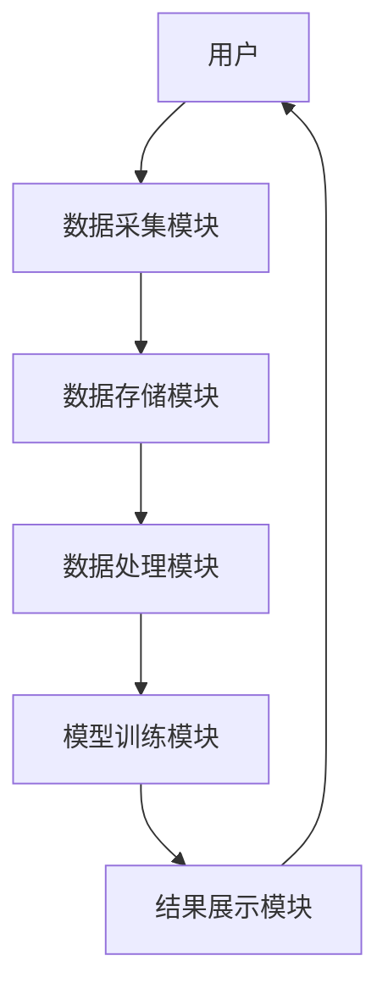

                 


# 构建智能化的个人投资组合ESG因素评估工具

## 关键词：ESG评估，投资组合，机器学习，系统架构，项目实战

## 摘要：  
随着全球对可持续投资的关注度不断提高，ESG（环境、社会、治理）因素在个人投资组合中的重要性日益凸显。本文旨在探讨如何利用智能化的技术手段构建个人投资组合的ESG因素评估工具。文章从ESG评估的核心概念出发，结合机器学习算法和系统架构设计，详细阐述了构建智能化ESG评估工具的方法和步骤。通过实际案例分析和代码实现，为读者提供一个可操作的解决方案。

---

# 第一章: ESG因素与投资组合概述

## 1.1 ESG的定义与内涵  
ESG（Environmental, Social, Governance）是衡量企业可持续发展能力的重要指标。环境因素关注企业的资源利用效率和环保表现；社会因素关注企业对社会的贡献和责任；治理因素关注企业的内部管理、透明度和合规性。  

## 1.2 ESG投资的重要性  
随着气候变化、社会责任和企业治理等问题的日益突出，越来越多的投资者开始关注ESG因素。研究表明，ESG表现良好的企业在长期投资回报上具有优势。  

## 1.3 ESG与传统投资的区别  
传统投资主要关注财务指标，而ESG投资则强调企业的可持续发展能力。通过将ESG因素纳入投资决策，投资者可以更好地规避风险并实现长期收益。  

---

# 第二章: ESG评估的核心概念与联系

## 2.1 ESG因素的属性特征对比  
| 因素 | 环境（Environmental） | 社会（Social） | 治理（Governance） |  
|------|----------------------|----------------|---------------------|  
| 指标 | 碳排放、能源效率 | 社会责任、员工福利 | 股权结构、董事会多样性 |  
| 数据来源 | 环境报告、政府数据 | 社会责任报告、新闻媒体 | 公司治理报告、监管文件 |  

## 2.2 ESG评估的实体关系图  


---

# 第三章: 基于机器学习的ESG评分模型

## 3.1 算法原理概述  
机器学习模型可以用于分析企业的ESG表现。常用算法包括线性回归和随机森林。以下是一个线性回归模型的简单示例：

$$ y = \beta_0 + \beta_1x_1 + \beta_2x_2 + \epsilon $$  

其中，$y$ 是目标变量（ESG评分），$x_1$ 和 $x_2$ 是环境和社会因素的特征变量。  

## 3.2 算法流程图  


## 3.3 算法实现代码  
```python
import pandas as pd
from sklearn.linear_model import LinearRegression
from sklearn.metrics import mean_squared_error

# 数据预处理
data = pd.read_csv('esg_data.csv')
X = data[['环境因素', '社会因素', '治理因素']]
y = data['ESG评分']

# 模型训练
model = LinearRegression()
model.fit(X, y)

# 模型预测
y_pred = model.predict(X)

# 评估指标
mse = mean_squared_error(y, y_pred)
print(f"均方误差: {mse}")
```

---

# 第四章: 系统架构设计

## 4.1 系统功能设计  
- 数据采集模块：获取企业ESG数据。  
- 数据处理模块：清洗和转换数据。  
- 模型训练模块：基于机器学习算法训练ESG评分模型。  
- 用户界面模块：展示ESG评分结果。  

## 4.2 系统架构图  


---

# 第五章: 项目实战

## 5.1 环境配置  
安装必要的库：  
```bash
pip install pandas scikit-learn matplotlib
```

## 5.2 核心代码实现  
```python
import pandas as pd
from sklearn.ensemble import RandomForestRegressor
from sklearn.model_selection import train_test_split
import matplotlib.pyplot as plt

# 数据加载
data = pd.read_csv('esg_data.csv')
X = data.drop('ESG评分', axis=1)
y = data['ESG评分']

# 数据分割
X_train, X_test, y_train, y_test = train_test_split(X, y, test_size=0.2, random_state=42)

# 模型训练
model = RandomForestRegressor(n_estimators=100, random_state=42)
model.fit(X_train, y_train)

# 模型预测
y_pred = model.predict(X_test)

# 模型评估
score = model.score(X_test, y_test)
print(f"模型得分: {score}")

# 可视化
feature_importances = pd.DataFrame({'feature': X.columns, 'importance': model.feature_importances_})
feature_importances = feature_importances.sort_values(by='importance', ascending=False)

plt.figure(figsize=(10, 5))
plt.title('特征重要性')
plt.bar(feature_importances['feature'], feature_importances['importance'])
plt.xticks(rotation=45)
plt.show()
```

## 5.3 实际案例分析  
以某企业为例，通过上述代码计算其ESG评分，并生成可视化报告。  

---

# 第六章: 总结与展望

## 6.1 本章总结  
本文详细介绍了构建智能化个人投资组合ESG因素评估工具的方法和步骤。通过机器学习算法和系统架构设计，为投资者提供了一个高效、可靠的工具。  

## 6.2 未来展望  
未来，随着ESG数据的丰富和算法的优化，智能化的ESG评估工具将更加精准和实用。同时，结合实时数据和动态调整策略，ESG投资将更具竞争力。  

---

作者：AI天才研究院/AI Genius Institute & 禅与计算机程序设计艺术 /Zen And The Art of Computer Programming

