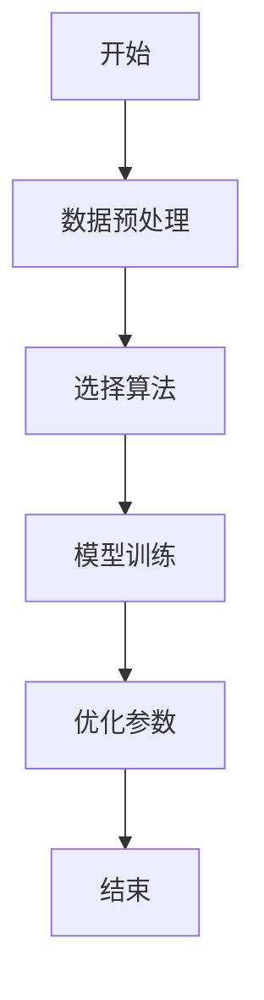
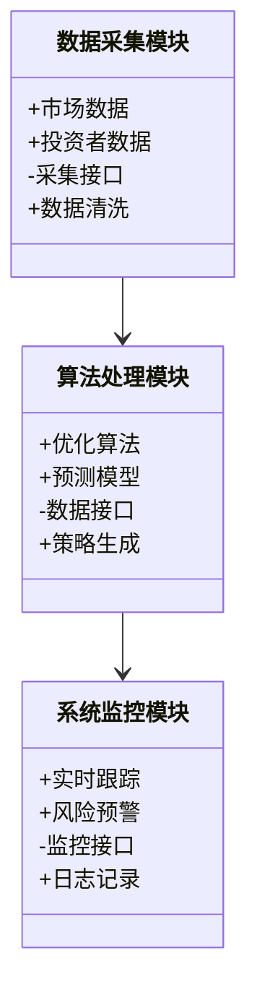
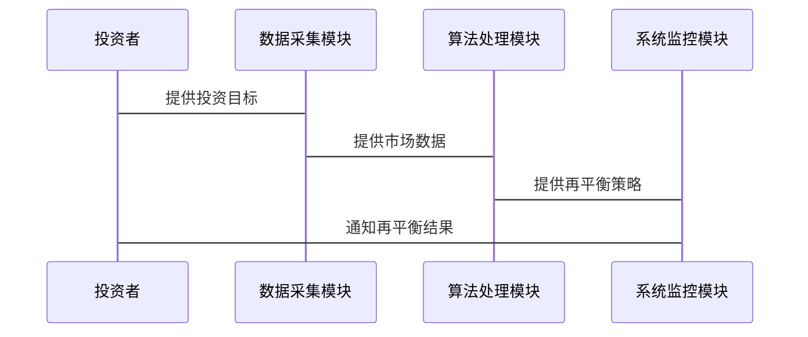

                 


# 构建智能化的个人投资组合再平衡系统

> 关键词：投资组合再平衡，人工智能，大数据，机器学习，智能化投资

> 摘要：本文将详细探讨如何利用人工智能和大数据技术构建一个智能化的个人投资组合再平衡系统。通过分析传统投资组合管理的局限性，提出基于现代投资组合理论和机器学习算法的再平衡策略。本文将从系统设计、算法实现、数据处理等多个维度展开，为读者提供一个全面的解决方案。

---

# 第一部分：投资组合再平衡的背景与挑战

## 第1章：投资组合再平衡的背景与挑战

### 1.1 投资组合再平衡的背景

#### 1.1.1 传统投资组合管理概述
传统投资组合管理主要依赖于定期的人工检查和调整，这种方式效率低下且难以应对市场的快速变化。随着金融市场的复杂化和波动性的增加，传统的被动管理方式已经无法满足投资者的需求。

#### 1.1.2 问题背景与描述
投资组合再平衡的目的是保持资产配置与投资目标一致。然而，市场波动、投资者风险偏好变化以及经济环境的不确定性使得再平衡的频率和幅度难以预测。传统方法通常采用固定时间间隔（如季度）进行再平衡，但这可能导致收益损失或额外的交易成本。

#### 1.1.3 问题解决与智能化需求
智能化再平衡系统的目标是通过实时数据分析和算法优化，自动确定最佳的再平衡时机和比例，从而提高投资效率和收益。

### 1.2 个人投资组合的特点与挑战

#### 1.2.1 个人投资目标的多样性
每个人的投资目标和风险承受能力不同，这使得个性化投资组合的构建和管理更具挑战性。

#### 1.2.2 市场波动对投资组合的影响
市场的波动性会导致投资组合的偏离，传统的定期再平衡方法无法及时应对这种动态变化。

#### 1.2.3 再平衡的复杂性与成本
频繁的交易操作会产生较高的交易成本，同时，复杂的市场环境需要更高的计算能力和更精确的算法支持。

### 1.3 智能化投资的兴起

#### 1.3.1 人工智能在金融领域的应用
人工智能技术，特别是机器学习，正在改变金融行业的许多方面，包括投资组合管理、风险评估和市场预测。

#### 1.3.2 大数据技术对投资决策的影响
大数据技术能够收集和分析海量的市场数据，为投资决策提供更精准的支持。

#### 1.3.3 智能化再平衡系统的潜力
通过智能化再平衡系统，投资者可以实现更高效、更精准的投资组合管理，从而在复杂多变的市场环境中获得更好的收益。

### 1.4 本章小结
本章主要介绍了投资组合再平衡的背景、挑战以及智能化再平衡系统的必要性。随着金融市场的复杂化和人工智能技术的发展，智能化再平衡系统成为一种趋势，能够帮助投资者更好地应对市场波动和实现投资目标。

---

## 第2章：投资组合再平衡的核心概念

### 2.1 投资组合再平衡的数学模型

#### 2.1.1 投资组合优化的数学表达
投资组合优化的目标是最大化收益，同时最小化风险。这可以通过以下数学公式表示：

$$
\text{目标函数：} \quad \max \sum_{i=1}^{n} w_i r_i
$$

$$
\text{约束条件：} \quad \sum_{i=1}^{n} w_i = 1, \quad \sum_{i=1}^{n} w_i^2 \leq \text{风险承受水平}
$$

其中，$w_i$ 是资产 $i$ 的权重，$r_i$ 是资产 $i$ 的预期收益。

#### 2.1.2 现代投资组合理论（MPT）
现代投资组合理论（MPT）由Harry Markowitz提出，是投资组合优化的基础。MPT通过分散投资来降低风险，同时实现收益最大化。

#### 2.1.3 风险与收益的平衡
在投资组合管理中，风险和收益是两个核心要素。再平衡的目的是在两者之间找到最佳平衡点，以实现投资目标。

### 2.2 再平衡策略的分类

#### 2.2.1 定期再平衡策略
定期再平衡策略是按照固定的时间间隔（如每月、每季度）进行再平衡操作。这种方法简单易行，但可能无法捕捉市场变化的时机。

#### 2.2.2 动态再平衡策略
动态再平衡策略根据市场变化和投资者风险偏好实时调整投资组合。这种方法更加灵活，但需要复杂的算法支持。

#### 2.2.3 基于阈值的再平衡策略
基于阈值的再平衡策略在投资组合偏离目标配置一定阈值时触发再平衡操作。这种方法能够减少不必要的交易成本。

### 2.3 智能化再平衡的核心要素

#### 2.3.1 数据采集与处理
数据采集是智能化再平衡系统的基石。需要收集市场数据、投资者行为数据以及宏观经济指标等。

#### 2.3.2 算法选择与优化
选择合适的算法（如遗传算法、模拟退火）并对其进行优化是实现智能化再平衡的关键。

#### 2.3.3 系统实现与部署
系统实现需要考虑模块化设计、高效计算能力以及系统的可扩展性。

### 2.4 本章小结
本章详细介绍了投资组合再平衡的数学模型、策略分类以及智能化再平衡的核心要素。通过理解这些概念，可以为后续的系统设计和算法实现奠定基础。

---

## 第3章：智能化再平衡系统的算法原理

### 3.1 常见的优化算法

#### 3.1.1 线性规划与非线性规划
线性规划适用于目标函数和约束条件均为线性的情况，而非线性规划则适用于更复杂的问题。

#### 3.1.2 遗传算法
遗传算法是一种基于自然选择和遗传机制的优化算法，适用于复杂的非线性问题。

#### 3.1.3 模拟退火算法
模拟退火算法是一种全局优化算法，能够避免陷入局部最优解。

### 3.2 机器学习在再平衡中的应用

#### 3.2.1 监督学习与回归模型
监督学习可以通过历史数据训练回归模型，预测市场走势并指导再平衡策略。

#### 3.2.2 非监督学习与聚类分析
非监督学习可以发现市场中的潜在模式，帮助识别投资机会和风险。

#### 3.2.3 强化学习与策略优化
强化学习通过试错机制优化投资策略，适用于动态变化的市场环境。

### 3.3 算法实现的数学模型

#### 3.3.1 投资组合优化的数学公式
投资组合优化的目标函数可以表示为：

$$
\max \quad \sum_{i=1}^{n} w_i r_i - \lambda \sum_{i=1}^{n} w_i^2 \sigma_i^2
$$

其中，$\lambda$ 是风险厌恶系数，$\sigma_i^2$ 是资产 $i$ 的方差。

#### 3.3.2 风险调整后的收益模型
风险调整后的收益可以通过夏普比率等指标进行衡量，公式为：

$$
\text{夏普比率} = \frac{E[r_p] - r_f}{\sigma_p}
$$

其中，$E[r_p]$ 是投资组合的预期收益，$r_f$ 是无风险利率，$\sigma_p$ 是投资组合的波动率。

#### 3.3.3 算法收敛性分析
算法的收敛性是影响优化效果的重要因素。通过数学分析可以确定算法是否能够在有限步内收敛到最优解。

### 3.4 算法实现的流程图



### 3.5 本章小结
本章详细介绍了常见的优化算法及其在投资组合再平衡中的应用。通过数学模型和流程图的分析，为后续的系统实现提供了理论基础。

---

## 第4章：智能化再平衡系统的架构设计

### 4.1 系统功能模块划分

#### 4.1.1 数据采集模块
数据采集模块负责收集市场数据、投资者行为数据等。

#### 4.1.2 算法处理模块
算法处理模块负责对数据进行分析和优化，生成再平衡策略。

#### 4.1.3 系统监控模块
系统监控模块实时跟踪投资组合的表现，确保系统稳定运行。

### 4.2 系统架构设计



### 4.3 系统交互流程



### 4.4 本章小结
本章详细描述了智能化再平衡系统的架构设计，包括功能模块划分、系统交互流程等。通过合理的系统架构，可以实现高效的投资组合管理。

---

## 第5章：智能化再平衡系统的实现与应用

### 5.1 环境搭建与数据准备

#### 5.1.1 环境安装
需要安装Python、机器学习库（如scikit-learn、TensorFlow）以及数据处理工具（如Pandas）。

#### 5.1.2 数据来源
数据可以来源于公开的金融数据API（如Yahoo Finance、Alpha Vantage）或本地数据集。

### 5.2 算法实现与优化

#### 5.2.1 优化算法实现
以下是一个遗传算法的Python实现示例：

```python
import random

def fitness(w, r):
    return sum(w * r)  # 简单的收益最大化

def mutate(w, mutation_rate=0.1):
    new_w = w.copy()
    for i in range(len(new_w)):
        if random.random() < mutation_rate:
            new_w[i] += random.gauss(0, 0.1)
    return new_w

def crossover(w1, w2):
    return [w1[i] if random.random() < 0.5 else w2[i] for i in range(len(w1))]

def genetic_algorithm(r, population_size=100, generations=50):
    population = [[random.random() for _ in range(len(r))] for _ in range(population_size)]
    for _ in range(generations):
        population = [mutate(individual) for individual in population]
        new_population = []
        for _ in range(population_size):
            parent1 = random.choice(population)
            parent2 = random.choice(population)
            child = crossover(parent1, parent2)
            new_population.append(child)
        population = new_population
    best = max(population, key=lambda w: fitness(w, r))
    return best
```

#### 5.2.2 机器学习模型训练
使用历史数据训练机器学习模型，预测市场走势并指导再平衡策略。

### 5.3 项目实战与案例分析

#### 5.3.1 数据处理与分析
对收集的市场数据进行清洗、特征提取和数据增强。

#### 5.3.2 算法优化与测试
通过回测和模拟交易测试算法的性能，调整参数以获得最佳效果。

#### 5.3.3 实际案例分析
以一个实际的市场案例为例，展示智能化再平衡系统如何优化投资组合。

### 5.4 本章小结
本章通过具体的实现步骤和案例分析，展示了智能化再平衡系统在实际应用中的潜力和效果。

---

## 第6章：最佳实践与系统优化

### 6.1 最佳实践

#### 6.1.1 数据质量管理
确保数据的准确性和完整性，是系统运行的基础。

#### 6.1.2 算法选择与优化
根据具体问题选择合适的算法，并通过参数调整和优化提升性能。

#### 6.1.3 系统安全性
保护投资者的敏感数据，防止数据泄露和系统攻击。

### 6.2 系统优化与扩展

#### 6.2.1 并行计算
通过并行计算提高系统的处理效率，适用于大数据和复杂算法。

#### 6.2.2 模型更新
定期更新机器学习模型，确保系统的预测能力。

#### 6.2.3 系统扩展
通过模块化设计和分布式架构，扩展系统的处理能力。

### 6.3 小结与注意事项

#### 6.3.1 小结
本章总结了智能化再平衡系统在实际应用中的最佳实践和优化方法。

#### 6.3.2 注意事项
在实际应用中，需要注意数据安全、算法选择和系统维护等问题。

### 6.4 拓展阅读
推荐进一步阅读相关领域的书籍和论文，深入理解投资组合管理和人工智能技术。

---

# 第二部分：总结与展望

## 第7章：总结与展望

### 7.1 本章总结
本文详细探讨了智能化个人投资组合再平衡系统的构建方法，从理论到实践，系统地介绍了背景、算法、架构和实现。

### 7.2 未来展望
随着人工智能和大数据技术的不断发展，智能化投资管理系统将更加智能化和个性化，为投资者提供更优质的服务。

---

# 作者：AI天才研究院/AI Genius Institute & 禅与计算机程序设计艺术 /Zen And The Art of Computer Programming

