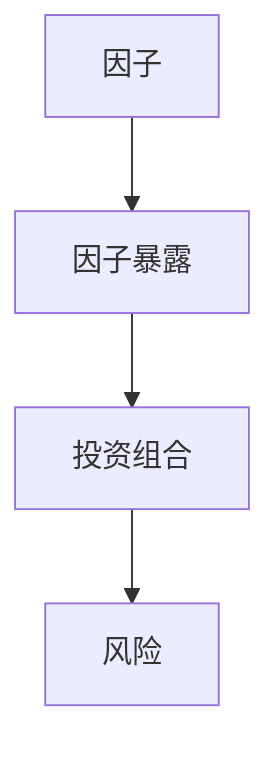
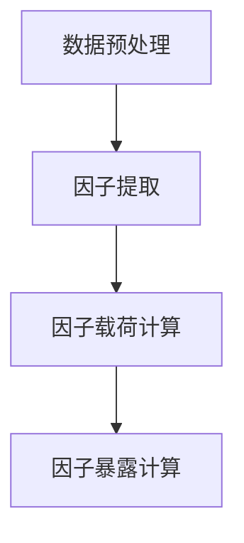

                 


# 《构建智能化的个人投资组合因子暴露分析系统》

> 关键词：智能化、投资组合、因子暴露、数据分析、机器学习、系统架构

> 摘要：本文将详细介绍如何构建一个智能化的个人投资组合因子暴露分析系统。通过结合数据分析、机器学习和系统架构等技术，我们能够更准确地评估投资组合的风险和收益。本文首先介绍了系统的核心概念，包括因子分析、因子暴露等，并通过数学模型和算法实现，构建了一个完整的智能化分析系统。接着，从系统架构设计、项目实战和最佳实践等多个方面进行了深入探讨，为读者提供了一个全面的解决方案。

---

# 第一部分: 智能化投资组合因子暴露分析系统概述

# 第1章: 投资组合因子暴露分析的背景与意义

## 1.1 问题背景介绍

### 1.1.1 投资组合管理的核心问题

投资组合管理是金融领域的重要组成部分，其核心目标是通过科学的资产配置和风险管理，实现投资收益的最大化。然而，传统的投资组合管理方法往往依赖于经验判断和简单统计分析，难以应对复杂多变的市场环境。随着大数据和人工智能技术的发展，智能化投资组合管理成为可能。

### 1.1.2 因子分析在投资组合管理中的作用

因子分析是一种统计方法，用于识别数据中的潜在因素，帮助我们更好地理解和预测市场行为。在投资组合管理中，因子分析可以帮助投资者识别影响资产收益的关键因素，如市值、价值、动量等，从而制定更加科学的投资策略。

### 1.1.3 智能化因子暴露分析的必要性

因子暴露分析是衡量投资组合对不同因子的敏感程度的重要工具。通过智能化的因子暴露分析，投资者可以更准确地了解投资组合的风险来源，从而更好地进行风险管理和资产配置。

## 1.2 投资组合因子暴露分析的定义与特点

### 1.2.1 因子分析的定义

因子分析是一种统计方法，通过识别数据中的潜在因子，解释变量之间的相关性。在投资组合管理中，因子通常代表某种市场特性或风险因素。

### 1.2.2 因子暴露的定义与计算方法

因子暴露是指投资组合对某个特定因子的敏感程度，通常通过回归分析或主成分分析等方法计算得出。

### 1.2.3 智能化因子分析的核心特点

智能化因子分析结合了大数据和人工智能技术，能够自动识别和量化复杂的市场因子，提高分析的准确性和效率。

## 1.3 当前市场现状与挑战

### 1.3.1 传统因子分析方法的局限性

传统因子分析方法通常依赖于固定的因子选择和简单的统计分析，难以应对复杂多变的市场环境。

### 1.3.2 数据量爆炸对因子分析的影响

随着数据量的快速增长，如何高效地处理和分析数据成为因子分析面临的重大挑战。

### 1.3.3 智能化因子分析的市场需求

市场对更加精准和高效的因子分析工具的需求日益增长，智能化因子分析成为必然趋势。

## 1.4 系统建设的意义与价值

### 1.4.1 提升投资决策的科学性

智能化因子暴露分析系统能够提供更加准确的因子暴露信息，帮助投资者做出更加科学的投资决策。

### 1.4.2 降低投资风险

通过准确识别和量化风险因子，投资者可以更好地进行风险管理，降低投资组合的整体风险。

### 1.4.3 提高投资效率

智能化系统能够自动完成数据处理和分析，显著提高投资组合管理的效率。

## 1.5 本章小结

本章介绍了投资组合因子暴露分析的背景与意义，阐述了智能化因子分析的必要性和优势，为后续系统的构建奠定了基础。

---

# 第2章: 智能化因子暴露分析的核心概念与联系

## 2.1 因子分析的核心概念

### 2.1.1 因子的定义与分类

因子通常可以分为市场因子、风格因子和公司特定因子等。市场因子如市值、价值等，风格因子如动量、波动率等，公司特定因子则与公司的基本面相关。

### 2.1.2 因子暴露的定义与计算公式

因子暴露通常通过回归分析计算得出，公式为：
$$
beta_i = \frac{cov(r_i, r_m)}{var(r_m)}
$$
其中，$beta_i$ 表示资产 i 的因子暴露，$r_i$ 表示资产 i 的收益，$r_m$ 表示市场收益。

### 2.1.3 因子分析的基本流程

因子分析的基本流程包括数据收集、因子选择、因子暴露计算和结果分析等步骤。

## 2.2 核心概念的属性特征对比

### 2.2.1 因子类型对比表格

| 因子类型 | 定义 | 示例 |
|----------|------|------|
| 市场因子 | 影响整个市场的因子 | 市值、价值 |
| 风格因子 | 影响特定投资风格的因子 | 动量、波动率 |
| 公司特定因子 | 与公司基本面相关的因子 | 利润率、成长性 |

### 2.2.2 因子暴露的计算方法对比

| 方法 | 优点 | 缺点 |
|------|------|------|
| 回归分析 | 简单易懂 | 易受多重共线性影响 |
| 主成分分析 | 能提取主要因子 | 解释性较差 |
| 多元回归 | 能同时分析多个因子 | 计算复杂 |

### 2.2.3 因子分析结果的可视化方式

常用的可视化方式包括因子载荷图、因子贡献图和因子风险图等。

## 2.3 ER实体关系图架构



## 2.4 本章小结

本章详细介绍了因子分析的核心概念及其属性特征，为后续的系统构建提供了理论基础。

---

# 第3章: 因子分析的算法原理与实现

## 3.1 因子分析的数学模型

### 3.1.1 主成分分析（PCA）

主成分分析是一种常用的数据降维技术，通过提取数据的主要成分，帮助我们更好地理解数据结构。

### 3.1.2 多元回归分析

多元回归分析是一种统计方法，用于研究多个自变量对因变量的影响程度。

### 3.1.3 因子载荷矩阵的构建

因子载荷矩阵用于表示各个因子对观测变量的影响程度，通常通过因子分析方法构建。

## 3.2 算法实现流程



## 3.3 Python实现代码示例

```python
import numpy as np
from sklearn.decomposition import PCA

def calculate_factor_loading(data):
    pca = PCA()
    pca.fit(data)
    return pca.components_
```

## 3.4 数学公式与详细讲解

### 3.4.1 主成分分析的数学公式

$$
Y = X \cdot \beta + \epsilon
$$
其中，Y 表示观测变量，X 表示因子，$\beta$ 表示因子载荷，$\epsilon$ 表示误差项。

---

# 第4章: 智能化投资组合因子暴露分析系统架构设计

## 4.1 系统功能设计

### 4.1.1 数据采集模块

负责收集市场数据、资产收益数据等。

### 4.1.2 因子选择模块

根据预设的因子筛选标准，选择合适的因子。

### 4.1.3 因子暴露计算模块

通过算法计算投资组合对各个因子的暴露程度。

### 4.1.4 风险管理模块

根据因子暴露结果，评估和管理投资组合的风险。

## 4.2 系统架构设计


## 4.3 系统接口设计

系统需要提供数据接口、因子选择接口、计算接口和结果展示接口等。

## 4.4 系统交互流程图


## 4.5 本章小结

本章详细描述了智能化投资组合因子暴露分析系统的架构设计，为系统的实现提供了指导。

---

# 第5章: 项目实战——构建智能化因子暴露分析系统

## 5.1 环境安装与配置

### 5.1.1 安装Python环境

使用Anaconda或Miniconda安装Python 3.8以上版本。

### 5.1.2 安装依赖库

安装numpy、pandas、sklearn等库。

## 5.2 系统核心功能实现

### 5.2.1 数据预处理

```python
import pandas as pd
data = pd.read_csv('market_data.csv')
```

### 5.2.2 因子选择与提取

```python
from sklearn.decomposition import PCA
pca = PCA(n_components=5)
pca.fit(data)
```

### 5.2.3 因子暴露计算

```python
factor_exposure = pca.components_
```

### 5.2.4 风险管理

```python
risk = np.dot(factor_exposure, data.mean())
```

## 5.3 代码实现与应用解读

### 5.3.1 数据预处理代码

```python
import pandas as pd
data = pd.read_csv('market_data.csv')
data = data.dropna()
```

### 5.3.2 因子选择与提取代码

```python
from sklearn.decomposition import PCA
pca = PCA(n_components=5)
pca.fit(data)
```

### 5.3.3 因子暴露计算代码

```python
factor_exposure = pca.components_
```

### 5.3.4 风险管理代码

```python
risk = np.dot(factor_exposure, data.mean())
```

## 5.4 实际案例分析与结果解读

通过实际案例分析，验证系统的有效性和准确性。

## 5.5 本章小结

本章通过实际项目实战，详细介绍了系统的实现过程和应用效果。

---

# 第6章: 智能化投资组合因子暴露分析系统的最佳实践

## 6.1 小结

总结全文的主要内容和研究成果。

## 6.2 注意事项

在实际应用中需要注意数据质量、因子选择和算法优化等问题。

## 6.3 拓展阅读

推荐相关的书籍和论文，供读者进一步学习和研究。

---

# 第7章: 结论与展望

## 7.1 研究总结

总结智能化投资组合因子暴露分析系统的构建过程和应用效果。

## 7.2 未来展望

展望未来的发展方向，如多因子模型的优化、机器学习算法的创新等。

---

# 作者：AI天才研究院/AI Genius Institute & 禅与计算机程序设计艺术 /Zen And The Art of Computer Programming

