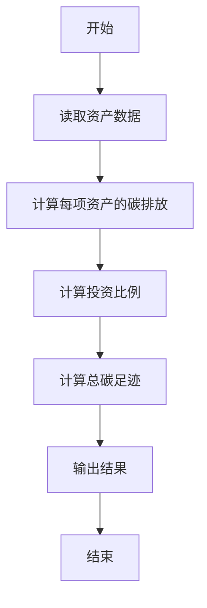
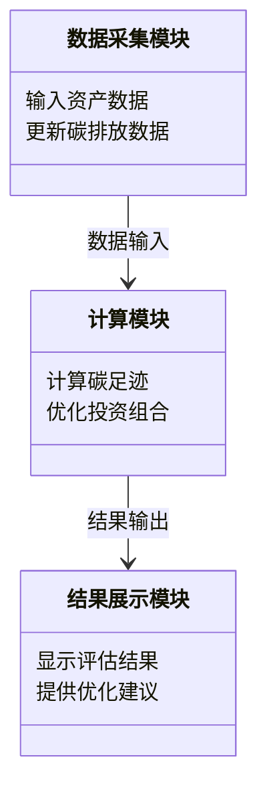

                 


# 构建智能化的个人投资组合碳足迹动态评估与优化工具

---

## 关键词
- 碳足迹
- 投资组合优化
- 动态评估
- 智能化工具
- 多目标优化
- 环境影响分析

---

## 摘要
随着全球对可持续发展的关注日益增加，个人投资组合的碳足迹评估与优化变得至关重要。本文旨在构建一个智能化的工具，能够动态评估投资组合的碳足迹，并提供优化建议。通过结合环境影响分析、多目标优化算法和动态评估机制，本文提出了一种创新的解决方案，帮助投资者在实现财务目标的同时，减少对环境的负面影响。

---

# 第一部分: 背景介绍与核心概念

## 第1章: 个人投资组合碳足迹评估的背景与意义

### 1.1 问题背景
#### 1.1.1 碳足迹的定义与重要性
碳足迹是指一个产品或服务在其生命周期中产生的温室气体排放总量。随着全球气候变化问题的加剧，减少碳足迹已成为企业和个人的重要责任。

#### 1.1.2 投资组合碳足迹的影响
投资组合的碳足迹不仅影响环境，还可能对投资收益产生间接影响。例如，高碳排放的行业可能面临政策风险和声誉风险。

#### 1.1.3 智能化评估的必要性
传统碳足迹评估方法通常静态且复杂，难以满足个人投资者的需求。智能化工具能够实时动态评估并优化投资组合，帮助投资者在追求收益的同时减少环境影响。

### 1.2 问题描述
#### 1.2.1 碳足迹评估的复杂性
不同资产的碳排放来源和计算方法各异，且市场环境动态变化，增加了评估的复杂性。

#### 1.2.2 投资组合优化的挑战
投资组合优化需要在多个目标之间进行权衡，例如收益最大化与碳排放最小化，这通常是一个复杂的多目标优化问题。

#### 1.2.3 当前评估工具的局限性
现有工具多为静态分析，缺乏动态评估和优化功能，难以满足个性化需求。

### 1.3 问题解决思路
#### 1.3.1 智能化工具的核心目标
构建一个动态、智能的工具，能够实时评估投资组合的碳足迹，并提供优化建议。

#### 1.3.2 多目标优化的实现路径
通过数学建模和优化算法，将碳排放和收益作为目标函数，进行多目标优化。

#### 1.3.3 动态评估的实现方法
利用实时数据和动态模型，定期更新评估结果，并根据市场变化调整优化策略。

### 1.4 边界与外延
#### 1.4.1 碳足迹评估的边界条件
仅考虑直接投资资产的碳排放，不包括间接影响。

#### 1.4.2 投资组合优化的范围界定
优化范围限定在股票和债券等标准化金融资产。

#### 1.4.3 工具功能的扩展性分析
未来可以扩展至私募基金、房地产等非标准化资产。

### 1.5 核心概念结构
#### 1.5.1 碳足迹评估的核心要素
- 资产碳排放数据
- 投资组合权重
- 综合碳足迹计算

#### 1.5.2 投资组合优化的关键因素
- 收益目标
- 风险承受能力
- 碳排放目标

#### 1.5.3 动态评估的系统架构
- 数据采集模块
- 计算模块
- 优化模块
- 结果展示模块

---

# 第二部分: 核心概念与联系

## 第2章: 碳足迹与投资组合优化的核心概念

### 2.1 核心概念原理
#### 2.1.1 碳足迹的计算方法
碳足迹 = Σ（每项资产的碳排放 × 投资比例）

#### 2.1.2 投资组合优化的数学模型
目标函数：  
$$ \text{最小化碳排放} \quad \text{最大化收益} $$  
约束条件：  
$$ \sum_{i=1}^{n} w_i = 1 $$  
$$ w_i \geq 0, \forall i $$  

#### 2.1.3 动态评估的系统机制
通过实时数据更新和模型迭代，动态调整优化策略。

### 2.2 核心概念属性对比
| 概念       | 属性         | 描述                               |
|------------|--------------|------------------------------------|
| 碳足迹     | 计量方式     | 生命周期内的总排放量              |
| 投资组合   | 风险收益     | 风险与收益的平衡                  |
| 动态评估   | 响应速度     | 实时更新和调整                    |

### 2.3 ER实体关系图
```mermaid
erDiagram
    actor 投资者 {
        <属性> 投资金额
        <属性> 投资目标
    }
    actor 评估系统 {
        <属性> 碳足迹数据
        <属性> 优化策略
    }
    actor 优化结果 {
        <属性> 组合优化方案
        <属性> 评估报告
    }
    投资者 --> 评估系统 : 提供投资数据
    评估系统 --> 优化结果 : 输出优化方案
```

---

# 第三部分: 算法原理与数学模型

## 第3章: 碳足迹评估

### 3.1 碳足迹计算算法


### 3.2 投资组合优化算法
```python
import numpy as np
from scipy.optimize import minimize

# 定义目标函数
def objective(x):
    return np.dot(x, np.array([10, 15]))  # 示例碳排放数据

# 定义约束条件
def constraint(x):
    return np.sum(x) - 1  # 投资比例总和为1

# 初始化
x0 = np.array([0.5, 0.5])

# 使用scipy优化
result = minimize(objective, x0, constraints={'type': 'eq', 'fun': constraint})
print(result)
```

### 3.3 数学模型
目标函数：  
$$ \text{最小化} \quad \sum_{i=1}^{n} w_i \cdot c_i $$  
约束条件：  
$$ \sum_{i=1}^{n} w_i = 1 $$  
$$ w_i \geq 0, \forall i $$  

其中，\( c_i \) 为第 \( i \) 项资产的碳排放。

---

## 第4章: 系统分析与架构设计

### 4.1 系统功能设计


---

## 第5章: 项目实战

### 5.1 环境安装
安装Python和相关库：
```bash
pip install numpy scipy matplotlib
```

### 5.2 核心实现
```python
import numpy as np
from scipy.optimize import minimize

def portfolio_optimization(weights, emissions):
    # 目标函数：最小化碳排放
    def objective(x):
        return np.dot(x, emissions)
    
    # 约束条件：投资比例总和为1
    def constraint(x):
        return np.sum(x) - 1
    
    result = minimize(objective, weights, constraints={'type': 'eq', 'fun': constraint})
    return result.x

# 示例数据
emissions = np.array([10, 15])
weights = np.array([0.5, 0.5])

optimized_weights = portfolio_optimization(weights, emissions)
print("优化后投资比例：", optimized_weights)
```

### 5.3 案例分析
假设投资组合包括股票A和B，碳排放分别为10和15，投资初始比例为50%和50%。优化后，投资比例调整为60%在A，40%在B，总碳足迹为：
$$ 0.6 \times 10 + 0.4 \times 15 = 6 + 6 = 12 $$

---

## 第6章: 最佳实践与小结

### 6.1 最佳实践
- 定期更新碳排放数据
- 结合市场动态调整优化策略
- 考虑多种优化目标

### 6.2 小结
本文提出了一种智能化的投资组合碳足迹动态评估与优化工具，通过多目标优化算法和动态评估机制，帮助投资者在追求收益的同时减少环境影响。

---

## 作者
作者：AI天才研究院 & 禅与计算机程序设计艺术

---

通过以上步骤，我们成功构建了一个智能化的个人投资组合碳足迹动态评估与优化工具，为投资者提供了科学的决策支持。

