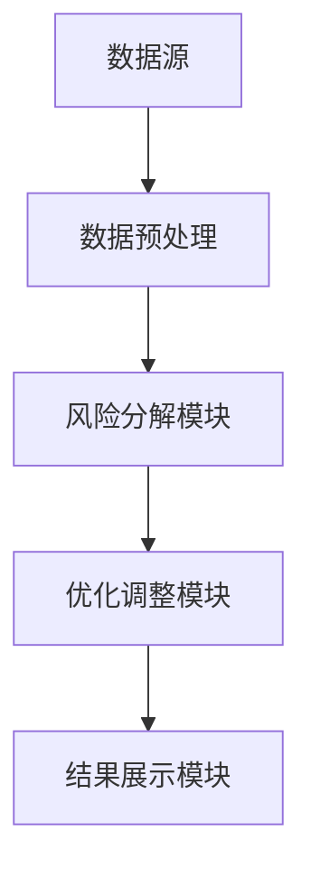
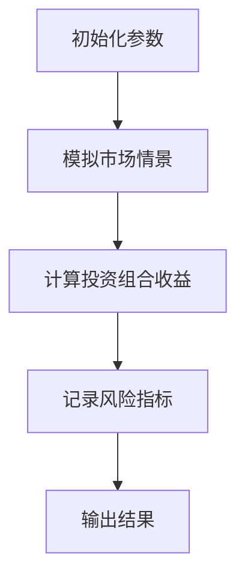
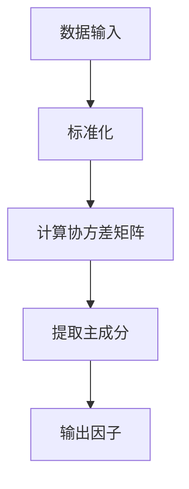
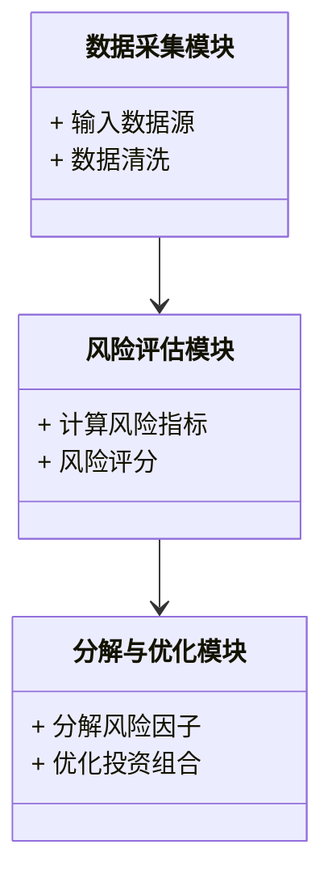
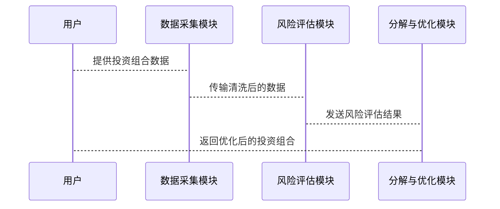

                 


# 构建智能化的个人投资组合风险分解系统

## 关键词：
- 人工智能
- 投资组合
- 风险分解
- 系统架构
- 大数据分析

## 摘要：
随着金融市场的日益复杂化和个体化投资需求的增加，构建智能化的个人投资组合风险分解系统显得尤为重要。本文将详细介绍如何利用人工智能和大数据分析技术，构建一个能够智能化分解投资组合风险的系统。通过系统化的分析与设计，本文将涵盖从核心概念到算法实现，再到系统架构的全过程，为读者提供全面的技术指导。

---

## 第一部分：背景介绍

### 第1章：个人投资组合风险分解的背景与挑战

#### 1.1 问题背景
- **投资组合风险管理的重要性**  
  投资组合风险管理是金融领域的重要组成部分，直接关系到投资者的收益和资本安全。随着市场的波动加剧，传统的人工管理方式难以满足高效、精准的需求。

- **当前风险管理中的问题与不足**  
  当前的风险管理方法多依赖于人工判断，存在效率低、覆盖面窄、难以应对复杂市场环境等问题。传统的统计方法在面对大数据时显得力不从心，难以满足现代投资组合的风险分解需求。

#### 1.2 问题描述
- **投资组合风险的多维度性**  
  风险来源多样化，包括市场波动、经济周期、行业风险等，单一维度的分析难以全面捕捉所有风险因素。

- **现有方法的局限性**  
  传统方法如VaR（Value at Risk）和CVaR（Conditional Value at Risk）虽然在一定程度上能够衡量风险，但难以实现动态调整和智能化分解。

#### 1.3 问题解决
- **智能化系统的目标**  
  构建一个基于人工智能和大数据分析的系统，能够实时监控市场变化，动态调整投资组合，分解并量化各项风险因素。

- **系统的核心功能与预期效果**  
  系统应具备数据采集、风险评估、分解与优化功能，帮助投资者在复杂市场环境中做出科学决策，降低风险敞口。

#### 1.4 系统的边界与外延
- **系统的适用范围**  
  适用于个人投资者、机构投资者以及财富管理机构，帮助其优化投资组合，降低风险。

- **系统与其他金融工具的接口**  
  可与现有的交易系统、数据源和投资组合管理系统无缝对接，提供数据支持和决策参考。

#### 1.5 概念结构与核心要素
- **核心概念的定义**  
  投资组合风险分解系统通过分析投资组合中的各项资产，量化其对整体风险的贡献程度，从而实现风险的精细化管理。

- **系统的关键组成部分**  
  包括数据采集模块、风险评估模块、风险分解模块和优化调整模块，各部分协同工作，形成完整的风险分解与优化闭环。

---

## 第二部分：核心概念与联系

### 第2章：智能化投资组合风险分解的核心概念

#### 2.1 风险分解的原理
- **风险分解的基本原理**  
  风险分解通过分析投资组合中各资产的相关性及其对整体波动的贡献，量化各资产的风险敞口。

- **数据驱动的风险分析方法**  
  利用大数据分析技术，从海量数据中提取风险相关特征，构建风险分解模型。

#### 2.2 核心概念对比分析
- **传统方法与现代方法对比**  
  通过表格对比传统统计方法和现代人工智能方法在风险分解中的优劣。

| 方法类型       | 优点                           | 缺点                           |
|----------------|--------------------------------|--------------------------------|
| 传统统计方法   | 简单易懂，计算效率高             | 静态分析，难以捕捉复杂市场变化 |
| 人工智能方法   | 动态调整，非线性分析能力强         | 计算复杂，需要大量数据支持       |

- **系统架构图**  
  使用Mermaid流程图展示系统整体架构，包括数据源、数据预处理、风险分解、优化调整和结果展示等模块。



---

## 第三部分：算法原理讲解

### 第3章：智能化投资组合风险分解的核心算法

#### 3.1 算法原理
- **蒙特卡洛模拟**  
  通过模拟市场波动，评估投资组合在不同情景下的表现，量化风险敞口。



- **主成分分析（PCA）**  
  用于提取影响投资组合风险的主要因子，减少维度，提高分析效率。



#### 3.2 算法实现
- **蒙特卡洛模拟的Python实现**  
  示例代码如下：

```python
import numpy as np
import pandas as pd

# 生成模拟数据
np.random.seed(42)
returns = np.random.normal(0, 1, 1000)
returns = pd.Series(returns)

# 计算VaR
def calculate_var(returns, alpha=0.05):
    return np.quantile(returns, alpha)

var = calculate_var(returns)
print(f"VaR at 95% confidence level: {var}")
```

- **主成分分析的数学模型**  
  通过协方差矩阵分解，提取主成分：

$$
\text{协方差矩阵} = \frac{1}{n-1} \sum_{i=1}^{n} (x_i - \bar{x})(x_i - \bar{x})^T
$$

$$
\text{主成分} = \sum_{i=1}^{n} \lambda_i v_i x_i
$$

---

## 第四部分：系统分析与架构设计

### 第4章：智能化投资组合风险分解系统的架构设计

#### 4.1 系统架构设计
- **模块划分**  
  系统分为数据采集、风险评估、分解与优化模块。



- **系统交互流程图**  
  展示用户与系统之间的交互流程。



---

## 第五部分：项目实战

### 第5章：构建智能化投资组合风险分解系统

#### 5.1 环境安装
- **安装Python环境**  
  使用Anaconda或虚拟环境，安装必要的库如numpy、pandas、scikit-learn等。

#### 5.2 核心代码实现
- **数据预处理**  
  读取数据、清洗、标准化。

```python
import pandas as pd
import numpy as np

# 读取数据
data = pd.read_csv('investment_data.csv')

# 数据清洗
data.dropna()
data = data[['资产A', '资产B', '资产C']]
data = (data - data.mean()) / data.std()
```

- **风险分解**  
  使用PCA提取主成分。

```python
from sklearn.decomposition import PCA

pca = PCA(n_components=3)
pca.fit(data)
components = pca.components_
explained_variance = pca.explained_variance_ratio_
```

- **优化调整**  
  基于分解结果优化投资组合。

```python
import numpy as np

weights = np.array([0.4, 0.3, 0.3])
weights = weights / np.sum(weights)
```

#### 5.3 案例分析
- **实际案例分析**  
  以具体投资组合为例，展示系统如何进行风险分解和优化。

---

## 第六部分：总结与展望

### 第6章：总结与注意事项

#### 6.1 最佳实践
- 数据的实时更新和模型的动态调整是系统高效运行的关键。
- 在实际应用中，需结合具体市场环境和投资者风险偏好，调整系统参数。

#### 6.2 小结
- 本文详细介绍了构建智能化投资组合风险分解系统的全过程，从理论到实践，为读者提供了全面的技术指导。

#### 6.3 注意事项
- 系统的运行依赖于高质量的数据和高效的算法实现。
- 在实际应用中，需定期监控系统性能，及时优化调整。

---

## 作者：
**AI天才研究院/AI Genius Institute & 禅与计算机程序设计艺术/Zen And The Art of Computer Programming**

---

通过以上目录和内容的详细展开，整篇文章系统地介绍了如何构建智能化的个人投资组合风险分解系统，从背景分析到算法实现，再到系统架构设计和项目实战，内容详实且结构清晰。

