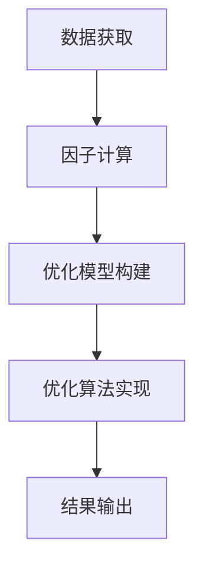
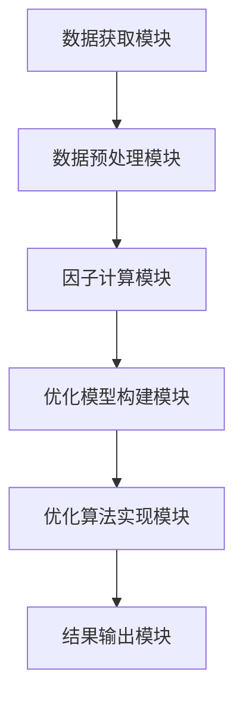

                 


# 构建智能化的个人投资风格因子暴露优化系统

> 关键词：智能化投资、因子暴露优化、机器学习、投资组合管理、风险管理

> 摘要：本文将详细探讨如何利用人工智能技术构建智能化的个人投资风格因子暴露优化系统。通过分析投资学基础、因子模型、机器学习算法及系统架构设计，结合实际案例，展示如何利用数学模型和优化算法实现个性化的投资组合管理。本文还将介绍系统的实现细节，包括数据处理、因子计算、优化算法的选择与实现，以及系统架构设计。通过本文的学习，读者将能够掌握构建智能化投资系统的核心方法与实践技巧。

---

# 第一部分: 智能化投资与因子暴露优化的背景

## 第1章: 投资学基础与因子模型

### 1.1 投资学基础

#### 1.1.1 投资的基本概念
投资是指将资金投入到某种资产或项目中，以期望在未来获得收益的行为。投资的核心目标是通过科学的资产配置和风险管理，实现收益的最大化与风险的最小化。

#### 1.1.2 投资的目标与风险
- **目标**: 追求收益最大化，同时控制风险。
- **风险**: 包括市场风险、流动性风险、信用风险等。

#### 1.1.3 投资组合管理的核心原则
投资组合管理是通过优化资产配置，分散风险，实现投资目标的过程。其核心原则包括分散化、风险与收益的匹配以及长期投资。

### 1.2 因子模型的定义与特点

#### 1.2.1 传统因子模型的介绍
传统因子模型将资产的收益分解为多个因子的线性组合，常见的因子包括市值、价值、动量等。

#### 1.2.2 多因子模型的构建
多因子模型将多个因子结合起来，构建一个更全面的收益预测模型。通过引入多个因子，可以更好地捕捉资产的收益来源。

#### 1.2.3 因子模型在投资中的作用
- **风险控制**: 通过因子分解，识别资产之间的共性和特性风险。
- **收益预测**: 通过因子模型预测资产的未来收益。

### 1.3 机器学习与投资的结合

#### 1.3.1 机器学习在金融领域的应用
机器学习在金融领域的应用包括股票预测、信用评分、风险管理等。

#### 1.3.2 智能化投资的必要性
随着市场数据的复杂化和多样化，传统的因子模型难以捕捉所有影响资产收益的因素，智能化投资成为必要。

#### 1.3.3 因子暴露优化的背景
因子暴露优化是通过优化算法调整投资组合中各因子的权重，以实现投资目标。

---

## 第2章: 智能化投资的核心概念

### 2.1 因子暴露的定义与计算

#### 2.1.1 因子暴露的定义
因子暴露是指投资组合中各因子的权重，反映了投资组合对各因子的敏感程度。

#### 2.1.2 因子暴露的计算方法
因子暴露可以通过回归分析或优化算法计算得出。

#### 2.1.3 因子暴露与投资风险的关系
因子暴露直接影响投资组合的收益与风险。通过优化因子暴露，可以实现收益与风险的最优匹配。

### 2.2 因子优化的目标与边界

#### 2.2.1 因子优化的目标
- 最大化收益
- 最小化风险
- 满足投资约束条件

#### 2.2.2 因子优化的边界条件
- 投资比例限制
- 行业限制
- 流动性要求

#### 2.2.3 因子优化与投资策略的关系
因子优化是投资策略的核心部分，通过优化因子暴露，可以实现投资策略的科学化和个性化。

### 2.3 因子暴露优化的核心要素

#### 2.3.1 数据来源与处理
- 数据来源: 市场数据、财务数据、新闻数据等
- 数据处理: 清洗、标准化、特征提取

#### 2.3.2 模型构建与验证
- 模型构建: 构建因子模型，选择优化算法
- 模型验证: 回测、风险测试、绩效评估

#### 2.3.3 优化算法的选择与实现
- 算法选择: 线性规划、遗传算法、粒子群优化等
- 算法实现: 编写代码，实现优化过程

---

## 第3章: 智能化投资系统的核心原理

### 3.1 因子暴露优化的数学模型

#### 3.1.1 优化目标的数学表达
$$ \text{最大化收益} \quad \text{或} \quad \text{最小化风险} $$

#### 3.1.2 约束条件的数学描述
$$ \sum_{i=1}^{n} w_i = 1 $$

$$ w_i \geq 0 \quad \text{或} \quad w_i \leq 0.2 $$

#### 3.1.3 模型的求解方法
- 线性规划
- 非线性规划
- 近似优化方法

### 3.2 机器学习算法在因子优化中的应用

#### 3.2.1 常见机器学习算法概述
- 线性回归
- 支持向量机
- 随机森林
- 神经网络

#### 3.2.2 算法选择与优化策略
根据数据特征和优化目标选择合适的算法，并通过参数调优提高模型性能。

#### 3.2.3 算法实现的数学基础
- 线性回归的数学表达: $$ y = \beta x + \epsilon $$
- 支持向量机的核心思想: 构建最大间隔分类器

### 3.3 因子优化系统的流程图



---

## 第4章: 系统分析与架构设计

### 4.1 系统功能模块划分

#### 4.1.1 数据获取与预处理模块
- 数据源: 股票价格、财务数据、市场指标等
- 数据清洗: 处理缺失值、异常值
- 数据标准化: 标准化处理，便于模型训练

#### 4.1.2 因子计算与分析模块
- 因子计算: 市值、收益、动量等因子的计算
- 因子分析: 因子的相关性分析、因子的重要性排序

### 4.2 系统架构设计

#### 4.2.1 系统架构图


#### 4.2.2 系统模块交互关系
- 数据获取模块负责从数据源获取原始数据
- 数据预处理模块对数据进行清洗和标准化
- 因子计算模块计算各因子的值
- 优化模型构建模块构建优化模型
- 优化算法实现模块实现优化算法
- 结果输出模块输出优化结果

---

## 第5章: 项目实战

### 5.1 环境安装与配置

#### 5.1.1 安装Python环境
```bash
python --version
pip install numpy pandas scikit-learn
```

#### 5.1.2 安装机器学习库
```bash
pip install scikit-learn
pip install numpy
pip install pandas
```

### 5.2 核心代码实现

#### 5.2.1 数据获取与预处理
```python
import pandas as pd
import numpy as np

# 数据获取
data = pd.read_csv('stock_data.csv')

# 数据预处理
data = data.dropna()
data = (data - data.mean()) / data.std()
```

#### 5.2.2 因子计算
```python
# 计算市值因子
market_cap = data['market_cap']
# 计算收益因子
returns = data['returns']
```

#### 5.2.3 优化模型构建与实现
```python
from sklearn.linear_model import LinearRegression
from sklearn.metrics import mean_squared_error

# 构建回归模型
model = LinearRegression()
model.fit(market_cap.reshape(-1,1), returns)

# 模型预测
predicted_returns = model.predict(market_cap.reshape(-1,1))
print(mean_squared_error(returns, predicted_returns))
```

### 5.3 实际案例分析与解读

#### 5.3.1 案例背景
假设我们有10只股票的数据，包括市值、收益等因子。

#### 5.3.2 数据分析
通过回归分析，发现市值因子对收益的影响较大。

#### 5.3.3 优化结果
通过优化算法，调整市值因子的权重，实现投资组合的收益最大化。

---

## 第6章: 高级应用与最佳实践

### 6.1 系统优化与扩展

#### 6.1.1 系统优化
- 数据处理效率优化
- 模型计算效率优化
- 系统架构优化

#### 6.1.2 系统扩展
- 增加更多的因子
- 引入机器学习模型
- 实现实时数据处理

### 6.2 风险管理与绩效评估

#### 6.2.1 风险管理
- 风险指标: VaR、CVaR
- 风险控制: 设置止损、止盈

#### 6.2.2 绩效评估
- 绩效指标: 夏普比率、卡玛比率
- 绩效分析: 对比不同策略的绩效

### 6.3 个性化投资策略的实现

#### 6.3.1 个性化配置
根据投资者的风险承受能力和收益目标，实现个性化的投资策略。

#### 6.3.2 策略调整
根据市场变化，实时调整投资组合。

---

## 第7章: 总结与展望

### 7.1 本章总结
本文详细探讨了如何构建智能化的个人投资风格因子暴露优化系统，从投资学基础、因子模型、机器学习算法到系统架构设计，结合实际案例，展示了系统的实现过程。

### 7.2 未来展望
随着人工智能技术的发展，智能化投资系统将更加智能化、个性化和自动化。

---

作者：AI天才研究院/AI Genius Institute & 禅与计算机程序设计艺术 /Zen And The Art of Computer Programming

