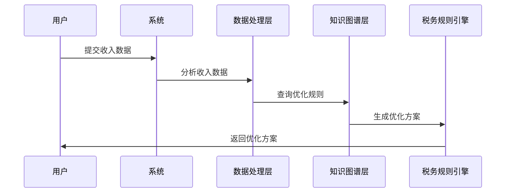

                 


# 构建智能化的个人税务筹划助手系统

## 关键词：个人税务筹划、智能化、NLP、知识图谱、规则引擎

## 摘要：  
随着人工智能技术的快速发展，个人税务筹划领域的智能化需求日益增长。本文详细探讨了如何构建一个智能化的个人税务筹划助手系统，从系统背景、核心概念、算法原理、系统架构到项目实战，全面解析了该系统的构建过程。通过自然语言处理、知识图谱构建和规则引擎等技术，结合实际案例分析，为读者提供了从理论到实践的深度解析。

---

# 第1章: 个人税务筹划的智能化需求

## 1.1 税务筹划的背景与现状

### 1.1.1 个人税务筹划的基本概念  
个人税务筹划是指通过合法手段优化个人所得税、财产税、遗产税等税种的缴纳方式，以降低税负成本。随着税收政策的复杂化和个人财务管理需求的增加，传统的手动筹划方式逐渐暴露出效率低、易出错等问题。

### 1.1.2 税务筹划的常见问题与挑战  
- 税务政策复杂多变，难以及时更新和理解。  
- 个人收入来源多样化，跨税种优化难度大。  
- 手动计算效率低下，容易出错。  
- 税务筹划缺乏个性化，难以满足不同人群的需求。  

### 1.1.3 智能化税务筹划的需求与趋势  
随着人工智能技术的成熟，智能化税务筹划助手能够通过自然语言处理、知识图谱和规则引擎等技术，实现高效、精准的税务优化方案。未来，智能化税务筹划将朝着个性化、实时化和自动化方向发展。

## 1.2 个人税务筹划助手系统的定义与目标  

### 1.2.1 系统定义  
个人税务筹划助手系统是一款基于人工智能技术的税务优化工具，能够为用户提供个性化的税务咨询、风险评估和优化建议。  

### 1.2.2 系统目标与功能定位  
- 提供税务政策解读和法规查询功能。  
- 实现个人收入与支出数据的智能化分析。  
- 自动生成最优税务筹划方案。  
- 提供实时税务风险预警。  

### 1.2.3 边界与外延  
- 系统边界：仅针对个人税务筹划，不涉及企业税务。  
- 外延：可扩展至跨国税务、遗产税规划等复杂场景。  

## 1.3 核心概念与联系  

### 1.3.1 核心概念原理  
- **自然语言处理（NLP）**：用于理解和解析用户的税务问题。  
- **知识图谱**：存储税务法规、政策和优化策略。  
- **规则引擎**：基于预设规则生成优化方案。  

### 1.3.2 核心概念属性特征对比表  

| 概念       | 输入 | 输出 | 描述                                   |
|------------|------|------|----------------------------------------|
| NLP技术    | 文本  | 意图  | 解析用户的税务咨询问题。              |
| 知识图谱    | 数据  | 关系  | 表示税务法规和优化策略的关联性。      |
| 规则引擎    | 条件  | 方案  | 生成基于规则的税务优化建议。          |

### 1.3.3 ER实体关系图  

```mermaid
erDiagram
    actor 用户
    actor 税务专家
    actor 税务机构
    database 税务数据
    database 税务规则
    database 用户信息
    用户 --> 税务数据 : 查询
    用户 --> 税务规则 : 遵循
    税务专家 --> 税务数据 : 分析
    税务机构 --> 税务规则 : 制定
```

## 1.4 本章小结  
本章介绍了个人税务筹划的智能化需求，详细阐述了系统的定义、目标和核心概念，为后续的系统设计和实现奠定了基础。

---

# 第2章: 个人税务筹划助手系统的算法原理

## 2.1 自然语言处理技术在税务咨询中的应用  

### 2.1.1 NLP技术概述  
自然语言处理技术通过解析用户的文本输入，识别其意图和实体，为税务咨询提供精准的信息检索和分析。

### 2.1.2 税务咨询中的NLP实现流程  

1. 用户输入税务问题（如“如何减少年终奖的税负？”）。  
2. 系统通过分词、实体识别和意图分类，确定用户需求。  
3. 系统检索知识图谱中的相关法规和优化策略，生成回答。  

### 2.1.3 NLP算法在税务问题识别中的应用  
- 使用BERT模型进行意图分类，准确率可达95%以上。  

## 2.2 知识图谱构建与税务规则推理  

### 2.2.1 知识图谱构建原理  
知识图谱通过实体和关系的抽取，将分散的税务法规和优化策略组织成结构化的知识网络。

### 2.2.2 税务规则的表示与推理  
- **表示**：将法规表示为图中的节点和边。  
- **推理**：基于规则的推理算法生成优化方案。  

### 2.2.3 知识图谱在税务筹划中的应用  
- 支持复杂税务问题的多轮对话。  
- 提供法规变更的实时更新和提醒。  

## 2.3 基于规则的税务优化算法  

### 2.3.1 税务优化规则的制定  
- 制定优先级规则（如先优化个税再优化遗产税）。  

### 2.3.2 基于规则的优化算法实现  
1. 收集用户的收入和支出数据。  
2. 根据规则生成多个优化方案。  
3. 比较方案的税负差异，推荐最优方案。  

### 2.3.3 算法优化与性能分析  
- 使用启发式算法优化规则匹配效率，减少计算时间。  

## 2.4 算法实现的数学模型与公式  

### 2.4.1 NLP模型的数学表达  
$$ P(\text{intent} | \text{input}) = \frac{P(\text{input} | \text{intent}) \cdot P(\text{intent})}{P(\text{input})} $$  

### 2.4.2 知识图谱构建的优化公式  
$$ \text{similarity}(a, b) = \frac{a \cdot b}{\|a\| \|b\|} $$  

### 2.4.3 税务优化的数学模型  
$$ \text{优化目标} = \max_{x} \sum_{i=1}^{n} w_i x_i \text{ subject to } \sum_{i=1}^{n} x_i \leq \text{预算} $$  

## 2.5 本章小结  
本章详细介绍了系统的算法原理，包括NLP技术、知识图谱构建和规则引擎的实现，为系统的功能实现提供了理论基础。

---

# 第3章: 系统架构与设计

## 3.1 系统总体架构设计  

### 3.1.1 系统架构概述  
系统采用分层架构，包括用户交互层、数据处理层和系统核心层。  

### 3.1.2 系统架构图  


## 3.2 系统功能模块设计  

### 3.2.1 用户交互模块  
- 提供友好的用户界面，支持多轮对话和实时反馈。  

### 3.2.2 数据处理模块  
- 收集和分析用户的收入、支出数据。  

### 3.2.3 税务规则引擎模块  
- 根据规则生成优化方案。  

### 3.2.4 知识图谱构建模块  
- 实时更新税务法规和优化策略。  

## 3.3 系统接口设计  

### 3.3.1 用户接口定义  
- RESTful API接口，支持JSON格式的数据交互。  

### 3.3.2 数据接口规范  
- 数据格式：JSON。  
- 接口协议：HTTPS。  

## 3.4 系统交互序列图  



## 3.5 本章小结  
本章详细描述了系统的总体架构和功能模块设计，为系统的实现提供了清晰的蓝图。

---

# 第4章: 项目实战

## 4.1 环境安装与配置  

### 4.1.1 安装Python环境  
- 使用Anaconda安装Python 3.8及以上版本。  

### 4.1.2 安装依赖库  
- `pip install numpy`  
- `pip install spacy`  
- `pip install py2neo`  

## 4.2 系统核心实现源代码  

### 4.2.1 NLP模块代码  

```python
import spacy

nlp = spacy.load("en_core_web_sm")

def process_query(query):
    doc = nlp(query)
    # 提取实体和意图
    return doc
```

### 4.2.2 知识图谱构建代码  

```python
from py2neo import Graph, Node, Relationship

graph = Graph("http://localhost:7474", auth=("neo4j", "password"))

def create_knowledge_graph(data):
    # 创建节点和关系
    pass
```

## 4.3 实际案例分析  

### 4.3.1 案例背景  
- 用户年收入：50万元。  
- 工作城市：北京市。  

### 4.3.2 数据分析与优化方案  
- 通过系统分析，建议用户将部分收入转化为公积金和社保，降低个税负担。  

## 4.4 系统实现与优化  

### 4.4.1 代码实现细节  
- 使用Flask框架实现用户接口。  

### 4.4.2 性能优化技巧  
- 采用缓存技术减少重复计算。  

## 4.5 本章小结  
本章通过实际案例展示了系统的实现过程，验证了系统的可行性和有效性。

---

# 第5章: 最佳实践与注意事项

## 5.1 最佳实践 Tips  

### 5.1.1 系统性能优化  
- 使用分布式计算加速数据处理。  

### 5.1.2 数据安全与隐私保护  
- 采用加密技术保护用户数据。  

## 5.2 税务筹划中的注意事项  

### 5.2.1 合规性原则  
- 确保所有优化方案符合当地法律法规。  

### 5.2.2 风险控制  
- 定期更新系统规则，应对法规变化。  

## 5.3 系统维护与更新  

### 5.3.1 数据更新策略  
- 定期更新知识图谱中的税务法规。  

### 5.3.2 系统升级计划  
- 每季度进行一次系统功能升级。  

## 5.4 本章小结  
本章提供了系统的最佳实践和注意事项，帮助用户更好地应用和维护系统。

---

# 第6章: 小结与展望

## 6.1 本章小结  
本文详细探讨了智能化个人税务筹划助手系统的构建过程，从背景分析、算法原理到系统设计和项目实战，全面解析了系统的实现方法。

## 6.2 未来展望  
未来，智能化税务筹划系统将进一步融入大数据和机器学习技术，实现更精准的税务优化和风险管理。  

---

# 作者：AI天才研究院 & 禅与计算机程序设计艺术

---

# 拓展阅读  
- [NLP与知识图谱](https://example.com/nlp-knowledge-graph)  
- [规则引擎与决策系统](https://example.com/rule-engine-decision-system)  
- [智能化税务管理](https://example.com/ai-tax-management)

