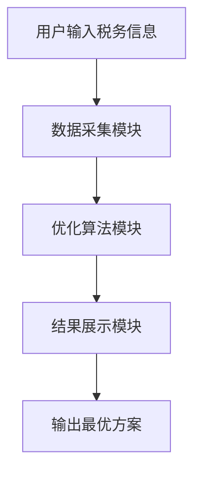
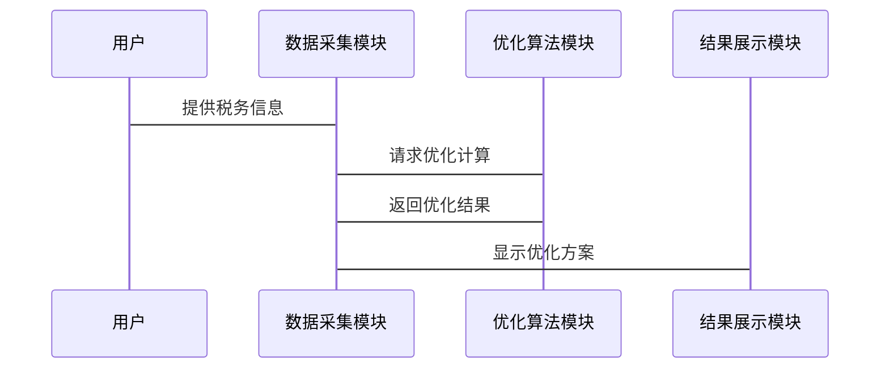

                 


# 构建智能化的个人税务筹划多目标优化助手

> 关键词：个人税务筹划，多目标优化，人工智能，NSGA-II算法，Python实现，系统架构设计

> 摘要：本文详细介绍了如何利用人工智能技术构建一个智能化的个人税务筹划多目标优化助手。通过分析税务筹划的背景、多目标优化的核心概念，结合具体的优化算法（如NSGA-II和PSO）的实现，展示了如何通过系统设计和项目实战来构建一个高效的税务优化工具。文章内容涵盖背景介绍、算法原理、系统架构、项目实现及实际案例分析，旨在为读者提供一个全面的技术指导。

---

## 第1章: 个人税务筹划的背景与需求

### 1.1 税务筹划的基本概念

#### 1.1.1 税务筹划的定义与特点
税务筹划是指通过合法手段，优化个人或企业的税务负担，最大化税后收益的过程。其特点包括合法性、系统性、规划性和风险性。合法性是税务筹划的核心原则，所有优化方案必须在法律允许的范围内进行。

#### 1.1.2 税务筹划的法律边界与合规性
税务筹划必须遵守国家的税收法律法规，避免逃税、避税等违法行为。合规性要求税务筹划方案符合税法的意图和精神，确保税务机关的认可。

#### 1.1.3 个人税务筹划的常见场景与挑战
个人税务筹划常见于收入分配、投资收益、资产配置等领域。例如，合理利用税收优惠政策、优化年终奖与工资的分配比例、选择最优的社保缴纳方案等。然而，个人在面对复杂税法时，往往缺乏专业知识，容易忽略最优解或触犯法律红线。

### 1.2 多目标优化的基本原理

#### 1.2.1 多目标优化的定义
多目标优化是指在多个相互冲突的目标下，寻找最优解的过程。例如，在税务筹划中，可能需要在税后收入最大化、风险最小化、合规性保障等多个目标之间进行权衡。

#### 1.2.2 多目标优化与单目标优化的对比
单目标优化仅考虑一个目标函数，而多目标优化需要同时考虑多个目标，并在可行解集中寻找帕累托最优解。多目标优化更贴近现实中的复杂问题，但实现难度更大。

#### 1.2.3 税务筹划中的多目标优化问题
在个人税务筹划中，多目标优化问题通常包括：如何在税后收入最大化的同时，最小化税务风险；如何在合规的前提下，优化资产配置等。

### 1.3 智能化税务筹划助手的必要性

#### 1.3.1 传统税务筹划的局限性
传统税务筹划主要依赖人工计算和经验判断，效率低、覆盖面窄，难以应对复杂的多目标优化问题。

#### 1.3.2 AI技术在税务筹划中的应用潜力
人工智能技术，特别是机器学习和进化算法，能够处理复杂的多目标优化问题，提供高效的解决方案。

#### 1.3.3 智能化助手的目标与价值
智能化税务筹划助手的目标是通过AI技术，帮助个人快速找到最优税务规划方案。其价值在于提高效率、降低成本、减少风险。

## 第2章: 多目标优化与税务筹划的核心概念

### 2.1 多目标优化的基本原理

#### 2.1.1 多目标优化的数学模型
多目标优化的数学模型可以表示为：
$$ \text{minimize } f(x) = (f_1(x), f_2(x), ..., f_n(x)) $$
其中，$f(x)$是目标函数向量，$x$是决策变量。

#### 2.1.2 常见的多目标优化算法
常用的多目标优化算法包括遗传算法（GA）、非支配排序遗传算法（NSGA）、粒子群优化算法（PSO）等。

#### 2.1.3 多目标优化的评价指标
常用的评价指标包括帕累托前沿、多样性指标等。

### 2.2 税务筹划中的多目标优化问题

#### 2.2.1 税务筹划问题的建模
税务筹划的多目标优化问题可以建模为：
$$ \text{maximize } f_1(x) = \text{税后收入} $$
$$ \text{minimize } f_2(x) = \text{税务风险} $$
$$ \text{subject to } g_1(x) \leq 0, g_2(x) \leq 0 $$

#### 2.2.2 税务筹划中的目标函数与约束条件
目标函数通常包括税后收入、资产收益等；约束条件包括税法规定、财务限制等。

#### 2.2.3 多目标优化在税务筹划中的应用案例
例如，优化个人所得税和企业所得税的缴纳比例，以实现整体税负最小化。

### 2.3 智能化助手的核心概念

#### 2.3.1 智能化助手的功能模块
功能模块包括数据采集、优化算法引擎、结果展示等。

#### 2.3.2 助手与用户交互的流程
用户输入税务相关信息，系统通过多目标优化算法计算出最优方案，并以可视化方式展示结果。

#### 2.3.3 助手的算法选择与实现
选择适合的多目标优化算法，如NSGA-II，实现税务优化。

## 第3章: 多目标优化算法原理与实现

### 3.1 常见的多目标优化算法

#### 3.1.1 非支配排序遗传算法（NSGA）

##### NSGA算法步骤
1. 初始化种群。
2. 计算每个个体的适应度。
3. 根据适应度进行选择、交叉和变异操作。
4. 将新种群进行非支配排序，保留非支配解。
5. 重复迭代，直到满足终止条件。

#### 3.1.2 带拥挤度的多目标遗传算法（NSGA-II）

##### NSGA-II算法步骤
1. 初始化种群。
2. 计算适应度。
3. 进行选择、交叉和变异。
4. 使用拥挤度方法进行环境评估。
5. 保留非支配解和部分支配解。
6. 迭代直到终止。

#### 3.1.3 粒子群优化算法（PSO）

##### PSO算法步骤
1. 初始化种群。
2. 计算适应度。
3. 更新个体和全局极值。
4. 根据极值更新种群位置。
5. 迭代直到终止。

### 3.2 多目标优化算法的数学模型

#### 3.2.1 NSGA-II的数学模型
适应度函数：
$$ f(x) = (f_1(x), f_2(x), ..., f_n(x)) $$

拥挤度计算：
$$ \text{crowding distance}(x) = \sum_{i=1}^n |x_i - y_i| $$

#### 3.2.2 PSO的数学模型
位置更新：
$$ x_i^{t+1} = x_i^t + v_i^t \cdot \text{inertia weight} + c_1 \cdot r_1 \cdot (p_i^t - x_i^t) + c_2 \cdot r_2 \cdot (p_g^t - x_i^t) $$

速度更新：
$$ v_i^{t+1} = v_i^t \cdot \text{inertia weight} + c_1 \cdot r_1 \cdot (p_i^t - x_i^t) + c_2 \cdot r_2 \cdot (p_g^t - x_i^t) $$

### 3.3 算法实现与优化

#### 3.3.1 算法实现步骤
以Python为例，实现NSGA-II算法：
1. 定义适应度函数。
2. 初始化种群。
3. 计算适应度。
4. 进行选择、交叉、变异。
5. 计算拥挤度，保留非支配解。
6. 迭代直到收敛。

#### 3.3.2 算法的收敛性分析
NSGA-II算法在多目标优化问题中表现出良好的收敛性和多样性。

#### 3.3.3 算法的性能评价指标
包括收敛速度、解的分布、帕累托前沿覆盖范围等。

---

## 第4章: 系统分析与架构设计

### 4.1 问题场景介绍
个人税务筹划涉及多个税务种类和复杂的法律环境，需要一个智能化的助手来提供高效的解决方案。

### 4.2 系统功能设计

#### 4.2.1 功能模块
- 数据采集模块：收集用户税务信息。
- 优化算法模块：实现多目标优化。
- 结果展示模块：可视化优化结果。

#### 4.2.2 系统功能流程图


### 4.3 系统架构设计

#### 4.3.1 系统架构图


#### 4.3.2 系统接口设计
- 数据接口：与税务数据库对接。
- 算法接口：与优化算法模块交互。

#### 4.3.3 系统交互流程图


## 第5章: 项目实战与实现

### 5.1 环境安装与配置

#### 5.1.1 安装Python与相关库
安装Python 3.8及以上版本，安装必要的库：
```bash
pip install numpy pandas scikit-learn pygmo
```

#### 5.1.2 安装Jupyter Notebook
```bash
pip install jupyter
```

### 5.2 核心实现源代码

#### 5.2.1 NSGA-II算法实现
```python
import numpy as np
from pygmo import algorithm, problem, population

class TaxOptimizationProblem(problem):
    def __init__(self, dimensions):
        super().__init__(dimensions)
    
    def fitness(self, x):
        # 税后收入最大化
        f1 = x.sum()
        # 税务风险最小化
        f2 = np.var(x)
        return np.array([f1, f2])
    
    def is_feasible(self, x):
        return True

def nsga_ii_algorithm():
    # 初始化问题
    prob = TaxOptimizationProblem(2)
    # 初始化种群
    pop = population(prob, size=100)
    # 设置算法参数
    algo = algorithm.nsga_ii()
    # 进行优化
    pop = pop.evolve(algo, 100)
    # 获取最优解
    front = pop.get_pareto_frontier()
    return front

if __name__ == "__main__":
    front = nsga_ii_algorithm()
    print(front)
```

#### 5.2.2 数据可视化代码
```python
import matplotlib.pyplot as plt

front = nsga_ii_algorithm()
plt.scatter(front[:,0], front[:,1], c='r')
plt.xlabel('税后收入')
plt.ylabel('税务风险')
plt.title('帕累托前沿')
plt.show()
```

### 5.3 代码应用解读与分析

#### 5.3.1 代码功能解读
- `TaxOptimizationProblem`类定义了优化问题，包括适应度函数和可行性判断。
- `nsga_ii_algorithm`函数实现了NSGA-II算法，返回帕累托前沿。
- 主程序调用优化算法并进行结果可视化。

#### 5.3.2 优化结果分析
通过运行代码，可以得到帕累托前沿，帮助用户在税后收入和税务风险之间找到最优平衡点。

### 5.4 实际案例分析

#### 5.4.1 案例背景
假设一个用户的年收入为10万元，需要在工资和年终奖之间分配，以优化税后收入。

#### 5.4.2 数据分析
通过优化算法，找到最优分配方案，使税后收入最大化。

#### 5.4.3 结果展示
通过可视化展示不同分配方案的税后收入和税务风险，用户可以选择最佳方案。

### 5.5 项目小结

#### 5.5.1 项目总结
通过Python和NSGA-II算法，成功构建了一个智能化的个人税务筹划助手，能够帮助用户快速找到最优税务方案。

#### 5.5.2 项目意义
展示了人工智能技术在税务优化中的应用潜力，为后续研究提供了参考。

## 第6章: 总结与展望

### 6.1 项目总结
通过本项目，我们成功构建了一个基于多目标优化的智能化个人税务筹划助手，验证了算法的有效性和系统的可行性。

### 6.2 项目的意义
本项目展示了人工智能技术在税务优化中的应用，为个人和企业提供了一个高效、合规的税务筹划工具。

### 6.3 项目展望
未来可以进一步优化算法，扩展功能，如加入更多税务种类、增强用户交互体验等。

## 附录

### 附录A: 项目源代码
完整的Python源代码，包括问题定义、算法实现和结果展示。

### 附录B: 算法详细说明
详细解释了NSGA-II和PSO算法的实现细节和优化技巧。

### 附录C: 税务法规参考资料
提供相关的税收政策和法规参考资料，帮助读者更好地理解税务筹划的合规性要求。

---

## 作者：AI天才研究院/AI Genius Institute & 禅与计算机程序设计艺术 /Zen And The Art of Computer Programming

---

**感谢您的阅读！希望这篇文章对您有所帮助。**

