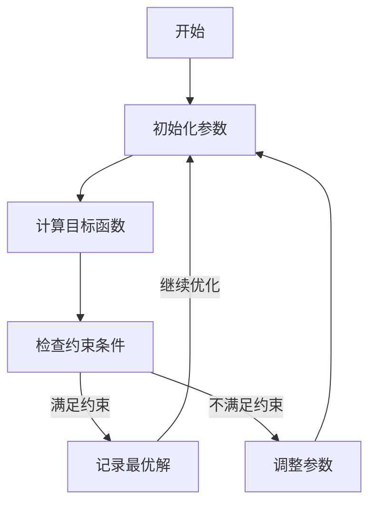

                 


# 构建智能化的个人税务筹划多目标动态优化助手

> 关键词：个人税务筹划，多目标动态优化，人工智能，动态规划，优化算法，税务助手

> 摘要：本文探讨如何利用人工智能技术构建智能化的个人税务筹划多目标动态优化助手，通过分析多目标动态优化的原理，结合实际案例，详细讲解如何利用AI技术实现税务筹划的自动化和智能化。

---

# 目录

## 第1章: 背景介绍

### 1.1 税务筹划的背景与挑战
- 1.1.1 税务筹划的基本概念
- 1.1.2 传统税务筹划的局限性
- 1.1.3 智能化税务筹划的需求

### 1.2 多目标动态优化的必要性
- 1.2.1 多目标优化的定义
- 1.2.2 动态优化的特性
- 1.2.3 税务筹划中的多目标动态优化需求

### 1.3 AI技术在税务筹划中的应用前景
- 1.3.1 AI技术的基本概念
- 1.3.2 AI在税务筹划中的应用场景
- 1.3.3 智能化税务筹划助手的优势

### 1.4 本章小结

---

## 第2章: 核心概念与联系

### 2.1 多目标优化的基本原理
- 2.1.1 多目标优化的定义
- 2.1.2 多目标优化的核心要素
- 2.1.3 多目标优化的数学模型

### 2.2 动态优化的实现方法
- 2.2.1 动态优化的基本概念
- 2.2.2 动态优化的实现步骤
- 2.2.3 动态优化的数学模型

### 2.3 税务筹划中的多目标动态优化
- 2.3.1 税务筹划的多目标特性
- 2.3.2 税务筹划的动态变化
- 2.3.3 多目标动态优化在税务筹划中的应用

### 2.4 核心概念的ER实体关系图
```mermaid
er
  actor: 用户
  goal: 优化目标
  constraint: 约束条件
  tax_data: 税务数据
  helper: 税务助手
  optimization_model: 优化模型
  actor --> goal: 提出优化需求
  actor --> constraint: 提供约束条件
  tax_data --> optimization_model: 输入税务数据
  optimization_model --> helper: 输出优化方案
```

---

## 第3章: 算法原理讲解

### 3.1 多目标动态优化算法的数学模型
- 3.1.1 目标函数
- 3.1.2 约束条件
- 3.1.3 优化变量

### 3.2 算法实现步骤
- 3.2.1 初始化
- 3.2.2 迭代优化
- 3.2.3 终止条件

### 3.3 算法实现的Mermaid流程图


### 3.4 Python代码实现
```python
def multi_objective_dynamic_optimization():
    import numpy as np
    import random

    # 目标函数
    def objective_function(x):
        return (x[0]**2 + x[1]**2) / 2

    # 约束条件
    def constraint(x):
        return x[0] + x[1] <= 1

    # 初始化参数
    x = np.array([0.5, 0.5])
    iteration = 0
    max_iterations = 1000

    for _ in range(max_iterations):
        iteration += 1
        # 计算目标函数值
        current_value = objective_function(x)
        # 检查约束条件
        if constraint(x):
            print(f"Iteration {iteration}: Optimal solution found: {x}")
            return x
        # 随机调整参数
        delta = random.uniform(0, 1)
        x = x + delta * (1 - iteration / max_iterations)

    print("Optimization completed without finding an exact solution.")
    return x

multi_objective_dynamic_optimization()
```

### 3.5 代码功能解读
- 3.5.1 目标函数的定义
- 3.5.2 约束条件的实现
- 3.5.3 参数初始化与迭代过程
- 3.5.4 输出结果的解释

---

## 第4章: 系统分析与架构设计

### 4.1 项目背景与目标
- 4.1.1 项目背景
- 4.1.2 项目目标
- 4.1.3 项目范围

### 4.2 系统功能设计
- 4.2.1 系统功能模块划分
- 4.2.2 功能流程图
- 4.2.3 用例分析

### 4.3 系统架构设计


### 4.4 系统接口与交互设计
- 4.4.1 系统接口定义
- 4.4.2 系统交互流程
- 4.4.3 序列图示例

---

## 第5章: 项目实战

### 5.1 环境安装与配置
- 5.1.1 安装Python
- 5.1.2 安装必要的库
- 5.1.3 配置开发环境

### 5.2 核心代码实现
- 5.2.1 税务数据的输入与处理
- 5.2.2 优化模型的实现
- 5.2.3 结果输出与展示

### 5.3 实际案例分析
- 5.3.1 案例背景
- 5.3.2 数据输入
- 5.3.3 优化过程
- 5.3.4 结果解读

### 5.4 项目小结
- 5.4.1 项目实现的关键点
- 5.4.2 项目成果的总结
- 5.4.3 可能遇到的问题与解决方法

---

## 第6章: 最佳实践与注意事项

### 6.1 最佳实践
- 6.1.1 数据质量的重要性
- 6.1.2 模型调优的技巧
- 6.1.3 系统维护的注意事项

### 6.2 小结
- 6.2.1 全文总结
- 6.2.2 未来研究方向
- 6.2.3 对读者的期望与建议

### 6.3 注意事项
- 6.3.1 数据隐私保护
- 6.3.2 模型的可解释性
- 6.3.3 系统的稳定性与可用性

### 6.4 拓展阅读
- 6.4.1 推荐的书籍与论文
- 6.4.2 相关的技术博客与资源
- 6.4.3 专业论坛与社区

---

## 作者：AI天才研究院/AI Genius Institute & 禅与计算机程序设计艺术 /Zen And The Art of Computer Programming

---

**文章末尾，欢迎读者在评论区留下自己的见解和问题，我们将逐一解答。**

